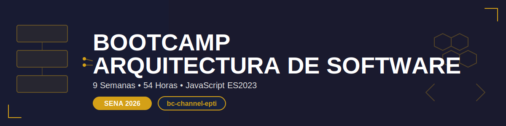

# 🏛️ Bootcamp: Arquitectura de Software

<p align="center">
  
</p>

<p align="center">
  <strong>De tecnólogo a arquitecto de software en 9 semanas</strong><br>
  <em>Aprende a diseñar sistemas robustos, escalables y seguros</em>
</p>

<p align="center">
  <a href="README_EN.md"></a>
</p>

<p align="center">
  <a href="#-sobre-el-bootcamp">Sobre el Bootcamp</a> •
  <a href="#-contenido-por-semana">Contenido</a> •
  <a href="#-herramientas">Herramientas</a> •
  <a href="#-evaluación">Evaluación</a> •
  <a href="#-comenzar">Comenzar</a>
</p>

---

## 🎯 Sobre el Bootcamp

Bienvenido al **Bootcamp de Arquitectura de Software**, un programa intensivo diseñado específicamente para estudiantes del **SENA - Tecnología en Análisis y Desarrollo de Software**.

En 9 semanas (54 horas totales) te transformarás en un profesional capaz de diseñar sistemas de software robustos, escalables y mantenibles, con implementaciones prácticas en JavaScript ES2023.

### 📊 Datos Clave

| Característica       | Detalle                                |
| -------------------- | -------------------------------------- |
| **Duración**         | 9 semanas                              |
| **Horas semanales**  | 6 horas (4 presenciales + 2 autónomas) |
| **Total horas**      | 54 horas                               |
| **Nivel**            | Tecnólogo SENA                         |
| **Modalidad**        | Presencial + Trabajo autónomo          |
| **Idioma de código** | JavaScript ES2023                      |
| **Repositorio**      | GitHub obligatorio                     |

### 🎓 ¿Qué Aprenderás?

Al finalizar este bootcamp serás capaz de:

- ✅ **Comprender** qué es arquitectura de software y su importancia en proyectos reales
- ✅ **Diferenciar** entre arquitectura y diseño de software
- ✅ **Aplicar** principios SOLID en diseños arquitectónicos
- ✅ **Seleccionar** patrones arquitectónicos apropiados según el contexto
- ✅ **Diseñar** componentes con alta cohesión y bajo acoplamiento
- ✅ **Implementar** patrones de diseño (Creacionales, Estructurales, de Comportamiento)
- ✅ **Crear** arquitecturas modernas (Microservicios, Clean Architecture, Hexagonal)
- ✅ **Desarrollar** arquitecturas en la nube (IaaS, PaaS, SaaS, Serverless, Contenedores)
- ✅ **Integrar** seguridad en el diseño arquitectónico desde el inicio
- ✅ **Documentar** decisiones arquitectónicas con diagramas y justificaciones técnicas

---

## 📚 Contenido por Semana

Cada semana incluye:

```
bootcamp/week-XX/
├── README.md                 # Descripción y objetivos
├── rubrica-evaluacion.md     # Criterios de evaluación
├── 0-assets/                 # Imágenes y diagramas
├── 1-teoria/                 # Material teórico
├── 2-practicas/              # Ejercicios guiados
├── 3-proyecto/               # Proyecto semanal
├── 4-recursos/               # Recursos adicionales
│   ├── ebooks-free/
│   ├── videografia/          # Videos YouTube (bc-channel-epti)
│   └── webgrafia/
└── 5-glosario/               # Términos clave A-Z
```

### 🗓️ Roadmap de 9 Semanas

| Semana | Tema                                             | Conceptos Clave                                       |
| ------ | ------------------------------------------------ | ----------------------------------------------------- |
| **01** | [Fundamentos de Arquitectura](bootcamp/week-01/) | Definición, diferencia con diseño, rol del arquitecto |
| **02** | [Principios SOLID](bootcamp/week-02/)            | SRP, OCP, LSP, ISP, DIP, cohesión, acoplamiento       |
| **03** | [Patrones Arquitectónicos](bootcamp/week-03/)    | Capas, Cliente-Servidor, Event-Driven                 |
| **04** | [Diseño de Componentes](bootcamp/week-04/)       | Componentes, comunicación, APIs REST                  |
| **05** | [Patrones de Diseño](bootcamp/week-05/)          | Creacionales, Estructurales, Comportamiento           |
| **06** | [Arquitecturas Modernas](bootcamp/week-06/)      | Microservicios, Clean, Hexagonal, DDD                 |
| **07** | [Arquitectura en la Nube](bootcamp/week-07/)     | IaaS, PaaS, SaaS, Serverless, Docker                  |
| **08** | [Seguridad](bootcamp/week-08/)                   | Security by Design, OAuth, JWT, OWASP                 |
| **09** | [Proyecto Integrador](bootcamp/week-09/)         | Aplicación completa con todos los conceptos           |

### 🔑 Componentes Clave

- 📖 **Teoría**: Conceptos con estructura **QUÉ-PARA-IMPACTO**
- 💻 **Prácticas**: Ejercicios progresivos con casos de estudio
- 🎯 **Proyecto**: Integrador semanal con documentación arquitectónica
- 📹 **Videos**: Material para YouTube (bc-channel-epti)
- 📚 **Recursos**: Ebooks, artículos, documentación oficial

---

## 🎯 Proyecto Integrador

Desarrollarás un proyecto arquitectónico completo que:

- 🔧 **Evoluciona semanalmente** aplicando nuevos conceptos
- 📐 **Incluye diagramas** arquitectónicos profesionales
- 💻 **Implementa patrones** en JavaScript ES2023
- 📝 **Documenta decisiones** con justificación técnica
- 🏆 **Forma parte** de tu portafolio profesional

El proyecto integrador te diferenciará en entrevistas técnicas y te preparará para proyectos reales en la industria.

---

## 🚀 Metodología de Aprendizaje

### Estrategias Didácticas

- **📊 Aprendizaje Basado en Proyectos (ABP)**: Proyectos integradores semanales
- **🏢 Estudio de Casos**: Análisis de arquitecturas reales (Netflix, Spotify, Amazon, Uber)
- **👥 Aprendizaje Colaborativo**: Trabajo en equipo y code reviews
- **💬 Debates Técnicos**: Discusión sobre patrones y decisiones arquitectónicas
- **🔄 Flipped Classroom**: Teoría previa + aplicación práctica en clase
- **🎨 Talleres Prácticos**: Diseño de diagramas y propuestas arquitectónicas

### Distribución del Tiempo (6h/semana)

| Modalidad      | Horas | Actividades                                  |
| -------------- | ----- | -------------------------------------------- |
| **Presencial** | 4h    | Conceptos clave, talleres, retroalimentación |
| **Autónomo**   | 2h    | Lectura, investigación, proyecto             |

---

## 🛠️ Herramientas

### Stack Tecnológico

| Categoría               | Herramientas                           |
| ----------------------- | -------------------------------------- |
| **Lenguaje**            | JavaScript ES2023                      |
| **Runtime**             | Node.js                                |
| **Gestión de paquetes** | pnpm (SOLO pnpm, NO npm)               |
| **Versionado**          | Git + GitHub                           |
| **Base de datos**       | PostgreSQL (principal), SQLite (local) |
| **Contenedores**        | Docker                                 |
| **Diagramas**           | Draw.io, PlantUML, Mermaid, Lucidchart |
| **IDE**                 | VS Code (recomendado)                  |

### 🎨 Convenciones de Código

```javascript
// ✅ BIEN - JavaScript ES2023
const createUser = (name, email) => ({
  id: generateId(),
  name,
  email,
  createdAt: new Date(),
});

// ✅ Código en INGLÉS
// ✅ Documentación en ESPAÑOL
// ✅ Principios SOLID siempre
```

---

## 📋 Requisitos Previos

Para aprovechar este bootcamp necesitas:

### Conocimientos Técnicos

- ✅ JavaScript básico (variables, funciones, objetos)
- ✅ Programación orientada a objetos (clases, herencia)
- ✅ Git básico (commit, push, pull)
- ✅ Uso de terminal/consola

### Actitudes

- 🔥 Curiosidad por entender sistemas complejos
- 💡 Pensamiento crítico sobre decisiones técnicas
- 🤝 Disposición para trabajo colaborativo
- 📚 Compromiso con el aprendizaje continuo

---

## 📖 Cómo Usar Este Repositorio

### Navegación

1. **Comienza aquí** → `bootcamp/week-01/README.md`
2. **Lee la teoría** → `1-teoria/`
3. **Practica** → `2-practicas/`
4. **Desarrolla el proyecto** → `3-proyecto/`
5. **Consulta recursos** → `4-recursos/`

### Tu Trabajo

Crearás tu **propio repositorio** en GitHub con esta estructura:

```
mi-bootcamp-arquitectura/
├── week-01/
│   ├── practicas/        # Tus ejercicios
│   ├── proyecto/         # Tu proyecto semanal
│   └── notas.md          # Tus apuntes
├── week-02/
│   └── ...
└── proyecto-final/       # Proyecto integrador completo
```

### Commits

Usa mensajes descriptivos:

```bash
git commit -m "feat(week-02): implementa patrón Singleton en UserService"
git commit -m "docs(week-03): agrega diagrama de arquitectura en capas"
```

---

## 📊 Evaluación

Sistema de evaluación SENA con **tres evidencias**:

### Distribución de Evidencias

| Tipo                | Peso | Descripción                                       |
| ------------------- | ---- | ------------------------------------------------- |
| 🧠 **Conocimiento** | 30%  | Comprensión de conceptos, cuestionarios, análisis |
| 💪 **Desempeño**    | 40%  | Aplicación práctica, diagramas, code reviews      |
| 📦 **Producto**     | 30%  | Proyecto funcional, documentación, código         |

### Criterios de Aprobación

- ✅ Mínimo **70%** en cada evidencia
- ✅ Entrega puntual de proyectos
- ✅ Código funcional y documentado
- ✅ Participación activa en talleres

Cada semana incluye su propia **rúbrica de evaluación** detallada.

---

## 👥 Comunidad y Soporte

### Canales de Comunicación

- 💬 **GitHub Issues**: Para preguntas técnicas
- 📹 **YouTube**: bc-channel-epti (videos complementarios)
- 👥 **Trabajo en equipo**: Colaboración en talleres
- 📝 **Code Reviews**: Retroalimentación de pares

### Filosofía de Aprendizaje

- ✅ **Hacer preguntas** es señal de pensamiento crítico
- ✅ **Compartir conocimiento** beneficia a todos
- ✅ **Aprender de errores** es parte del proceso
- ✅ **Colaborar** enriquece el aprendizaje

---

## 🚀 Comenzar

### Paso 1: Configura tu Entorno

```bash
# Instalar pnpm (si no lo tienes)
npm install -g pnpm

# Verificar instalación
pnpm --version
node --version
git --version
```

### Paso 2: Clona este Repositorio

```bash
git clone https://github.com/ergrato-dev/bc-arquitectura-software.git
cd bc-arquitectura-software
```

### Paso 3: Crea tu Repositorio Personal

```bash
# Crea un nuevo repositorio en GitHub llamado: mi-bootcamp-arquitectura
# Luego:
mkdir mi-bootcamp-arquitectura
cd mi-bootcamp-arquitectura
git init
git remote add origin https://github.com/TU-USUARIO/mi-bootcamp-arquitectura.git
```

### Paso 4: Inicia la Semana 1

📖 Dirígete a → [`bootcamp/week-01/README.md`](bootcamp/week-01/README.md)

---

## 💡 Filosofía del Bootcamp

> **"No se trata de memorizar patrones, sino de entender por qué existen y cuándo aplicarlos"**

- 🎯 **Comprensión profunda** sobre memorización superficial
- 💻 **Aprender haciendo**, no solo leyendo
- 📐 **Justificar decisiones** con criterio técnico
- 🏗️ **Diseñar para el futuro**, no solo para hoy

---

## 🏆 Al Finalizar

Serás capaz de:

- ✅ Diseñar arquitecturas de software profesionales
- ✅ Justificar decisiones técnicas con fundamentos sólidos
- ✅ Crear documentación arquitectónica clara
- ✅ Implementar patrones de diseño apropiados
- ✅ Participar en discusiones arquitectónicas de alto nivel
- ✅ Tener un portafolio con proyecto arquitectónico completo

**¡Tu viaje hacia convertirte en arquitecto de software comienza aquí!**

---

## 📚 Recursos Adicionales

### Bibliografía Recomendada

- 📖 **Software Architecture in Practice** (Bass, Clements, Kazman)
- 📖 **Design Patterns** (Gang of Four - Gamma, Helm, Johnson, Vlissides)
- 📖 **Clean Architecture** (Robert C. Martin)
- 📖 **Patterns of Enterprise Application Architecture** (Martin Fowler)
- 📖 **Building Microservices** (Sam Newman)

### Enlaces Útiles

- 🌐 [MDN Web Docs - JavaScript](https://developer.mozilla.org/es/docs/Web/JavaScript)
- 🌐 [PlantUML](https://plantuml.com/) - Diagramas como código
- 🌐 [Mermaid](https://mermaid.js.org/) - Diagramas en markdown
- 🌐 [OWASP Top 10](https://owasp.org/www-project-top-ten/) - Seguridad

### Documentación

- [🤖 Instrucciones para Copilot](.github/copilot-instructions.md)
- [📋 Planeación Pedagógica](_docs/PLANEACION_PEDAGOGICA-ARQUITECTURA_DE_SOFTWARE.md)

---

## 📺 Contenido en YouTube

Suscríbete al canal **bc-channel-epti** para acceder a:

- 📹 Videos teóricos por semana
- 📹 Tutoriales prácticos paso a paso
- 📹 Análisis de casos reales
- 📹 Sesiones de code review

---

## 🤝 Contribuir

Este es un proyecto educativo del SENA. Si encuentras errores o tienes sugerencias:

1. Abre un [Issue](https://github.com/ergrato-dev/bc-arquitectura-software/issues)
2. Propón mejoras vía Pull Request
3. Comparte tus experiencias de aprendizaje

---

## 📄 Licencia

Este material educativo está disponible bajo licencia **MIT**.

Eres libre de:

- ✅ Usar el material para aprender
- ✅ Modificarlo según tus necesidades
- ✅ Compartirlo con otros estudiantes

Siempre manteniendo la atribución original.

---

<p align="center">
  <strong>🎓 Bootcamp de Arquitectura de Software</strong><br>
  <em>SENA - Tecnología en Análisis y Desarrollo de Software</em><br>
  <em>bc-channel-epti</em>
</p>

<p align="center">
  <a href="bootcamp/week-01">🚀 Comenzar Semana 1</a> •
  <a href="_docs">📚 Ver Documentación</a> •
  <a href="https://github.com/ergrato-dev/bc-arquitectura-software/issues">💬 Soporte</a>
</p>

<p align="center">
  Hecho con ❤️ para la comunidad de estudiantes del SENA
</p>

---

_Última actualización: Febrero 2026_
