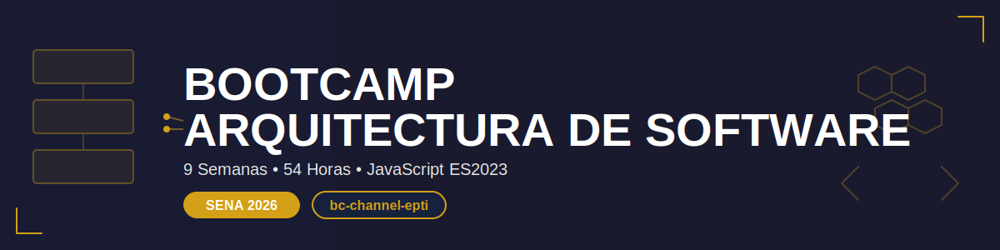

# 🏛️ Bootcamp: Software Architecture

<p align="center">
  
</p>

<p align="center">
  <strong>From technologist to software architect in 9 weeks</strong><br>
  <em>Learn to design robust, scalable, and secure systems</em>
</p>

<p align="center">
  <a href="README.md"></a>
</p>

<p align="center">
  <a href="#-about-the-bootcamp">About</a> •
  <a href="#-weekly-content">Content</a> •
  <a href="#-tools">Tools</a> •
  <a href="#-evaluation">Evaluation</a> •
  <a href="#-get-started">Get Started</a>
</p>

---

## 🎯 About the Bootcamp

Welcome to the **Software Architecture Bootcamp**, an intensive program specifically designed for students of **SENA - Technology in Analysis and Software Development**.

In 9 weeks (54 total hours) you will transform into a professional capable of designing robust, scalable, and maintainable software systems, with practical implementations in JavaScript ES2023.

### 📊 Key Data

| Feature           | Detail                               |
| ----------------- | ------------------------------------ |
| **Duration**      | 9 weeks                              |
| **Weekly hours**  | 6 hours (4 in-person + 2 autonomous) |
| **Total hours**   | 54 hours                             |
| **Level**         | SENA Technologist                    |
| **Modality**      | In-person + Autonomous work          |
| **Code language** | JavaScript ES2023                    |
| **Repository**    | GitHub mandatory                     |

### 🎓 What You'll Learn

By completing this bootcamp, you will be able to:

- ✅ **Understand** what software architecture is and its importance in real projects
- ✅ **Differentiate** between software architecture and design
- ✅ **Apply** SOLID principles in architectural designs
- ✅ **Select** appropriate architectural patterns according to context
- ✅ **Design** components with high cohesion and low coupling
- ✅ **Implement** design patterns (Creational, Structural, Behavioral)
- ✅ **Create** modern architectures (Microservices, Clean Architecture, Hexagonal)
- ✅ **Develop** cloud architectures (IaaS, PaaS, SaaS, Serverless, Containers)
- ✅ **Integrate** security into architectural design from the start
- ✅ **Document** architectural decisions with diagrams and technical justifications

---

## 📚 Weekly Content

Each week includes:

```
bootcamp/week-XX/
├── README.md                 # Description and objectives
├── rubrica-evaluacion.md     # Evaluation criteria
├── 0-assets/                 # Images and diagrams
├── 1-teoria/                 # Theoretical material
├── 2-practicas/              # Guided exercises
├── 3-proyecto/               # Weekly project
├── 4-recursos/               # Additional resources
│   ├── ebooks-free/
│   ├── videografia/          # YouTube videos (bc-channel-epti)
│   └── webgrafia/
└── 5-glosario/               # Key terms A-Z
```

### 🗓️ 9-Week Roadmap

| Week   | Topic                                                   | Key Concepts                                         |
| ------ | ------------------------------------------------------- | ---------------------------------------------------- |
| **01** | [Software Architecture Fundamentals](bootcamp/week-01-fundamentos-arquitectura/) | Definition, difference with design, architect's role |
| **02** | [SOLID Principles](bootcamp/week-02-principios-solid/)                   | SRP, OCP, LSP, ISP, DIP, cohesion, coupling          |
| **03** | [Architectural Patterns](bootcamp/week-03-patrones-arquitectonicos-clasicos/)             | Layered, Client-Server, Event-Driven                 |
| **04** | [Component Design](bootcamp/week-04-diseno-componentes-comunicacion/)                   | Components, communication, REST APIs                 |
| **05** | [Design Patterns](bootcamp/week-05-patrones-diseno/)                    | Creational, Structural, Behavioral                   |
| **06** | [Modern Architectures](bootcamp/week-06-arquitecturas-modernas/)               | Microservices, Clean, Hexagonal, DDD                 |
| **07** | [Cloud Architecture](bootcamp/week-07-arquitectura-nube/)                 | IaaS, PaaS, SaaS, Serverless, Docker                 |
| **08** | [Security](bootcamp/week-08-seguridad-arquitectura/)                           | Security by Design, OAuth, JWT, OWASP                |
| **09** | [Capstone Project](bootcamp/week-09-proyecto-integrador-final/)                   | Complete application with all concepts               |

### 🔑 Key Components

- 📖 **Theory**: Concepts with **WHAT-WHY-IMPACT** structure
- 💻 **Practice**: Progressive exercises with case studies
- 🎯 **Project**: Weekly integrative with architectural documentation
- 📹 **Videos**: Material for YouTube (bc-channel-epti)
- 📚 **Resources**: Ebooks, articles, official documentation

---

## 🎯 Capstone Project

You will develop a complete architectural project that:

- 🔧 **Evolves weekly** applying new concepts
- 📐 **Includes professional** architectural diagrams
- 💻 **Implements patterns** in JavaScript ES2023
- 📝 **Documents decisions** with technical justification
- 🏆 **Forms part** of your professional portfolio

The capstone project will differentiate you in technical interviews and prepare you for real industry projects.

---

## 🚀 Learning Methodology

### Teaching Strategies

- **📊 Project-Based Learning (PBL)**: Weekly integrative projects
- **🏢 Case Studies**: Analysis of real architectures (Netflix, Spotify, Amazon, Uber)
- **👥 Collaborative Learning**: Teamwork and code reviews
- **💬 Technical Debates**: Discussion on patterns and architectural decisions
- **🔄 Flipped Classroom**: Prior theory + practical application in class
- **🎨 Practical Workshops**: Diagram design and architectural proposals

### Time Distribution (6h/week)

| Modality       | Hours | Activities                        |
| -------------- | ----- | --------------------------------- |
| **In-person**  | 4h    | Key concepts, workshops, feedback |
| **Autonomous** | 2h    | Reading, research, project        |

---

## 🛠️ Tools

### Technology Stack

| Category            | Tools                                  |
| ------------------- | -------------------------------------- |
| **Language**        | JavaScript ES2023                      |
| **Runtime**         | Node.js                                |
| **Package manager** | pnpm (ONLY pnpm, NOT npm)              |
| **Version control** | Git + GitHub                           |
| **Database**        | PostgreSQL (primary), SQLite (local)   |
| **Containers**      | Docker                                 |
| **Diagrams**        | Draw.io, PlantUML, Mermaid, Lucidchart |
| **IDE**             | VS Code (recommended)                  |

### 🎨 Code Conventions

```javascript
// ✅ GOOD - JavaScript ES2023
const createUser = (name, email) => ({
  id: generateId(),
  name,
  email,
  createdAt: new Date(),
});

// ✅ Code in ENGLISH
// ✅ Documentation in SPANISH
// ✅ SOLID principles always
```

---

## 📋 Prerequisites

To take advantage of this bootcamp you need:

### Technical Knowledge

- ✅ Basic JavaScript (variables, functions, objects)
- ✅ Object-oriented programming (classes, inheritance)
- ✅ Basic Git (commit, push, pull)
- ✅ Use of terminal/console

### Attitudes

- 🔥 Curiosity to understand complex systems
- 💡 Critical thinking about technical decisions
- 🤝 Willingness for collaborative work
- 📚 Commitment to continuous learning

---

## 📖 How to Use This Repository

### Navigation

1. **Start here** → `bootcamp/week-01-fundamentos-arquitectura/README.md`
2. **Read theory** → `1-teoria/`
3. **Practice** → `2-practicas/`
4. **Develop project** → `3-proyecto/`
5. **Consult resources** → `4-recursos/`

### Your Work

You will create your **own repository** on GitHub with this structure:

```
my-architecture-bootcamp/
├── week-01/
│   ├── practicas/        # Your exercises
│   ├── proyecto/         # Your weekly project
│   └── notas.md          # Your notes
├── week-02/
│   └── ...
└── proyecto-final/       # Complete capstone project
```

### Commits

Use descriptive messages:

```bash
git commit -m "feat(week-02): implement Singleton pattern in UserService"
git commit -m "docs(week-03): add layered architecture diagram"
```

---

## 📊 Evaluation

SENA evaluation system with **three evidences**:

### Evidence Distribution

| Type               | Weight | Description                                   |
| ------------------ | ------ | --------------------------------------------- |
| 🧠 **Knowledge**   | 30%    | Concept comprehension, quizzes, analysis      |
| 💪 **Performance** | 40%    | Practical application, diagrams, code reviews |
| 📦 **Product**     | 30%    | Functional project, documentation, code       |

### Approval Criteria

- ✅ Minimum **70%** in each evidence
- ✅ Timely project delivery
- ✅ Functional and documented code
- ✅ Active participation in workshops

Each week includes its own detailed **evaluation rubric**.

---

## 👥 Community and Support

### Communication Channels

- 💬 **GitHub Issues**: For technical questions
- 📹 **YouTube**: bc-channel-epti (complementary videos)
- 👥 **Teamwork**: Collaboration in workshops
- 📝 **Code Reviews**: Peer feedback

### Learning Philosophy

- ✅ **Asking questions** is a sign of critical thinking
- ✅ **Sharing knowledge** benefits everyone
- ✅ **Learning from mistakes** is part of the process
- ✅ **Collaborating** enriches learning

---

## 🚀 Get Started

### Step 1: Set Up Your Environment

```bash
# Install pnpm (if you don't have it)
npm install -g pnpm

# Verify installation
pnpm --version
node --version
git --version
```

### Step 2: Clone This Repository

```bash
git clone https://github.com/ergrato-dev/bc-arquitectura-software.git
cd bc-arquitectura-software
```

### Step 3: Create Your Personal Repository

```bash
# Create a new repository on GitHub named: my-architecture-bootcamp
# Then:
mkdir my-architecture-bootcamp
cd my-architecture-bootcamp
git init
git remote add origin https://github.com/YOUR-USERNAME/my-architecture-bootcamp.git
```

### Step 4: Start Week 1

📖 Go to → [`bootcamp/week-01-fundamentos-arquitectura/README.md`](bootcamp/week-01-fundamentos-arquitectura/README.md)

---

## 💡 Bootcamp Philosophy

> **"It's not about memorizing patterns, but understanding why they exist and when to apply them"**

- 🎯 **Deep understanding** over superficial memorization
- 💻 **Learning by doing**, not just reading
- 📐 **Justify decisions** with technical criteria
- 🏗️ **Design for the future**, not just for today

---

## 🏆 Upon Completion

You will be able to:

- ✅ Design professional software architectures
- ✅ Justify technical decisions with solid foundations
- ✅ Create clear architectural documentation
- ✅ Implement appropriate design patterns
- ✅ Participate in high-level architectural discussions
- ✅ Have a portfolio with complete architectural project

**Your journey to becoming a software architect starts here!**

---

## 📚 Additional Resources

### Recommended Bibliography

- 📖 **Software Architecture in Practice** (Bass, Clements, Kazman)
- 📖 **Design Patterns** (Gang of Four - Gamma, Helm, Johnson, Vlissides)
- 📖 **Clean Architecture** (Robert C. Martin)
- 📖 **Patterns of Enterprise Application Architecture** (Martin Fowler)
- 📖 **Building Microservices** (Sam Newman)

### Useful Links

- 🌐 [MDN Web Docs - JavaScript](https://developer.mozilla.org/en-US/docs/Web/JavaScript)
- 🌐 [PlantUML](https://plantuml.com/) - Diagrams as code
- 🌐 [Mermaid](https://mermaid.js.org/) - Diagrams in markdown
- 🌐 [OWASP Top 10](https://owasp.org/www-project-top-ten/) - Security

### Documentation

- [🤖 Copilot Instructions](.github/copilot-instructions.md)
- [📋 Pedagogical Planning](_docs/PLANEACION_PEDAGOGICA-ARQUITECTURA_DE_SOFTWARE.md)

---

## 📺 YouTube Content

Subscribe to **bc-channel-epti** channel to access:

- 📹 Theoretical videos per week
- 📹 Step-by-step practical tutorials
- 📹 Real case analysis
- 📹 Code review sessions

---

## 🤝 Contributing

This is a SENA educational project. If you find errors or have suggestions:

1. Open an [Issue](https://github.com/ergrato-dev/bc-arquitectura-software/issues)
2. Propose improvements via Pull Request
3. Share your learning experiences

---

## 📄 License

This educational material is available under **MIT** license.

You are free to:

- ✅ Use the material to learn
- ✅ Modify it according to your needs
- ✅ Share it with other students

Always maintaining the original attribution.

---

<p align="center">
  <strong>🎓 Software Architecture Bootcamp</strong><br>
  <em>SENA - Technology in Analysis and Software Development</em><br>
  <em>bc-channel-epti</em>
</p>

<p align="center">
  <a href="bootcamp/week-01-fundamentos-arquitectura">🚀 Start Week 1</a> •
  <a href="_docs">📚 View Documentation</a> •
  <a href="https://github.com/ergrato-dev/bc-arquitectura-software/issues">💬 Support</a>
</p>

<p align="center">
  Made with ❤️ for the SENA student community
</p>

---

## ⚠️ Disclaimer

This repository is a **freely accessible educational resource** created for pedagogical purposes for SENA - Technology in Analysis and Software Development students.

- **Educational use**: The content is intended exclusively for academic training and does not constitute professional or technical advice of any kind.
- **No warranties**: The material is provided **"as is"**, without warranties of any kind, either express or implied, regarding its accuracy, completeness, fitness for a particular purpose, or freedom from errors.
- **Limitation of liability**: The authors, contributors, and SENA shall not be liable for any direct, indirect, incidental, or consequential damages arising from the use or inability to use this material, including data loss or financial harm.
- **Third-party tools**: References to third-party tools, libraries, frameworks, or services are included for illustrative purposes only. The authors make no guarantees regarding their functionality, security, or future maintenance.
- **Code examples**: Code snippets are simplified examples for didactic purposes. They should not be used directly in production environments without proper review and adaptation.
- **Content currency**: Technology evolves constantly. Some material may become outdated over time; always cross-reference with the latest official documentation.
- **Trademarks**: Product, company, or service names mentioned (Netflix, Spotify, Amazon, Uber, etc.) are trademarks of their respective owners and are used for educational purposes only.

By accessing and using this repository, you agree to the above terms.

---

_Last updated: February 2026_
