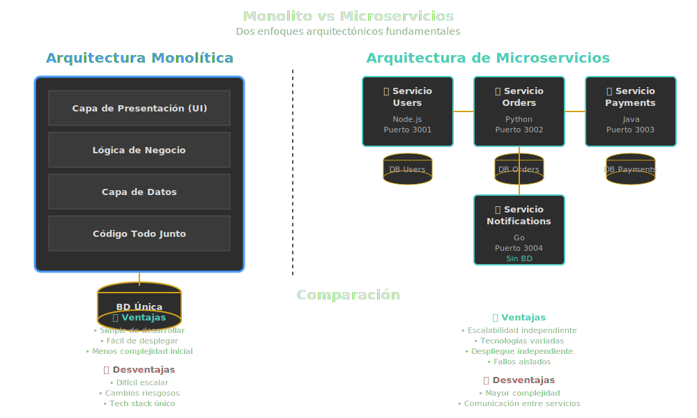

# 🔗 Relación Metodología-Arquitectura: Cómo se Complementan

## 🎯 Objetivos de Aprendizaje

Al finalizar esta sección, serás capaz de:

- ✅ Comprender cómo metodologías y arquitectura se influencian mutuamente
- ✅ Identificar patrones arquitectónicos apropiados para cada metodología
- ✅ Aplicar decisiones arquitectónicas que soporten la metodología elegida
- ✅ Reconocer trade-offs entre flexibilidad y planificación

---

## 📖 La Simbiosis Metodología-Arquitectura

### 🎯 ¿Qué es esta relación?

La **relación metodología-arquitectura** es la conexión bidireccional donde:

- La **metodología** influye en cómo diseñamos y evolucionamos la arquitectura
- La **arquitectura** habilita o limita qué metodología podemos usar efectivamente

Es como la relación entre el ADN y el entorno: uno define potencial, el otro determina cómo se expresa.

### 🚀 ¿Para qué entender esta relación?

Comprender esta relación sirve para:

1. **Tomar decisiones arquitectónicas coherentes** con la forma de trabajar del equipo
2. **Evitar fricciones** entre metodología y arquitectura
3. **Maximizar la productividad** del equipo
4. **Facilitar cambios** cuando la metodología lo requiere
5. **Diseñar sistemas sostenibles** a largo plazo

### 💥 ¿Qué impacto tiene?

**Si alineas metodología y arquitectura:**

- ✅ El equipo **fluye sin impedimentos** técnicos
- ✅ Los despliegues son **frecuentes y seguros**
- ✅ Los cambios de requisitos se **implementan rápidamente**
- ✅ La arquitectura **evoluciona naturalmente**
- ✅ La productividad se **mantiene alta** en el tiempo

**Si hay desalineación:**

- ❌ La arquitectura **sabotea la metodología** (ej: monolito en Scrum)
- ❌ Los despliegues son **lentos y riesgosos**
- ❌ Los cambios requieren **reescribir grandes porciones**
- ❌ La productividad **decrece con el tiempo**
- ❌ El equipo se **frustra constantemente**



---

## 🏗️ Cascada → Arquitectura Monolítica Planificada

### Características de la Arquitectura en Cascada

Cuando usas metodología en Cascada, la arquitectura típica tiene:

1. **Diseño completo al inicio** (Big Design Up Front - BDUF)
2. **Arquitectura monolítica** en capas
3. **Documentación exhaustiva** (SAD - Software Architecture Document)
4. **Decisiones difíciles de revertir**
5. **Enfoque en estabilidad** sobre flexibilidad

### Ejemplo: Sistema ERP Empresarial

```javascript
/**
 * ARQUITECTURA EN 3 CAPAS PLANIFICADA
 *
 * Decisiones tomadas en Fase de Diseño (Mes 1-2):
 * - Servidor: Java Spring Boot
 * - Base de datos: Oracle 19c
 * - Frontend: JSF + PrimeFaces
 * - Servidor de aplicaciones: WildFly
 * - Reportes: JasperReports
 *
 * Esta arquitectura NO cambiará durante los 18 meses de proyecto
 */

// ============================================
// CAPA 1: PRESENTACIÓN (Presentation Layer)
// ============================================

/**
 * Controlador de ventas
 * Responsable de manejar peticiones HTTP y renderizar vistas
 */
class SalesController {
  constructor(salesService) {
    this.salesService = salesService;
  }

  // Muestra el dashboard de ventas
  showDashboard(request, response) {
    const salesData = this.salesService.getSalesReport(request.params.month);
    response.render('sales-dashboard.jsp', { data: salesData });
  }

  // Procesa creación de orden
  createOrder(request, response) {
    const orderData = request.body;
    const result = this.salesService.createSalesOrder(orderData);
    response.redirect('/orders/' + result.id);
  }
}

// ============================================
// CAPA 2: LÓGICA DE NEGOCIO (Business Layer)
// ============================================

/**
 * Servicio de ventas
 * Contiene toda la lógica de negocio relacionada con ventas
 * Validaciones, cálculos, orquestación de operaciones
 */
class SalesService {
  constructor(orderRepository, inventoryRepository, customerRepository) {
    this.orderRepository = orderRepository;
    this.inventoryRepository = inventoryRepository;
    this.customerRepository = customerRepository;
  }

  /**
   * Crea una orden de venta
   * Lógica de negocio compleja con múltiples validaciones
   */
  createSalesOrder(orderData) {
    // Validación 1: Cliente existe y está activo
    const customer = this.customerRepository.findById(orderData.customerId);
    if (!customer || !customer.isActive) {
      throw new Error('Cliente no válido o inactivo');
    }

    // Validación 2: Verificar crédito disponible
    if (customer.creditLimit < orderData.total) {
      throw new Error('Cliente excede límite de crédito');
    }

    // Validación 3: Verificar inventario disponible
    for (const item of orderData.items) {
      const stock = this.inventoryRepository.getStock(item.productId);
      if (stock < item.quantity) {
        throw new Error(`Inventario insuficiente para ${item.productName}`);
      }
    }

    // Crear la orden (transacción completa)
    const order = {
      id: this.generateOrderId(),
      customerId: orderData.customerId,
      items: orderData.items,
      subtotal: this.calculateSubtotal(orderData.items),
      tax: this.calculateTax(orderData.items),
      total: orderData.total,
      status: 'PENDING',
      createdAt: new Date(),
    };

    // Persistir en base de datos
    this.orderRepository.save(order);

    // Reducir inventario
    for (const item of orderData.items) {
      this.inventoryRepository.reduceStock(item.productId, item.quantity);
    }

    // Registrar en auditoría
    this.auditLog('ORDER_CREATED', order.id);

    return order;
  }

  /**
   * Genera reporte de ventas
   * Agregaciones y cálculos complejos
   */
  getSalesReport(month) {
    const orders = this.orderRepository.findByMonth(month);

    return {
      totalOrders: orders.length,
      totalRevenue: orders.reduce((sum, o) => sum + o.total, 0),
      averageOrderValue: this.calculateAverage(orders),
      topProducts: this.getTopProducts(orders),
      salesByRegion: this.groupByRegion(orders),
    };
  }

  // Métodos auxiliares privados
  calculateSubtotal(items) {
    return items.reduce((sum, item) => sum + item.price * item.quantity, 0);
  }

  calculateTax(items) {
    const subtotal = this.calculateSubtotal(items);
    return subtotal * 0.19; // IVA 19%
  }

  generateOrderId() {
    return `ORD-${Date.now()}-${Math.random().toString(36).substr(2, 9)}`;
  }
}

// ============================================
// CAPA 3: ACCESO A DATOS (Data Access Layer)
// ============================================

/**
 * Repositorio de órdenes
 * Responsable ÚNICAMENTE de persistencia
 * Ejecuta queries SQL contra Oracle
 */
class OrderRepository {
  constructor(databaseConnection) {
    this.db = databaseConnection;
  }

  /**
   * Guarda una orden en la base de datos
   */
  save(order) {
    const query = `
      INSERT INTO sales_orders (
        id, customer_id, subtotal, tax, total, status, created_at
      ) VALUES (?, ?, ?, ?, ?, ?, ?)
    `;

    this.db.execute(query, [
      order.id,
      order.customerId,
      order.subtotal,
      order.tax,
      order.total,
      order.status,
      order.createdAt,
    ]);

    // Guardar items de la orden
    for (const item of order.items) {
      this.saveOrderItem(order.id, item);
    }
  }

  /**
   * Busca órdenes por mes
   */
  findByMonth(month) {
    const query = `
      SELECT * FROM sales_orders
      WHERE EXTRACT(MONTH FROM created_at) = ?
      ORDER BY created_at DESC
    `;

    return this.db.query(query, [month]);
  }

  /**
   * Busca orden por ID
   */
  findById(orderId) {
    const query = 'SELECT * FROM sales_orders WHERE id = ?';
    return this.db.queryOne(query, [orderId]);
  }

  // Método privado para items
  saveOrderItem(orderId, item) {
    const query = `
      INSERT INTO order_items (
        order_id, product_id, quantity, price, subtotal
      ) VALUES (?, ?, ?, ?, ?)
    `;

    this.db.execute(query, [
      orderId,
      item.productId,
      item.quantity,
      item.price,
      item.quantity * item.price,
    ]);
  }
}

/**
 * Repositorio de inventario
 */
class InventoryRepository {
  constructor(databaseConnection) {
    this.db = databaseConnection;
  }

  getStock(productId) {
    const query = 'SELECT quantity FROM inventory WHERE product_id = ?';
    const result = this.db.queryOne(query, [productId]);
    return result ? result.quantity : 0;
  }

  reduceStock(productId, quantity) {
    const query = `
      UPDATE inventory 
      SET quantity = quantity - ?,
          updated_at = CURRENT_TIMESTAMP
      WHERE product_id = ?
    `;

    this.db.execute(query, [quantity, productId]);
  }
}

// ============================================
// CONFIGURACIÓN Y BOOTSTRAPPING
// ============================================

/**
 * Configuración inicial de la aplicación
 * Todo cableado manual (Dependency Injection manual)
 */
class ApplicationBootstrap {
  static initialize() {
    // Configurar conexión a base de datos
    const dbConfig = {
      host: 'oracle-prod.company.com',
      port: 1521,
      database: 'ORCL',
      username: process.env.DB_USER,
      password: process.env.DB_PASS,
    };

    const db = new OracleConnection(dbConfig);

    // Crear repositorios
    const orderRepository = new OrderRepository(db);
    const inventoryRepository = new InventoryRepository(db);
    const customerRepository = new CustomerRepository(db);

    // Crear servicios
    const salesService = new SalesService(
      orderRepository,
      inventoryRepository,
      customerRepository,
    );

    // Crear controladores
    const salesController = new SalesController(salesService);

    // Configurar rutas HTTP
    const app = new Application();
    app.route('/sales/dashboard', salesController.showDashboard);
    app.route('/sales/orders', salesController.createOrder);

    return app;
  }
}

// Iniciar aplicación
const app = ApplicationBootstrap.initialize();
app.listen(8080);
```

### Características Clave de esta Arquitectura

1. **Separación estricta en capas**
   - Presentación NO habla directamente con Datos
   - Todo pasa por la capa de Lógica de Negocio

2. **Responsabilidades claras**
   - Controller: Solo maneja HTTP
   - Service: Solo lógica de negocio
   - Repository: Solo SQL

3. **Acoplamiento a tecnología**
   - Difícil migrar de Oracle a PostgreSQL
   - Difícil migrar de monolito a microservicios

4. **Diseño completo desde el inicio**
   - Todas las clases, métodos, tablas definidas en documentación
   - Poca flexibilidad para cambios

### ✅ Ventajas de esta Aproximación

- 📝 **Documentación clara**: Toda la arquitectura está documentada
- 🎯 **Roles bien definidos**: Frontend, Backend, DBA trabajan independientemente
- 🔒 **Estabilidad**: No hay cambios arquitectónicos sorpresivos
- 📊 **Predecible**: Tiempos y costos estimables con precisión

### ❌ Desventajas

- 🐌 **Lento para cambiar**: Modificar una tabla afecta múltiples capas
- 🔗 **Alto acoplamiento**: Cambiar BD requiere cambiar todo
- ⏰ **Largo tiempo de entrega**: Meses hasta ver el sistema funcionando
- 📦 **Monolito**: Escalado vertical, no horizontal

---

## 🚀 Ágil → Arquitectura de Microservicios Evolutiva

### Características de la Arquitectura en Ágil

Cuando usas metodología ágil (Scrum/Kanban), la arquitectura típica tiene:

1. **Diseño incremental** ("just enough")
2. **Modularidad extrema** (microservicios, APIs)
3. **Despliegues independientes** (CI/CD)
4. **Decisiones reversibles** (feature toggles)
5. **Enfoque en flexibilidad** y velocidad

### Ejemplo: Plataforma de Streaming (estilo Netflix)

```javascript
/**
 * ARQUITECTURA DE MICROSERVICIOS
 *
 * Cada servicio:
 * - Se despliega independientemente
 * - Tiene su propia base de datos
 * - Evoluciona a su propio ritmo
 * - Es mantenido por un squad autónomo
 */

// ============================================
// MICROSERVICIO 1: USER SERVICE
// ============================================

/**
 * Servicio de gestión de usuarios
 * Squad: Authentication Team
 * Deploy: Independiente, varias veces al día
 * BD: PostgreSQL (users_db)
 */

// user-service/src/api/user-controller.js
const express = require('express');
const router = express.Router();

// POST /api/users - Crear usuario
router.post('/users', async (req, res) => {
  try {
    const { email, password, name } = req.body;

    // Validaciones
    if (!email || !password) {
      return res.status(400).json({ error: 'Email y password requeridos' });
    }

    // Crear usuario
    const user = await userService.createUser({ email, password, name });

    // Emitir evento (comunicación asíncrona)
    await eventBus.publish('user.created', {
      userId: user.id,
      email: user.email,
      timestamp: new Date(),
    });

    res.status(201).json({
      id: user.id,
      email: user.email,
      name: user.name,
    });
  } catch (error) {
    res.status(500).json({ error: error.message });
  }
});

// GET /api/users/:id - Obtener usuario
router.get('/users/:id', async (req, res) => {
  const user = await userService.getUserById(req.params.id);

  if (!user) {
    return res.status(404).json({ error: 'Usuario no encontrado' });
  }

  res.json(user);
});

module.exports = router;

// user-service/src/domain/user-service.js
class UserService {
  constructor(repository, passwordHasher, eventBus) {
    this.repository = repository;
    this.passwordHasher = passwordHasher;
    this.eventBus = eventBus;
  }

  async createUser({ email, password, name }) {
    // Verificar si existe
    const existing = await this.repository.findByEmail(email);
    if (existing) {
      throw new Error('Email ya registrado');
    }

    // Hash password
    const hashedPassword = await this.passwordHasher.hash(password);

    // Crear usuario
    const user = {
      id: crypto.randomUUID(),
      email,
      password: hashedPassword,
      name,
      createdAt: new Date(),
      isActive: true,
    };

    await this.repository.save(user);

    return user;
  }

  async getUserById(id) {
    return await this.repository.findById(id);
  }
}

// ============================================
// MICROSERVICIO 2: CONTENT SERVICE
// ============================================

/**
 * Servicio de gestión de contenido (películas, series)
 * Squad: Content Team
 * Deploy: Independiente
 * BD: MongoDB (content_db)
 */

// content-service/src/api/content-controller.js
const express = require('express');
const router = express.Router();

// GET /api/content/search - Buscar contenido
router.get('/content/search', async (req, res) => {
  const { query, genre, year } = req.query;

  const results = await contentService.search({
    query,
    filters: { genre, year },
  });

  res.json({
    results,
    total: results.length,
  });
});

// GET /api/content/:id - Obtener detalle de contenido
router.get('/content/:id', async (req, res) => {
  // Buscar en caché primero
  const cached = await cache.get(`content:${req.params.id}`);
  if (cached) {
    return res.json(JSON.parse(cached));
  }

  // Si no está en caché, buscar en BD
  const content = await contentService.getById(req.params.id);

  if (!content) {
    return res.status(404).json({ error: 'Contenido no encontrado' });
  }

  // Guardar en caché (1 hora)
  await cache.set(
    `content:${req.params.id}`,
    JSON.stringify(content),
    'EX',
    3600,
  );

  res.json(content);
});

module.exports = router;

// ============================================
// MICROSERVICIO 3: RECOMMENDATION SERVICE
// ============================================

/**
 * Servicio de recomendaciones
 * Squad: ML/Recommendations Team
 * Deploy: Independiente
 * BD: Cassandra (recommendations_db)
 *
 * Este servicio CONSUME eventos de otros servicios
 */

// recommendation-service/src/event-handlers/user-activity-handler.js
class UserActivityHandler {
  constructor(recommendationEngine) {
    this.engine = recommendationEngine;
  }

  /**
   * Escucha eventos de visualización de contenido
   * Publicados por el Playback Service
   */
  async onContentWatched(event) {
    const { userId, contentId, watchedPercentage, timestamp } = event.data;

    // Actualizar perfil de usuario
    await this.engine.updateUserProfile(userId, {
      contentId,
      watchedPercentage,
      timestamp,
    });

    // Regenerar recomendaciones si es necesario
    if (watchedPercentage > 70) {
      await this.engine.generateRecommendations(userId);
    }
  }
}

// recommendation-service/src/api/recommendation-controller.js
router.get('/recommendations/:userId', async (req, res) => {
  const { userId } = req.params;

  // Obtener recomendaciones personalizadas
  const recommendations = await recommendationService.getForUser(userId);

  res.json({
    userId,
    recommendations,
    generatedAt: new Date(),
  });
});

// ============================================
// API GATEWAY
// ============================================

/**
 * Punto de entrada único
 * Enruta peticiones a microservicios
 * Maneja autenticación centralizada
 */

// api-gateway/src/gateway.js
const express = require('express');
const httpProxy = require('http-proxy-middleware');
const jwt = require('jsonwebtoken');

const app = express();

// Middleware de autenticación
const authenticate = (req, res, next) => {
  const token = req.headers.authorization?.replace('Bearer ', '');

  if (!token) {
    return res.status(401).json({ error: 'No autorizado' });
  }

  try {
    const decoded = jwt.verify(token, process.env.JWT_SECRET);
    req.user = decoded;
    next();
  } catch (error) {
    return res.status(401).json({ error: 'Token inválido' });
  }
};

// Rutas a microservicios
app.use(
  '/api/users',
  httpProxy.createProxyMiddleware({
    target: 'http://user-service:3001',
    changeOrigin: true,
  }),
);

app.use(
  '/api/content',
  authenticate,
  httpProxy.createProxyMiddleware({
    target: 'http://content-service:3002',
    changeOrigin: true,
  }),
);

app.use(
  '/api/recommendations',
  authenticate,
  httpProxy.createProxyMiddleware({
    target: 'http://recommendation-service:3003',
    changeOrigin: true,
  }),
);

app.listen(3000);

// ============================================
// EVENT BUS (RabbitMQ / Kafka)
// ============================================

/**
 * Comunicación asíncrona entre microservicios
 * Patrón: Publish-Subscribe
 */

// shared/event-bus.js
class EventBus {
  constructor(messageBroker) {
    this.broker = messageBroker;
  }

  // Publicar evento
  async publish(eventName, data) {
    const event = {
      id: crypto.randomUUID(),
      name: eventName,
      data,
      timestamp: new Date(),
      version: '1.0',
    };

    await this.broker.publish('events', eventName, JSON.stringify(event));
  }

  // Suscribirse a eventos
  async subscribe(eventName, handler) {
    await this.broker.subscribe('events', eventName, async (message) => {
      const event = JSON.parse(message.content.toString());
      await handler(event);
    });
  }
}

// Ejemplo de uso en User Service
eventBus.publish('user.created', {
  userId: '123',
  email: 'user@example.com',
});

// Ejemplo de suscripción en Recommendation Service
eventBus.subscribe('user.created', async (event) => {
  // Crear perfil de recomendaciones para nuevo usuario
  await recommendationService.initializeProfile(event.data.userId);
});
```

### Características Clave de esta Arquitectura

1. **Servicios independientes**
   - Cada microservicio se despliega por separado
   - Cada uno tiene su propia base de datos

2. **Comunicación desacoplada**
   - Síncrona: HTTP REST vía API Gateway
   - Asíncrona: Eventos vía RabbitMQ/Kafka

3. **Escalado granular**
   - User Service: 3 instancias
   - Content Service: 10 instancias (más demandado)
   - Recommendation Service: 5 instancias

4. **Evolución independiente**
   - Content Team despliega sin afectar User Team
   - Cada servicio puede usar tecnología diferente

### ✅ Ventajas de esta Aproximación

- ⚡ **Despliegues frecuentes**: Varias veces al día por equipo
- 🔧 **Fácil de cambiar**: Reescribir un servicio sin afectar otros
- 📈 **Escalado granular**: Escalar solo lo que necesita
- 🚀 **Velocidad de desarrollo**: Equipos trabajan en paralelo

### ❌ Desventajas

- 🔗 **Complejidad operacional**: Orquestar 20+ servicios
- 🌐 **Latencia de red**: Llamadas entre servicios son lentas
- 🐛 **Debugging difícil**: Errores se distribuyen en múltiples servicios
- 📊 **Monitoreo complejo**: Necesitas herramientas especializadas (Datadog, New Relic)

---

## 🔄 Evolución: Del Monolito a Microservicios

### Migración Gradual (Strangler Fig Pattern)

```javascript
/**
 * FASE 1: Monolito inicial (Mes 1-6)
 * Todo en una sola aplicación
 */

// app.js (Monolito)
const express = require('express');
const app = express();

app.post('/users', createUser);           // ← Funcionalidad de usuarios
app.get('/products', getProducts);        // ← Funcionalidad de productos
app.post('/orders', createOrder);         // ← Funcionalidad de órdenes

app.listen(3000);

/**
 * FASE 2: Extraer primer microservicio (Mes 7-9)
 * Migrar gestión de usuarios
 */

// Monolito ahora redirige a User Service
app.post('/users', (req, res) => {
  // Llamar al nuevo User Service
  const response = await fetch('http://user-service:3001/users', {
    method: 'POST',
    body: JSON.stringify(req.body)
  });

  const data = await response.json();
  res.json(data);
});

// Productos y órdenes todavía en monolito
app.get('/products', getProducts);        // ← Todavía en monolito
app.post('/orders', createOrder);         // ← Todavía en monolito

/**
 * FASE 3: Extraer segundo microservicio (Mes 10-12)
 * Migrar gestión de productos
 */

// Ahora usuarios y productos son microservicios
app.post('/users', proxyToUserService);
app.get('/products', proxyToProductService);

// Solo órdenes en monolito
app.post('/orders', createOrder);         // ← Todavía en monolito

/**
 * FASE 4: Completar migración (Mes 13-15)
 * Todo son microservicios, monolito se convierte en API Gateway
 */

// api-gateway.js
app.use('/users', proxyToUserService);
app.use('/products', proxyToProductService);
app.use('/orders', proxyToOrderService);

// Monolito original: RETIRADO ✅
```

### Lecciones de la Migración

1. **No migres todo a la vez**: "Strangler Fig" es gradual
2. **Empieza por servicios periféricos**: No por el core crítico
3. **Mantén compatibilidad**: Monolito y microservicios conviven
4. **Automatiza desde el inicio**: CI/CD, testing, monitoring

---

## 🎯 Trade-offs: Cascada vs Ágil

| Aspecto                       | Cascada + Monolito    | Ágil + Microservicios |
| ----------------------------- | --------------------- | --------------------- |
| **Time to Market**            | Lento (6-18 meses)    | Rápido (2-4 semanas)  |
| **Complejidad inicial**       | Baja                  | Alta                  |
| **Complejidad a largo plazo** | Alta                  | Media                 |
| **Costo operacional**         | Bajo                  | Alto                  |
| **Flexibilidad**              | Baja                  | Alta                  |
| **Requisitos de equipo**      | Generalistas          | Especialistas         |
| **Ideal para**                | Proyectos predecibles | Productos innovadores |

---

## 💡 Recomendaciones Prácticas

### ✅ Empieza Monolítico, Evoluciona a Microservicios

La mayoría de startups exitosas (Amazon, Netflix, Uber) empezaron con monolitos y evolucionaron:

1. **MVP (0-6 meses)**: Monolito bien diseñado
2. **Crecimiento (6-18 meses)**: Identificar bounded contexts
3. **Escala (18+ meses)**: Extraer microservicios gradualmente

### ✅ No Hay Arquitectura Perfecta

- Cascada + Monolito: Apropiado para sistemas estables (ERP, software médico)
- Ágil + Microservicios: Apropiado para productos digitales (SaaS, e-commerce)
- Híbrido: Mayoría de empresas usa algo en el medio

### ✅ Alinea Arquitectura con Cultura

- Si tu equipo es tradicional → No fuerces microservicios
- Si tu equipo es ágil → No fuerces monolito
- La arquitectura debe servir al equipo, no al revés

---

## 🎓 Resumen de Conceptos Clave

| Concepto              | Definición Breve                                             |
| --------------------- | ------------------------------------------------------------ |
| **Simbiosis**         | Metodología y arquitectura se influencian mutuamente         |
| **Monolito en capas** | Arquitectura típica de Cascada, 3 capas, acoplado            |
| **Microservicios**    | Arquitectura típica de Ágil, servicios independientes        |
| **Strangler Fig**     | Patrón para migrar gradualmente de monolito a microservicios |
| **Trade-offs**        | No hay solución perfecta, solo compromisos                   |

---

## 💡 Reflexión Final

> "La mejor arquitectura es aquella que se adapta a cómo trabaja tu equipo y evoluciona con tu producto."

No copies arquitecturas de FAANG (Facebook, Amazon, Apple, Netflix, Google) si no tienes sus problemas. Empieza simple, evoluciona según necesidad.

---

## 🚀 Siguiente Paso

En la siguiente sesión práctica, analizaremos casos reales de empresas que alinearon metodología y arquitectura exitosamente (y algunas que fallaron).

---

## 📚 Lecturas Recomendadas

- **"Building Microservices"** - Sam Newman
- **"Monolith to Microservices"** - Sam Newman
- **"Accelerate"** - Nicole Forsgren, Jez Humble, Gene Kim
- **"Team Topologies"** - Matthew Skelton, Manuel Pais

---

**Bootcamp de Arquitectura de Software**
_SENA - Tecnología en Análisis y Desarrollo de Software_
_Week 01 - Fundamentos de Arquitectura_
