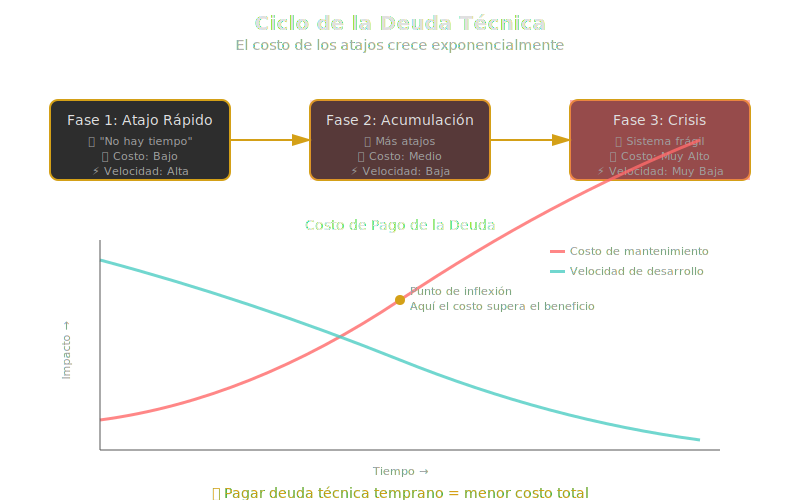

# 🏗️ ¿Por Qué Importa la Arquitectura de Software?

## 🎯 Objetivos de Aprendizaje

Al finalizar esta sección, serás capaz de:

- ✅ Comprender qué es arquitectura de software y por qué es fundamental
- ✅ Diferenciar entre arquitectura y diseño de software
- ✅ Identificar las consecuencias de una mala arquitectura
- ✅ Reconocer los beneficios de una buena arquitectura desde el inicio del proyecto

---

## 📖 ¿Qué es la Arquitectura de Software?

### 🎯 ¿Qué es?

La **arquitectura de software** es el conjunto de decisiones estructurales fundamentales que definen cómo se organizan y relacionan los componentes de un sistema. Es el "plano maestro" que guía la construcción del software, similar a cómo un arquitecto diseña los planos de un edificio antes de su construcción.

> **Definición formal (IEEE 1471)**: "La arquitectura de software es la organización fundamental de un sistema, representada por sus componentes, las relaciones entre ellos y con el entorno, y los principios que gobiernan su diseño y evolución."

### 🚀 ¿Para qué sirve?

La arquitectura de software sirve para:

1. **Tomar decisiones tempranas** sobre estructura, tecnologías y patrones a seguir
2. **Reducir la complejidad** dividiendo el sistema en partes manejables
3. **Facilitar la comunicación** entre equipos mediante un vocabulario común
4. **Prever problemas futuros** antes de que sean costosos de resolver
5. **Garantizar atributos de calidad** como escalabilidad, seguridad y mantenibilidad

### 💥 ¿Qué impacto tiene?

**Si diseñas una buena arquitectura:**

- ✅ El sistema es **fácil de mantener y evolucionar**
- ✅ Los nuevos desarrolladores se **integran rápidamente**
- ✅ Los cambios de requisitos tienen **menor impacto**
- ✅ Es posible **escalar** cuando crece la demanda
- ✅ Los costos de desarrollo a largo plazo se **reducen significativamente**

**Si NO diseñas arquitectura o es deficiente:**

- ❌ El código se convierte en un **"monolito inmanejable"**
- ❌ Cada cambio genera **efectos colaterales inesperados**
- ❌ Los costos de mantenimiento se **disparan exponencialmente**
- ❌ El sistema colapsa bajo presión (**no escala**)
- ❌ El proyecto puede **fracasar completamente**

---

## 🏛️ Arquitectura vs Diseño de Software

Muchos desarrolladores confunden estos dos conceptos. Veamos sus diferencias:

| Aspecto           | Arquitectura de Software          | Diseño de Software          |
| ----------------- | --------------------------------- | --------------------------- |
| **Nivel**         | Alto nivel (visión general)       | Bajo nivel (implementación) |
| **Alcance**       | Sistema completo                  | Componentes individuales    |
| **Decisiones**    | Estructura, tecnologías, patrones | Algoritmos, clases, métodos |
| **Impacto**       | Difícil de cambiar más adelante   | Más flexible a cambios      |
| **Quién lo hace** | Arquitecto de software            | Desarrollador/Diseñador     |
| **Cuándo**        | Inicio del proyecto               | Durante todo el desarrollo  |

### 📌 Ejemplo Práctico

**Arquitectura**: Decidir usar una arquitectura de microservicios con Node.js, PostgreSQL y comunicación vía HTTP REST.

**Diseño**: Implementar la clase `UserService` con métodos `createUser()`, `updateUser()`, decidir qué algoritmo de hash usar para contraseñas.

---

## 🌍 Casos Reales: Consecuencias de una Mala Arquitectura

### 📉 Caso 1: Healthcare.gov (2013)

**Problema:** Lanzamiento del sitio web de salud del gobierno de EE.UU.

**Fallos arquitectónicos:**

- Sistema monolítico incapaz de escalar
- Integración deficiente entre componentes
- Sin pruebas de carga adecuadas

**Consecuencias:**

- El sitio colapsó el primer día
- Solo 6 personas pudieron registrarse el primer día (esperaban millones)
- Costo de reparación: **$1.7 mil millones de dólares**
- Daño reputacional masivo

**Lección:** La arquitectura debe diseñarse para escalar desde el inicio.

---

### 📉 Caso 2: Knight Capital Group (2012)

**Problema:** Error de software en sistema de trading.

**Fallos arquitectónicos:**

- Falta de reversión automática (rollback)
- Sin circuit breakers en arquitectura
- Acoplamiento excesivo entre componentes

**Consecuencias:**

- Pérdida de **$440 millones en 45 minutos**
- La empresa casi quiebra
- Despidos masivos

**Lección:** La arquitectura debe incluir mecanismos de seguridad y recuperación.

---

### ✅ Caso 3: Netflix (Evolución exitosa)

**Decisión arquitectónica:** Migrar de monolito a microservicios (2008-2016).

**Beneficios arquitectónicos:**

- Escalabilidad independiente de cada servicio
- Despliegues sin downtime
- Resiliencia ante fallos (Chaos Engineering)

**Resultados:**

- Soporta **200+ millones de usuarios** simultáneos
- Despliega código **miles de veces al día**
- Disponibilidad del 99.99%

**Lección:** Una arquitectura bien diseñada permite el crecimiento exponencial.

---

## 🎯 Atributos de Calidad en Arquitectura

Una buena arquitectura debe considerar los **atributos de calidad** desde el inicio:

### 1. 🚀 **Rendimiento (Performance)**

**¿Qué es?** Capacidad del sistema de responder rápidamente a las solicitudes.

**Ejemplo:** Amazon descubrió que cada 100ms de latencia reduce las ventas en 1%.

**Decisión arquitectónica:** Usar caché (Redis), CDN para contenido estático, bases de datos distribuidas.

---

### 2. 📈 **Escalabilidad (Scalability)**

**¿Qué es?** Capacidad de manejar crecimiento de usuarios o datos.

**Ejemplo:** Twitter debe soportar picos de 140,000 tweets/segundo durante eventos globales.

**Decisión arquitectónica:** Arquitectura de microservicios, balanceadores de carga, bases de datos sharding.

---

### 3. 🔒 **Seguridad (Security)**

**¿Qué es?** Protección contra accesos no autorizados y vulnerabilidades.

**Ejemplo:** Equifax perdió datos de 147 millones de personas por no parchear una vulnerabilidad conocida.

**Decisión arquitectónica:** Autenticación OAuth2/JWT, encriptación end-to-end, principio de menor privilegio.

---

### 4. 🔧 **Mantenibilidad (Maintainability)**

**¿Qué es?** Facilidad para corregir errores y agregar nuevas funcionalidades.

**Ejemplo:** El 70% del costo de software es mantenimiento, no desarrollo inicial.

**Decisión arquitectónica:** Modularidad, alta cohesión, bajo acoplamiento, código limpio.

---

### 5. 🛡️ **Disponibilidad (Availability)**

**¿Qué es?** Porcentaje de tiempo que el sistema está operativo.

**Ejemplo:** Google Cloud garantiza 99.95% de uptime (4.38 horas de downtime/año máximo).

**Decisión arquitectónica:** Redundancia, failover automático, monitoreo proactivo.

---

### 6. ⚡ **Resilencia (Resilience)**

**¿Qué es?** Capacidad de recuperarse ante fallos.

**Ejemplo:** Cuando AWS-US-East-1 cae, servicios como Slack, Discord, Spotify se ven afectados.

**Decisión arquitectónica:** Circuit breakers, retry con backoff exponencial, multi-región.

---

## 🧩 El Rol del Arquitecto de Software

### ¿Qué hace un arquitecto de software?

1. **Define la visión técnica** del proyecto
2. **Toma decisiones estructurales** sobre tecnologías y patrones
3. **Balancea trade-offs** entre diferentes atributos de calidad
4. **Documenta decisiones** arquitectónicas (ADRs)
5. **Guía al equipo técnico** en implementaciones complejas
6. **Revisa código crítico** para cumplimiento arquitectónico
7. **Evoluciona la arquitectura** según necesidades cambiantes

### Habilidades clave

- 🧠 **Pensamiento sistémico**: Ver el panorama completo
- 🔍 **Análisis de trade-offs**: No hay soluciones perfectas
- 💬 **Comunicación**: Explicar decisiones técnicas a stakeholders no técnicos
- 📚 **Conocimiento amplio**: Patrones, tecnologías, mejores prácticas
- 🔮 **Visión a largo plazo**: Anticipar necesidades futuras

---

## 📊 Deuda Técnica: El Costo de una Mala Arquitectura

### 🎯 ¿Qué es la deuda técnica?

La **deuda técnica** es el costo futuro que se paga por tomar atajos o decisiones subóptimas en el presente.

**Analogía:** Es como pedir un préstamo. Puedes avanzar rápido ahora, pero pagarás intereses (tiempo, dinero) en el futuro.

### Tipos de deuda técnica

1. **Deuda deliberada**: "Sabemos que esto no es ideal, pero necesitamos lanzar ya"
2. **Deuda accidental**: Por falta de conocimiento o experiencia
3. **Deuda por obsolescencia**: Tecnologías que quedan desactualizadas

### 💰 El impacto real

Según estudios de Gartner y McKinsey:

- El **40% del presupuesto de IT** se gasta en manejar deuda técnica
- La productividad puede **reducirse hasta un 50%** en sistemas con alta deuda técnica
- El **23% de los proyectos fracasan** por deuda técnica acumulada

### ✅ Cómo prevenir deuda técnica con arquitectura

1. **Diseño modular**: Cambiar una parte sin afectar todo el sistema
2. **Principios SOLID**: Código extensible y mantenible
3. **Documentación**: Registrar decisiones arquitectónicas (ADRs)
4. **Revisiones técnicas**: Code reviews y arquitectura reviews
5. **Refactorización continua**: No dejar que la deuda se acumule

---

## 🎓 Resumen de Conceptos Clave

| Concepto                     | Definición Breve                                                      |
| ---------------------------- | --------------------------------------------------------------------- |
| **Arquitectura de Software** | Decisiones estructurales fundamentales del sistema                    |
| **Atributos de Calidad**     | Rendimiento, escalabilidad, seguridad, mantenibilidad, etc.           |
| **Deuda Técnica**            | Costo futuro de decisiones subóptimas presentes                       |
| **Arquitecto**               | Responsable de decisiones técnicas de alto nivel                      |
| **Trade-offs**               | Compromisos entre diferentes atributos (ej: rendimiento vs seguridad) |

---

## 💡 Reflexión Final

> "La arquitectura de software es como los cimientos de un edificio. Puedes tener los mejores acabados y decoraciones, pero si los cimientos son débiles, todo se derrumbará."

La arquitectura no es un lujo ni una etapa opcional. Es la diferencia entre:

- ✅ Un sistema que crece con tu negocio
- ❌ Un sistema que colapsa bajo su propio peso

La inversión en arquitectura temprana **ahorra dinero, tiempo y dolores de cabeza** a largo plazo.

---

## 🚀 Siguiente Paso

Ahora que comprendes **por qué** importa la arquitectura, en la siguiente sección exploraremos **cómo** las metodologías de desarrollo (tradicionales vs ágiles) se relacionan con las decisiones arquitectónicas.

---

## 📚 Lecturas Recomendadas

- **"Clean Architecture"** - Robert C. Martin (Uncle Bob)
- **"Software Architecture in Practice"** - Bass, Clements, Kazman
- **"The Software Architect Elevator"** - Gregor Hohpe
- **"Building Evolutionary Architectures"** - Ford, Parsons, Kua

---

**Bootcamp de Arquitectura de Software**
_SENA - Tecnología en Análisis y Desarrollo de Software_
_Week 01 - Fundamentos de Arquitectura_
