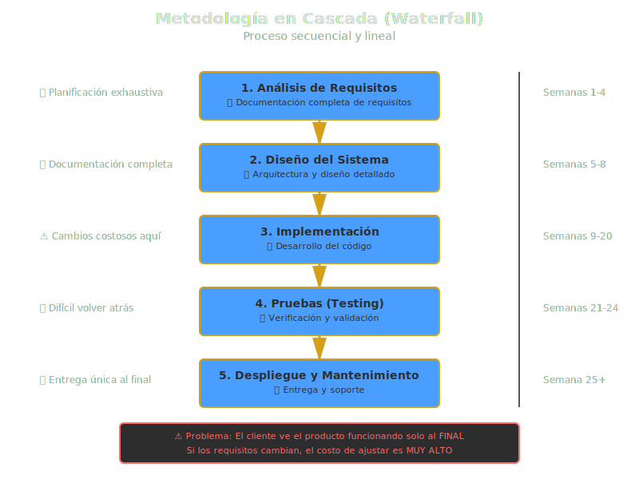
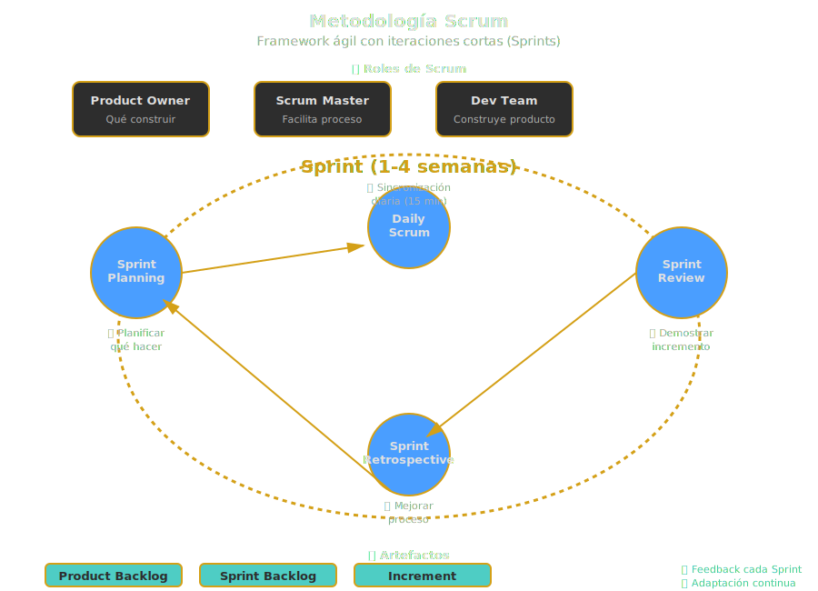

# 🔄 Metodologías de Desarrollo de Software

## 🎯 Objetivos de Aprendizaje

Al finalizar esta sección, serás capaz de:

- ✅ Comprender las diferencias entre metodologías tradicionales y ágiles
- ✅ Identificar cuándo usar cada tipo de metodología
- ✅ Relacionar metodologías con decisiones arquitectónicas
- ✅ Reconocer cómo las metodologías impactan en la arquitectura del software

---

## 📖 ¿Qué son las Metodologías de Desarrollo?

### 🎯 ¿Qué es?

Una **metodología de desarrollo de software** es un conjunto estructurado de prácticas, principios y procesos que guían cómo se planifica, diseña, construye y entrega un sistema de software.

Es el "cómo" trabajamos para construir software: cómo nos organizamos, cómo planificamos, cómo nos comunicamos con el cliente, cómo manejamos los cambios.

### 🚀 ¿Para qué sirve?

Las metodologías sirven para:

1. **Organizar el trabajo** del equipo de desarrollo
2. **Gestionar riesgos** y cambios de requisitos
3. **Mejorar la comunicación** entre stakeholders
4. **Predecir tiempos y costos** de desarrollo
5. **Garantizar calidad** del producto final

### 💥 ¿Qué impacto tiene?

**Si eliges la metodología correcta:**

- ✅ El equipo trabaja de manera **coordinada y eficiente**
- ✅ Los cambios de requisitos se **manejan sin crisis**
- ✅ El cliente **obtiene valor tempranamente**
- ✅ Los riesgos se **identifican a tiempo**
- ✅ El proyecto **se entrega exitosamente**

**Si eliges la metodología incorrecta:**

- ❌ El equipo pierde tiempo en **procesos innecesarios**
- ❌ Los cambios generan **caos y retrabajos**
- ❌ El cliente ve resultados **muy tarde**
- ❌ Los costos se **salen de control**
- ❌ El proyecto puede **fracasar**

---

## 🏛️ Metodologías Tradicionales (Predictivas)

### 📋 Características Principales

Las metodologías tradicionales, también conocidas como **predictivas** o **en cascada (Waterfall)**, se basan en:

1. **Planificación exhaustiva** al inicio del proyecto
2. **Fases secuenciales** que no se solapan
3. **Requisitos completos** antes de empezar a codificar
4. **Documentación extensa** en cada etapa
5. **Cambios difíciles y costosos** una vez iniciada la construcción

### 🔄 El Modelo en Cascada (Waterfall)

```
┌─────────────────┐
│  Requisitos     │ ← Se recopilan TODOS los requisitos
└────────┬────────┘
         ↓
┌─────────────────┐
│  Diseño         │ ← Se diseña la arquitectura completa
└────────┬────────┘
         ↓
┌─────────────────┐
│  Implementación │ ← Se codifica según el diseño
└────────┬────────┘
         ↓
┌─────────────────┐
│  Pruebas        │ ← Se valida que funciona
└────────┬────────┘
         ↓
┌─────────────────┐
│  Despliegue     │ ← Se entrega al cliente
└────────┬────────┘
         ↓
┌─────────────────┐
│  Mantenimiento  │ ← Se corrigen errores
└─────────────────┘
```

**Flujo:** Cada fase debe completarse 100% antes de pasar a la siguiente.

### ✅ Ventajas del Modelo en Cascada

- 📝 **Documentación completa**: Todo está documentado detalladamente
- 📊 **Planificación clara**: Tiempos y costos predecibles
- 👔 **Ideal para proyectos regulados**: Industrias con normativas estrictas (aeroespacial, médica)
- 🎯 **Requisitos estables**: Funciona si los requisitos NO cambiarán

### ❌ Desventajas del Modelo en Cascada

- 🐌 **Entrega tardía**: El cliente ve el producto al final
- 🔒 **Inflexible a cambios**: Modificar requisitos es muy costoso
- ⏰ **Largo tiempo de feedback**: Errores se descubren tarde
- 📈 **Alto riesgo**: Si algo falla, se descubre muy tarde

### 🏗️ Impacto Arquitectónico

**En Cascada, la arquitectura se define TODA al inicio:**

- Se crea un documento de arquitectura completo (200+ páginas)
- Decisiones tecnológicas se toman antes de codificar
- Si la arquitectura tiene errores, son muy costosos de corregir más adelante

**Ejemplo:** Proyecto de sistema bancario tradicional

- Se diseñan todos los módulos (cuentas, transferencias, préstamos)
- Se define toda la arquitectura (mainframe, base de datos, interfaces)
- Se construye todo antes de desplegar
- Duración: 18-24 meses hasta primer deploy



---

## 🚀 Metodologías Ágiles (Adaptativas)

### 📋 Características Principales

Las metodologías ágiles se basan en:

1. **Iteraciones cortas** (sprints de 1-4 semanas)
2. **Entrega continua de valor** al cliente
3. **Colaboración constante** con stakeholders
4. **Bienvenida a los cambios** de requisitos
5. **Software funcionando** sobre documentación exhaustiva

### 📜 Manifiesto Ágil (2001)

Los 4 valores fundamentales:

1. **Individuos e interacciones** sobre procesos y herramientas
2. **Software funcionando** sobre documentación extensiva
3. **Colaboración con el cliente** sobre negociación contractual
4. **Respuesta ante el cambio** sobre seguir un plan rígido

### 🔄 Scrum: La Metodología Ágil Más Popular

```
┌─────────────────────────────────────────┐
│          PRODUCT BACKLOG                │
│  1. Login de usuarios                   │
│  2. Gestión de productos                │
│  3. Carrito de compras                  │
│  4. Pasarela de pago                    │
│  ...                                    │
└─────────┬───────────────────────────────┘
          ↓
    ┌─────────────┐
    │   SPRINT    │ ← 2 semanas
    │   PLANNING  │
    └──────┬──────┘
           ↓
    ┌─────────────────────────┐
    │   SPRINT (2 semanas)    │
    │  - Daily Standup        │
    │  - Desarrollo           │
    │  - Testing              │
    │  - Sprint Review        │
    │  - Retrospectiva        │
    └──────┬──────────────────┘
           ↓
    ┌─────────────┐
    │  INCREMENT  │ ← Producto funcional
    │  (Funcional)│    desplegable
    └─────────────┘
```

**Flujo:** Cada sprint entrega software funcionando que agrega valor.

### ✅ Ventajas de Scrum/Ágil

- ⚡ **Entrega temprana**: Cliente ve valor cada 2-4 semanas
- 🔄 **Adaptabilidad**: Cambios de requisitos son bienvenidos
- 🎯 **Feedback continuo**: Se ajusta rápido según feedback
- 🤝 **Colaboración**: Cliente involucrado todo el tiempo
- 📉 **Menor riesgo**: Problemas se detectan rápido

### ❌ Desventajas de Scrum/Ágil

- 📝 **Documentación limitada**: Puede ser insuficiente para proyectos complejos
- 🎯 **Requiere compromiso del cliente**: Si el cliente no participa, falla
- 👥 **Equipos pequeños**: Difícil escalar a 100+ desarrolladores
- 🔮 **Planificación a largo plazo**: Difícil estimar fechas lejanas

### 🏗️ Impacto Arquitectónico

**En Ágil, la arquitectura evoluciona incrementalmente:**

- Se diseña "lo suficiente" para el próximo sprint
- La arquitectura se **refactoriza continuamente**
- Decisiones arquitectónicas se toman "just in time"
- Arquitectura emergente vs arquitectura planificada

**Ejemplo:** Startup de e-commerce

- Sprint 1: Login básico (arquitectura simple: Node.js + PostgreSQL)
- Sprint 3: Agregar carrito (se añade Redis para sesiones)
- Sprint 6: Escalar (se migra a microservicios)
- Duración: Valor cada 2 semanas, evolución continua



---

## 🔄 Otras Metodologías Importantes

### 1. 🎯 Kanban

**¿Qué es?** Sistema visual de gestión de flujo de trabajo.

**Características:**

- Tablero visual (To Do, In Progress, Done)
- Límite de trabajo en progreso (WIP limits)
- Flujo continuo (no hay sprints)

**Cuándo usarlo:**

- Equipos de soporte o mantenimiento
- Trabajo impredecible y continuo
- Proyectos sin deadlines fijos

**Impacto arquitectónico:**

- Arquitectura debe permitir **despliegues frecuentes**
- Prioridad en **modularidad** para cambios rápidos

---

### 2. 🚀 Extreme Programming (XP)

**¿Qué es?** Metodología ágil enfocada en la excelencia técnica.

**Prácticas clave:**

- Pair programming (programación en pareja)
- Test-Driven Development (TDD)
- Integración continua (CI)
- Refactorización constante

**Cuándo usarlo:**

- Proyectos con requisitos cambiantes
- Equipos pequeños y altamente técnicos
- Alta exigencia de calidad de código

**Impacto arquitectónico:**

- Arquitectura debe ser **fácilmente testeable**
- Diseño simple que permita **refactorización continua**
- Enfoque en **código limpio**

---

### 3. 📱 DevOps

**¿Qué es?** Cultura y prácticas que integran desarrollo y operaciones.

**Prácticas clave:**

- Integración continua / Entrega continua (CI/CD)
- Infraestructura como código (IaC)
- Monitoreo y logging automatizado
- Automatización de todo lo posible

**Cuándo usarlo:**

- Productos SaaS que necesitan despliegues frecuentes
- Startups que necesitan iterar rápido
- Empresas con múltiples microservicios

**Impacto arquitectónico:**

- Arquitectura **cloud-native**
- Diseño de **12-factor apps**
- **Containerización** (Docker/Kubernetes)
- **Observabilidad** integrada (métricas, logs, trazas)

---

## 🎯 Comparación: Tradicional vs Ágil

| Aspecto           | Tradicional (Cascada) | Ágil (Scrum)                 |
| ----------------- | --------------------- | ---------------------------- |
| **Requisitos**    | Todos al inicio       | Evolucionan en cada sprint   |
| **Entrega**       | Una sola al final     | Incrementos cada 2-4 semanas |
| **Cambios**       | Muy costosos          | Bienvenidos                  |
| **Documentación** | Extensa               | Suficiente                   |
| **Cliente**       | Inicio y final        | Participación continua       |
| **Riesgo**        | Alto (todo al final)  | Bajo (detección temprana)    |
| **Arquitectura**  | Completa al inicio    | Evoluciona gradualmente      |
| **Ideal para**    | Requisitos estables   | Requisitos cambiantes        |

---

## 🏗️ Relación entre Metodología y Arquitectura

### 🔗 ¿Cómo se complementan?

La metodología y la arquitectura están íntimamente relacionadas:

#### 📌 Metodología Tradicional → Arquitectura Planificada

```javascript
// Ejemplo: Sistema bancario tradicional

/**
 * DECISIONES ARQUITECTÓNICAS AL INICIO:
 * - Arquitectura en 3 capas (Presentación, Lógica, Datos)
 * - Base de datos relacional centralizada (Oracle)
 * - Servidor de aplicaciones (WebSphere)
 * - Interfaz web (JSP/Servlets)
 *
 * ESTAS DECISIONES NO CAMBIARÁN EN 2-3 AÑOS
 */

// Capa de Presentación
class BankAccountController {
  displayAccount(accountId) {
    // Renderiza vista JSP
  }
}

// Capa de Lógica
class BankAccountService {
  getAccountBalance(accountId) {
    // Lógica de negocio
    return this.accountRepository.findById(accountId);
  }
}

// Capa de Datos
class BankAccountRepository {
  findById(accountId) {
    // Consulta SQL a Oracle
  }
}
```

**Características:**

- Arquitectura completa y detallada desde el inicio
- Decisiones tecnológicas difíciles de cambiar
- Diseño orientado a estabilidad a largo plazo

---

#### 📌 Metodología Ágil → Arquitectura Evolutiva

```javascript
// Ejemplo: Startup de e-commerce

/**
 * SPRINT 1 - MVP: Arquitectura simple
 * - Aplicación monolítica Node.js
 * - SQLite (base de datos en archivo)
 * - Sin caché
 */

// users.js - Todo en un solo archivo al inicio
const users = [];

const createUser = (name, email) => {
  const user = { id: users.length + 1, name, email };
  users.push(user);
  return user;
};

/**
 * SPRINT 5 - CRECIMIENTO: Evolucionamos arquitectura
 * - PostgreSQL (reemplaza SQLite)
 * - Redis para caché
 * - Separación en capas
 */

// user-repository.js
class UserRepository {
  async create(name, email) {
    const result = await db.query(
      'INSERT INTO users (name, email) VALUES ($1, $2) RETURNING *',
      [name, email],
    );
    return result.rows[0];
  }
}

// user-service.js
class UserService {
  constructor(repository, cache) {
    this.repository = repository;
    this.cache = cache;
  }

  async getUser(id) {
    // Primero busca en caché
    const cached = await this.cache.get(`user:${id}`);
    if (cached) return JSON.parse(cached);

    // Si no está, busca en BD
    const user = await this.repository.findById(id);

    // Guarda en caché para próximas consultas
    await this.cache.set(`user:${id}`, JSON.stringify(user), 'EX', 3600);

    return user;
  }
}

/**
 * SPRINT 10 - ESCALA: Microservicios
 * - Servicio de usuarios independiente
 * - Servicio de productos independiente
 * - API Gateway
 */

// user-microservice/index.js
const express = require('express');
const app = express();

app.post('/api/users', async (req, res) => {
  const user = await userService.create(req.body);
  res.json(user);
});

app.listen(3001); // Puerto independiente
```

**Características:**

- Arquitectura inicial simple ("YAGNI" - You Ain't Gonna Need It)
- Evoluciona según necesidades reales
- Refactorización continua
- Decisiones "just in time"

---

## 🎯 ¿Cuándo Usar Cada Metodología?

### ✅ Usa Metodología Tradicional (Cascada) cuando:

1. **Requisitos muy claros y estables**
   - Ejemplo: Sistema de nómina para gobierno (requisitos legales fijos)

2. **Proyectos regulados con alta documentación**
   - Ejemplo: Software médico (FDA requiere documentación extensa)

3. **Tecnología madura y probada**
   - Ejemplo: Migración de mainframe legacy

4. **Cliente no puede participar frecuentemente**
   - Ejemplo: Cliente corporativo con reuniones trimestrales

5. **Contratos de precio fijo**
   - Ejemplo: Licitación pública con alcance cerrado

---

### ✅ Usa Metodología Ágil (Scrum/Kanban) cuando:

1. **Requisitos inciertos o cambiantes**
   - Ejemplo: Startup explorando product-market fit

2. **Necesitas feedback rápido del mercado**
   - Ejemplo: Aplicación móvil innovadora

3. **Equipos pequeños y co-localizados**
   - Ejemplo: Equipo de 5-9 personas en misma oficina

4. **Cliente disponible y comprometido**
   - Ejemplo: Product Owner dedicado full-time

5. **Proyectos de innovación**
   - Ejemplo: Desarrollo de MVP (Minimum Viable Product)

---

### ✅ Usa Híbrido cuando:

Muchas organizaciones usan **enfoques híbridos**:

- **Water-Scrum-Fall**: Planificación inicial (Waterfall) → Desarrollo iterativo (Scrum) → Deploy tradicional (Waterfall)
- **SAFe (Scaled Agile Framework)**: Ágil a nivel de equipos, coordinación tradicional a nivel empresa

---

## 💡 Decisiones Arquitectónicas Según Metodología

| Decisión Arquitectónica | Cascada    | Ágil                |
| ----------------------- | ---------- | ------------------- |
| **Modularidad**         | Importante | Crítica             |
| **Flexibilidad**        | Media      | Alta                |
| **Documentación**       | Exhaustiva | Suficiente          |
| **Testing**             | Al final   | Continuo (TDD)      |
| **Refactorización**     | Rara       | Frecuente           |
| **Deploy**              | Una vez    | Continuo (CI/CD)    |
| **Tecnologías**         | Estables   | Modernas/Emergentes |

---

## 🚀 Caso de Estudio: Spotify

### Evolución de Metodología y Arquitectura

**2008 - Inicio:**

- Metodología: Scrum básico
- Arquitectura: Monolito Python

**2012 - Crecimiento:**

- Metodología: Squads, Tribes, Chapters (Spotify Model)
- Arquitectura: Microservicios en Java/Python

**2020 - Escala:**

- Metodología: Autonomía de equipos con alineación (OKRs)
- Arquitectura: 1000+ microservicios, event-driven

**Lección:** Metodología y arquitectura evolucionaron juntas para soportar el crecimiento.

---

## 🎓 Resumen de Conceptos Clave

| Concepto                     | Definición Breve                              |
| ---------------------------- | --------------------------------------------- |
| **Metodología**              | Cómo organizamos y gestionamos el desarrollo  |
| **Cascada**                  | Fases secuenciales, planificación exhaustiva  |
| **Ágil**                     | Iteraciones cortas, entrega continua de valor |
| **Scrum**                    | Framework ágil con sprints de 2-4 semanas     |
| **Arquitectura Planificada** | Diseño completo al inicio (Cascada)           |
| **Arquitectura Evolutiva**   | Diseño que evoluciona (Ágil)                  |

---

## 💡 Reflexión Final

> "No existe una metodología perfecta. La mejor metodología es la que se adapta a tu contexto: tipo de proyecto, equipo, cliente y restricciones."

La clave es:

1. **Entender el contexto** de tu proyecto
2. **Elegir la metodología apropiada** (o adaptar una)
3. **Diseñar la arquitectura** acorde a la metodología
4. **Evolucionar ambas** según aprendizajes

---

## 🚀 Siguiente Paso

Ahora que comprendes cómo las metodologías influyen en la arquitectura, en la siguiente sección exploraremos **cómo metodologías y arquitectura trabajan juntas** en un proyecto real, analizando casos de estudio prácticos.

---

## 📚 Lecturas Recomendadas

- **"The Agile Samurai"** - Jonathan Rasmusson
- **"Scrum: The Art of Doing Twice the Work in Half the Time"** - Jeff Sutherland
- **"Continuous Delivery"** - Jez Humble, David Farley
- **"Building Evolutionary Architectures"** - Neal Ford

---

**Bootcamp de Arquitectura de Software**
_SENA - Tecnología en Análisis y Desarrollo de Software_
_Week 01 - Fundamentos de Arquitectura_
