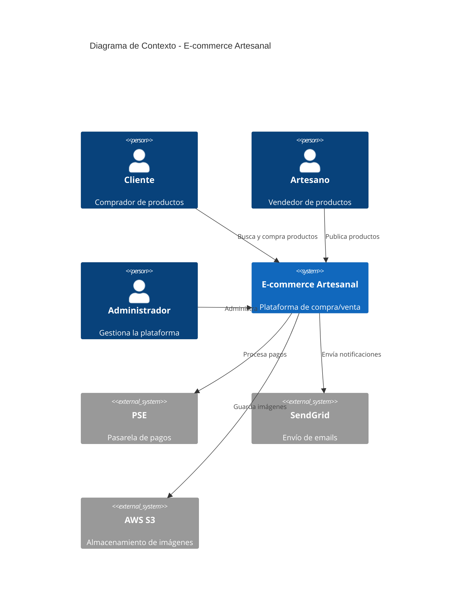

# 🚀 Proyecto Integrador - Semana 01

## 🎯 Objetivo General

Seleccionar un caso de estudio personal que desarrollarás durante las 9 semanas del bootcamp, definiendo la metodología de desarrollo y las decisiones arquitectónicas iniciales de manera justificada.

## ⏱️ Duración

- Trabajo en clase: 30 minutos
- Trabajo autónomo: 90 minutos
- **Total**: 2 horas

---

## 📋 Descripción del Proyecto

Este proyecto evolucionará semanalmente:

- **Semana 01**: Selección de caso y metodología ← **ESTÁS AQUÍ**
- **Semana 02**: Aplicación de principios SOLID
- **Semana 03**: Definición de patrón arquitectónico
- **Semana 04**: Diseño de APIs y componentes
- **Semana 05**: Implementación de patrones de diseño
- **Semana 06**: Arquitectura moderna (microservicios/hexagonal)
- **Semana 07**: Containerización con Docker
- **Semana 08**: Seguridad en la arquitectura
- **Semana 09**: Presentación final completa

---

## 🎨 Casos de Estudio Sugeridos

Elige **UNO** de los siguientes (o propón el tuyo):

### Opción 1: E-commerce de Productos Artesanales 🛍️

**Descripción**: Plataforma para conectar artesanos colombianos con compradores.

**Funcionalidades principales**:

- Catálogo de productos con búsqueda y filtros
- Carrito de compras
- Pasarela de pago (PSE, tarjetas)
- Panel de vendedor (gestión de inventario, órdenes)
- Sistema de mensajería vendedor-comprador
- Reseñas y calificaciones

**Complejidad**: Media

**Tecnologías sugeridas**: Node.js, PostgreSQL, React

---

### Opción 2: Plataforma de Reservas de Consultorios Médicos 🏥

**Descripción**: Sistema de agendamiento de citas médicas para clínicas.

**Funcionalidades principales**:

- Registro de pacientes y médicos
- Calendario de disponibilidad
- Reserva de citas en tiempo real
- Notificaciones por email/SMS
- Historia clínica básica
- Dashboard administrativo

**Complejidad**: Media-Alta

**Tecnologías sugeridas**: Node.js, MongoDB, React/Vue

---

### Opción 3: Red Social para Estudiantes del SENA 🎓

**Descripción**: Plataforma para compartir proyectos y colaborar.

**Funcionalidades principales**:

- Perfiles de usuario
- Publicación de proyectos (con código, imágenes)
- Sistema de likes y comentarios
- Búsqueda de colaboradores por habilidades
- Mensajería privada
- Feed de actividades

**Complejidad**: Alta

**Tecnologías sugeridas**: Node.js, PostgreSQL, React, Socket.io

---

### Opción 4: Sistema de Gestión de Biblioteca 📚

**Descripción**: Software para administrar préstamos de libros.

**Funcionalidades principales**:

- Catálogo de libros (CRUD)
- Gestión de usuarios (estudiantes, bibliotecarios)
- Préstamos y devoluciones
- Multas por retraso
- Reservas de libros
- Reportes estadísticos

**Complejidad**: Baja-Media

**Tecnologías sugeridas**: Node.js, SQLite/PostgreSQL, React

---

### Opción 5: Propón tu Propio Caso ✨

**Requisitos mínimos**:

- Mínimo 5 entidades de dominio
- Al menos 3 actores/roles diferentes
- Operaciones CRUD + lógica de negocio
- Interacción en tiempo real (opcional pero valorado)
- Potencial para aplicar patrones arquitectónicos

---

## 📝 Entregables de la Semana 01

### 1. Documento de Decisión Arquitectónica (ADR)

Crea un archivo `ADR-001-metodologia-y-arquitectura-inicial.md` con la siguiente estructura:

```markdown
# ADR-001: Metodología y Arquitectura Inicial

## Estado

Propuesto / Aceptado / Rechazado / Deprecado

## Contexto

Describe tu caso de estudio:

- ¿Qué problema resuelve?
- ¿Quiénes son los usuarios?
- ¿Cuáles son los requisitos principales?
- ¿Cuáles son las restricciones (tiempo, presupuesto, equipo)?

## Decisión

### Metodología Elegida

- ¿Cascada, Scrum, Kanban, XP, Híbrido?
- Justifica tu elección basándote en el contexto

### Arquitectura Inicial

- ¿Monolito, microservicios, N-capas?
- ¿Por qué esta arquitectura es apropiada?
- ¿Cómo evolucionará a medida que el proyecto crezca?

### Stack Tecnológico

- Backend: Node.js / Python / Java
- Base de datos: PostgreSQL / MongoDB / MySQL
- Frontend: React / Vue / Angular
- Justifica cada elección

## Consecuencias

### Positivas

- ¿Qué beneficios trae esta decisión?

### Negativas

- ¿Qué trade-offs estás aceptando?

### Riesgos

- ¿Qué podría salir mal?
- ¿Cómo mitigarás esos riesgos?

## Alternativas Consideradas

- ¿Qué otras opciones evaluaste?
- ¿Por qué las descartaste?

## Fecha

2026-02-01

## Autor

Tu nombre
```

---

### 2. Diagrama de Contexto (C4 Model - Nivel 1)

Crea un diagrama que muestre:

- **Sistema principal** (tu aplicación)
- **Actores** (usuarios que interactúan)
- **Sistemas externos** (servicios de terceros)

**Herramientas sugeridas**:

- Draw.io
- PlantUML
- Mermaid
- Excalidraw

**Ejemplo en Mermaid**:



---

### 3. Atributos de Calidad Priorizados

Completa la siguiente tabla (escala 1-5):

| Atributo de Calidad | Prioridad | Justificación                   |
| ------------------- | --------- | ------------------------------- |
| **Rendimiento**     | 1-5       | ¿Por qué?                       |
| **Escalabilidad**   | 1-5       | ¿Cuántos usuarios esperas?      |
| **Disponibilidad**  | 1-5       | ¿Cuánto downtime es aceptable?  |
| **Seguridad**       | 1-5       | ¿Datos sensibles?               |
| **Mantenibilidad**  | 1-5       | ¿Evolucionará mucho?            |
| **Usabilidad**      | 1-5       | ¿Qué tan crítica es la UX?      |
| **Costo**           | 1-5       | ¿Restricciones presupuestarias? |

**Prioridades**:

- 5 = Crítico (no negociable)
- 4 = Muy importante
- 3 = Importante
- 2 = Deseable
- 1 = No prioritario

---

### 4. Plan de Evolución Arquitectónica

Describe cómo evolucionará tu arquitectura en 3 fases:

**Fase 1: MVP (Semanas 1-3)**

- Arquitectura inicial
- Funcionalidades mínimas
- Stack tecnológico básico

**Fase 2: Crecimiento (Semanas 4-6)**

- ¿Qué mejorarías?
- ¿Qué componentes refactorizarías?
- ¿Qué patrones aplicarías?

**Fase 3: Escala (Semanas 7-9)**

- ¿Migrarías a microservicios?
- ¿Añadirías caché (Redis)?
- ¿Containerizarías con Docker?

---

## ✅ Criterios de Evaluación

| Criterio                      | Peso | Descripción                                    |
| ----------------------------- | ---- | ---------------------------------------------- |
| **ADR Completo**              | 30%  | Todas las secciones con justificación sólida   |
| **Diagrama de Contexto**      | 20%  | Actores, sistema, dependencias externas claras |
| **Priorización de Atributos** | 20%  | Coherencia entre prioridades y decisiones      |
| **Plan de Evolución**         | 20%  | Visión realista de crecimiento                 |
| **Justificación Técnica**     | 10%  | Decisiones fundamentadas en teoría             |

**Mínimo aprobatorio**: 70%

---

## 📚 Plantillas y Recursos

### Plantilla de ADR

Descarga: `3-proyecto/templates/ADR-template.md`

### Ejemplos de Diagramas C4

Descarga: `3-proyecto/ejemplos/`

### Checklist de Entrega

- [ ] ADR-001 completado con todas las secciones
- [ ] Diagrama de contexto (imagen SVG/PNG)
- [ ] Tabla de atributos de calidad priorizada
- [ ] Plan de evolución en 3 fases
- [ ] Justificaciones técnicas basadas en material de la semana
- [ ] Archivo README.md en carpeta del proyecto

---

## 🚀 Estructura de Carpetas Sugerida

```
mi-proyecto/
├── README.md                          # Descripción general
├── docs/
│   ├── architecture/
│   │   ├── ADR-001-metodologia.md
│   │   ├── context-diagram.svg
│   │   └── quality-attributes.md
│   └── requirements/
│       └── functional-requirements.md
└── src/                               # (Código en semanas futuras)
```

---

## 💡 Consejos para el Éxito

### ✅ DO (Haz)

- **Empieza simple**: No sobre-ingenierices desde el inicio
- **Justifica cada decisión**: Basándote en el material del bootcamp
- **Sé realista**: Considera tu nivel de experiencia
- **Piensa en evolución**: ¿Cómo crecerá tu proyecto?
- **Documenta desde ya**: Los ADRs son para tu yo futuro

### ❌ DON'T (No hagas)

- **No copies proyectos de FAANG**: Netflix maneja 200M usuarios, tú no
- **No elijas tecnologías porque "están de moda"**: Justifica técnicamente
- **No ignores las restricciones**: Tiempo, presupuesto, equipo son reales
- **No sobre-documentes**: Suficiente, no exhaustivo
- **No cambies de proyecto**: Este será tu caso de estudio las 9 semanas

---

## 🎯 Próximos Pasos (Semana 02)

En la próxima semana:

1. Aplicarás **principios SOLID** a tu proyecto
2. Diseñarás las **entidades principales** del dominio
3. Refactorizarás código para **alta cohesión y bajo acoplamiento**

Para prepararte:

- ✅ Ten tu caso de estudio bien definido
- ✅ Familiarízate con JavaScript ES2023
- ✅ Revisa patrones de diseño básicos

---

## 📞 Soporte

**¿Dudas sobre tu proyecto?**

- Consulta en la sesión presencial
- Crea un issue en GitHub
- Discute en el foro del curso

**¿No sabes qué caso elegir?**

- Piensa en un problema real que quieras resolver
- Consulta con compañeros
- Pide feedback al instructor

---

## 🏆 Ejemplos de Proyectos Anteriores

### Ejemplo 1: Sistema de Adopción de Mascotas

- **Metodología**: Scrum (sprints de 1 semana)
- **Arquitectura**: Monolito modular → Microservicios (semana 6)
- **Stack**: Node.js + PostgreSQL + React
- **Destacado**: Excelente justificación de trade-offs

### Ejemplo 2: Plataforma de Carpooling

- **Metodología**: Kanban (flujo continuo)
- **Arquitectura**: Microservicios desde el inicio
- **Stack**: Python + MongoDB + Vue
- **Destacado**: Diagrama de contexto muy claro

### Ejemplo 3: Sistema de Gestión de Gym

- **Metodología**: Híbrido (planificación inicial + Scrum)
- **Arquitectura**: N-capas tradicional
- **Stack**: Java + MySQL + Angular
- **Destacado**: Priorización de atributos de calidad

---

## 📅 Fecha de Entrega

**Semana 01 - Domingo 23:59**

**Formato de entrega**:

- Carpeta comprimida (.zip) con tu proyecto
- Subir a plataforma del SENA
- Nombre: `apellido-nombre-proyecto-week01.zip`

---

**¡Éxito en tu proyecto! Este es el inicio de tu viaje como arquitecto de software.** 🚀

---

**Bootcamp de Arquitectura de Software**
_SENA - Week 01 - Proyecto Integrador_
