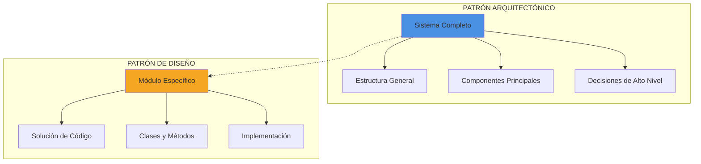
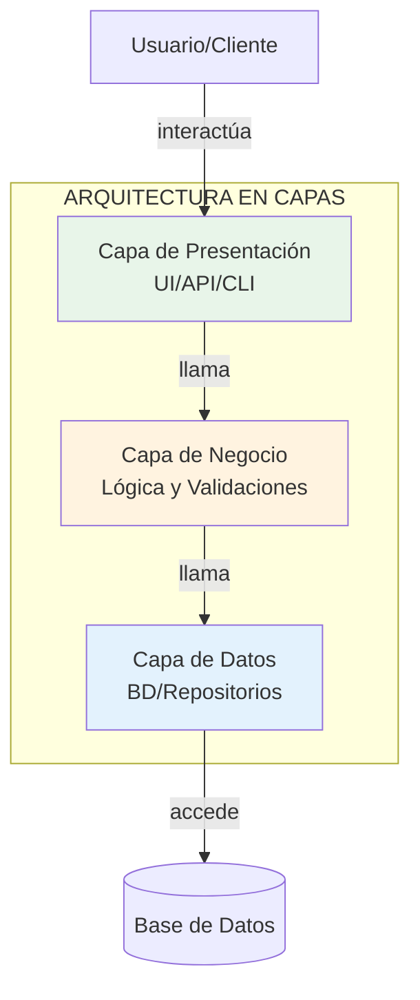
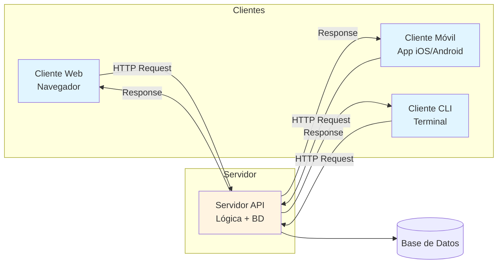
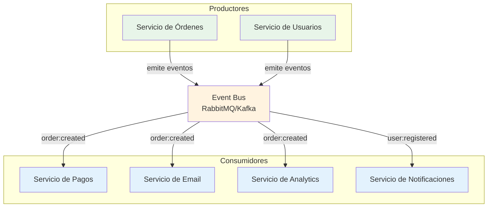
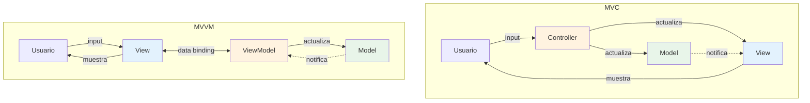
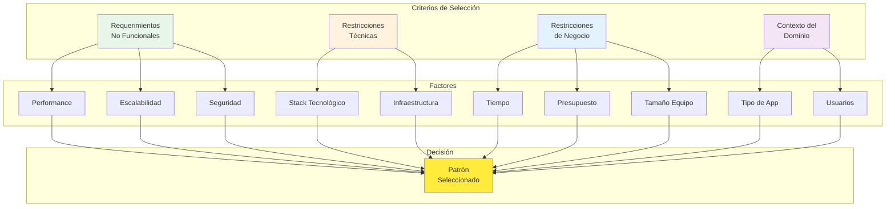

# Assets Week 03: Patrones Arquitectónicos Clásicos

Este directorio contiene los diagramas visuales de apoyo para la teoría de la semana 03.

## 📊 Diagramas Disponibles

### 1. `01-patron-vs-diseno.svg`

**Propósito**: Diferencia entre patrón arquitectónico y patrón de diseño
**Usado en**: [01-introduccion-patrones.md](../1-teoria/01-introduccion-patrones.md)

### 2. `02-layered-architecture.svg`

**Propósito**: Arquitectura en capas con 3 niveles
**Usado en**: [02-patron-capas.md](../1-teoria/02-patron-capas.md)

### 3. `03-client-server.svg`

**Propósito**: Arquitectura Cliente-Servidor
**Usado en**: [03-cliente-servidor-eventos.md](../1-teoria/03-cliente-servidor-eventos.md)

### 4. `04-event-driven.svg`

**Propósito**: Arquitectura basada en eventos
**Usado en**: [03-cliente-servidor-eventos.md](../1-teoria/03-cliente-servidor-eventos.md)

### 5. `05-mvc-mvvm.svg`

**Propósito**: Comparación MVC vs MVVM
**Usado en**: [04-mvc-mvvm.md](../1-teoria/04-mvc-mvvm.md)

### 6. `06-matriz-seleccion.svg`

**Propósito**: Matriz de criterios para seleccionar patrón
**Usado en**: [05-seleccion-patron.md](../1-teoria/05-seleccion-patron.md)

---

## 🛠️ Generación de SVG

Los diagramas Mermaid pueden convertirse a SVG usando:

1. **Mermaid Live Editor**: https://mermaid.live/
2. **CLI**: `mmdc -i diagram.mmd -o output.svg`
3. **VS Code**: Extensión "Markdown Preview Mermaid Support"

## 📐 Especificaciones

- **Formato**: SVG (escalable)
- **Ancho recomendado**: 800-1200px
- **Colores**: Paleta consistente con branding bc-channel-epti
- **Fuente**: Sans-serif (Arial, Helvetica)

---

**Bootcamp de Arquitectura de Software - Semana 03**  
_SENA - Tecnología en Análisis y Desarrollo de Software_  
_bc-channel-epti_
