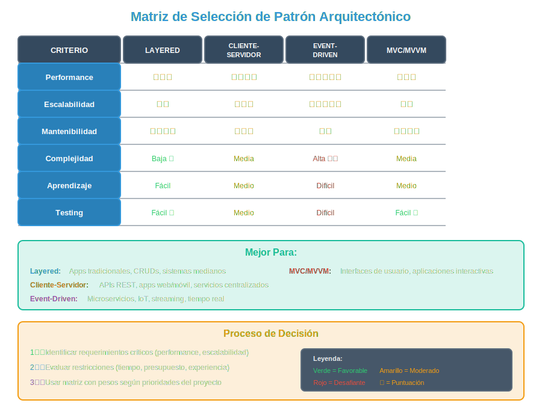

# 🎯 Selección de Patrón Arquitectónico

## 🎨 El Arte de Elegir el Patrón Correcto

Seleccionar un patrón arquitectónico es una de las decisiones más importantes en el diseño de un sistema. **No existe "el mejor patrón"**, existe **el patrón apropiado para tu contexto específico**.



### Principio Fundamental

> "La arquitectura es sobre decisiones, no sobre soluciones únicas. Cada decisión arquitectónica implica trade-offs (compromisos)."
> — Martin Fowler

---

## 🎯 ¿Qué es un Criterio de Selección?

Un **criterio de selección** es un factor que influye en la elección de un patrón arquitectónico. Estos criterios se dividen en:

1. **Requerimientos No Funcionales** (Calidad)
2. **Restricciones Técnicas** (Tecnología)
3. **Restricciones de Negocio** (Tiempo, Costo, Equipo)
4. **Contexto del Dominio** (Tipo de aplicación)

---

## 📊 Criterios de Selección

### 1. Requerimientos No Funcionales

#### Performance (Rendimiento)

**¿Qué tan rápido debe responder el sistema?**

| Patrón               | Performance | Mejor Para                           |
| -------------------- | ----------- | ------------------------------------ |
| **Layered**          | ⭐⭐⭐      | Apps con latencia aceptable (<500ms) |
| **Cliente-Servidor** | ⭐⭐⭐⭐    | Apps con caching efectivo            |
| **Event-Driven**     | ⭐⭐⭐⭐    | Operaciones asíncronas (no bloquea)  |
| **MVC/MVVM**         | ⭐⭐⭐      | UIs con actualizaciones frecuentes   |

**Ejemplo de decisión:**

- **E-commerce con 100k usuarios concurrentes**: Event-Driven + Caching
- **Blog personal con 100 visitas/día**: Layered es suficiente

---

#### Escalabilidad

**¿El sistema debe crecer horizontalmente?**

| Patrón               | Escalabilidad | Limitación                                |
| -------------------- | ------------- | ----------------------------------------- |
| **Layered**          | ⭐⭐          | Escalar toda la app (monolito)            |
| **Cliente-Servidor** | ⭐⭐⭐        | Escalar servidor (load balancer)          |
| **Event-Driven**     | ⭐⭐⭐⭐⭐    | Escalar consumidores independientemente   |
| **MVC/MVVM**         | ⭐⭐          | Escalabilidad en servidor (no en cliente) |

**Ejemplo real:**

- **Netflix**: Event-Driven + Microservicios (escala a 200M+ usuarios)
- **Aplicación interna de empresa (100 usuarios)**: Layered es suficiente

---

#### Mantenibilidad

**¿Qué tan fácil es modificar el sistema?**

| Patrón               | Mantenibilidad | Razón                                 |
| -------------------- | -------------- | ------------------------------------- |
| **Layered**          | ⭐⭐⭐⭐       | Separación clara de responsabilidades |
| **Cliente-Servidor** | ⭐⭐⭐         | Lógica centralizada                   |
| **Event-Driven**     | ⭐⭐           | Difícil rastrear flujo de eventos     |
| **MVC/MVVM**         | ⭐⭐⭐⭐       | Componentes desacoplados              |

**Ejemplo:**

- **Sistema con rotación alta de desarrolladores**: Layered (fácil de aprender)
- **Equipo senior con experiencia en eventos**: Event-Driven

---

#### Disponibilidad (Availability)

**¿El sistema debe estar disponible 24/7?**

| Patrón               | Disponibilidad | Resiliencia                     |
| -------------------- | -------------- | ------------------------------- |
| **Layered**          | ⭐⭐           | Monolito = punto único de falla |
| **Cliente-Servidor** | ⭐⭐⭐         | Réplicas de servidor            |
| **Event-Driven**     | ⭐⭐⭐⭐       | Consumidores independientes     |
| **MVC/MVVM**         | ⭐⭐⭐         | Depende del servidor            |

**Ejemplo:**

- **Aplicación bancaria crítica**: Event-Driven con redundancia
- **Blog personal**: Layered con hosting básico

---

#### Seguridad

**¿Qué tan crítica es la seguridad?**

| Patrón               | Seguridad | Ventaja                         |
| -------------------- | --------- | ------------------------------- |
| **Layered**          | ⭐⭐⭐    | Validaciones en capa de negocio |
| **Cliente-Servidor** | ⭐⭐⭐⭐  | Lógica crítica en servidor      |
| **Event-Driven**     | ⭐⭐⭐    | Auditoría de eventos            |
| **MVC/MVVM**         | ⭐⭐⭐    | Depende de implementación       |

**Ejemplo:**

- **Banca online**: Cliente-Servidor + Layered (validaciones en servidor)
- **Red social pública**: Menos crítico, cualquier patrón

---

### 2. Restricciones Técnicas

#### Stack Tecnológico Existente

**¿Qué tecnologías usa el equipo actualmente?**

| Tecnología                         | Patrón Natural             |
| ---------------------------------- | -------------------------- |
| **Ruby on Rails, Django, Laravel** | MVC server-side            |
| **React, Vue, Angular**            | MVVM client-side           |
| **Express.js + PostgreSQL**        | Layered o Cliente-Servidor |
| **RabbitMQ, Kafka, Redis Pub/Sub** | Event-Driven               |

**Ejemplo:**

- Equipo experto en Django → MVC tradicional
- Equipo experto en React → MVVM (SPA)

---

#### Infraestructura

**¿Qué infraestructura está disponible?**

| Infraestructura                     | Patrón Recomendado           |
| ----------------------------------- | ---------------------------- |
| **Servidor tradicional (VM)**       | Layered, Cliente-Servidor    |
| **Cloud (AWS, Azure, GCP)**         | Event-Driven, Serverless     |
| **Containers (Docker, Kubernetes)** | Microservicios, Event-Driven |
| **Shared hosting**                  | Layered monolítico           |

---

### 3. Restricciones de Negocio

#### Tiempo de Desarrollo

**¿Cuánto tiempo hay para lanzar?**

| Tiempo                           | Patrón Recomendado           | Razón                        |
| -------------------------------- | ---------------------------- | ---------------------------- |
| **1-2 semanas (MVP)**            | Layered simple               | Rápido de implementar        |
| **1-3 meses**                    | Cliente-Servidor o MVC       | Balance complejidad/features |
| **6+ meses (producto complejo)** | Event-Driven, Microservicios | Vale la pena la complejidad  |

**Ejemplo:**

- **Startup con MVP en 2 semanas**: Layered con framework rápido (Rails, Django)
- **Producto enterprise**: Event-Driven con planning extenso

---

#### Presupuesto

**¿Cuánto dinero hay disponible?**

| Presupuesto              | Infraestructura            | Patrón                       |
| ------------------------ | -------------------------- | ---------------------------- |
| **Bajo (<$100/mes)**     | Shared hosting             | Layered monolítico           |
| **Medio ($500-$2k/mes)** | VPS, cloud básico          | Cliente-Servidor             |
| **Alto (>$5k/mes)**      | Cloud avanzado, Kubernetes | Event-Driven, Microservicios |

---

#### Tamaño del Equipo

**¿Cuántos desarrolladores trabajan en el proyecto?**

| Tamaño Equipo | Patrón Recomendado           | Razón                  |
| ------------- | ---------------------------- | ---------------------- |
| **1-2 devs**  | Layered simple               | Menos overhead         |
| **3-5 devs**  | Cliente-Servidor, MVC        | Pueden dividirse capas |
| **10+ devs**  | Microservicios, Event-Driven | Equipos independientes |

---

### 4. Contexto del Dominio

#### Tipo de Aplicación

| Tipo de App             | Patrón Recomendado     | Ejemplo                 |
| ----------------------- | ---------------------- | ----------------------- |
| **CRUD simple**         | Layered, MVC           | Panel de administración |
| **E-commerce**          | Layered + Event-Driven | Amazon, MercadoLibre    |
| **Chat/Mensajería**     | Event-Driven           | WhatsApp, Slack         |
| **Dashboard/Analytics** | MVVM (SPA)             | Google Analytics        |
| **Streaming**           | Event-Driven           | Netflix, Spotify        |
| **API pública**         | Cliente-Servidor       | Twitter API, GitHub API |

---

## 🧩 Matriz de Decisión

### Tabla Comparativa Completa

| Criterio                 | Layered            | Cliente-Servidor | Event-Driven        | MVC/MVVM            |
| ------------------------ | ------------------ | ---------------- | ------------------- | ------------------- |
| **Performance**          | Media              | Alta             | Muy Alta            | Media               |
| **Escalabilidad**        | Baja               | Media            | Muy Alta            | Baja                |
| **Mantenibilidad**       | Alta               | Media            | Baja                | Alta                |
| **Complejidad**          | Baja               | Media            | Alta                | Media               |
| **Curva de aprendizaje** | Baja               | Media            | Alta                | Media               |
| **Testing**              | Fácil              | Medio            | Difícil             | Fácil               |
| **Debugging**            | Fácil              | Medio            | Difícil             | Fácil               |
| **Mejor para**           | Apps tradicionales | APIs, apps web   | Microservicios, IoT | SPAs, UIs complejas |

---

## 🎯 Casos de Estudio: Decisiones Reales

### Caso 1: E-commerce Pequeño (Startup)

**Contexto:**

- Equipo: 2 desarrolladores
- Tiempo: 1 mes para MVP
- Presupuesto: $200/mes
- Usuarios esperados: 1,000/mes

**Criterios prioritarios:**

1. ✅ Tiempo de desarrollo rápido
2. ✅ Bajo costo
3. ✅ Mantenibilidad (equipo pequeño)

**Decisión: Layered Architecture (3 capas)**

**Justificación:**

- Rápido de implementar con framework (Laravel, Rails)
- Hosting compartido económico
- Fácil de mantener con 2 devs
- Escalabilidad no es crítica inicialmente

**Stack:**

- Backend: Laravel (MVC) / Node.js + Express
- Frontend: Blade templates / React básico
- BD: PostgreSQL
- Hosting: DigitalOcean ($12/mes)

---

### Caso 2: Aplicación de Mensajería (Competidor de WhatsApp)

**Contexto:**

- Equipo: 15 desarrolladores
- Tiempo: 6 meses
- Presupuesto: $50k/mes
- Usuarios esperados: 100k+ concurrentes

**Criterios prioritarios:**

1. ✅ Tiempo real (latencia <100ms)
2. ✅ Escalabilidad extrema
3. ✅ Disponibilidad 99.9%

**Decisión: Event-Driven Architecture + Microservicios**

**Justificación:**

- Mensajes son eventos asíncronos
- Escalar servicios independientemente (chat, notificaciones, media)
- Alta disponibilidad (si cae notificaciones, chat sigue funcionando)

**Stack:**

- Backend: Node.js con Kafka/RabbitMQ
- Frontend: React Native (móvil) + React (web)
- BD: Cassandra (escalabilidad)
- Infraestructura: Kubernetes en AWS

---

### Caso 3: Dashboard Analítico (SaaS)

**Contexto:**

- Equipo: 5 desarrolladores
- Tiempo: 3 meses
- Presupuesto: $5k/mes
- Usuarios: 500 empresas con múltiples usuarios

**Criterios prioritarios:**

1. ✅ UI altamente interactiva
2. ✅ Actualizaciones en tiempo real
3. ✅ Múltiples vistas de datos

**Decisión: MVVM (SPA) + Cliente-Servidor (API REST)**

**Justificación:**

- Dashboard requiere interactividad compleja
- MVVM (React/Vue) ideal para UIs con muchos gráficos
- API REST para servir datos a múltiples clientes
- WebSockets para actualizaciones en tiempo real

**Stack:**

- Frontend: Vue.js (MVVM) + Chart.js
- Backend: Node.js + Express (API REST)
- BD: PostgreSQL + Redis (caching)
- Infraestructura: Vercel (frontend) + Railway (backend)

---

### Caso 4: Sistema Bancario (Crítico)

**Contexto:**

- Equipo: 30 desarrolladores
- Tiempo: 1 año
- Presupuesto: Ilimitado (crítico)
- Usuarios: 500k cuentas

**Criterios prioritarios:**

1. ✅ Seguridad máxima
2. ✅ Disponibilidad 99.99%
3. ✅ Auditoría completa
4. ✅ Cumplimiento regulatorio

**Decisión: Layered + Event-Driven + Cliente-Servidor**

**Justificación:**

- **Layered**: Separación de responsabilidades, validaciones en múltiples capas
- **Event-Driven**: Auditoría completa (cada transacción = evento registrado)
- **Cliente-Servidor**: Validaciones críticas en servidor, cliente no confiable

**Stack:**

- Backend: Java Spring Boot (Layered)
- Eventos: Apache Kafka (Event-Driven)
- Frontend: Angular (MVVM) + App móvil
- BD: Oracle (transaccional) + Event Store (auditoría)
- Infraestructura: On-premise con redundancia completa

---

## 🧭 Proceso de Selección Paso a Paso

### Paso 1: Identificar Requerimientos Críticos

Pregunta clave: **¿Qué NO puede fallar?**

Ejemplos:

- Sistema bancario: Seguridad, disponibilidad
- Chat: Tiempo real, escalabilidad
- Blog: Mantenibilidad, bajo costo

### Paso 2: Evaluar Restricciones

Pregunta clave: **¿Qué limitaciones tengo?**

- Tiempo: ¿Cuándo debe lanzarse?
- Dinero: ¿Cuál es el presupuesto?
- Equipo: ¿Cuántos devs? ¿Qué experiencia tienen?

### Paso 3: Crear Matriz de Decisión

Asigna peso a cada criterio (0-10):

| Criterio       | Peso | Layered | C/S     | Event-Driven | MVC/MVVM |
| -------------- | ---- | ------- | ------- | ------------ | -------- |
| Performance    | 8    | 6       | 8       | 9            | 6        |
| Escalabilidad  | 9    | 4       | 6       | 10           | 4        |
| Mantenibilidad | 7    | 9       | 7       | 4            | 9        |
| Costo          | 6    | 9       | 7       | 5            | 7        |
| **TOTAL**      | -    | **182** | **196** | **208**      | **186**  |

En este ejemplo: **Event-Driven gana** (208 puntos).

### Paso 4: Validar con Equipo

- ¿El equipo tiene experiencia con este patrón?
- ¿Hay disposición para aprender?
- ¿Hay tiempo para aprender?

### Paso 5: Prototipar (Spike)

Crear prueba de concepto (1-2 días) con el patrón elegido:

- ¿Se siente natural?
- ¿El equipo lo entiende?
- ¿Hay problemas técnicos inesperados?

---

## 🚨 Errores Comunes en Selección

### ❌ Error 1: "Usar la Tecnología de Moda"

**Problema:**

- Elegir microservicios porque "todos lo usan"
- Sistema simple que no lo necesita

**Solución:**

- Elegir basado en necesidades, no en hype
- Layered puede ser suficiente para 80% de casos

---

### ❌ Error 2: "Optimización Prematura"

**Problema:**

- Diseñar para 1M usuarios cuando hay 100
- Complejidad innecesaria

**Solución:**

- Comenzar simple (Layered)
- Migrar a Event-Driven/Microservicios cuando sea necesario

---

### ❌ Error 3: "Ignorar Experiencia del Equipo"

**Problema:**

- Equipo junior implementando Event-Driven complejo
- Bugs, debugging difícil, frustración

**Solución:**

- Elegir patrón que el equipo pueda mantener
- Invertir en capacitación si es necesario

---

### ❌ Error 4: "Mezclar Patrones sin Justificación"

**Problema:**

- "Usaremos Layered + Event-Driven + Microservicios porque sí"
- Complejidad sin beneficio

**Solución:**

- Comenzar con UN patrón principal
- Agregar otros solo si hay justificación clara

---

## 💡 Mejores Prácticas de Selección

1. ✅ **Prioriza simplicidad**: El patrón más simple que resuelva el problema
2. ✅ **Documenta la decisión**: ADR (Architecture Decision Record)
3. ✅ **Evalúa trade-offs**: No hay solución perfecta
4. ✅ **Considera evolución**: ¿Puedo migrar después si es necesario?
5. ✅ **Valida con equipo**: Consenso técnico
6. ✅ **Prototipar antes de comprometer**: Spike técnico
7. ✅ **Revisar decisión periódicamente**: Cada 6-12 meses

---

## 📋 Plantilla de Decisión Arquitectónica

```markdown
# ADR-001: Selección de Patrón Arquitectónico para [Proyecto]

## Contexto

- **Tipo de aplicación**: E-commerce
- **Tamaño equipo**: 5 desarrolladores
- **Tiempo**: 3 meses para MVP
- **Presupuesto**: $2k/mes
- **Usuarios esperados**: 10k/mes inicialmente

## Requerimientos Críticos

1. Performance aceptable (<500ms)
2. Mantenibilidad alta (equipo mediano)
3. Escalabilidad media (puede crecer 10x)

## Opciones Consideradas

1. **Layered Architecture**
2. **Event-Driven Architecture**
3. **Microservicios**

## Decisión: Layered Architecture

## Justificación

- Equipo tiene experiencia con Layered
- Tiempo ajustado (3 meses)
- Escalabilidad de 10x es manejable con Layered + caching
- Event-Driven es overkill para MVP

## Consecuencias

### Positivas

- Desarrollo rápido
- Fácil de mantener
- Bajo costo de infraestructura

### Negativas

- Si escalabilidad > 100x, necesitaremos migrar
- Operaciones asíncronas limitadas

## Revisión

- **Cuándo**: 6 meses después del lanzamiento
- **Trigger**: Si usuarios > 50k/mes
```

---

## 🚀 Próximos Pasos

- **[Práctica: Matriz de Selección](../2-practicas/03-practica-seleccion.md)** - Ejercicio guiado
- **[Proyecto Semana 03](../3-proyecto/proyecto-semana-03.md)** - Aplicar selección a tu dominio

---

**Bootcamp de Arquitectura de Software - Semana 03**  
_SENA - Tecnología en Análisis y Desarrollo de Software_  
_bc-channel-epti_
