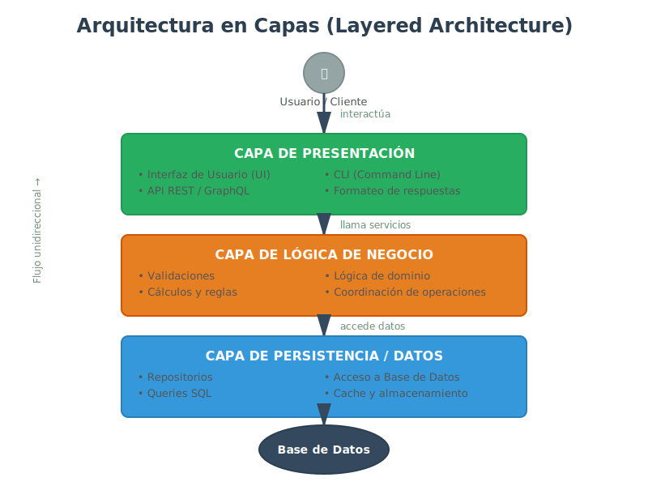

# 🏗️ Arquitectura en Capas (Layered Architecture)

## 🎯 ¿Qué es la Arquitectura en Capas?

La **Arquitectura en Capas** (Layered Architecture) es un patrón que organiza el sistema en grupos de componentes (capas) horizontales, donde cada capa tiene una responsabilidad específica y bien definida. Las capas se apilan verticalmente, y cada una solo puede comunicarse con la capa inmediatamente inferior.



### Definición Formal

> "El patrón en capas divide el sistema en grupos de subtareas, donde cada grupo está en un nivel particular de abstracción. Cada capa proporciona servicios a la capa superior y actúa como cliente de la capa inferior."
> — Frank Buschmann, _Pattern-Oriented Software Architecture_

### Principio Fundamental

**Separación de Responsabilidades** (Separation of Concerns):

- Cada capa maneja UNA responsabilidad específica
- Los cambios en una capa no afectan a otras capas
- La dependencia fluye en una sola dirección: de arriba hacia abajo

---

## 🚀 ¿Para Qué Sirve la Arquitectura en Capas?

### 1. **Separar Responsabilidades Claramente**

Cada capa tiene un propósito único y no mezcla responsabilidades:

```
┌─────────────────────────────────────┐
│  CAPA DE PRESENTACIÓN               │
│  Responsabilidad: Interfaz usuario  │
│  Ejemplos: HTML, CLI, API REST      │
└──────────────┬──────────────────────┘
               │ Llama a servicios
┌──────────────▼──────────────────────┐
│  CAPA DE LÓGICA DE NEGOCIO          │
│  Responsabilidad: Reglas de negocio │
│  Ejemplos: Validaciones, cálculos   │
└──────────────┬──────────────────────┘
               │ Llama a persistencia
┌──────────────▼──────────────────────┐
│  CAPA DE PERSISTENCIA               │
│  Responsabilidad: Acceso a datos    │
│  Ejemplos: BD, archivos, cache      │
└─────────────────────────────────────┘
```

**Ejemplo real: Netflix**

- **Capa de Presentación**: Apps móviles, web, smart TVs
- **Capa de Negocio**: Algoritmo de recomendación, gestión de suscripciones
- **Capa de Datos**: Base de datos de usuarios, catálogo de contenido

### 2. **Facilitar el Mantenimiento**

Si cambias la UI, no necesitas tocar la lógica de negocio ni la base de datos.

**Caso real:**

- Amazon cambió su interfaz móvil 15 veces en 2023
- La lógica de negocio (cálculo de precios, inventario) no se modificó
- Resultado: Actualizaciones rápidas sin riesgo de romper pagos

### 3. **Reutilización de Capas**

Una misma capa de negocio puede servir a múltiples presentaciones:

```
    ┌─────────────┐  ┌─────────────┐  ┌─────────────┐
    │  App Móvil  │  │  Sitio Web  │  │  API REST   │
    └──────┬──────┘  └──────┬──────┘  └──────┬──────┘
           └─────────────────┴──────────────────┘
                            │
              ┌─────────────▼──────────────┐
              │  CAPA DE NEGOCIO (única)   │
              └─────────────┬──────────────┘
                            │
              ┌─────────────▼──────────────┐
              │  CAPA DE DATOS (única)     │
              └────────────────────────────┘
```

### 4. **Testing Independiente**

Puedes testear cada capa sin necesidad de las otras:

```javascript
// Test de capa de negocio (sin UI ni BD)
const service = new ProductService(mockRepository);
const product = service.createProduct('Laptop', 1200, 10);
assert(product.price === 1200);
```

---

## 💥 ¿Qué Impacto Tiene Aplicar (o No Aplicar) Capas?

### ✅ **Si lo aplicas:**

1. **Mantenibilidad Alta**
   - Bugs aislados en una capa
   - Cambios localizados sin efecto dominó

2. **Escalabilidad del Equipo**
   - Un equipo trabaja en UI
   - Otro equipo trabaja en backend
   - Tercer equipo optimiza BD
   - Todos trabajan en paralelo sin conflictos

3. **Flexibilidad Tecnológica**
   - Cambiar de PostgreSQL a MongoDB solo afecta capa de datos
   - Migrar de React a Vue solo afecta capa de presentación

4. **Reusabilidad**
   - Misma lógica de negocio para app web y móvil
   - Misma capa de datos para múltiples servicios

**Caso real: Spotify**

- Misma lógica de negocio (playlists, recomendaciones)
- Múltiples UIs: Web, iOS, Android, Desktop, Smart TVs, Consolas
- Cambios en algoritmo de recomendación → afectan todas las plataformas automáticamente

### ❌ **Si NO lo aplicas (código monolítico):**

1. **"God Class" / "Big Ball of Mud"**
   - Una clase hace TODO: UI + validación + cálculos + BD

```javascript
// ❌ TODO MEZCLADO
function createUser(req, res) {
  // Presentación mezclada
  const name = req.body.name;

  // Validación mezclada
  if (!name) return res.status(400).send('Nombre requerido');

  // Lógica de negocio mezclada
  const user = { id: Date.now(), name, createdAt: new Date() };

  // Persistencia mezclada
  db.users.push(user);

  // Presentación mezclada
  res.json(user);
}
```

2. **Cambios Peligrosos**
   - Arreglar un bug en UI puede romper la BD
   - Agregar una validación puede afectar la presentación

3. **Testing Imposible**
   - No puedes testear lógica de negocio sin levantar servidor + BD

4. **Duplicación de Código**
   - Lógica de negocio repetida en app móvil y web

**Caso real: Twitter (2010)**

- Monolito Ruby on Rails sin capas claras
- Resultado: "Fail Whale" (caídas constantes)
- Solución: Migración a arquitectura en capas + microservicios
- Impacto: 200 caídas/año → Disponibilidad 99.9%

---

## 🏛️ Capas Típicas de una Arquitectura en Capas

### Modelo Clásico de 3 Capas

#### 1. Capa de Presentación (Presentation Layer)

**Responsabilidad**: Interactuar con el usuario o sistemas externos

**Qué hace:**

- Mostrar información (HTML, JSON, CLI)
- Recibir inputs del usuario
- Formatear respuestas
- Manejar rutas/endpoints (en APIs)

**Qué NO hace:**

- Validar reglas de negocio
- Calcular precios, descuentos, impuestos
- Acceder directamente a la base de datos

**Tecnologías:**

- Web: React, Vue, Angular
- Móvil: React Native, Flutter
- API: Express.js, FastAPI
- CLI: Commander.js

**Ejemplo JavaScript ES2023:**

```javascript
// src/presentation/product-controller.js

export class ProductController {
  constructor(productService) {
    this.productService = productService;
  }

  // Maneja ruta POST /products
  async createProduct(req, res) {
    try {
      const { name, price, stock } = req.body;

      // Delega a capa de negocio
      const product = await this.productService.createProduct(
        name,
        price,
        stock,
      );

      // Formatea respuesta
      res.status(201).json({
        success: true,
        data: product,
        message: 'Producto creado exitosamente',
      });
    } catch (error) {
      res.status(400).json({
        success: false,
        error: error.message,
      });
    }
  }
}
```

---

#### 2. Capa de Lógica de Negocio (Business Logic Layer)

**Responsabilidad**: Implementar reglas de negocio y lógica de dominio

**Qué hace:**

- Validar datos según reglas de negocio
- Ejecutar cálculos (precios, descuentos, impuestos)
- Coordinar operaciones entre múltiples entidades
- Aplicar políticas de negocio

**Qué NO hace:**

- Renderizar HTML o JSON
- Ejecutar queries SQL directamente
- Manejar requests HTTP

**Ejemplo JavaScript ES2023:**

```javascript
// src/business/product-service.js

export class ProductService {
  #productRepository;
  #notificationService;

  constructor(productRepository, notificationService) {
    this.#productRepository = productRepository;
    this.#notificationService = notificationService;
  }

  async createProduct(name, price, stock) {
    // 1. VALIDACIÓN DE NEGOCIO
    this.#validateProductData(name, price, stock);

    // 2. LÓGICA DE DOMINIO
    const product = {
      id: crypto.randomUUID(),
      name: name.trim(),
      price: this.#calculateFinalPrice(price),
      stock,
      active: true,
      createdAt: new Date(),
    };

    // 3. PERSISTENCIA (delega a capa de datos)
    const savedProduct = await this.#productRepository.save(product);

    // 4. NOTIFICACIONES (regla de negocio)
    if (stock < 10) {
      await this.#notificationService.notifyLowStock(savedProduct);
    }

    return savedProduct;
  }

  #validateProductData(name, price, stock) {
    if (!name || name.trim() === '') {
      throw new Error('Nombre de producto requerido');
    }
    if (price <= 0) {
      throw new Error('Precio debe ser mayor a 0');
    }
    if (stock < 0) {
      throw new Error('Stock no puede ser negativo');
    }
  }

  #calculateFinalPrice(basePrice) {
    const TAX_RATE = 0.19; // 19% IVA
    return basePrice * (1 + TAX_RATE);
  }
}
```

---

#### 3. Capa de Persistencia (Data Access Layer)

**Responsabilidad**: Gestionar acceso a datos (BD, archivos, APIs externas)

**Qué hace:**

- Ejecutar queries SQL
- Guardar/recuperar entidades
- Cachear datos
- Manejar transacciones de BD

**Qué NO hace:**

- Validar reglas de negocio
- Calcular precios o descuentos
- Formatear respuestas HTTP

**Ejemplo JavaScript ES2023:**

```javascript
// src/data/product-repository.js

export class ProductRepository {
  #db; // Conexión a BD (PostgreSQL, MongoDB, etc.)

  constructor(database) {
    this.#db = database;
  }

  async save(product) {
    const query = `
      INSERT INTO products (id, name, price, stock, active, created_at)
      VALUES ($1, $2, $3, $4, $5, $6)
      RETURNING *
    `;
    const values = [
      product.id,
      product.name,
      product.price,
      product.stock,
      product.active,
      product.createdAt,
    ];

    const result = await this.#db.query(query, values);
    return result.rows[0];
  }

  async findById(id) {
    const query = 'SELECT * FROM products WHERE id = $1';
    const result = await this.#db.query(query, [id]);
    return result.rows[0] || null;
  }

  async findAll() {
    const query = 'SELECT * FROM products WHERE active = true';
    const result = await this.#db.query(query);
    return result.rows;
  }
}
```

---

### Modelos Extendidos: 4 o 5 Capas

#### Modelo de 4 Capas

```
┌─────────────────────────────────────┐
│  CAPA DE PRESENTACIÓN (UI/API)      │
└──────────────┬──────────────────────┘
┌──────────────▼──────────────────────┐
│  CAPA DE APLICACIÓN (Use Cases)     │ ← Coordinación
└──────────────┬──────────────────────┘
┌──────────────▼──────────────────────┐
│  CAPA DE DOMINIO (Entidades+Lógica) │ ← Reglas de negocio
└──────────────┬──────────────────────┘
┌──────────────▼──────────────────────┐
│  CAPA DE INFRAESTRUCTURA (BD+APIs)  │ ← Persistencia
└─────────────────────────────────────┘
```

#### Modelo de 5 Capas (Enterprise)

```
┌─────────────────────────────────────┐
│  PRESENTACIÓN                       │
└──────────────┬──────────────────────┘
┌──────────────▼──────────────────────┐
│  SERVICIOS (APIs/Fachadas)          │
└──────────────┬──────────────────────┘
┌──────────────▼──────────────────────┐
│  LÓGICA DE NEGOCIO                  │
└──────────────┬──────────────────────┘
┌──────────────▼──────────────────────┐
│  ACCESO A DATOS (Repositorios)      │
└──────────────┬──────────────────────┘
┌──────────────▼──────────────────────┐
│  BASE DE DATOS (PostgreSQL/MongoDB) │
└─────────────────────────────────────┘
```

---

## ✅ Ventajas de la Arquitectura en Capas

| Ventaja                      | Descripción                                          | Ejemplo                                                        |
| ---------------------------- | ---------------------------------------------------- | -------------------------------------------------------------- |
| **Fácil de entender**        | Estructura intuitiva, ideal para equipos nuevos      | Desarrollador junior identifica rápidamente dónde va el código |
| **Separación clara**         | Cada capa tiene responsabilidad única                | Cambio de UI no afecta BD                                      |
| **Reusabilidad**             | Capas inferiores sirven a múltiples capas superiores | Misma lógica de negocio para web y móvil                       |
| **Testing aislado**          | Se testea cada capa independientemente               | Test de servicios sin levantar BD real                         |
| **Escalabilidad del equipo** | Equipos trabajan en capas diferentes sin conflictos  | Equipo de frontend + equipo de backend                         |
| **Tecnología desacoplada**   | Cambiar tecnología en una capa no afecta otras       | Migrar de MySQL a PostgreSQL solo afecta capa de datos         |

---

## ❌ Desventajas y Limitaciones

| Desventaja                            | Descripción                                    | Mitigación                                   |
| ------------------------------------- | ---------------------------------------------- | -------------------------------------------- |
| **Performance**                       | Llamadas atraviesan múltiples capas (latencia) | Cacheo en capas intermedias                  |
| **Overhead**                          | Cada capa agrega complejidad                   | Usar solo 3 capas para proyectos medianos    |
| **Dependencia descendente rígida**    | Capas superiores dependen de inferiores        | Aplicar Dependency Inversion Principle       |
| **No ideal para tiempo real**         | Latencia acumulada en cada capa                | Preferir Event-Driven para tiempo real       |
| **Escalabilidad horizontal limitada** | Difícil escalar capas independientemente       | Migrar a microservicios si escala es crítica |

---

## 🎯 Casos de Uso Ideales

### ✅ **Cuándo usar Arquitectura en Capas:**

1. **Aplicaciones empresariales tradicionales (ERPs, CRMs)**
   - Reglas de negocio complejas
   - Múltiples interfaces de usuario
   - Equipo de tamaño medio/grande

2. **APIs REST/GraphQL**
   - Separación clara entre endpoints y lógica
   - Necesidad de reutilizar lógica de negocio

3. **Aplicaciones con múltiples clientes**
   - App móvil + sitio web + API pública
   - Misma lógica de negocio compartida

4. **Proyectos con equipo junior/medio**
   - Estructura clara y fácil de aprender
   - Menos complejidad que microservicios

### ❌ **Cuándo NO usar Arquitectura en Capas:**

1. **Sistemas de tiempo real (streaming, gaming)**
   - Latencia de capas es problema
   - Preferir Event-Driven

2. **Aplicaciones muy simples (scripts, prototipos)**
   - Overhead innecesario
   - Código directo es más rápido

3. **Microservicios con alta escalabilidad**
   - Cada servicio debe escalar independientemente
   - Preferir arquitectura distribuida

---

## 📐 Reglas y Restricciones

### Regla 1: Dependencia Unidireccional

**Flujo permitido:**

```
Presentación → Negocio → Persistencia ✅
```

**Flujo prohibido:**

```
Persistencia → Negocio ❌
Negocio → Presentación ❌
```

### Regla 2: Comunicación con Capa Inmediata

**Permitido:**

```
Presentación → Negocio ✅
Negocio → Persistencia ✅
```

**Evitar:**

```
Presentación → Persistencia (saltarse capa de negocio) ⚠️
```

### Regla 3: Sin Lógica de Negocio fuera de su Capa

- ❌ Validaciones en capa de presentación
- ❌ Cálculos en capa de persistencia
- ✅ TODO en capa de negocio

---

## 🚀 Ejemplo Completo: Sistema de Biblioteca

### Estructura de Carpetas

```
library-system/
├── src/
│   ├── presentation/
│   │   └── book-controller.js
│   ├── business/
│   │   └── book-service.js
│   ├── data/
│   │   └── book-repository.js
│   └── index.js
└── package.json
```

### Implementación

**Capa de Presentación:**

```javascript
// src/presentation/book-controller.js
export class BookController {
  constructor(bookService) {
    this.bookService = bookService;
  }

  async lendBook(req, res) {
    const { bookId, userId } = req.body;
    const loan = await this.bookService.lendBook(bookId, userId);
    res.json({ success: true, loan });
  }
}
```

**Capa de Negocio:**

```javascript
// src/business/book-service.js
export class BookService {
  constructor(bookRepository, loanRepository) {
    this.bookRepository = bookRepository;
    this.loanRepository = loanRepository;
  }

  async lendBook(bookId, userId) {
    // Validación de negocio
    const book = await this.bookRepository.findById(bookId);
    if (!book.available) {
      throw new Error('Libro no disponible');
    }

    // Lógica de negocio
    const loan = {
      id: crypto.randomUUID(),
      bookId,
      userId,
      loanDate: new Date(),
      dueDate: new Date(Date.now() + 14 * 24 * 60 * 60 * 1000), // 14 días
      status: 'ACTIVE',
    };

    // Persistencia
    await this.loanRepository.save(loan);
    await this.bookRepository.updateAvailability(bookId, false);

    return loan;
  }
}
```

**Capa de Datos:**

```javascript
// src/data/book-repository.js
export class BookRepository {
  constructor(database) {
    this.db = database;
  }

  async findById(id) {
    const result = await this.db.query('SELECT * FROM books WHERE id = $1', [
      id,
    ]);
    return result.rows[0];
  }

  async updateAvailability(id, available) {
    await this.db.query('UPDATE books SET available = $1 WHERE id = $2', [
      available,
      id,
    ]);
  }
}
```

---

## 💡 Mejores Prácticas

1. ✅ **Dependency Injection**: Inyectar dependencias por constructor
2. ✅ **Interfaces claras**: Métodos con nombres descriptivos
3. ✅ **Sin lógica en constructores**: Constructores solo inicializan
4. ✅ **Validaciones en capa de negocio**: No en presentación
5. ✅ **DTOs para comunicación entre capas**: Objetos de transferencia de datos
6. ✅ **Logging en todas las capas**: Para debugging
7. ✅ **Testing unitario por capa**: Mocks para dependencias

---

## 🔗 Próximos Pasos

- **[Cliente-Servidor y Event-Driven](03-cliente-servidor-eventos.md)** - Arquitecturas distribuidas
- **[Práctica: Implementar Layered Architecture](../2-practicas/02-practica-layered.md)** - Ejercicio guiado

---

**Bootcamp de Arquitectura de Software - Semana 03**  
_SENA - Tecnología en Análisis y Desarrollo de Software_  
_bc-channel-epti_
