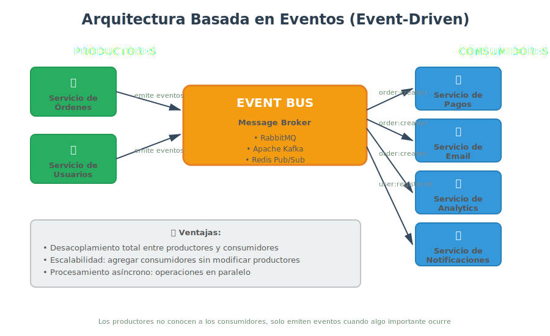

# 🌐 Arquitecturas Cliente-Servidor y Event-Driven

## 🎯 Arquitectura Cliente-Servidor

### ¿Qué es Cliente-Servidor?

La **Arquitectura Cliente-Servidor** es un patrón que divide el sistema en dos componentes principales:

- **Servidor**: Proveedor de servicios/recursos (centralizado)
- **Cliente**: Consumidor de servicios/recursos (distribuido)


### Definición Formal

> "El patrón Cliente-Servidor organiza el sistema en un conjunto de servicios que son proporcionados por servidores, y un conjunto de clientes que usan esos servicios. Los clientes conocen a los servidores, pero los servidores no conocen a los clientes."
> — Frank Buschmann, _POSA Vol. 1_

---

## 🚀 ¿Para Qué Sirve Cliente-Servidor?

### 1. **Centralizar Lógica de Negocio**

Todo el procesamiento complejo ocurre en el servidor:

```
┌──────────┐  ┌──────────┐  ┌──────────┐
│ Cliente  │  │ Cliente  │  │ Cliente  │
│  Móvil   │  │   Web    │  │   CLI    │
└────┬─────┘  └────┬─────┘  └────┬─────┘
     │             │              │
     └─────────────┴──────────────┘
                   │
           ┌───────▼────────┐
           │    SERVIDOR    │
           │ (Lógica única) │
           └───────┬────────┘
                   │
           ┌───────▼────────┐
           │  BASE DE DATOS │
           └────────────────┘
```

**Ejemplo real: WhatsApp**

- **Clientes**: Apps móviles (iOS, Android), Web
- **Servidor**: Gestiona mensajes, sincronización, cifrado
- **Ventaja**: Actualizar lógica de mensajería una sola vez en servidor, no en millones de apps

### 2. **Facilitar Mantenimiento y Actualizaciones**

Cambios en servidor se reflejan inmediatamente en todos los clientes.

**Caso real: Gmail**

- Google actualiza detección de spam en servidor
- Resultado: Todos los usuarios (web, móvil, desktop) se benefician instantáneamente
- No requiere actualizar apps cliente

### 3. **Seguridad Centralizada**

Datos sensibles y validaciones críticas en servidor (fuera del alcance del cliente).

**Ejemplo bancario:**

```javascript
// ❌ INSEGURO: Validación en cliente
if (user.balance >= amount) {
  // Cliente puede hackear esto
  processPayment();
}

// ✅ SEGURO: Validación en servidor
// servidor/payment-service.js
async processPayment(userId, amount) {
  const balance = await this.getBalance(userId); // Servidor verifica
  if (balance < amount) {
    throw new Error('Fondos insuficientes');
  }
  // Procesar pago de forma segura
}
```

---

## 💥 ¿Qué Impacto Tiene Cliente-Servidor?

### ✅ **Si lo aplicas:**

1. **Control centralizado**
   - Un solo punto para actualizar lógica
   - Consistencia garantizada entre clientes

2. **Escalabilidad horizontal del servidor**
   - Agregar más servidores según demanda
   - Load balancers distribuyen carga

3. **Clientes livianos**
   - Apps móviles/web más rápidas
   - Menos procesamiento en dispositivo del usuario

4. **Seguridad mejorada**
   - Datos sensibles nunca salen del servidor
   - Validaciones críticas centralizadas

**Caso real: Netflix**

- **Servidores**: Streaming, recomendaciones, gestión de cuentas
- **Clientes**: Smart TVs, navegadores, móviles (solo reproducen)
- **Resultado**: Actualización de algoritmo de recomendación → afecta a todos instantáneamente

### ❌ **Si NO lo aplicas (Peer-to-Peer sin servidor):**

1. **Sincronización compleja**
   - Cada cliente debe coordinar con otros clientes
   - Conflictos de datos

2. **Seguridad débil**
   - No hay punto central de control
   - Difícil garantizar integridad de datos

3. **Actualizaciones lentas**
   - Cada cliente debe actualizarse independientemente
   - Versiones incompatibles entre clientes

**Caso real: Torrents (P2P)**

- Ventaja: Descarga distribuida, sin servidor
- Desventaja: No hay control, seguridad ni sincronización centralizada

---

## 🏗️ Componentes de Cliente-Servidor

### Servidor

**Responsabilidades:**

- Escuchar peticiones de clientes
- Procesar lógica de negocio
- Acceder a base de datos
- Retornar respuestas

**Ejemplo Node.js/Express:**

```javascript
// server.js
import express from 'express';
import { UserService } from './services/user-service.js';

const app = express();
const userService = new UserService();

// Endpoint: POST /users
app.post('/users', async (req, res) => {
  try {
    const { name, email } = req.body;
    const user = await userService.createUser(name, email);
    res.status(201).json(user);
  } catch (error) {
    res.status(400).json({ error: error.message });
  }
});

app.listen(3000, () => {
  console.log('🚀 Servidor escuchando en puerto 3000');
});
```

### Cliente

**Responsabilidades:**

- Enviar peticiones al servidor
- Recibir y mostrar respuestas
- Manejar interacción con usuario

**Ejemplo JavaScript (Cliente Web):**

```javascript
// client.js
async function createUser(name, email) {
  const response = await fetch('http://localhost:3000/users', {
    method: 'POST',
    headers: { 'Content-Type': 'application/json' },
    body: JSON.stringify({ name, email }),
  });

  if (!response.ok) {
    throw new Error('Error creando usuario');
  }

  return await response.json();
}

// Uso
const newUser = await createUser('Ana López', 'ana@example.com');
console.log('Usuario creado:', newUser);
```

---

## ✅ Ventajas de Cliente-Servidor

| Ventaja                        | Descripción                                              |
| ------------------------------ | -------------------------------------------------------- |
| **Centralización**             | Lógica y datos en un solo lugar                          |
| **Facilidad de mantenimiento** | Actualizar servidor → afecta a todos los clientes        |
| **Seguridad**                  | Validaciones críticas en servidor                        |
| **Escalabilidad horizontal**   | Agregar más servidores según demanda                     |
| **Clientes livianos**          | Dispositivos cliente no necesitan mucho poder de cómputo |

## ❌ Desventajas de Cliente-Servidor

| Desventaja                      | Descripción                          | Mitigación                      |
| ------------------------------- | ------------------------------------ | ------------------------------- |
| **Punto único de falla**        | Si servidor cae, todo el sistema cae | Load balancers, réplicas        |
| **Latencia de red**             | Cada petición requiere red           | Cacheo en cliente               |
| **Cuello de botella**           | Servidor puede saturarse             | Escalado horizontal             |
| **Dependencia de conectividad** | Cliente necesita internet            | Modo offline con sincronización |

---

## 🎯 Casos de Uso Cliente-Servidor

### ✅ **Cuándo usar:**

1. **Aplicaciones web y móviles tradicionales**
   - E-commerce (Amazon, MercadoLibre)
   - Redes sociales (Facebook, Instagram)
   - SaaS (Gmail, Salesforce)

2. **Sistemas con múltiples tipos de clientes**
   - App móvil + web + desktop
   - APIs públicas

3. **Necesidad de control centralizado**
   - Bancos (seguridad crítica)
   - Sistemas de salud (datos sensibles)

### ❌ **Cuándo NO usar:**

1. **Aplicaciones offline primero**
   - Editores de texto (VS Code puede ser offline)
   - Juegos locales

2. **Sistemas peer-to-peer**
   - Compartición de archivos (BitTorrent)
   - Blockchain

---

## 🎆 Arquitectura Basada en Eventos (Event-Driven)

### ¿Qué es Event-Driven?

La **Arquitectura Basada en Eventos** (Event-Driven Architecture - EDA) es un patrón donde los componentes se comunican mediante eventos asíncronos. Los productores emiten eventos sin conocer a los consumidores, y los consumidores reaccionan a eventos sin conocer a los productores.



### Principio Fundamental

**Desacoplamiento temporal y espacial:**

- **Temporal**: Productor y consumidor no necesitan estar activos simultáneamente
- **Espacial**: Productor no conoce quién consumirá el evento

---

## 🚀 ¿Para Qué Sirve Event-Driven?

### 1. **Desacoplamiento Total**

Componentes no se conocen entre sí, solo conocen eventos:

```
┌───────────────┐         ┌──────────────┐
│   Productor   │────────>│ Event Bus    │
│   (Service A) │ emite   │  (Mensajes)  │
└───────────────┘         └──────┬───────┘
                                 │ publica
                    ┌────────────┼────────────┐
                    │            │            │
              ┌─────▼────┐ ┌────▼─────┐ ┌───▼──────┐
              │Consumer 1│ │Consumer 2│ │Consumer 3│
              │(Email)   │ │(SMS)     │ │(Log)     │
              └──────────┘ └──────────┘ └──────────┘
```

**Ejemplo real: Uber**

- **Evento**: "Viaje completado"
- **Consumidores**:
  - Servicio de pagos (cobra tarjeta)
  - Servicio de notificaciones (envía recibo)
  - Servicio de analytics (guarda estadísticas)
  - Servicio de recomendaciones (sugiere próximo viaje)

### 2. **Escalabilidad Extrema**

Agregar nuevos consumidores sin modificar productores.

**Caso real: Slack**

- **Evento**: "Mensaje enviado"
- **Consumidores existentes**: Notificaciones push, indexación de búsqueda
- **Nuevos consumidores** (agregados sin modificar código):
  - Bot de traducción automática
  - Integración con Jira
  - Análisis de sentimientos con IA

### 3. **Procesamiento Asíncrono**

Operaciones lentas no bloquean el flujo principal.

```javascript
// Flujo síncrono tradicional ❌
async function processOrder(order) {
  await saveOrder(order); // 50ms
  await chargePayment(order); // 2000ms (lento!)
  await sendEmail(order); // 500ms
  await updateInventory(order); // 100ms
  // Total: ~2650ms
}

// Flujo asíncrono con eventos ✅
async function processOrder(order) {
  await saveOrder(order); // 50ms
  eventBus.emit('order:created', order); // 1ms (emitir evento)
  // Total: ~51ms ← Usuario recibe respuesta rápida
}

// Consumidores procesan en background
eventBus.on('order:created', async (order) => {
  await chargePayment(order); // Se ejecuta en paralelo
});

eventBus.on('order:created', async (order) => {
  await sendEmail(order); // Se ejecuta en paralelo
});
```

---

## 💥 ¿Qué Impacto Tiene Event-Driven?

### ✅ **Si lo aplicas:**

1. **Altamente escalable**
   - Procesar millones de eventos concurrentemente
   - Consumidores independientes

2. **Resiliente**
   - Si un consumidor falla, otros continúan
   - Eventos pueden reintentarse

3. **Flexible**
   - Agregar funcionalidades sin modificar código existente
   - Nuevos consumidores se "suscriben" a eventos

4. **Performance mejorado**
   - Operaciones lentas en background
   - Usuario recibe respuesta inmediata

**Caso real: Twitter**

- **Evento**: "Usuario tuitea"
- **Consumidores** (todos en paralelo):
  - Timeline de seguidores (actualizaciones)
  - Notificaciones push
  - Indexación de búsqueda
  - Análisis de trending topics
  - Moderación de contenido (IA)
- **Resultado**: Tweet publicado en <100ms, procesamiento completo en background

### ❌ **Si NO lo aplicas (comunicación directa/síncrona):**

1. **Alto acoplamiento**
   - Cada componente conoce a todos los demás
   - Cambios en cascada

2. **Difícil de escalar**
   - Operaciones secuenciales (una después de otra)
   - Cuellos de botella

3. **Performance pobre**
   - Usuario espera a que termine TODO el procesamiento
   - Timeout si operaciones son lentas

---

## 🏗️ Componentes de Event-Driven

### Event Bus (Message Broker)

**Responsabilidad**: Distribuir eventos a consumidores interesados

**Tecnologías populares:**

- **RabbitMQ**: Message broker clásico
- **Apache Kafka**: Stream processing de alto rendimiento
- **Redis Pub/Sub**: Eventos en memoria
- **AWS EventBridge**: Serverless event bus
- **Node.js EventEmitter**: Para aplicaciones locales

### Productor de Eventos

**Responsabilidad**: Emitir eventos cuando ocurren acciones importantes

```javascript
// producer.js
import { EventEmitter } from 'events';

export class OrderService extends EventEmitter {
  async createOrder(orderData) {
    // 1. Procesar orden
    const order = await this.saveOrder(orderData);

    // 2. Emitir evento
    this.emit('order:created', {
      orderId: order.id,
      userId: order.userId,
      amount: order.total,
      timestamp: new Date(),
    });

    return order;
  }
}
```

### Consumidor de Eventos

**Responsabilidad**: Reaccionar a eventos específicos

```javascript
// consumer.js
export class PaymentService {
  constructor(orderService) {
    // Suscribirse a eventos
    orderService.on('order:created', (event) => {
      this.processPayment(event);
    });
  }

  async processPayment(event) {
    console.log(`💳 Procesando pago para orden ${event.orderId}`);
    // Lógica de pago
  }
}

export class EmailService {
  constructor(orderService) {
    orderService.on('order:created', (event) => {
      this.sendConfirmation(event);
    });
  }

  async sendConfirmation(event) {
    console.log(`📧 Enviando email para orden ${event.orderId}`);
    // Lógica de email
  }
}
```

---

## ✅ Ventajas de Event-Driven

| Ventaja             | Descripción                                    |
| ------------------- | ---------------------------------------------- |
| **Desacoplamiento** | Productores y consumidores no se conocen       |
| **Escalabilidad**   | Agregar consumidores sin modificar productores |
| **Asincronía**      | Operaciones lentas no bloquean el flujo        |
| **Resiliencia**     | Fallo de un consumidor no afecta otros         |
| **Auditoría**       | Historial completo de eventos del sistema      |

## ❌ Desventajas de Event-Driven

| Desventaja                 | Descripción                                   | Mitigación                         |
| -------------------------- | --------------------------------------------- | ---------------------------------- |
| **Complejidad**            | Difícil rastrear flujo de eventos             | Logging distribuido (ELK, Datadog) |
| **Debugging difícil**      | Eventos asíncronos son difíciles de debuggear | Herramientas de tracing (Jaeger)   |
| **Consistencia eventual**  | Datos no están sincronizados instantáneamente | Diseño tolerante a inconsistencias |
| **Duplicación de eventos** | Eventos pueden procesarse más de una vez      | Operaciones idempotentes           |

---

## 🎯 Casos de Uso Event-Driven

### ✅ **Cuándo usar:**

1. **Sistemas de tiempo real**
   - Chat (Slack, Discord)
   - Notificaciones push
   - Streaming (Twitch)

2. **Microservicios**
   - Comunicación entre servicios independientes
   - Sagas distribuidas

3. **IoT (Internet of Things)**
   - Sensores emitiendo datos constantemente
   - Smart homes

4. **E-commerce con alto volumen**
   - Procesamiento de órdenes en paralelo
   - Inventario en tiempo real

### ❌ **Cuándo NO usar:**

1. **Sistemas simples con pocas operaciones**
   - CRUD básico
   - Scripts pequeños

2. **Necesidad de respuestas inmediatas y síncronas**
   - Transacciones bancarias críticas (requieren confirmación inmediata)

---

## 🆚 Cliente-Servidor vs Event-Driven

| Aspecto           | Cliente-Servidor                | Event-Driven                               |
| ----------------- | ------------------------------- | ------------------------------------------ |
| **Comunicación**  | Síncrona (request-response)     | Asíncrona (fire-and-forget)                |
| **Acoplamiento**  | Medio (cliente conoce servidor) | Bajo (productores no conocen consumidores) |
| **Escalabilidad** | Horizontal (más servidores)     | Muy alta (consumidores independientes)     |
| **Complejidad**   | Baja                            | Alta                                       |
| **Debugging**     | Fácil                           | Difícil                                    |
| **Mejor para**    | Apps web/móvil tradicionales    | Sistemas distribuidos, microservicios      |

---

## 🔗 Combinando Ambos Patrones

Muchos sistemas modernos combinan Cliente-Servidor + Event-Driven:

```
┌──────────┐         ┌────────────┐
│ Cliente  │────────>│  Servidor  │
│  (App)   │ HTTP    │  (API)     │
└──────────┘         └─────┬──────┘
                           │ emite eventos
                     ┌─────▼──────┐
                     │ Event Bus  │
                     └─────┬──────┘
                  ┌────────┼────────┐
            ┌─────▼────┐ ┌─▼────────▼┐
            │Notification│ │Analytics │
            │  Service   │ │  Service │
            └────────────┘ └──────────┘
```

**Ejemplo real: Instagram**

- **Cliente-Servidor**: App móvil sube foto vía API REST
- **Event-Driven**:
  - Evento "foto subida" → Procesamiento de imagen (filtros)
  - Evento "foto subida" → Notificaciones a seguidores
  - Evento "foto subida" → Indexación de búsqueda
  - Evento "foto subida" → Análisis de contenido (IA)

---

## 💡 Mejores Prácticas

### Cliente-Servidor:

1. ✅ **Validar en servidor, no solo en cliente**
2. ✅ **Usar HTTPS para seguridad**
3. ✅ **Implementar rate limiting** (evitar abuso)
4. ✅ **Cacheo en cliente** para reducir llamadas
5. ✅ **Versionado de API** (v1, v2)

### Event-Driven:

1. ✅ **Eventos descriptivos**: `order:created`, no `event123`
2. ✅ **Incluir metadata**: timestamp, userId, etc.
3. ✅ **Operaciones idempotentes** (procesar evento 2 veces = mismo resultado)
4. ✅ **Dead Letter Queue** (eventos que fallaron múltiples veces)
5. ✅ **Monitoreo y logging** distribuido

---

## 🚀 Próximos Pasos

- **[MVC/MVVM](04-mvc-mvvm.md)** - Patrones para interfaces de usuario
- **[Práctica: Análisis de Arquitecturas](../2-practicas/practica-01-analisis-arquitecturas.md)**

---

**Bootcamp de Arquitectura de Software - Semana 03**  
_SENA - Tecnología en Análisis y Desarrollo de Software_  
_bc-channel-epti_
