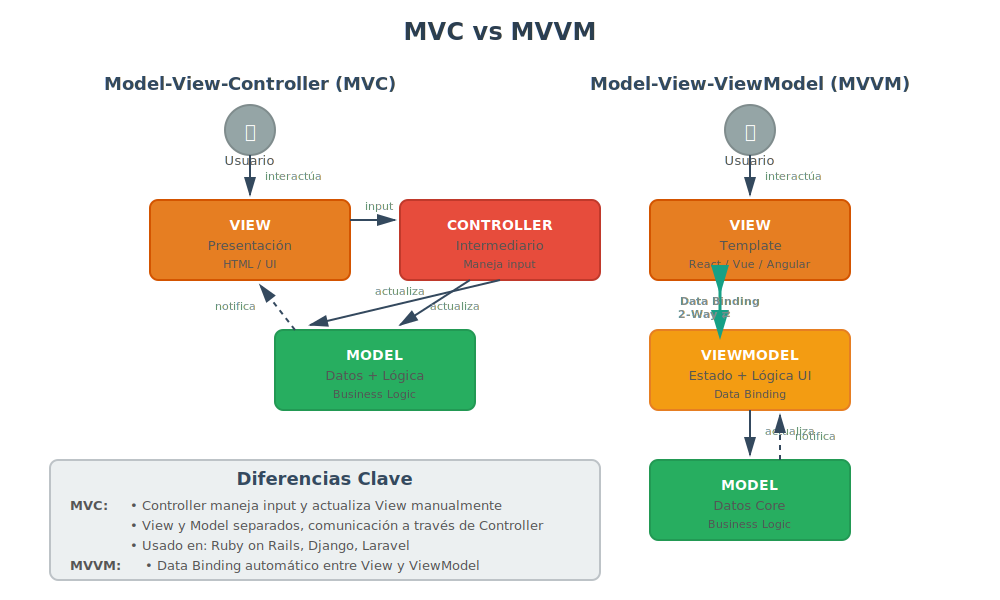

# 🎨 MVC y MVVM: Patrones para Interfaces de Usuario

## 🎯 Model-View-Controller (MVC)

### ¿Qué es MVC?

**MVC** (Model-View-Controller) es un patrón arquitectónico que separa una aplicación en tres componentes interconectados:
- **Model (Modelo)**: Datos y lógica de negocio
- **View (Vista)**: Presentación visual
- **Controller (Controlador)**: Intermediario que maneja inputs y actualiza Model/View



### Definición Formal

> "El patrón MVC divide una aplicación interactiva en tres componentes. El modelo contiene la funcionalidad y datos core. Las vistas muestran información al usuario. Los controladores manejan la entrada del usuario."
> — Gamma et al., *Design Patterns*

---

## 🚀 ¿Para Qué Sirve MVC?

### 1. **Separar Lógica de Presentación**

La lógica de negocio (Model) está completamente desacoplada de cómo se muestra (View):

```
        ┌──────────┐
        │   USER   │
        └────┬─────┘
             │ interactúa
      ┌──────▼──────────┐
      │   CONTROLLER    │
      │ (Maneja input)  │
      └──┬──────────┬───┘
         │          │
    actualiza    lee/actualiza
         │          │
    ┌────▼────┐  ┌──▼───────┐
    │  VIEW   │  │  MODEL   │
    │(Muestra)│◄─│(Datos +  │
    │         │  │ Lógica)  │
    └─────────┘  └──────────┘
         notifica cambios
```

**Ejemplo real: Ruby on Rails (MVC clásico)**
- **Model**: `User`, `Product`, `Order` (ActiveRecord)
- **View**: Templates HTML/ERB
- **Controller**: `UsersController`, `ProductsController`

### 2. **Múltiples Vistas para el Mismo Modelo**

Un modelo puede tener diferentes representaciones visuales:

```javascript
// Model (único)
class Product {
  constructor(name, price) {
    this.name = name;
    this.price = price;
  }
  
  applyDiscount(percentage) {
    this.price -= this.price * (percentage / 100);
  }
}

// Vista 1: Tarjeta de producto (HTML)
class CardView {
  render(product) {
    return `<div class="card">
      <h3>${product.name}</h3>
      <p>$${product.price}</p>
    </div>`;
  }
}

// Vista 2: Fila de tabla (HTML)
class TableRowView {
  render(product) {
    return `<tr>
      <td>${product.name}</td>
      <td>${product.price}</td>
    </tr>`;
  }
}

// Vista 3: JSON (API)
class JSONView {
  render(product) {
    return JSON.stringify(product);
  }
}
```

### 3. **Testing Simplificado**

Modelo se puede testear sin UI:

```javascript
// Test del modelo (sin necesidad de renderizar UI)
test('Product debe aplicar descuento correctamente', () => {
  const product = new Product('Laptop', 1000);
  product.applyDiscount(10);
  expect(product.price).toBe(900);
});
```

---

## 💥 ¿Qué Impacto Tiene MVC?

### ✅ **Si lo aplicas:**

1. **Mantenibilidad mejorada**
   - Cambiar UI no afecta lógica de negocio
   - Bugs aislados en un componente

2. **Trabajo en paralelo**
   - Diseñadores trabajan en View
   - Desarrolladores backend trabajan en Model
   - Desarrolladores frontend trabajan en Controller

3. **Reutilización**
   - Mismo Model para web y móvil
   - Múltiples Views para el mismo dato

4. **Testing independiente**
   - Testear Model sin UI
   - Testear Controller con mocks

**Caso real: GitHub**
- **Model**: Repositorios, Issues, Pull Requests (lógica de Git)
- **View**: Interfaz web, API REST, GraphQL, GitHub CLI
- **Controller**: Rutas que conectan acciones de usuario con operaciones de Git
- **Resultado**: Misma lógica sirve a múltiples interfaces

### ❌ **Si NO lo aplicas:**

1. **Código spaghetti**
   - HTML mezclado con JavaScript mezclado con lógica

```html
<!-- ❌ TODO MEZCLADO -->
<script>
  function saveUser() {
    const name = document.getElementById('name').value;
    if (name === '') { // Validación mezclada con UI
      alert('Nombre requerido'); // Presentación mezclada
      return;
    }
    
    const user = { id: Date.now(), name }; // Lógica mezclada
    localStorage.setItem('user', JSON.stringify(user)); // Persistencia mezclada
    
    document.getElementById('result').innerHTML = 'Usuario guardado'; // UI mezclada
  }
</script>
```

2. **Duplicación de lógica**
   - Validaciones repetidas en múltiples formularios
   - Lógica de negocio copiada entre páginas

3. **Testing imposible**
   - No se puede testear lógica sin manipular DOM

---

## 🏗️ Componentes de MVC

### Model (Modelo)

**Responsabilidad**: Datos + lógica de negocio

```javascript
// model/product.js
export class Product {
  #id;
  #name;
  #price;
  #stock;

  constructor(id, name, price, stock) {
    this.#id = id;
    this.#name = name;
    this.#price = price;
    this.#stock = stock;
  }

  // Lógica de negocio
  applyDiscount(percentage) {
    if (percentage < 0 || percentage > 100) {
      throw new Error('Descuento inválido');
    }
    this.#price -= this.#price * (percentage / 100);
  }

  isAvailable() {
    return this.#stock > 0;
  }

  // Getters
  get name() { return this.#name; }
  get price() { return this.#price; }
  get stock() { return this.#stock; }
}
```

### View (Vista)

**Responsabilidad**: Presentación visual

```javascript
// view/product-view.js
export class ProductView {
  #container;

  constructor(containerId) {
    this.#container = document.getElementById(containerId);
  }

  render(product) {
    this.#container.innerHTML = `
      <div class="product-card">
        <h3>${product.name}</h3>
        <p class="price">$${product.price.toFixed(2)}</p>
        <p class="stock">Stock: ${product.stock}</p>
        <button id="apply-discount">Aplicar 10% descuento</button>
      </div>
    `;
  }

  showError(message) {
    this.#container.innerHTML = `<p class="error">${message}</p>`;
  }
}
```

### Controller (Controlador)

**Responsabilidad**: Conectar Model y View, manejar eventos

```javascript
// controller/product-controller.js
export class ProductController {
  #model;
  #view;

  constructor(model, view) {
    this.#model = model;
    this.#view = view;
    
    this.#init();
  }

  #init() {
    // Renderizar vista inicial
    this.#view.render(this.#model);
    
    // Conectar eventos
    document.getElementById('apply-discount').addEventListener('click', () => {
      this.applyDiscount();
    });
  }

  applyDiscount() {
    try {
      this.#model.applyDiscount(10);
      this.#view.render(this.#model); // Actualizar vista
    } catch (error) {
      this.#view.showError(error.message);
    }
  }
}

// Uso
const product = new Product(1, 'Laptop', 1000, 15);
const view = new ProductView('product-container');
const controller = new ProductController(product, view);
```

---

## 🎯 Model-View-ViewModel (MVVM)

### ¿Qué es MVVM?

**MVVM** es una variante de MVC donde:
- **Model**: Datos y lógica (igual que MVC)
- **View**: Presentación visual (igual que MVC)
- **ViewModel**: Intermediario que expone datos del Model en formato "bindeable" para la View

**Diferencia clave**: Data binding bidireccional automático entre View y ViewModel.

### Flujo de MVVM

```
┌─────────┐  binding   ┌──────────────┐  actualiza  ┌─────────┐
│  VIEW   │◄──────────►│  VIEWMODEL   │◄───────────│  MODEL  │
│ (HTML)  │   2-way    │ (State+Logic)│   1-way    │ (Datos) │
└─────────┘            └──────────────┘            └─────────┘
```

---

## 🚀 ¿Para Qué Sirve MVVM?

### 1. **Data Binding Automático**

Los cambios en ViewModel se reflejan automáticamente en View (y viceversa):

**Ejemplo con Vue.js (MVVM):**

```javascript
// ViewModel (Vue component)
export default {
  data() {
    return {
      product: {
        name: 'Laptop',
        price: 1000
      }
    };
  },
  methods: {
    applyDiscount() {
      this.product.price *= 0.9; // ViewModel actualizado
      // Vista se actualiza AUTOMÁTICAMENTE
    }
  }
};
```

```html
<!-- View (template) -->
<div>
  <h3>{{ product.name }}</h3>
  <p>${{ product.price }}</p>
  <button @click="applyDiscount">Aplicar descuento</button>
</div>
```

**Sin código de sincronización manual**: Vue/React/Angular actualizan automáticamente el DOM cuando cambia el estado.

### 2. **Código más Declarativo**

En lugar de manipular DOM manualmente, declaras cómo debe verse la UI:

```javascript
// ❌ MVC tradicional (imperativo)
function updatePrice(newPrice) {
  document.getElementById('price').textContent = `$${newPrice}`;
}

// ✅ MVVM (declarativo)
this.price = newPrice; // La vista se actualiza sola
```

### 3. **Testing Simplificado**

ViewModel es una clase JavaScript normal, testeable sin UI:

```javascript
// Test del ViewModel (sin renderizar UI)
test('ViewModel debe calcular total correctamente', () => {
  const vm = new ProductViewModel();
  vm.addItem('Laptop', 1000);
  vm.addItem('Mouse', 25);
  expect(vm.total).toBe(1025);
});
```

---

## 💥 ¿Qué Impacto Tiene MVVM?

### ✅ **Si lo aplicas:**

1. **Menos código boilerplate**
   - No más `getElementById`, `innerHTML`, `addEventListener` manual
   - Framework maneja sincronización

2. **Desarrollo más rápido**
   - Cambios en estado → UI actualizada automáticamente
   - Menos bugs de sincronización

3. **Mejor experiencia de usuario**
   - Actualizaciones reactivas instantáneas
   - UIs más fluidas

**Caso real: Gmail (interfaz moderna)**
- **Model**: Emails, contactos (backend)
- **ViewModel**: Estado de bandeja de entrada, emails seleccionados, filtros activos
- **View**: Interfaz web reactiva (cambios instantáneos sin recargar página)

### ❌ **Si NO lo aplicas (jQuery tradicional):**

1. **Sincronización manual tediosa**
   - Cada cambio requiere actualizar DOM manualmente

2. **Bugs de inconsistencia**
   - Estado en memoria ≠ Estado visual
   - Olvidar actualizar una parte del UI

---

## 🏗️ Componentes de MVVM

### Model

```javascript
// model/product.js (igual que MVC)
export class Product {
  constructor(id, name, price) {
    this.id = id;
    this.name = name;
    this.price = price;
  }
}
```

### ViewModel

```javascript
// viewmodel/product-viewmodel.js
import { reactive } from 'vue'; // O React useState, Angular signals

export class ProductViewModel {
  constructor(productModel) {
    // Estado reactivo
    this.state = reactive({
      product: productModel,
      discount: 0,
      finalPrice: productModel.price
    });
  }

  applyDiscount(percentage) {
    this.state.discount = percentage;
    this.state.finalPrice = this.state.product.price * (1 - percentage / 100);
    // La vista se actualiza AUTOMÁTICAMENTE
  }

  get displayPrice() {
    return `$${this.state.finalPrice.toFixed(2)}`;
  }
}
```

### View (Template)

```html
<!-- view/product.vue -->
<template>
  <div class="product">
    <h3>{{ state.product.name }}</h3>
    <p>Precio original: ${{ state.product.price }}</p>
    <p>Descuento: {{ state.discount }}%</p>
    <p class="final-price">{{ displayPrice }}</p>
    <button @click="applyDiscount(10)">10% OFF</button>
  </div>
</template>

<script>
import { ProductViewModel } from './viewmodel/product-viewmodel.js';

export default {
  setup() {
    const product = { id: 1, name: 'Laptop', price: 1000 };
    const vm = new ProductViewModel(product);
    return vm;
  }
};
</script>
```

---

## 🆚 MVC vs MVVM

| Aspecto | MVC | MVVM |
|---------|-----|------|
| **Actualización de View** | Manual (controller actualiza view) | Automática (data binding) |
| **Complejidad** | Media | Baja (framework maneja binding) |
| **Testing** | Controller difícil de testear | ViewModel fácil de testear |
| **Código boilerplate** | Más (manipulación DOM manual) | Menos (framework maneja) |
| **Frameworks** | Ruby on Rails, Django, Laravel | React, Vue, Angular, Svelte |
| **Mejor para** | Apps tradicionales server-side | SPAs (Single Page Apps) |

---

## 🎯 MVC/MVVM en Frameworks Modernos

### React (MVVM-ish)

```javascript
// ProductCard.jsx
import { useState } from 'react';

export function ProductCard({ product }) {
  const [price, setPrice] = useState(product.price);

  const applyDiscount = () => {
    setPrice(price * 0.9); // State actualizado → UI se actualiza
  };

  return (
    <div>
      <h3>{product.name}</h3>
      <p>${price.toFixed(2)}</p>
      <button onClick={applyDiscount}>10% OFF</button>
    </div>
  );
}
```

### Vue.js (MVVM puro)

```javascript
// ProductCard.vue
<template>
  <div>
    <h3>{{ product.name }}</h3>
    <p>${{ price }}</p>
    <button @click="applyDiscount">10% OFF</button>
  </div>
</template>

<script setup>
import { ref } from 'vue';

const props = defineProps(['product']);
const price = ref(props.product.price);

const applyDiscount = () => {
  price.value *= 0.9;
};
</script>
```

### Angular (MVVM)

```typescript
// product-card.component.ts
import { Component, Input } from '@angular/core';

@Component({
  selector: 'product-card',
  template: `
    <div>
      <h3>{{ product.name }}</h3>
      <p>\${{ price }}</p>
      <button (click)="applyDiscount()">10% OFF</button>
    </div>
  `
})
export class ProductCardComponent {
  @Input() product: any;
  price: number;

  ngOnInit() {
    this.price = this.product.price;
  }

  applyDiscount() {
    this.price *= 0.9;
  }
}
```

---

## 🎯 Casos de Uso

### ✅ **MVC tradicional:**

1. **Aplicaciones server-side rendering**
   - Ruby on Rails, Django, Laravel, Express + EJS

2. **Aplicaciones con múltiples tecnologías de View**
   - API REST (JSON) + Web (HTML) + Móvil

3. **Equipos que prefieren control total sobre UI**
   - Sin "magia" de frameworks

### ✅ **MVVM:**

1. **Single Page Applications (SPAs)**
   - Gmail, Twitter, Facebook (web app)

2. **Aplicaciones con UI altamente interactiva**
   - Dashboards, editores en tiempo real

3. **Desarrollo rápido con frameworks modernos**
   - React, Vue, Angular, Svelte

---

## 💡 Mejores Prácticas

### MVC:
1. ✅ **Model nunca conoce View**: Solo datos y lógica
2. ✅ **Controller delgado**: Solo conecta, no lógica de negocio
3. ✅ **View sin lógica**: Solo presentación
4. ✅ **Un Controller por recurso**: `UsersController`, `ProductsController`

### MVVM:
1. ✅ **ViewModel sin lógica de View**: No manipular DOM
2. ✅ **Estado inmutable cuando sea posible**: Evitar mutaciones directas
3. ✅ **Computed properties para cálculos**: No en template
4. ✅ **Componentes pequeños y reutilizables**: Single Responsibility

---

## 🚀 Próximos Pasos

- **[Selección de Patrón Arquitectónico](05-seleccion-patron.md)** - Cómo elegir el apropiado
- **[Práctica: Layered Architecture](../2-practicas/practica-02-layered.md)**

---

**Bootcamp de Arquitectura de Software - Semana 03**  
_SENA - Tecnología en Análisis y Desarrollo de Software_  
_bc-channel-epti_
