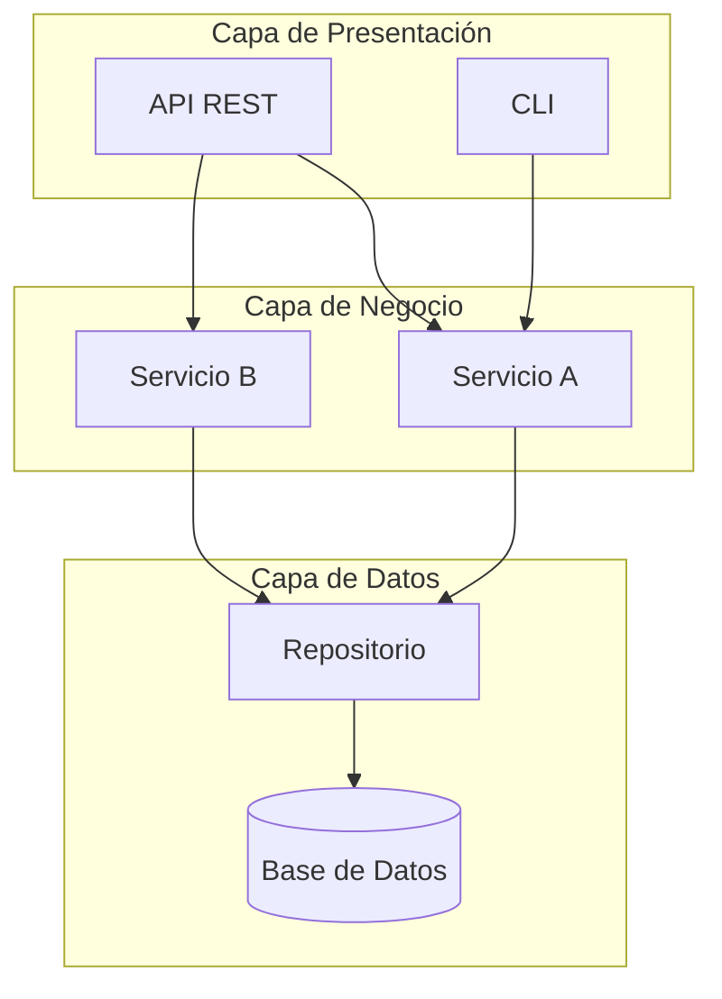

# 🚀 Proyecto Integrador - Semana 03

## 🎯 Objetivo

Definir y justificar el **patrón arquitectónico** para tu dominio, documentando la decisión con una matriz de selección y un ADR (Architecture Decision Record).

## ⏱️ Duración

**2.5 horas** (60 min clase + 90 min autónomo)

---

## 📋 Descripción del Proyecto

Este proyecto es la **tercera iteración** de tu caso de estudio personal:

- **Semana 01**: Selección de caso y metodología ✅
- **Semana 02**: Aplicación de principios SOLID ✅
- **Semana 03**: Definición de patrón arquitectónico ← **ESTÁS AQUÍ**
- **Semana 04**: Diseño de APIs y componentes
- **Semana 05**: Implementación de patrones de diseño
- **Semana 06**: Arquitectura moderna (microservicios/hexagonal)
- **Semana 07**: Containerización con Docker
- **Semana 08**: Seguridad en la arquitectura
- **Semana 09**: Presentación final completa

---

## 🎯 Tu Dominio Asignado

Continuarás trabajando con el **dominio de negocio único** que te fue asignado en la semana 01. Esta semana definirás qué patrón arquitectónico usarás y por qué.

---

## 📝 Requerimientos de Esta Semana

### 1. Análisis de Requisitos Arquitectónicos

Identifica los **requisitos no funcionales** críticos de tu dominio:

| Requisito      | Nivel Requerido     | Justificación |
| -------------- | ------------------- | ------------- |
| Escalabilidad  | Alto / Medio / Bajo | ¿Por qué?     |
| Performance    | Alto / Medio / Bajo | ¿Por qué?     |
| Mantenibilidad | Alto / Medio / Bajo | ¿Por qué?     |
| Disponibilidad | Alto / Medio / Bajo | ¿Por qué?     |
| Seguridad      | Alto / Medio / Bajo | ¿Por qué?     |

### 2. Matriz de Selección de Patrón

Evalúa **mínimo 3 patrones** usando una matriz de decisión ponderada:

| Criterio     |   Peso   |   Patrón A   |   Patrón B   |   Patrón C   |
| ------------ | :------: | :----------: | :----------: | :----------: |
| [Criterio 1] |  \_\_%   |  × ** = **   |  × ** = **   |  × ** = **   |
| [Criterio 2] |  \_\_%   |  × ** = **   |  × ** = **   |  × ** = **   |
| [Criterio 3] |  \_\_%   |  × ** = **   |  × ** = **   |  × ** = **   |
| [Criterio 4] |  \_\_%   |  × ** = **   |  × ** = **   |  × ** = **   |
| [Criterio 5] |  \_\_%   |  × ** = **   |  × ** = **   |  × ** = **   |
| **TOTAL**    | **100%** | **\_\_\_\_** | **\_\_\_\_** | **\_\_\_\_** |

### 3. Architecture Decision Record (ADR)

Crea un documento `PATRON-SELECCIONADO.md` siguiendo esta plantilla:

---

## 📄 Plantilla: PATRON-SELECCIONADO.md

```markdown
# ADR-003: Selección de Patrón Arquitectónico para [Tu Dominio]

## Estado

Aceptado

## Fecha

[Fecha de la decisión]

## Contexto

### Descripción del Dominio

[Breve descripción de tu dominio de negocio]

### Requisitos Identificados

- **Funcionales**: [Lista de funcionalidades principales]
- **No Funcionales**: [Escalabilidad, performance, seguridad, etc.]

### Restricciones

- **Equipo**: [Tamaño y experiencia del equipo]
- **Tiempo**: [Plazo del proyecto]
- **Presupuesto**: [Limitaciones de recursos]
- **Tecnología**: [Stack definido: JavaScript ES2023]

## Opciones Evaluadas

### Opción 1: [Patrón A]

**Descripción**: [Qué es y cómo funciona]

**Pros**:

- **Contras**:

-

### Opción 2: [Patrón B]

**Descripción**: [Qué es y cómo funciona]

**Pros**:

- **Contras**:

-

### Opción 3: [Patrón C]

**Descripción**: [Qué es y cómo funciona]

**Pros**:

- **Contras**:

-

## Decisión

Hemos decidido usar **[Patrón Seleccionado]** para el sistema de [Tu Dominio].

### Justificación Principal

[Explica por qué este patrón es el mejor para tu contexto específico]

### Resultado de la Matriz de Decisión

| Patrón     | Score  |
| ---------- | :----: |
| [Patrón A] | \_\_\_ |
| [Patrón B] | \_\_\_ |
| [Patrón C] | \_\_\_ |

**Ganador**: [Patrón con mayor score]

## Consecuencias

### Positivas

-
-
-

### Negativas (Trade-offs Aceptados)

-
-

### Riesgos y Mitigación

| Riesgo |  Probabilidad   |     Impacto     | Mitigación |
| ------ | :-------------: | :-------------: | ---------- |
|        | Alto/Medio/Bajo | Alto/Medio/Bajo |            |

## Diagrama de Arquitectura

[Incluir diagrama de alto nivel mostrando los componentes principales]
```

[Tu diagrama aquí usando ASCII art o referencia a imagen SVG]

```

## Notas Adicionales

- **Próximos pasos**: [Qué sigue en semana 04]
- **Referencias**: [Libros, artículos consultados]
```

---

## 🏗️ Diagrama de Arquitectura Requerido

Crea un diagrama que muestre:

1. **Componentes principales** de tu sistema
2. **Capas o módulos** según el patrón elegido
3. **Flujo de datos** entre componentes
4. **Integraciones externas** (BD, APIs, servicios)

### Formato del Diagrama

Puedes usar cualquiera de estos formatos:

- **ASCII art** en el documento markdown
- **Mermaid** (integrado en GitHub)
- **SVG** creado con Draw.io o similar
- **PlantUML**

### Ejemplo de Diagrama Mermaid



---

## 📁 Estructura de Entrega

```
week-03/tu-proyecto/
├── PATRON-SELECCIONADO.md      # ADR completo
├── diagrama-arquitectura.svg    # O .md con Mermaid
└── README.md                    # Resumen ejecutivo
```

### Contenido del README.md

```markdown
# [Nombre de tu Proyecto] - Arquitectura

## Patrón Seleccionado

[Nombre del patrón]

## Justificación en una línea

[Por qué este patrón para este dominio]

## Diagrama de Alto Nivel

[Referencia al diagrama]

## Documentos

- [PATRON-SELECCIONADO.md](PATRON-SELECCIONADO.md) - Decisión arquitectónica completa
```

---

## ✅ Criterios de Evaluación

### Evidencia de Conocimiento (30%)

| Criterio                | Excelente (5)                              | Bueno (4)                        | Aceptable (3)      | Insuficiente (1-2)    |
| ----------------------- | ------------------------------------------ | -------------------------------- | ------------------ | --------------------- |
| Comprensión de patrones | Explica 4+ patrones con pros/contras       | Explica 3 patrones correctamente | Explica 2 patrones | No comprende patrones |
| Justificación técnica   | Argumentos técnicos sólidos y contextuales | Buenos argumentos                | Argumentos básicos | Sin justificación     |

### Evidencia de Desempeño (40%)

| Criterio           | Excelente (5)                                        | Bueno (4)             | Aceptable (3)        | Insuficiente (1-2)   |
| ------------------ | ---------------------------------------------------- | --------------------- | -------------------- | -------------------- |
| Matriz de decisión | Completa con pesos justificados y cálculos correctos | Completa con cálculos | Matriz básica        | Incompleta           |
| ADR                | Todas las secciones completas y coherentes           | Secciones principales | Secciones básicas    | Incompleto           |
| Diagrama           | Profesional, claro, completo                         | Claro y comprensible  | Básico pero correcto | Confuso o incompleto |

### Evidencia de Producto (30%)

| Criterio                 | Excelente (5)                      | Bueno (4)                     | Aceptable (3)     | Insuficiente (1-2) |
| ------------------------ | ---------------------------------- | ----------------------------- | ----------------- | ------------------ |
| Coherencia con dominio   | Patrón perfectamente alineado      | Buena alineación              | Alineación básica | Desalineado        |
| Continuidad del proyecto | Integra semanas 01 y 02 claramente | Referencias a semanas previas | Mención básica    | Sin continuidad    |

---

## 💡 Tips para el Éxito

1. **No hay patrón "correcto"** - Lo importante es la justificación
2. **Considera tu contexto** - Equipo, tiempo, recursos
3. **Piensa en el futuro** - ¿Cómo evolucionará tu sistema?
4. **Documenta trade-offs** - Muestra que entiendes las consecuencias
5. **El diagrama comunica** - Un buen diagrama vale más que mil palabras

---

## 🔗 Recursos de Apoyo

- [Teoría: Selección de Patrones](../1-teoria/05-seleccion-patron.md)
- [Práctica: Matriz de Selección](../2-practicas/03-practica-seleccion.md)
- [Asset: Matriz de Selección](../0-assets/06-matriz-seleccion.svg)

---

## 📅 Fechas de Entrega

- **Avance en clase**: Matriz de decisión completada
- **Entrega final**: ADR completo + diagrama

---

## ❓ Preguntas Frecuentes

### ¿Puedo cambiar el patrón después?

Sí, las decisiones arquitectónicas pueden evolucionar. Lo importante es documentar por qué cambias y qué aprendiste.

### ¿Qué pasa si dos patrones tienen el mismo score?

Considera criterios de desempate:

1. Familiaridad del equipo
2. Ecosistema de herramientas
3. Casos de éxito similares

### ¿El diagrama debe ser perfecto?

No, debe ser **claro y comunicar la estructura**. La perfección viene con la práctica.

---

**¡Éxito con tu proyecto! 🚀**

Esta decisión arquitectónica guiará el desarrollo de las próximas semanas.

---

[⬅️ Volver al README](../README.md) | [➡️ Reto de la Semana](../reto-semana-03.md)
