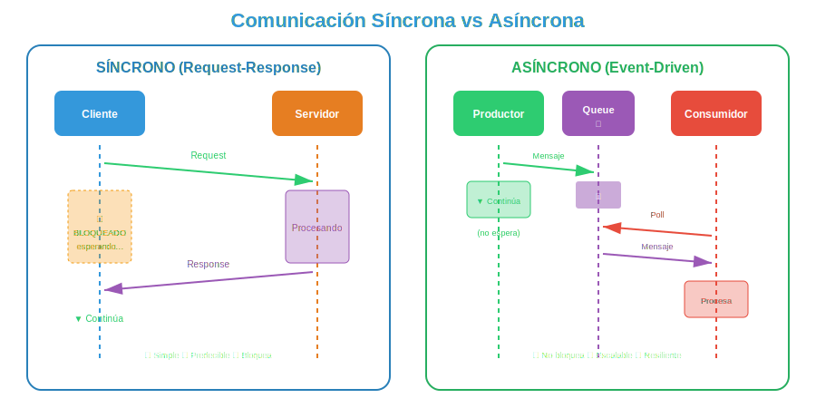

# 🔄 Comunicación Síncrona vs Asíncrona

## 🎯 ¿Qué es la Comunicación entre Componentes?

### Definición

La **comunicación entre componentes** es el mecanismo por el cual las partes de un sistema intercambian datos y coordinan acciones. El estilo de comunicación elegido impacta directamente en el rendimiento, escalabilidad y complejidad del sistema.

> 💡 _"Elegir entre comunicación síncrona y asíncrona es como elegir entre una llamada telefónica y un correo electrónico: cada uno tiene su momento apropiado."_

---

## 📞 Comunicación Síncrona (Request-Response)

### ¿Qué es?

En la comunicación **síncrona**, el emisor envía una solicitud y **espera bloqueado** hasta recibir la respuesta. El flujo de ejecución se detiene hasta que la operación completa.



### Características

| Característica            | Descripción                                   |
| ------------------------- | --------------------------------------------- |
| **Bloqueo**               | El cliente espera la respuesta                |
| **Acoplamiento temporal** | Ambos deben estar disponibles simultáneamente |
| **Simplicidad**           | Fácil de entender y depurar                   |
| **Latencia visible**      | El usuario percibe el tiempo de espera        |

### Ejemplo en JavaScript

```javascript
// Comunicación síncrona con fetch (usando async/await)
const getUser = async (userId) => {
  console.log('Solicitando usuario...');

  // El código ESPERA aquí hasta que la respuesta llegue
  const response = await fetch(`/api/users/${userId}`);

  if (!response.ok) {
    throw new Error(`Error: ${response.status}`);
  }

  const user = await response.json();
  console.log('Usuario recibido:', user);

  return user;
};

// Uso
const processUserOrder = async (userId, orderId) => {
  // Cada llamada espera a la anterior
  const user = await getUser(userId); // Espera...
  const order = await getOrder(orderId); // Espera...
  const result = await processPayment(user, order); // Espera...

  return result;
};
```

### Patrones Síncronos Comunes

#### 1. REST API (HTTP)

```javascript
// Cliente HTTP síncrono
class UserApiClient {
  #baseUrl;

  constructor(baseUrl) {
    this.#baseUrl = baseUrl;
  }

  async getAll() {
    const response = await fetch(`${this.#baseUrl}/users`);
    return response.json();
  }

  async getById(id) {
    const response = await fetch(`${this.#baseUrl}/users/${id}`);
    if (response.status === 404) return null;
    return response.json();
  }

  async create(userData) {
    const response = await fetch(`${this.#baseUrl}/users`, {
      method: 'POST',
      headers: { 'Content-Type': 'application/json' },
      body: JSON.stringify(userData),
    });
    return response.json();
  }
}
```

#### 2. RPC (Remote Procedure Call)

```javascript
// Patrón RPC síncrono
class CalculatorRpcClient {
  #endpoint;

  constructor(endpoint) {
    this.#endpoint = endpoint;
  }

  async call(method, params) {
    const response = await fetch(this.#endpoint, {
      method: 'POST',
      headers: { 'Content-Type': 'application/json' },
      body: JSON.stringify({
        jsonrpc: '2.0',
        method,
        params,
        id: Date.now(),
      }),
    });

    const result = await response.json();

    if (result.error) {
      throw new Error(result.error.message);
    }

    return result.result;
  }

  async add(a, b) {
    return this.call('add', [a, b]);
  }

  async multiply(a, b) {
    return this.call('multiply', [a, b]);
  }
}
```

---

## 📬 Comunicación Asíncrona (Fire-and-Forget / Event-Driven)

### ¿Qué es?

En la comunicación **asíncrona**, el emisor envía un mensaje y **continúa inmediatamente** sin esperar respuesta. El procesamiento ocurre de forma independiente.

El flujo típico es:

1. **Productor** envía mensaje a la cola
2. **Productor** continúa ejecutando (no espera)
3. **Consumidor** obtiene mensajes de la cola cuando está listo
4. **Consumidor** procesa el mensaje de forma independiente

### Características

| Característica               | Descripción                                                  |
| ---------------------------- | ------------------------------------------------------------ |
| **No bloqueante**            | El emisor no espera respuesta                                |
| **Desacoplamiento temporal** | Emisor y receptor no necesitan estar activos simultáneamente |
| **Escalabilidad**            | Los mensajes se pueden procesar en paralelo                  |
| **Complejidad**              | Más difícil de depurar y rastrear                            |
| **Resiliencia**              | Tolerante a fallos temporales                                |

### Ejemplo en JavaScript

```javascript
import { EventEmitter } from 'events';

// Event Bus para comunicación asíncrona
class EventBus extends EventEmitter {
  publish(event, data) {
    console.log(`📤 Evento publicado: ${event}`);
    this.emit(event, data);
  }

  subscribe(event, handler) {
    console.log(`📥 Suscrito a: ${event}`);
    this.on(event, handler);
  }
}

const eventBus = new EventBus();

// Productor: publica eventos y continúa
const orderService = {
  async createOrder(orderData) {
    // Guardar orden en BD
    const order = await saveOrder(orderData);

    // Publicar evento y CONTINUAR (no espera)
    eventBus.publish('order:created', order);

    console.log('Orden creada, continuando...');
    return order;
  },
};

// Consumidores: procesan eventos de forma independiente
eventBus.subscribe('order:created', async (order) => {
  console.log('📧 Enviando email de confirmación...');
  await sendConfirmationEmail(order);
});

eventBus.subscribe('order:created', async (order) => {
  console.log('📦 Reservando inventario...');
  await reserveInventory(order.items);
});

eventBus.subscribe('order:created', async (order) => {
  console.log('📊 Actualizando analytics...');
  await updateAnalytics(order);
});
```

### Patrones Asíncronos Comunes

#### 1. Publish/Subscribe (Pub/Sub)

```javascript
// Sistema Pub/Sub simple
class PubSub {
  #topics = new Map();

  subscribe(topic, subscriber) {
    if (!this.#topics.has(topic)) {
      this.#topics.set(topic, new Set());
    }
    this.#topics.get(topic).add(subscriber);

    // Retorna función para desuscribirse
    return () => this.#topics.get(topic).delete(subscriber);
  }

  publish(topic, message) {
    const subscribers = this.#topics.get(topic);

    if (!subscribers) {
      console.log(`No hay suscriptores para: ${topic}`);
      return;
    }

    // Notificar a todos los suscriptores
    for (const subscriber of subscribers) {
      // Ejecutar de forma asíncrona (no bloquea)
      setImmediate(() => subscriber(message));
    }
  }
}

// Uso
const pubsub = new PubSub();

// Suscriptores
const unsubscribe1 = pubsub.subscribe('user:registered', (user) => {
  console.log(`Enviando welcome email a ${user.email}`);
});

const unsubscribe2 = pubsub.subscribe('user:registered', (user) => {
  console.log(`Creando perfil inicial para ${user.name}`);
});

// Publicar (fire-and-forget)
pubsub.publish('user:registered', { name: 'Ana', email: 'ana@test.com' });
console.log('Continuando ejecución...');

// Output:
// Continuando ejecución...
// Enviando welcome email a ana@test.com
// Creando perfil inicial para Ana
```

#### 2. Message Queue

```javascript
// Simulación de Message Queue
class MessageQueue {
  #queues = new Map();
  #consumers = new Map();

  // Productor envía mensaje a la cola
  enqueue(queueName, message) {
    if (!this.#queues.has(queueName)) {
      this.#queues.set(queueName, []);
    }

    this.#queues.get(queueName).push({
      id: Date.now(),
      data: message,
      timestamp: new Date(),
    });

    console.log(`📬 Mensaje encolado en ${queueName}`);

    // Procesar si hay consumidor
    this.#processNext(queueName);
  }

  // Consumidor se registra para procesar mensajes
  consume(queueName, handler) {
    this.#consumers.set(queueName, handler);
    console.log(`👂 Consumidor registrado para ${queueName}`);

    // Procesar mensajes pendientes
    this.#processNext(queueName);
  }

  async #processNext(queueName) {
    const queue = this.#queues.get(queueName);
    const handler = this.#consumers.get(queueName);

    if (!queue || !handler || queue.length === 0) return;

    const message = queue.shift();

    try {
      await handler(message.data);
      console.log(`✅ Mensaje ${message.id} procesado`);
    } catch (error) {
      console.error(`❌ Error procesando mensaje: ${error.message}`);
      // En producción: retry, dead letter queue, etc.
    }

    // Procesar siguiente mensaje
    setImmediate(() => this.#processNext(queueName));
  }
}

// Uso
const mq = new MessageQueue();

// Consumidor de emails (puede estar en otro servidor)
mq.consume('email-queue', async (emailData) => {
  console.log(`📧 Enviando email a ${emailData.to}`);
  await new Promise((r) => setTimeout(r, 1000)); // Simular envío
  console.log(`📧 Email enviado a ${emailData.to}`);
});

// Productor (API de registro)
const registerUser = async (userData) => {
  // Guardar usuario
  const user = { id: Date.now(), ...userData };

  // Encolar email (no espera)
  mq.enqueue('email-queue', {
    to: user.email,
    subject: 'Bienvenido',
    body: `Hola ${user.name}!`,
  });

  // Retorna inmediatamente
  return user;
};
```

---

## ⚖️ Comparación: Síncrono vs Asíncrono

### Diagrama Comparativo


### Tabla Comparativa

| Aspecto                 | Síncrono                     | Asíncrono                     |
| ----------------------- | ---------------------------- | ----------------------------- |
| **Bloqueo**             | Sí, espera respuesta         | No, continúa inmediatamente   |
| **Acoplamiento**        | Temporal (ambos activos)     | Ninguno                       |
| **Latencia**            | Visible al usuario           | Oculta                        |
| **Escalabilidad**       | Limitada por espera          | Alta (procesamiento paralelo) |
| **Complejidad**         | Baja                         | Media-Alta                    |
| **Debugging**           | Fácil (stack trace lineal)   | Difícil (eventos dispersos)   |
| **Consistencia**        | Inmediata                    | Eventual                      |
| **Tolerancia a fallos** | Baja (falla si receptor cae) | Alta (mensajes en cola)       |

### Cuándo Usar Cada Uno

#### ✅ Usa Síncrono cuando:

1. **Necesitas respuesta inmediata**: Login, consultas, validaciones
2. **Operaciones CRUD simples**: Obtener datos de usuario
3. **Flujo lineal requerido**: Paso 1 → Paso 2 → Paso 3
4. **Consistencia fuerte**: Transacciones bancarias

```javascript
// ✅ Síncrono: Login necesita respuesta inmediata
const login = async (credentials) => {
  const response = await authService.authenticate(credentials);

  if (!response.success) {
    return { error: 'Credenciales inválidas' };
  }

  return { token: response.token };
};
```

#### ✅ Usa Asíncrono cuando:

1. **Operaciones largas**: Envío de emails, procesamiento de imágenes
2. **Desacoplamiento necesario**: Microservicios independientes
3. **Alta carga**: Miles de operaciones por segundo
4. **Tolerancia a fallos**: El receptor puede estar temporalmente caído

```javascript
// ✅ Asíncrono: Email no necesita bloquear el registro
const registerUser = async (userData) => {
  const user = await userRepository.create(userData);

  // No espera - el email se enviará eventualmente
  eventBus.publish('user:registered', user);

  return user; // Responde rápido al cliente
};
```

---

## 🔀 Patrones Híbridos

### Request-Reply Asíncrono

Combina lo mejor de ambos: no bloquea pero garantiza respuesta.

```javascript
class AsyncRequestReply {
  #pendingRequests = new Map();
  #eventBus;

  constructor(eventBus) {
    this.#eventBus = eventBus;

    // Escuchar respuestas
    this.#eventBus.subscribe('response', (data) => {
      const { correlationId, result } = data;
      const resolver = this.#pendingRequests.get(correlationId);

      if (resolver) {
        resolver(result);
        this.#pendingRequests.delete(correlationId);
      }
    });
  }

  async request(event, data, timeout = 5000) {
    const correlationId = `${Date.now()}-${Math.random()}`;

    return new Promise((resolve, reject) => {
      // Timeout si no hay respuesta
      const timer = setTimeout(() => {
        this.#pendingRequests.delete(correlationId);
        reject(new Error('Request timeout'));
      }, timeout);

      // Guardar resolver
      this.#pendingRequests.set(correlationId, (result) => {
        clearTimeout(timer);
        resolve(result);
      });

      // Enviar request
      this.#eventBus.publish(event, { correlationId, data });
    });
  }
}

// Uso
const client = new AsyncRequestReply(eventBus);

// Envía de forma asíncrona pero espera respuesta
const result = await client.request('calculate', { a: 5, b: 3 }, 3000);
```

### Saga Pattern

Para operaciones distribuidas que necesitan compensación.

```javascript
class OrderSaga {
  async execute(orderData) {
    const steps = [];

    try {
      // Paso 1: Reservar inventario
      const inventory = await inventoryService.reserve(orderData.items);
      steps.push({ service: 'inventory', action: 'reserve', data: inventory });

      // Paso 2: Procesar pago
      const payment = await paymentService.charge(orderData.total);
      steps.push({ service: 'payment', action: 'charge', data: payment });

      // Paso 3: Crear envío
      const shipping = await shippingService.create(orderData);
      steps.push({ service: 'shipping', action: 'create', data: shipping });

      return { success: true, steps };
    } catch (error) {
      // Compensar pasos completados (rollback)
      await this.compensate(steps);
      throw error;
    }
  }

  async compensate(steps) {
    // Revertir en orden inverso
    for (const step of steps.reverse()) {
      console.log(`Compensando: ${step.service}.${step.action}`);

      switch (step.service) {
        case 'inventory':
          await inventoryService.release(step.data);
          break;
        case 'payment':
          await paymentService.refund(step.data);
          break;
        case 'shipping':
          await shippingService.cancel(step.data);
          break;
      }
    }
  }
}
```

---

## 💥 ¿Qué Impacto Tiene?

### ✅ Si eliges correctamente:

| Beneficio              | Descripción                          |
| ---------------------- | ------------------------------------ |
| **Rendimiento óptimo** | No bloqueas innecesariamente         |
| **Escalabilidad**      | Sistema maneja más carga             |
| **Resiliencia**        | Fallos aislados, no cascada          |
| **UX fluida**          | Usuario no espera operaciones largas |

### ❌ Si eliges mal:

| Problema                      | Consecuencia                               |
| ----------------------------- | ------------------------------------------ |
| **Síncrono para todo**        | Timeout, latencia alta, baja escalabilidad |
| **Asíncrono para todo**       | Complejidad innecesaria, debugging difícil |
| **Sin consistencia eventual** | Datos inconsistentes entre servicios       |

---

## 🎯 Resumen

| Concepto                  | Descripción                                 |
| ------------------------- | ------------------------------------------- |
| **Síncrono**              | Emisor espera respuesta, flujo bloqueante   |
| **Asíncrono**             | Emisor continúa sin esperar, no bloqueante  |
| **Pub/Sub**               | Múltiples suscriptores a un evento          |
| **Message Queue**         | Cola de mensajes con procesamiento ordenado |
| **Consistencia eventual** | Los datos se sincronizan eventualmente      |

---

## 📚 Referencias

- Richardson, C. (2018). _Microservices Patterns_. Capítulo 3: Interprocess Communication
- Hohpe, G. & Woolf, B. (2003). _Enterprise Integration Patterns_
- Kleppmann, M. (2017). _Designing Data-Intensive Applications_. Capítulo 4

---

[⬅️ Anterior: Diseño de Componentes](01-diseno-componentes.md) | [➡️ Siguiente: APIs RESTful](03-apis-restful.md)
