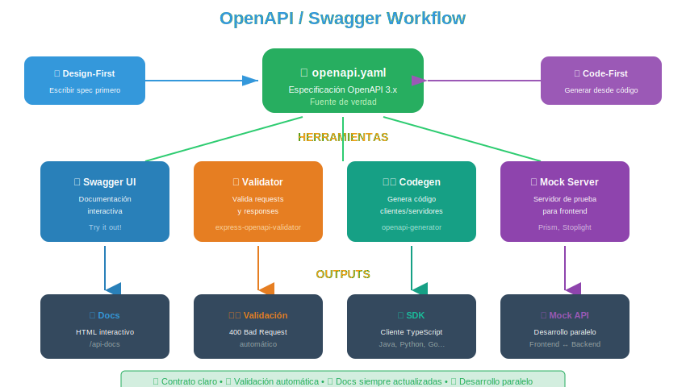

# 📄 Documentación de APIs con OpenAPI

## 🎯 ¿Qué es OpenAPI?

### Definición

**OpenAPI Specification (OAS)**, antes conocida como Swagger Specification, es un estándar para describir APIs RESTful de forma legible tanto para humanos como para máquinas.

> 💡 _"OpenAPI es el contrato que define tu API: qué endpoints existen, qué parámetros aceptan, qué respuestas retornan, y cómo autenticarse."_

### Historia

| Año  | Evento                                                 |
| ---- | ------------------------------------------------------ |
| 2011 | Swagger creado por Tony Tam                            |
| 2015 | SmartBear adquiere Swagger                             |
| 2016 | Swagger Spec → OpenAPI 3.0 (donado a Linux Foundation) |
| 2017 | OpenAPI 3.0.0 liberado                                 |
| 2021 | OpenAPI 3.1.0 (alineado con JSON Schema)               |
| 2026 | OpenAPI 3.1.x (versión actual)                         |

---

## 🎯 ¿Para qué Sirve OpenAPI?

### Casos de Uso

1. **Documentación interactiva**: Swagger UI, Redoc
2. **Generación de código**: Clientes en múltiples lenguajes
3. **Validación**: Verificar requests/responses contra el schema
4. **Testing**: Generar tests automáticos
5. **Mocking**: Crear servidores mock para desarrollo frontend

### Flujo de Trabajo



---

## 📝 Estructura de un Documento OpenAPI

### Estructura Básica

```yaml
# openapi.yaml
openapi: 3.1.0

info:
  title: Mi API
  version: 1.0.0
  description: Descripción de la API

servers:
  - url: https://api.example.com/v1
    description: Producción

paths:
  /users:
    get:
      # ...
    post:
      # ...

components:
  schemas:
    User:
      # ...
  securitySchemes:
    bearerAuth:
      # ...

security:
  - bearerAuth: []

tags:
  - name: Users
    description: Operaciones de usuarios
```

### Secciones Principales

| Sección      | Descripción                                |
| ------------ | ------------------------------------------ |
| `openapi`    | Versión de la especificación               |
| `info`       | Metadatos de la API                        |
| `servers`    | URLs base de la API                        |
| `paths`      | Endpoints disponibles                      |
| `components` | Schemas, security, responses reutilizables |
| `security`   | Esquemas de autenticación globales         |
| `tags`       | Agrupación de operaciones                  |

---

## 📋 Ejemplo Completo: API de Usuarios

```yaml
openapi: 3.1.0

info:
  title: User Management API
  description: |
    API RESTful para gestión de usuarios.

    ## Características
    - CRUD completo de usuarios
    - Autenticación JWT
    - Paginación de resultados
  version: 1.0.0
  contact:
    name: Soporte API
    email: api-support@example.com
    url: https://example.com/support
  license:
    name: MIT
    url: https://opensource.org/licenses/MIT

servers:
  - url: http://localhost:3000/api/v1
    description: Servidor de desarrollo
  - url: https://api.example.com/v1
    description: Servidor de producción

tags:
  - name: Users
    description: Gestión de usuarios
  - name: Auth
    description: Autenticación y autorización

paths:
  /users:
    get:
      tags:
        - Users
      summary: Listar usuarios
      description: Obtiene una lista paginada de usuarios
      operationId: getUsers
      parameters:
        - name: page
          in: query
          description: Número de página
          schema:
            type: integer
            minimum: 1
            default: 1
        - name: limit
          in: query
          description: Elementos por página
          schema:
            type: integer
            minimum: 1
            maximum: 100
            default: 10
        - name: search
          in: query
          description: Búsqueda por nombre o email
          schema:
            type: string
      responses:
        '200':
          description: Lista de usuarios
          content:
            application/json:
              schema:
                type: object
                properties:
                  success:
                    type: boolean
                    example: true
                  data:
                    type: array
                    items:
                      $ref: '#/components/schemas/User'
                  pagination:
                    $ref: '#/components/schemas/Pagination'
        '401':
          $ref: '#/components/responses/Unauthorized'
        '500':
          $ref: '#/components/responses/InternalError'

    post:
      tags:
        - Users
      summary: Crear usuario
      description: Crea un nuevo usuario en el sistema
      operationId: createUser
      requestBody:
        required: true
        content:
          application/json:
            schema:
              $ref: '#/components/schemas/CreateUserInput'
            examples:
              basic:
                summary: Usuario básico
                value:
                  name: 'Ana García'
                  email: 'ana@example.com'
              admin:
                summary: Usuario administrador
                value:
                  name: 'Admin User'
                  email: 'admin@example.com'
                  role: 'admin'
      responses:
        '201':
          description: Usuario creado exitosamente
          headers:
            Location:
              description: URL del nuevo recurso
              schema:
                type: string
                example: /api/v1/users/123
          content:
            application/json:
              schema:
                type: object
                properties:
                  success:
                    type: boolean
                    example: true
                  data:
                    $ref: '#/components/schemas/User'
        '400':
          $ref: '#/components/responses/BadRequest'
        '409':
          description: Email ya registrado
          content:
            application/json:
              schema:
                $ref: '#/components/schemas/Error'
              example:
                success: false
                error:
                  code: EMAIL_EXISTS
                  message: El email ya está registrado

  /users/{id}:
    parameters:
      - name: id
        in: path
        required: true
        description: ID único del usuario
        schema:
          type: string
          format: uuid
        example: '550e8400-e29b-41d4-a716-446655440000'

    get:
      tags:
        - Users
      summary: Obtener usuario
      description: Obtiene los detalles de un usuario específico
      operationId: getUserById
      responses:
        '200':
          description: Usuario encontrado
          content:
            application/json:
              schema:
                type: object
                properties:
                  success:
                    type: boolean
                  data:
                    $ref: '#/components/schemas/User'
        '404':
          $ref: '#/components/responses/NotFound'

    put:
      tags:
        - Users
      summary: Reemplazar usuario
      description: Reemplaza completamente los datos de un usuario
      operationId: replaceUser
      requestBody:
        required: true
        content:
          application/json:
            schema:
              $ref: '#/components/schemas/CreateUserInput'
      responses:
        '200':
          description: Usuario actualizado
          content:
            application/json:
              schema:
                type: object
                properties:
                  success:
                    type: boolean
                  data:
                    $ref: '#/components/schemas/User'
        '404':
          $ref: '#/components/responses/NotFound'

    patch:
      tags:
        - Users
      summary: Actualizar usuario parcialmente
      description: Actualiza solo los campos enviados
      operationId: updateUser
      requestBody:
        required: true
        content:
          application/json:
            schema:
              $ref: '#/components/schemas/UpdateUserInput'
      responses:
        '200':
          description: Usuario actualizado
          content:
            application/json:
              schema:
                type: object
                properties:
                  success:
                    type: boolean
                  data:
                    $ref: '#/components/schemas/User'
        '404':
          $ref: '#/components/responses/NotFound'

    delete:
      tags:
        - Users
      summary: Eliminar usuario
      description: Elimina un usuario del sistema
      operationId: deleteUser
      responses:
        '204':
          description: Usuario eliminado exitosamente
        '404':
          $ref: '#/components/responses/NotFound'

components:
  schemas:
    User:
      type: object
      description: Representación de un usuario
      required:
        - id
        - name
        - email
        - role
        - createdAt
      properties:
        id:
          type: string
          format: uuid
          description: Identificador único
          example: '550e8400-e29b-41d4-a716-446655440000'
        name:
          type: string
          description: Nombre completo
          minLength: 2
          maxLength: 100
          example: 'Ana García'
        email:
          type: string
          format: email
          description: Correo electrónico único
          example: 'ana@example.com'
        role:
          type: string
          enum:
            - user
            - admin
            - moderator
          default: user
          description: Rol del usuario
        avatar:
          type: string
          format: uri
          nullable: true
          description: URL del avatar
        createdAt:
          type: string
          format: date-time
          description: Fecha de creación
        updatedAt:
          type: string
          format: date-time
          description: Fecha de última actualización

    CreateUserInput:
      type: object
      description: Datos para crear un usuario
      required:
        - name
        - email
      properties:
        name:
          type: string
          minLength: 2
          maxLength: 100
          example: 'Ana García'
        email:
          type: string
          format: email
          example: 'ana@example.com'
        role:
          type: string
          enum:
            - user
            - admin
            - moderator
          default: user

    UpdateUserInput:
      type: object
      description: Datos para actualizar un usuario (todos opcionales)
      properties:
        name:
          type: string
          minLength: 2
          maxLength: 100
        email:
          type: string
          format: email
        role:
          type: string
          enum:
            - user
            - admin
            - moderator

    Pagination:
      type: object
      properties:
        page:
          type: integer
          example: 1
        limit:
          type: integer
          example: 10
        total:
          type: integer
          example: 100
        totalPages:
          type: integer
          example: 10
        hasNext:
          type: boolean
          example: true
        hasPrev:
          type: boolean
          example: false

    Error:
      type: object
      required:
        - success
        - error
      properties:
        success:
          type: boolean
          example: false
        error:
          type: object
          required:
            - code
            - message
          properties:
            code:
              type: string
              example: 'VALIDATION_ERROR'
            message:
              type: string
              example: 'El email es inválido'
            details:
              type: array
              items:
                type: object
                properties:
                  field:
                    type: string
                  message:
                    type: string

  responses:
    BadRequest:
      description: Datos de entrada inválidos
      content:
        application/json:
          schema:
            $ref: '#/components/schemas/Error'
          example:
            success: false
            error:
              code: VALIDATION_ERROR
              message: Datos inválidos
              details:
                - field: email
                  message: El email es requerido

    Unauthorized:
      description: No autenticado
      content:
        application/json:
          schema:
            $ref: '#/components/schemas/Error'
          example:
            success: false
            error:
              code: UNAUTHORIZED
              message: Token no proporcionado o inválido

    NotFound:
      description: Recurso no encontrado
      content:
        application/json:
          schema:
            $ref: '#/components/schemas/Error'
          example:
            success: false
            error:
              code: NOT_FOUND
              message: Usuario no encontrado

    InternalError:
      description: Error interno del servidor
      content:
        application/json:
          schema:
            $ref: '#/components/schemas/Error'
          example:
            success: false
            error:
              code: INTERNAL_ERROR
              message: Error interno del servidor

  securitySchemes:
    bearerAuth:
      type: http
      scheme: bearer
      bearerFormat: JWT
      description: Token JWT en header Authorization

    apiKey:
      type: apiKey
      in: header
      name: X-API-Key
      description: API Key para acceso programático

security:
  - bearerAuth: []
```

---

## 🛠️ Swagger UI con Express

### Instalación

```bash
pnpm add swagger-ui-express yamljs
```

### Configuración

```javascript
// src/app.js
import express from 'express';
import swaggerUi from 'swagger-ui-express';
import YAML from 'yamljs';
import path from 'path';
import { fileURLToPath } from 'url';

const __filename = fileURLToPath(import.meta.url);
const __dirname = path.dirname(__filename);

const app = express();

// Cargar especificación OpenAPI
const swaggerDocument = YAML.load(path.join(__dirname, '../docs/openapi.yaml'));

// Opciones de Swagger UI
const swaggerOptions = {
  explorer: true,
  customCss: '.swagger-ui .topbar { display: none }',
  customSiteTitle: 'Mi API - Documentación',
};

// Montar Swagger UI
app.use(
  '/api-docs',
  swaggerUi.serve,
  swaggerUi.setup(swaggerDocument, swaggerOptions),
);

// También servir el archivo YAML crudo
app.get('/api-docs/openapi.yaml', (req, res) => {
  res.sendFile(path.join(__dirname, '../docs/openapi.yaml'));
});

export default app;
```

### Resultado

```
┌─────────────────────────────────────────────────────────────┐
│  http://localhost:3000/api-docs                             │
├─────────────────────────────────────────────────────────────┤
│                                                             │
│  ┌─────────────────────────────────────────────────────┐   │
│  │  User Management API  v1.0.0                        │   │
│  │  API RESTful para gestión de usuarios               │   │
│  └─────────────────────────────────────────────────────┘   │
│                                                             │
│  [Users]                                                    │
│    GET    /users      Listar usuarios          [Try it]    │
│    POST   /users      Crear usuario            [Try it]    │
│    GET    /users/{id} Obtener usuario          [Try it]    │
│    PUT    /users/{id} Reemplazar usuario       [Try it]    │
│    PATCH  /users/{id} Actualizar parcialmente  [Try it]    │
│    DELETE /users/{id} Eliminar usuario         [Try it]    │
│                                                             │
│  [Schemas]                                                  │
│    User, CreateUserInput, UpdateUserInput, Error, ...      │
│                                                             │
└─────────────────────────────────────────────────────────────┘
```

---

## 🔄 Code-First vs Design-First

### Design-First (Recomendado)

Escribes la especificación OpenAPI primero, luego implementas.

```
1. Diseñar API en openapi.yaml
2. Validar con stakeholders
3. Generar código skeleton
4. Implementar lógica
5. Validar requests contra spec
```

**Ventajas:**

- API consistente desde el inicio
- Documentación siempre actualizada
- Frontend puede mockear mientras backend desarrolla

### Code-First

Escribes el código primero, generas la especificación.

```javascript
// Con swagger-jsdoc
import swaggerJsdoc from 'swagger-jsdoc';

const options = {
  definition: {
    openapi: '3.1.0',
    info: {
      title: 'Mi API',
      version: '1.0.0',
    },
  },
  apis: ['./src/routes/*.js'], // Archivos con anotaciones
};

const swaggerSpec = swaggerJsdoc(options);
```

```javascript
// src/routes/users.js

/**
 * @openapi
 * /users:
 *   get:
 *     tags: [Users]
 *     summary: Listar usuarios
 *     responses:
 *       200:
 *         description: Lista de usuarios
 */
router.get('/users', async (req, res) => {
  // ...
});

/**
 * @openapi
 * /users:
 *   post:
 *     tags: [Users]
 *     summary: Crear usuario
 *     requestBody:
 *       required: true
 *       content:
 *         application/json:
 *           schema:
 *             $ref: '#/components/schemas/CreateUserInput'
 */
router.post('/users', async (req, res) => {
  // ...
});
```

---

## ✅ Validación de Requests

```javascript
// Validar requests contra OpenAPI spec
import { OpenApiValidator } from 'express-openapi-validator';

app.use(
  OpenApiValidator.middleware({
    apiSpec: './docs/openapi.yaml',
    validateRequests: true,
    validateResponses: true, // En desarrollo
  }),
);

// Manejo de errores de validación
app.use((err, req, res, next) => {
  if (err.status === 400) {
    return res.status(400).json({
      success: false,
      error: {
        code: 'VALIDATION_ERROR',
        message: err.message,
        details: err.errors,
      },
    });
  }
  next(err);
});
```

---

## 🧰 Herramientas Útiles

### Editor Online

- **Swagger Editor**: https://editor.swagger.io/
- Validación en tiempo real
- Preview de documentación
- Generación de código

### Generadores de Código

```bash
# Generar cliente JavaScript
npx @openapitools/openapi-generator-cli generate \
  -i openapi.yaml \
  -g javascript \
  -o ./generated-client

# Generar servidor Node.js
npx @openapitools/openapi-generator-cli generate \
  -i openapi.yaml \
  -g nodejs-express-server \
  -o ./generated-server
```

### Alternativas a Swagger UI

- **Redoc**: Más limpio, mejor para documentación pública
- **Stoplight Elements**: Moderno, customizable
- **RapiDoc**: Customizable, temas

```javascript
// Usando Redoc
import redoc from 'redoc-express';

app.get(
  '/docs',
  redoc({
    title: 'Mi API',
    specUrl: '/api-docs/openapi.yaml',
  }),
);
```

---

## 💥 ¿Qué Impacto Tiene?

### ✅ Si documentas con OpenAPI:

| Beneficio                | Descripción                             |
| ------------------------ | --------------------------------------- |
| **Onboarding rápido**    | Nuevos devs entienden la API en minutos |
| **Testing automatizado** | Validación contra spec                  |
| **Contratos claros**     | Frontend y backend acordados            |
| **Generación de código** | Clientes automáticos                    |

### ❌ Si NO documentas:

| Problema                      | Consecuencia                  |
| ----------------------------- | ----------------------------- |
| **"¿Qué parámetros acepta?"** | Pérdida de tiempo preguntando |
| **Inconsistencias**           | Cada endpoint diferente       |
| **Bugs de integración**       | Frontend asume mal            |
| **Onboarding lento**          | Semanas para entender la API  |

---

## 📊 Diagrama de Referencia


---

## 📚 Referencias

- OpenAPI Specification: https://spec.openapis.org/oas/latest.html
- Swagger: https://swagger.io/
- OpenAPI Generator: https://openapi-generator.tech/
- Redoc: https://redocly.com/redoc/

---

[⬅️ Anterior: GraphQL vs REST](04-graphql-vs-rest.md) | [➡️ Volver al README](../README.md)
