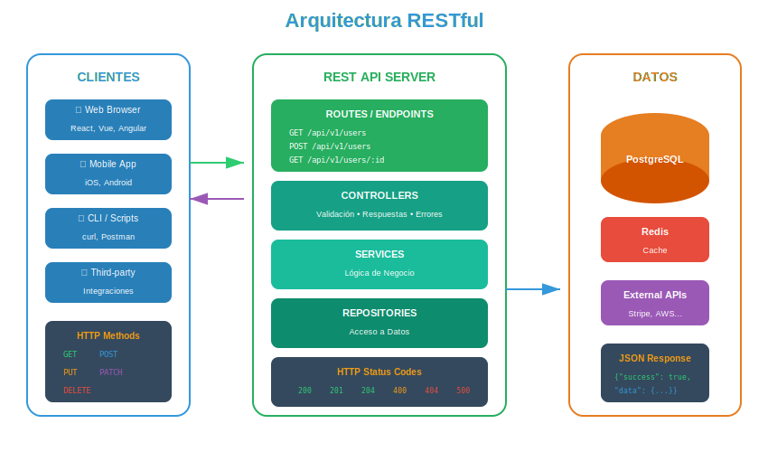

# 🌐 APIs RESTful: Diseño y Mejores Prácticas

## 🎯 ¿Qué es REST?

### Definición

**REST** (Representational State Transfer) es un estilo arquitectónico para diseñar APIs que utilizan HTTP como protocolo de comunicación. Fue definido por Roy Fielding en su tesis doctoral (2000).

> 💡 _"REST no es un estándar ni un protocolo, es un conjunto de principios y restricciones que, si se siguen, producen APIs predecibles, escalables y mantenibles."_

### Los 6 Principios REST



| Principio               | Descripción                                              | Impacto                 |
| ----------------------- | -------------------------------------------------------- | ----------------------- |
| **Cliente-Servidor**    | Separación de UI y datos                                 | Evolución independiente |
| **Sin Estado**          | Cada request contiene toda la información                | Escalabilidad           |
| **Cacheable**           | Respuestas pueden cachearse                              | Performance             |
| **Interfaz Uniforme**   | Recursos identificados, manipulados vía representaciones | Simplicidad             |
| **Sistema en Capas**    | Cliente no sabe si habla con servidor final              | Flexibilidad            |
| **Código bajo demanda** | (Opcional) Servidor envía código ejecutable              | Extensibilidad          |

---

## 🎯 ¿Para qué sirve REST?

### Casos de Uso

1. **APIs públicas**: Twitter, GitHub, Stripe
2. **Backends para aplicaciones**: Mobile apps, SPAs
3. **Integración entre sistemas**: Microservicios, terceros
4. **CRUD de recursos**: Usuarios, productos, pedidos

### Ejemplo del Mundo Real: E-Commerce API

| Recurso  | Endpoints                  | Métodos          |
| -------- | -------------------------- | ---------------- |
| Products | `/api/v1/products`         | GET, POST        |
|          | `/api/v1/products/:id`     | GET, PUT, DELETE |
| Users    | `/api/v1/users`            | GET, POST        |
|          | `/api/v1/users/:id`        | GET, PUT, DELETE |
| Orders   | `/api/v1/orders`           | GET, POST        |
|          | `/api/v1/orders/:id`       | GET, PUT, DELETE |
|          | `/api/v1/orders/:id/items` | GET, POST        |

---

## 🏗️ Diseño de Recursos y Endpoints

### Recursos vs Acciones

REST se centra en **recursos** (sustantivos), no en **acciones** (verbos).

```javascript
// ❌ MAL - Orientado a acciones
app.get('/getUsers', ...);
app.post('/createUser', ...);
app.post('/deleteUser', ...);
app.get('/getUserOrders', ...);

// ✅ BIEN - Orientado a recursos
app.get('/users', ...);        // Listar usuarios
app.post('/users', ...);       // Crear usuario
app.delete('/users/:id', ...); // Eliminar usuario
app.get('/users/:id/orders', ...); // Órdenes del usuario
```

### Nomenclatura de URLs

| Regla                   | Ejemplo Correcto | Ejemplo Incorrecto |
| ----------------------- | ---------------- | ------------------ |
| Plural para colecciones | `/users`         | `/user`            |
| Kebab-case              | `/user-profiles` | `/userProfiles`    |
| Minúsculas              | `/products`      | `/Products`        |
| Sin extensiones         | `/users/1`       | `/users/1.json`    |
| Sin verbos              | `/orders`        | `/getOrders`       |
| Jerarquía lógica        | `/users/1/posts` | `/posts?userId=1`  |

### Relaciones entre Recursos

```javascript
// Recursos anidados (relación padre-hijo)
GET /users/:userId/orders          // Órdenes de un usuario
GET /orders/:orderId/items         // Items de una orden
POST /projects/:projectId/tasks    // Crear tarea en proyecto

// Recursos relacionados (consulta)
GET /orders?userId=123             // Filtrar órdenes por usuario
GET /products?category=electronics // Filtrar productos
```

---

## 📡 Métodos HTTP (Verbos)

### CRUD Mapping

| Método     | CRUD              | Idempotente | Seguro | Uso                |
| ---------- | ----------------- | ----------- | ------ | ------------------ |
| **GET**    | Read              | ✅ Sí       | ✅ Sí  | Obtener recursos   |
| **POST**   | Create            | ❌ No       | ❌ No  | Crear recursos     |
| **PUT**    | Update (completo) | ✅ Sí       | ❌ No  | Reemplazar recurso |
| **PATCH**  | Update (parcial)  | ❌ No\*     | ❌ No  | Modificar campos   |
| **DELETE** | Delete            | ✅ Sí       | ❌ No  | Eliminar recursos  |

> \*PATCH puede ser idempotente si se implementa correctamente

### Implementación en Express.js

```javascript
import express from 'express';

const router = express.Router();

// GET /api/users - Listar todos
router.get('/users', async (req, res) => {
  const users = await userService.findAll();
  res.json({ success: true, data: users });
});

// GET /api/users/:id - Obtener uno
router.get('/users/:id', async (req, res) => {
  const user = await userService.findById(req.params.id);

  if (!user) {
    return res.status(404).json({
      success: false,
      error: { message: 'Usuario no encontrado', code: 'USER_NOT_FOUND' },
    });
  }

  res.json({ success: true, data: user });
});

// POST /api/users - Crear
router.post('/users', async (req, res) => {
  const { name, email } = req.body;

  // Validación
  if (!name || !email) {
    return res.status(400).json({
      success: false,
      error: {
        message: 'Nombre y email son requeridos',
        code: 'VALIDATION_ERROR',
      },
    });
  }

  const newUser = await userService.create({ name, email });

  // 201 Created + Location header
  res
    .status(201)
    .location(`/api/users/${newUser.id}`)
    .json({ success: true, data: newUser });
});

// PUT /api/users/:id - Reemplazar completamente
router.put('/users/:id', async (req, res) => {
  const { name, email, role } = req.body;

  // PUT requiere enviar TODOS los campos
  if (!name || !email) {
    return res.status(400).json({
      success: false,
      error: {
        message: 'PUT requiere todos los campos',
        code: 'INCOMPLETE_DATA',
      },
    });
  }

  const updatedUser = await userService.replace(req.params.id, {
    name,
    email,
    role,
  });

  if (!updatedUser) {
    return res.status(404).json({
      success: false,
      error: { message: 'Usuario no encontrado', code: 'USER_NOT_FOUND' },
    });
  }

  res.json({ success: true, data: updatedUser });
});

// PATCH /api/users/:id - Actualizar parcialmente
router.patch('/users/:id', async (req, res) => {
  // PATCH solo actualiza campos enviados
  const updates = req.body;

  const updatedUser = await userService.update(req.params.id, updates);

  if (!updatedUser) {
    return res.status(404).json({
      success: false,
      error: { message: 'Usuario no encontrado', code: 'USER_NOT_FOUND' },
    });
  }

  res.json({ success: true, data: updatedUser });
});

// DELETE /api/users/:id - Eliminar
router.delete('/users/:id', async (req, res) => {
  const deleted = await userService.delete(req.params.id);

  if (!deleted) {
    return res.status(404).json({
      success: false,
      error: { message: 'Usuario no encontrado', code: 'USER_NOT_FOUND' },
    });
  }

  // 204 No Content (sin body)
  res.status(204).send();
});

export default router;
```

---

## 📊 Códigos de Estado HTTP

### Categorías

| Rango   | Categoría          | Descripción                     |
| ------- | ------------------ | ------------------------------- |
| **1xx** | Informacional      | Request recibido, procesando    |
| **2xx** | Éxito              | Request procesado correctamente |
| **3xx** | Redirección        | Acción adicional necesaria      |
| **4xx** | Error del cliente  | Error en el request             |
| **5xx** | Error del servidor | Error procesando request válido |

### Códigos Más Usados en APIs

```javascript
// 2xx - Éxito
const SUCCESS_CODES = {
  200: 'OK - Request exitoso (GET, PUT, PATCH)',
  201: 'Created - Recurso creado (POST)',
  204: 'No Content - Sin contenido (DELETE)',
  202: 'Accepted - Procesamiento asíncrono aceptado',
};

// 4xx - Errores del cliente
const CLIENT_ERROR_CODES = {
  400: 'Bad Request - Datos inválidos',
  401: 'Unauthorized - Sin autenticación',
  403: 'Forbidden - Sin autorización',
  404: 'Not Found - Recurso no existe',
  405: 'Method Not Allowed - Verbo no permitido',
  409: 'Conflict - Conflicto (ej: email duplicado)',
  422: 'Unprocessable Entity - Validación fallida',
  429: 'Too Many Requests - Rate limit excedido',
};

// 5xx - Errores del servidor
const SERVER_ERROR_CODES = {
  500: 'Internal Server Error - Error genérico',
  502: 'Bad Gateway - Error en servicio upstream',
  503: 'Service Unavailable - Mantenimiento/sobrecarga',
  504: 'Gateway Timeout - Timeout en servicio upstream',
};
```

### Uso Correcto de Códigos

```javascript
// Helper para respuestas consistentes
const httpResponse = {
  // Éxito
  ok: (res, data) => res.status(200).json({ success: true, data }),
  created: (res, data, location) => {
    res.status(201);
    if (location) res.location(location);
    return res.json({ success: true, data });
  },
  noContent: (res) => res.status(204).send(),

  // Errores del cliente
  badRequest: (res, message, code = 'BAD_REQUEST') =>
    res.status(400).json({ success: false, error: { message, code } }),

  unauthorized: (res, message = 'No autenticado') =>
    res
      .status(401)
      .json({ success: false, error: { message, code: 'UNAUTHORIZED' } }),

  forbidden: (res, message = 'No autorizado') =>
    res
      .status(403)
      .json({ success: false, error: { message, code: 'FORBIDDEN' } }),

  notFound: (res, resource = 'Recurso') =>
    res
      .status(404)
      .json({
        success: false,
        error: { message: `${resource} no encontrado`, code: 'NOT_FOUND' },
      }),

  conflict: (res, message) =>
    res
      .status(409)
      .json({ success: false, error: { message, code: 'CONFLICT' } }),

  // Error del servidor
  serverError: (res, error) => {
    console.error('Server Error:', error);
    res
      .status(500)
      .json({
        success: false,
        error: {
          message: 'Error interno del servidor',
          code: 'INTERNAL_ERROR',
        },
      });
  },
};

// Uso
router.post('/users', async (req, res) => {
  try {
    const { email } = req.body;

    // Validación
    if (!email) {
      return httpResponse.badRequest(
        res,
        'Email es requerido',
        'MISSING_EMAIL',
      );
    }

    // Verificar duplicado
    const existing = await userService.findByEmail(email);
    if (existing) {
      return httpResponse.conflict(res, 'El email ya está registrado');
    }

    // Crear
    const user = await userService.create(req.body);
    return httpResponse.created(res, user, `/api/users/${user.id}`);
  } catch (error) {
    return httpResponse.serverError(res, error);
  }
});
```

---

## 📄 Paginación, Filtrado y Ordenamiento

### Paginación

```javascript
// Query params para paginación
// GET /api/users?page=2&limit=20

router.get('/users', async (req, res) => {
  const page = parseInt(req.query.page) || 1;
  const limit = Math.min(parseInt(req.query.limit) || 10, 100); // Max 100
  const offset = (page - 1) * limit;

  const { data, total } = await userService.findPaginated({ offset, limit });

  const totalPages = Math.ceil(total / limit);

  res.json({
    success: true,
    data,
    pagination: {
      page,
      limit,
      total,
      totalPages,
      hasNext: page < totalPages,
      hasPrev: page > 1,
    },
  });
});
```

### Filtrado

```javascript
// Query params para filtros
// GET /api/products?category=electronics&minPrice=100&maxPrice=500&inStock=true

router.get('/products', async (req, res) => {
  const filters = {
    category: req.query.category,
    minPrice: req.query.minPrice ? parseFloat(req.query.minPrice) : undefined,
    maxPrice: req.query.maxPrice ? parseFloat(req.query.maxPrice) : undefined,
    inStock: req.query.inStock === 'true',
  };

  // Eliminar filtros undefined
  const activeFilters = Object.fromEntries(
    Object.entries(filters).filter(([_, v]) => v !== undefined),
  );

  const products = await productService.findWithFilters(activeFilters);

  res.json({ success: true, data: products, filters: activeFilters });
});
```

### Ordenamiento

```javascript
// Query params para ordenamiento
// GET /api/products?sort=price&order=desc

router.get('/products', async (req, res) => {
  const allowedSortFields = ['name', 'price', 'createdAt'];

  let sort = req.query.sort || 'createdAt';
  const order = req.query.order === 'desc' ? 'desc' : 'asc';

  // Validar campo de ordenamiento
  if (!allowedSortFields.includes(sort)) {
    sort = 'createdAt';
  }

  const products = await productService.findAll({ sort, order });

  res.json({ success: true, data: products });
});
```

---

## 🔢 Versionado de APIs

### Estrategias de Versionado

```javascript
// 1. En la URL (más común)
// /api/v1/users
// /api/v2/users

app.use('/api/v1', v1Router);
app.use('/api/v2', v2Router);

// 2. En el header (más RESTful)
// Accept: application/vnd.myapp.v1+json

app.use('/api/users', (req, res, next) => {
  const version =
    req.headers['accept']?.match(/vnd\.myapp\.v(\d+)/)?.[1] || '1';
  req.apiVersion = version;
  next();
});

// 3. En query param (menos recomendado)
// /api/users?version=2
```

### Implementación con URL

```javascript
// routes/v1/users.js
const v1Router = express.Router();

v1Router.get('/users', (req, res) => {
  // V1: respuesta simple
  res.json(users);
});

// routes/v2/users.js
const v2Router = express.Router();

v2Router.get('/users', (req, res) => {
  // V2: respuesta con envelope y metadata
  res.json({
    success: true,
    data: users,
    meta: {
      version: 'v2',
      timestamp: new Date().toISOString(),
    },
  });
});
```

---

## 📈 Modelo de Madurez de Richardson

Leonard Richardson propuso 4 niveles de madurez para APIs REST:

```
┌─────────────────────────────────────────────────────────────┐
│            RICHARDSON MATURITY MODEL                        │
├─────────────────────────────────────────────────────────────┤
│                                                             │
│  Nivel 3: HATEOAS                          🏆 Glory of REST │
│  ├── Hypermedia controls                                    │
│  ├── Navegación descubrible                                 │
│  └── Auto-documentada                                       │
│                                                             │
│  Nivel 2: Verbos HTTP                                       │
│  ├── GET, POST, PUT, DELETE                                 │
│  ├── Códigos de estado correctos                            │
│  └── Recursos identificados                                 │
│                                                             │
│  Nivel 1: Recursos                                          │
│  ├── URLs como recursos                                     │
│  └── Múltiples endpoints                                    │
│                                                             │
│  Nivel 0: POX (Plain Old XML/JSON)         💀 The Swamp     │
│  ├── Un solo endpoint                                       │
│  └── POST para todo                                         │
│                                                             │
└─────────────────────────────────────────────────────────────┘
```

### Nivel 0: The Swamp of POX

```javascript
// ❌ Nivel 0 - Todo por POST a un endpoint
app.post('/api', (req, res) => {
  const { action, data } = req.body;

  switch (action) {
    case 'GET_USERS':
      return res.json(users);
    case 'CREATE_USER':
      return res.json(createUser(data));
    case 'DELETE_USER':
      return res.json(deleteUser(data.id));
  }
});
```

### Nivel 1: Recursos

```javascript
// 🔶 Nivel 1 - Recursos pero sin verbos HTTP correctos
app.post('/api/users/getAll', ...);
app.post('/api/users/create', ...);
app.post('/api/users/delete', ...);
```

### Nivel 2: Verbos HTTP

```javascript
// ✅ Nivel 2 - Recursos + Verbos + Códigos de estado
app.get('/api/users', ...);      // 200
app.post('/api/users', ...);     // 201
app.delete('/api/users/:id', ...); // 204
```

### Nivel 3: HATEOAS

```javascript
// 🏆 Nivel 3 - Hypermedia As The Engine Of Application State
app.get('/api/users/:id', (req, res) => {
  const user = findUser(req.params.id);

  res.json({
    data: user,
    _links: {
      self: { href: `/api/users/${user.id}` },
      orders: { href: `/api/users/${user.id}/orders` },
      update: { href: `/api/users/${user.id}`, method: 'PUT' },
      delete: { href: `/api/users/${user.id}`, method: 'DELETE' },
    },
  });
});

app.get('/api/users', (req, res) => {
  const users = findAllUsers();

  res.json({
    data: users.map((user) => ({
      ...user,
      _links: {
        self: { href: `/api/users/${user.id}` },
      },
    })),
    _links: {
      self: { href: '/api/users' },
      create: { href: '/api/users', method: 'POST' },
    },
  });
});
```

---

## 💥 ¿Qué Impacto Tiene?

### ✅ Si sigues REST correctamente:

| Beneficio          | Descripción                             |
| ------------------ | --------------------------------------- |
| **Predecibilidad** | Desarrolladores saben qué esperar       |
| **Cacheabilidad**  | GET requests pueden cachearse           |
| **Escalabilidad**  | Sin estado permite múltiples servidores |
| **Documentación**  | OpenAPI/Swagger documenta fácilmente    |

### ❌ Si no sigues REST:

| Problema                | Consecuencia                         |
| ----------------------- | ------------------------------------ |
| **APIs inconsistentes** | Cada endpoint es diferente           |
| **Difícil de cachear**  | POST no se cachea                    |
| **Confusión**           | Desarrolladores no saben qué esperar |

---

## 📊 Diagrama de Referencia


---

## 📚 Referencias

- Fielding, R. T. (2000). _Architectural Styles and the Design of Network-based Software Architectures_
- Richardson, L. & Ruby, S. (2007). _RESTful Web Services_
- Richardson Maturity Model: https://martinfowler.com/articles/richardsonMaturityModel.html

---

[⬅️ Anterior: Comunicación Síncrona vs Asíncrona](02-comunicacion-sincrona-asincrona.md) | [➡️ Siguiente: GraphQL vs REST](04-graphql-vs-rest.md)
