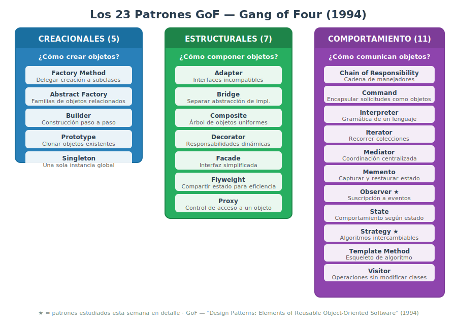
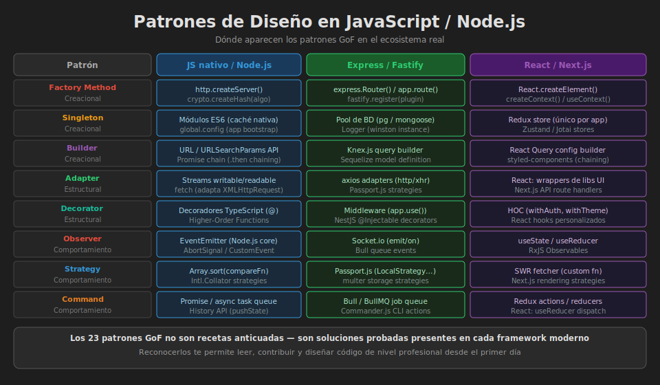

# 📖 01 — Introducción a los Patrones de Diseño

> _"Cada patrón describe un problema que ocurre repetidamente en nuestro entorno, y luego describe el núcleo de la solución a ese problema, de tal manera que puedes usar esta solución un millón de veces sin hacerlo de la misma manera dos veces."_
>
> — Christopher Alexander (arquitecto, padre de los patrones)

---

## 🎯 ¿Qué es un Patrón de Diseño?

### ¿Qué es?

Un **patrón de diseño** es una solución reutilizable, probada y documentada a un problema recurrente en el diseño de software. No es código que puedas copiar y pegar: es una **plantilla conceptual** que describes y adaptas a tu situación concreta.

Los patrones más famosos fueron documentados por Erich Gamma, Richard Helm, Ralph Johnson y John Vlissides en el libro **"Design Patterns: Elements of Reusable Object-Oriented Software"** (1994). A estos cuatro autores se les conoce como el **Gang of Four (GoF)**, y su libro es una de las obras más influyentes en la historia del software.

```
Patrón ≠ Librería   (no es código que instalas)
Patrón ≠ Algoritmo  (no describe pasos de cómputo)
Patrón  = Solución abstracta a un problema de diseño recurrente
```

### ¿Para qué sirve?

- **Vocabulario compartido**: cuando dices "usé un Observer aquí", cualquier desarrollador del mundo entiende la estructura y el propósito sin leer el código.
- **Soluciones probadas**: evitas reinventar la rueda con enfoques que la industria ya validó durante décadas.
- **Código más mantenible**: un código bien estructurado con patrones es más fácil de extender, modificar y testear.
- **Comunicación en equipos**: en code reviews, arquitecturas y documentación técnica, los patrones son el lenguaje común.

### ¿Qué impacto tiene?

**Si los aplicas correctamente:**

- ✅ Tus colegas entienden tu código más rápido
- ✅ Agregar funcionalidad nueva no rompe lo existente
- ✅ Los bugs son más fáciles de localizar e aislar
- ✅ Tu código tiene un nivel profesional reconocible

**Si no los conoces:**

- ❌ Reinventas soluciones que ya existen (y usualmente peor)
- ❌ Tu código crece en complejidad accidental
- ❌ Los cambios tienen efectos en cascada impredecibles
- ❌ Pierdes comunicación técnica con tu equipo

---

## 📦 Las Tres Categorías del GoF



El Gang of Four organizó los 23 patrones en tres categorías según **su propósito principal**:

```
┌─────────────────────────────────────────────────────────────────┐
│                    23 PATRONES GoF                              │
├─────────────────┬──────────────────┬───────────────────────────┤
│  CREACIONALES   │   ESTRUCTURALES  │     COMPORTAMIENTO        │
│  (5 patrones)   │   (7 patrones)   │     (11 patrones)         │
├─────────────────┼──────────────────┼───────────────────────────┤
│ Abstract Factory│ Adapter          │ Chain of Responsibility   │
│ Builder         │ Bridge           │ Command                   │
│ Factory Method  │ Composite        │ Interpreter               │
│ Prototype       │ Decorator        │ Iterator                  │
│ Singleton       │ Facade           │ Mediator                  │
│                 │ Flyweight        │ Memento                   │
│                 │ Proxy            │ Observer                  │
│                 │                  │ State                     │
│                 │                  │ Strategy                  │
│                 │                  │ Template Method           │
│                 │                  │ Visitor                   │
├─────────────────┼──────────────────┼───────────────────────────┤
│ ¿CÓMO crear     │ ¿CÓMO componer   │ ¿CÓMO comunican           │
│ objetos?        │ objetos?         │ los objetos?              │
└─────────────────┴──────────────────┴───────────────────────────┘
```

### 🏗️ Creacionales

Se ocupan de **cómo se crean los objetos**. Desacoplan el código del consumidor de la lógica de construcción.

- → "No me importa cómo se crea el objeto, solo que exista y funcione"

### 🧩 Estructurales

Se ocupan de **cómo se componen los objetos** para formar estructuras más grandes.

- → "Tengo objetos con interfaces incompatibles o quiero agregar comportamiento sin modificar clases"

### 🔄 De Comportamiento

Se ocupan de **cómo se comunican y colaboran** los objetos entre sí.

- → "Quiero delegar responsabilidades de forma flexible sin acoplamiento fuerte"

---

## 🌍 Patrones en el Mundo Real (JavaScript)



Los patrones están **en todas partes** en el ecosistema que ya usas:

| Patrón        | Dónde lo ves hoy                                                                          |
| ------------- | ----------------------------------------------------------------------------------------- |
| **Observer**  | `EventEmitter` en Node.js, `addEventListener` en el navegador, `useState` en React        |
| **Singleton** | Pool de conexiones a BD, módulos de configuración (ES modules son singletons por default) |
| **Factory**   | `document.createElement()`, `React.createElement()`                                       |
| **Decorator** | Middleware en Express.js, `@Injectable()` en NestJS                                       |
| **Strategy**  | Passport.js (estrategias de autenticación: local, Google, JWT)                            |
| **Adapter**   | Drivers de bases de datos (Mongoose, Sequelize, Prisma)                                   |
| **Facade**    | SDK de AWS, cliente de Stripe, librerías de terceros                                      |
| **Builder**   | Query builders (Knex.js, TypeORM QueryBuilder)                                            |
| **Command**   | Redux (acciones), sistema de undo/redo, colas de trabajo                                  |
| **Iterator**  | `for...of`, generadores (`function*`), `Symbol.iterator`                                  |

---

## ⚠️ Cuándo NO usar patrones

Esta es una lección que muchos aprenden dolorosa y tarde: **los patrones tienen un costo**.

```
Complejidad innecesaria = Anti-patrón por sí mismo
```

Un patrón agrega:

- Más clases / archivos
- Más abstracciones que aprender
- Más indirección que seguir al debuggear

**Usa un patrón cuando:**

- ✅ Ya tienes el problema que el patrón resuelve (no el potencial problema futuro)
- ✅ El código sin el patrón ya es difícil de mantener
- ✅ El equipo conoce el patrón (o está dispuesto a aprenderlo)

**No uses un patrón cuando:**

- ❌ "Lo pongo por si acaso en el futuro lo necesito"
- ❌ El sistema es simple y el patrón lo complica innecesariamente
- ❌ Solo quieres parecer que escribes código "avanzado"

> 💡 **Mantra del ingeniero maduro**: "Make it work, make it right, make it fast" — Kent Beck. Primero funciona, luego lo estructuras bien.

---

## 🔗 Relación con los Principios SOLID

Los patrones de diseño son **implementaciones concretas de los principios SOLID**:

| Principio SOLID               | Patrones que lo refuerzan                              |
| ----------------------------- | ------------------------------------------------------ |
| **S** - Single Responsibility | Command, Strategy, Observer                            |
| **O** - Open/Closed           | Strategy, Decorator, Factory Method                    |
| **L** - Liskov Substitution   | Template Method, Strategy                              |
| **I** - Interface Segregation | Adapter, Facade                                        |
| **D** - Dependency Inversion  | Factory Method, Abstract Factory, Dependency Injection |

---

## 📊 Anatomía de un Patrón (Cómo leerlos)

Cada patrón en el libro del GoF tiene la misma estructura. Aprenderla te ayuda a estudiarlos sistemáticamente:

| Sección                   | Contenido                              |
| ------------------------- | -------------------------------------- |
| **Nombre**                | Identificador único del patrón         |
| **Intención**             | ¿Qué problema resuelve en una oración? |
| **También conocido como** | Nombres alternativos                   |
| **Motivación**            | Escenario concreto que lo justifica    |
| **Aplicabilidad**         | ¿Cuándo usarlo?                        |
| **Estructura**            | Diagrama de clases UML                 |
| **Participantes**         | Roles en el patrón                     |
| **Colaboraciones**        | Cómo interactúan los participantes     |
| **Consecuencias**         | Trade-offs: qué ganas y qué pierdes    |
| **Implementación**        | Código de ejemplo                      |

---

## 🎬 Patrones vs Arquitectura

Es importante distinguir:

```
NIVEL ARQUITECTÓNICO         NIVEL DE DISEÑO
(Semana 03 y 06)             (Esta semana)
─────────────────────────    ──────────────────────────
• Capas (Layered)            • Factory, Builder
• MVC / MVVM                 • Observer, Strategy
• Microservicios             • Adapter, Facade
• Clean Architecture
─────────────────────────    ──────────────────────────
Cómo organizar               Cómo resolver problemas
sistemas enteros             dentro de componentes
```

Los patrones arquitectónicos organizan el **sistema completo**. Los patrones de diseño resuelven **problemas dentro de componentes o módulos**.

---

## 📚 Recursos para Profundizar

- 📘 **Design Patterns: Elements of Reusable Object-Oriented Software** — Gang of Four (1994)
- 📘 **Head First Design Patterns** — Freeman & Robson (más accesible para comenzar)
- 🌐 [refactoring.guru/design-patterns](https://refactoring.guru/design-patterns) — Guía visual excelente
- 🌐 [patterns.dev](https://www.patterns.dev) — Patrones modernos en JavaScript

---

_Siguiente: [02 — Patrones Creacionales →](02-patrones-creacionales.md)_

_Bootcamp de Arquitectura de Software · SENA · bc-channel-epti_
