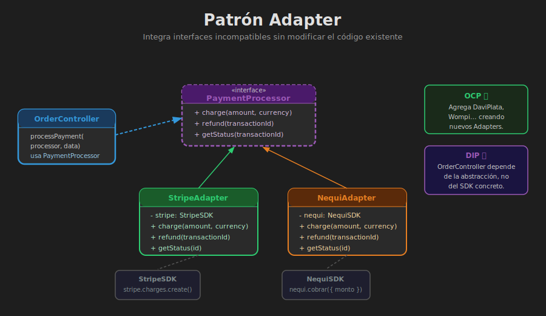
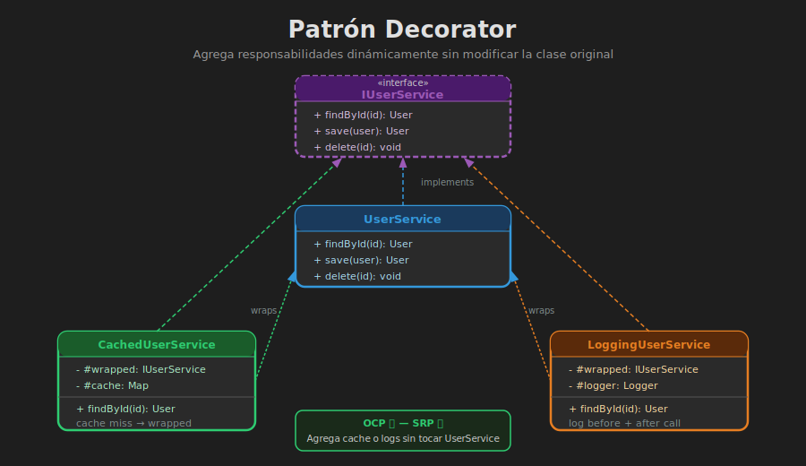
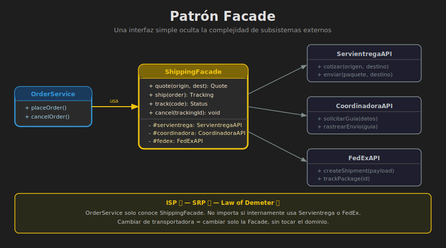

# 📖 03 — Patrones Estructurales

> _Los patrones estructurales se ocupan de cómo componer clases y objetos para formar estructuras más grandes._
>
> — Gang of Four

---

## 🎯 ¿Qué son los Patrones Estructurales?

### ¿Qué son?

Los patrones estructurales describen **cómo combinar clases y objetos** para construir estructuras más complejas. Se centran en la **composición**: cómo las partes se ensamblan para crear el todo, manteniendo flexibilidad y eficiencia.

### ¿Para qué sirven?

- Permiten que clases con interfaces **incompatibles** trabajen juntas
- Agregan funcionalidades a objetos **sin modificar sus clases** (principio abierto/cerrado)
- Simplifican la interfaz de subsistemas **complejos**
- Permiten tratar objetos individuales y colecciones de forma **uniforme**

### ¿Qué impacto tiene?

**Si los aplicas:**

- ✅ Integras sistemas heredados o APIs de terceros sin tocar su código
- ✅ Extiendes objetos en tiempo de ejecución sin herencia
- ✅ Reduces la complejidad que el cliente debe manejar

**Si no los aplicas:**

- ❌ Modificas clases existentes para adaptarlas (violación de OCP)
- ❌ La herencia se convierte en un árbol inmanejable de subclases
- ❌ El cliente está acoplado a la complejidad interna de los subsistemas

---

## 🔌 Adapter

### ¿Qué es?

El **Adapter** (también llamado Wrapper) convierte la interfaz de una clase en otra interfaz que el cliente espera. Permite que clases con interfaces incompatibles trabajen juntas.

```
Problema: Tienes una API de terceros (FedEx, Stripe, una BD legacy)
          con una interfaz diferente a la que espera tu sistema.

Solución: Un Adapter "traduce" las llamadas de tu interfaz a la
          interfaz del sistema externo.
```

### Analogía Real

Un adaptador de corriente de viaje: tu cargador tiene clavija americana (tipo A), pero el tomacorriente en Europa es tipo C. El adaptador en el medio hace que ambos sean compatibles sin modificar ni el cargador ni el tomacorriente.

### Estructura



```
┌─────────────┐     usa      ┌──────────────────┐
│   Cliente   │ ────────────▶│ PaymentProcessor │ ← Interfaz esperada
└─────────────┘              │  send(amount)    │
                             └────────┬─────────┘
                                      │ implementa
                             ┌────────▼─────────┐         ┌──────────────┐
                             │  StripeAdapter   │ ─────── ▶│  StripeSDK   │
                             │  send(amount) →  │ llama a  │  charge()    │
                             └──────────────────┘         └──────────────┘
```

### Implementación en JavaScript ES2023

```javascript
// payment-adapter.js
// El contrato que nuestro sistema espera

class PaymentProcessor {
  /**
   * @param {number} amount - Monto en pesos colombianos
   * @param {string} currency - Código de moneda (COP, USD)
   * @param {Object} metadata - Datos adicionales del pago
   * @returns {{ success: boolean, transactionId: string }}
   */
  process(amount, currency, metadata) {
    throw new Error("process() debe ser implementado");
  }
}

// ──────────────────────────────────────────
// API de Stripe (interfaz externa — NO la modificamos)
// ──────────────────────────────────────────
class StripeSDK {
  // Stripe tiene su propia nomenclatura y estructura
  createCharge({ amount_cents, currency_code, card_token, description }) {
    console.log(
      `[Stripe SDK] Cobrar ${amount_cents} centavos en ${currency_code}`,
    );
    return {
      charge_id: `ch_${Date.now()}`,
      status: "succeeded",
      amount_charged: amount_cents,
    };
  }
}

// ──────────────────────────────────────────
// Adapter: traduce nuestra interfaz a la de Stripe
// ──────────────────────────────────────────
class StripeAdapter extends PaymentProcessor {
  #stripeSDK;

  constructor() {
    super();
    // Creamos la instancia del SDK de Stripe internamente
    this.#stripeSDK = new StripeSDK();
  }

  process(amount, currency, metadata) {
    // Adaptamos: nuestro `amount` (pesos) → centavos de Stripe
    const result = this.#stripeSDK.createCharge({
      amount_cents: amount * 100, // Stripe trabaja en centavos
      currency_code: currency.toLowerCase(),
      card_token: metadata.cardToken,
      description: metadata.description ?? "Compra ShopFlow",
    });

    // Adaptamos la respuesta de Stripe a nuestra interfaz estándar
    return {
      success: result.status === "succeeded",
      transactionId: result.charge_id,
    };
  }
}

// ──────────────────────────────────────────
// Otro Adapter: para la pasarela colombiana Nequi
// ──────────────────────────────────────────
class NequiSDK {
  transferir({ valor, celular, referencia }) {
    console.log(`[Nequi SDK] Transferir $${valor} al ${celular}`);
    return { codigo: "APROBADO", id_transaccion: `NQ${Date.now()}` };
  }
}

class NequiAdapter extends PaymentProcessor {
  #nequiSDK;

  constructor() {
    super();
    this.#nequiSDK = new NequiSDK();
  }

  process(amount, currency, metadata) {
    // Adaptamos nuestra interfaz a la interfaz en español de Nequi
    const result = this.#nequiSDK.transferir({
      valor: amount,
      celular: metadata.phone,
      referencia: metadata.orderId ?? "SHOPFLOW",
    });

    return {
      success: result.codigo === "APROBADO",
      transactionId: result.id_transaccion,
    };
  }
}

export { PaymentProcessor, StripeAdapter, NequiAdapter };

// ──────────────────────────────────────────
// Uso — el cliente trabaja con la misma interfaz sin importar el proveedor
// ──────────────────────────────────────────
import { StripeAdapter, NequiAdapter } from "./payment-adapter.js";

const getProcessor = (method) => {
  const processors = {
    stripe: new StripeAdapter(),
    nequi: new NequiAdapter(),
  };
  return processors[method] ?? null;
};

const processor = getProcessor("nequi");
const result = processor.process(150000, "COP", {
  phone: "+573001234567",
  orderId: "ord_001",
});
console.log(result); // { success: true, transactionId: 'NQ...' }
```

**Principios SOLID reforzados:**

- 🟢 **OCP**: Agregar PayPal = nueva clase `PayPalAdapter`. Sin modificar nada existente.
- 🟢 **DIP**: El cliente depende de `PaymentProcessor` (abstracción), no de `StripeSDK`.

---

## 🎨 Decorator



### ¿Qué es?

El **Decorator** agrega **responsabilidades adicionales a un objeto dinámicamente** (en tiempo de ejecución), como una alternativa más flexible a la herencia.

```
Problema: Necesitas agregar funcionalidades a objetos individuales
          sin afectar a otros objetos de la misma clase.
          Con herencia, crearías una explosión de subclases.

Solución: Envuelve el objeto original en un "decorador" que añade
          el comportamiento, delegando al objeto original.
```

### Analogía Real

Un café: primero tienes el café solo (objeto base). Le agregas leche (decorador), luego caramelo (decorador), luego crema (decorador). Cada uno envuelve al anterior y agrega su funcionalidad, sin modificar el café original.

### Implementación en JavaScript ES2023

```javascript
// logger-decorator.js
// Sistema de logging para servicios — agregamos logging sin modificar los servicios

// Interfaz base
class UserService {
  async findById(id) {
    throw new Error("Debe ser implementado");
  }
  async save(user) {
    throw new Error("Debe ser implementado");
  }
}

// Implementación concreta
class UserServiceImpl extends UserService {
  #users = new Map([
    [
      "usr_001",
      { id: "usr_001", name: "Ana García", email: "ana@sena.edu.co" },
    ],
    [
      "usr_002",
      { id: "usr_002", name: "Carlos Ruiz", email: "carlos@sena.edu.co" },
    ],
  ]);

  async findById(id) {
    return this.#users.get(id) ?? null;
  }

  async save(user) {
    this.#users.set(user.id, user);
    return user;
  }
}

// Decorador de logging — envuelve cualquier UserService
class LoggingUserServiceDecorator extends UserService {
  #service; // El objeto decorado
  #logger;

  constructor(service, logger = console) {
    super();
    this.#service = service;
    this.#logger = logger;
  }

  async findById(id) {
    this.#logger.log(`[LOG] findById llamado con id="${id}"`);
    const start = Date.now();
    const result = await this.#service.findById(id);
    const duration = Date.now() - start;
    this.#logger.log(
      `[LOG] findById completado en ${duration}ms. Encontrado: ${!!result}`,
    );
    return result;
  }

  async save(user) {
    this.#logger.log(`[LOG] save llamado para usuario id="${user.id}"`);
    const result = await this.#service.save(user);
    this.#logger.log(`[LOG] save completado.`);
    return result;
  }
}

// Decorador de caché — se puede combinar con el de logging
class CachedUserServiceDecorator extends UserService {
  #service;
  #cache = new Map();
  #ttl; // tiempo de vida en ms

  constructor(service, ttlMs = 60000) {
    super();
    this.#service = service;
    this.#ttl = ttlMs;
  }

  async findById(id) {
    const cached = this.#cache.get(id);
    if (cached && Date.now() - cached.timestamp < this.#ttl) {
      console.log(`[CACHE] Hit para id="${id}"`);
      return cached.data;
    }

    const result = await this.#service.findById(id);
    if (result) {
      this.#cache.set(id, { data: result, timestamp: Date.now() });
      console.log(`[CACHE] Guardado id="${id}"`);
    }
    return result;
  }

  async save(user) {
    // Invalidar caché al guardar
    this.#cache.delete(user.id);
    return this.#service.save(user);
  }
}

export {
  UserServiceImpl,
  LoggingUserServiceDecorator,
  CachedUserServiceDecorator,
};

// ──────────────────────────────────────────
// Uso — combinando decoradores como capas de cebolla
// ──────────────────────────────────────────
const baseService = new UserServiceImpl();

// Opción 1: Solo con logging
const loggedService = new LoggingUserServiceDecorator(baseService);

// Opción 2: Con caché Y logging (los decoradores se apilan)
const fullyDecoratedService = new LoggingUserServiceDecorator(
  new CachedUserServiceDecorator(baseService, 30000),
);

const user = await fullyDecoratedService.findById("usr_001");
```

---

## 🏰 Facade



### ¿Qué es?

El **Facade** proporciona una **interfaz simplificada** a un conjunto de interfaces en un subsistema. Define una interfaz de nivel más alto que hace al subsistema más fácil de usar.

```
Problema: Tu cliente necesita coordinar múltiples subsistemas
          complejos (APIs de envío, cálculo de impuestos,
          verificación de inventario...).

Solución: Una Facade reúne todas esas interacciones en métodos
          de alto nivel, ocultando la complejidad.
```

### Analogía Real

El salpicadero de un auto: no necesitas saber cómo funciona el motor, la transmisión, el sistema hidráulico. El tablero (Facade) te da una interfaz simple: volante, pedales, palanca de cambios.

### Implementación en JavaScript ES2023

```javascript
// shipping-facade.js
// Tres carriers distintos, cada uno con su propia API y complejidad

// Subsistema 1: Servientrega
class ServientregaAPI {
  constructor() {
    console.log("[Servientrega] Inicializando cliente API...");
  }
  calcularTarifa({ peso, volumen, origen, destino }) {
    return { tarifa: 12000, tiempo_dias: 3 };
  }
  crearGuia({ pedido_id, remitente, destinatario }) {
    return { guia: `SV${Date.now()}`, estado: "CREADA" };
  }
  rastrearEnvio(guia) {
    return { guia, estado: "EN_TRANSITO", ubicacion: "Bogotá" };
  }
}

// Subsistema 2: Coordinadora
class CoordinadoraAPI {
  authenticate(apiKey) {
    return { token: "coord_token_" + Date.now() };
  }
  getShippingRate(params) {
    return { price: 15000, delivery_days: 5 };
  }
  createShipment(params) {
    return { tracking_number: `CO${Date.now()}`, status: "CREATED" };
  }
}

// Subsistema 3: FedEx (internacional)
class FedExAPI {
  constructor(accountNumber, meterNumber) {
    this.credentials = { accountNumber, meterNumber };
  }
  getRates(shipFrom, shipTo, packageDetails) {
    return {
      totalNetCharge: { amount: 85.5, currency: "USD" },
      deliveryDays: 7,
    };
  }
  createShipment(data) {
    return { trackingNumber: `FX${Date.now()}`, serviceCategory: "EXPRESS" };
  }
}

// ──────────────────────────────────────────
// La FACADE — interfaz simplificada para el cliente
// ──────────────────────────────────────────
class ShippingFacade {
  #servientrega;
  #coordinadora;
  #fedex;
  #coordToken;

  constructor() {
    // Inicializa los subsistemas internamente
    this.#servientrega = new ServientregaAPI();
    this.#coordinadora = new CoordinadoraAPI();
    this.#fedex = new FedExAPI("ACCOUNT_123", "METER_456");

    // Autenticar Coordinadora
    const auth = this.#coordinadora.authenticate(
      process.env.COORD_API_KEY ?? "test_key",
    );
    this.#coordToken = auth.token;
  }

  /**
   * Calcula el costo de envío — el cliente no sabe qué carrier se usa
   * @param {Object} order - El pedido
   * @param {Object} address - Dirección de destino
   */
  calculateShipping(order, address) {
    // La Facade decide qué carrier usar según las reglas de negocio
    if (address.country !== "CO") {
      const rate = this.#fedex.getRates(
        { city: "Bogota", country: "CO" },
        { city: address.city, country: address.country },
        { weight: 1 },
      );
      return {
        carrier: "FedEx",
        cost: rate.totalNetCharge.amount * 4000, // USD a COP aprox.
        estimatedDays: rate.deliveryDays,
        currency: "COP",
      };
    }

    if (order.total >= 200000) {
      return {
        carrier: "Servientrega",
        cost: 0,
        estimatedDays: 3,
        isFree: true,
      };
    }

    const rate = this.#coordinadora.getShippingRate({ orderId: order.id });
    return {
      carrier: "Coordinadora",
      cost: rate.price,
      estimatedDays: rate.delivery_days,
    };
  }

  /**
   * Crea el envío y devuelve número de guía — el cliente no sabe el carrier
   */
  createShipment(order, address) {
    const shipping = this.calculateShipping(order, address);

    if (shipping.carrier === "Servientrega") {
      const guia = this.#servientrega.crearGuia({
        pedido_id: order.id,
        remitente: { nombre: "ShopFlow Bodega", ciudad: "Bogotá" },
        destinatario: { nombre: address.name, ciudad: address.city },
      });
      return { ...shipping, trackingNumber: guia.guia };
    }

    if (shipping.carrier === "Coordinadora") {
      const shipment = this.#coordinadora.createShipment({
        token: this.#coordToken,
        orderId: order.id,
        address,
      });
      return { ...shipping, trackingNumber: shipment.tracking_number };
    }

    // FedEx internacional
    const shipment = this.#fedex.createShipment({ order, address });
    return { ...shipping, trackingNumber: shipment.trackingNumber };
  }
}

export { ShippingFacade };

// ──────────────────────────────────────────
// Uso — el cliente solo habla con la Facade
// ──────────────────────────────────────────
import { ShippingFacade } from "./shipping-facade.js";

const shipping = new ShippingFacade();

const order = { id: "ord_001", total: 350000 };
const address = { name: "Ana García", city: "Medellín", country: "CO" };

// Simple, claro — sin saber nada de Servientrega, Coordinadora ni FedEx
const result = shipping.createShipment(order, address);
console.log(result);
// { carrier: 'Servientrega', cost: 0, estimatedDays: 3, isFree: true, trackingNumber: 'SV...' }
```

---

## 📊 Comparación de Patrones Estructurales

| Patrón        | Propósito                                       | Caso típico en JavaScript                  |
| ------------- | ----------------------------------------------- | ------------------------------------------ |
| **Adapter**   | Compatibilizar interfaces incompatibles         | Integrar SDKs de terceros (Stripe, Twilio) |
| **Decorator** | Agregar comportamiento sin modificar la clase   | Logging, caché, autenticación como capas   |
| **Facade**    | Simplificar un subsistema complejo              | Unificar múltiples APIs en una interfaz    |
| **Composite** | Tratar objetos individuales y colecciones igual | Árbol de categorías, sistema de archivos   |
| **Proxy**     | Controlar el acceso a un objeto                 | Lazy loading, autorización, caché          |
| **Bridge**    | Separar abstracción de implementación           | Drivers multi-plataforma                   |

---

_Anterior: [02 — Creacionales ←](02-patrones-creacionales.md) | Siguiente: [04 — Comportamiento →](04-patrones-comportamiento.md)_

_Bootcamp de Arquitectura de Software · SENA · bc-channel-epti_
