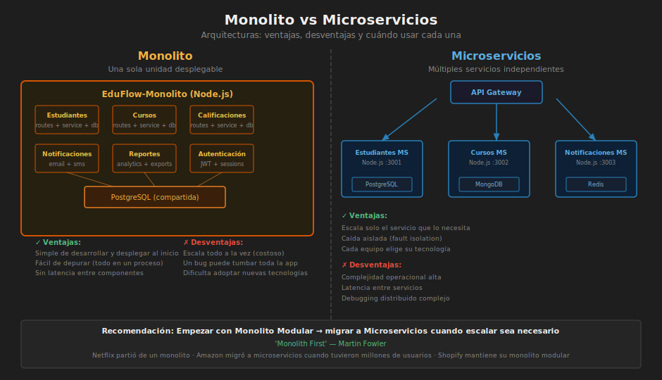

# 📖 01 — Del Monolito a los Microservicios

> _"La arquitectura de software es la suma de las decisiones de diseño que son difíciles de cambiar después."_
>
> — Martin Fowler

---

## 🎯 ¿Qué es una Arquitectura Monolítica?

### ¿Qué es?

Un **monolito** es una aplicación donde todos los módulos (UI, negocio, acceso a datos) se despliegan como **una sola unidad**. No importa cuántas capas internas tenga: si se despliega junto, es un monolito.

```
┌──────────────────────────────────────────┐
│              MONOLITO                    │
│                                          │
│  ┌──────────┐  ┌──────────┐  ┌────────┐ │
│  │  Usuarios │  │ Pedidos  │  │ Pagos  │ │
│  │  (módulo) │  │ (módulo) │  │(módulo)│ │
│  └──────────┘  └──────────┘  └────────┘ │
│                                          │
│       1 proceso  ·  1 BD  ·  1 deploy   │
└──────────────────────────────────────────┘
```

### ¿Para qué sirve?

- **Proyectos nuevos y equipos pequeños**: un monolito bien estructurado es más rápido de desarrollar y operar.
- **MVPs y startups**: menos infraestructura, menos costos operativos.
- **Dominio poco conocido**: evita dividir el negocio prematuramente.

### ¿Qué impacto tiene?

**Si lo aplicas correctamente:**

- ✅ Menor complejidad operacional
- ✅ Transacciones simples (ACID nativo)
- ✅ Debugging y trazabilidad directa
- ✅ Un solo repositorio, un solo deploy

**Si escalas sin replantear:**

- ❌ Equipos bloqueados entre sí (acoplamiento de deploy)
- ❌ Partes del sistema no pueden escalar independientemente
- ❌ Un bug en pagos puede tirar TODO el sistema
- ❌ Ciclos de release lentos

---



## 🔬 ¿Qué es una Arquitectura de Microservicios?

### ¿Qué es?

Los **microservicios** dividen la aplicación en **servicios pequeños e independientes**, cada uno responsable de una capacidad de negocio, con su propia base de datos y ciclo de vida de despliegue.

```
┌────────────┐    ┌────────────┐    ┌────────────┐
│  Servicio  │    │  Servicio  │    │  Servicio  │
│  Usuarios  │    │  Pedidos   │    │   Pagos    │
│            │    │            │    │            │
│  [BD-users]│    │ [BD-orders]│    │ [BD-payments]│
└─────┬──────┘    └─────┬──────┘    └─────┬──────┘
      │                 │                 │
      └────────── API Gateway / Bus ──────┘
```

### ¿Para qué sirven?

- **Escalado independiente**: el servicio de pagos puede escalar 10×, el de usuarios 2×.
- **Equipos autónomos**: cada equipo posee, desarrolla y despliega su servicio.
- **Tecnología adecuada por dominio**: el servicio de búsqueda usa Elasticsearch; el de pedidos usa PostgreSQL.
- **Fallos aislados**: un servicio caído no tumba toda la aplicación.

### ¿Qué impacto tiene?

**Beneficios:**

- ✅ Escalado granular
- ✅ Despliegues independientes y frecuentes
- ✅ Equipos autónomos (Conway's Law)
- ✅ Resiliencia: fallos acotados

**Costos reales (no ignorarlos):**

- ⚠️ Latencia de red entre servicios
- ⚠️ Consistencia eventual (no ACID distribuido)
- ⚠️ Operaciones complejas (Kubernetes, observabilidad, tracing)
- ⚠️ Debugging distribuido extremadamente difícil

---

## 🌍 Casos Reales

### Amazon (2001 → Microservicios)

Amazon comenzó como un monolito. Con el crecimiento, los deploys tardaban días y los equipos se bloqueaban entre sí. Migraron a microservicios: hoy tienen **>500 servicios** y más de **150 deploys por segundo**.

### Netflix

Migró su monolito DVD a microservicios en la nube (AWS) entre 2008 y 2012. Resultado: resiliencia ante fallos, escalado de millones de streams simultáneos y despliegues sin downtime. Invirtieron años y desarrollaron herramientas como **Chaos Monkey** (inyección de fallos) para lograrlo.

### La TRAMPA del "microservicios desde el día 1"

> _"Don't start with microservices. Monolith first."_ — Martin Fowler

Muchos equipos migran a microservicios prematuramente y terminan con un **monolito distribuido**: los peores características de ambos mundos (latencia, transacciones complejas, acoplamiento de red).

---

## 🔄 Strangler Fig Pattern — Migración Segura

Cuando tienes un monolito que necesitas migrar gradualmente a microservicios, usa el **Strangler Fig Pattern** (árbol estrangulador):

```
Fase 1: Monolito completo
┌────────────────────────┐
│    Monolito Legacy     │
│  usuarios, pedidos,    │
│  pagos, inventario     │
└────────────────────────┘

Fase 2: Extraer Pagos
┌────────────────────────┐    ┌──────────────┐
│  usuarios, pedidos,    │───▶│  Svc. Pagos  │
│  inventario            │    │  (nuevo)     │
└────────────────────────┘    └──────────────┘

Fase 3: Extraer Pedidos
┌────────────────┐    ┌──────────────┐    ┌──────────────┐
│ Monolito (menos│    │  Svc. Pagos  │    │  Svc. Pedidos│
│ funcionalidad) │    └──────────────┘    └──────────────┘
└────────────────┘

Fase N: Monolito vacío → se elimina
```

**Regla**: el API Gateway dirige las rutas al servicio nuevo; el monolito maneja el resto. Se extrae capacidad a capacidad, con pruebas en cada paso.

---

## ⚖️ ¿Cuándo usar qué?

| Criterio              | Monolito       | Microservicios                 |
| --------------------- | -------------- | ------------------------------ |
| Tamaño del equipo     | < 10 personas  | Múltiples equipos              |
| Madurez del dominio   | Desconocido    | Bien definido                  |
| Requisitos de escala  | Moderados      | Altamente variables por módulo |
| Tiempo al mercado     | Urgente        | Puede invertir más tiempo      |
| Presupuesto DevOps    | Bajo           | Alto                           |
| Consistencia de datos | ACID requerido | Eventual aceptable             |

> 🏆 **Regla de oro**: empieza con un **monolito modular** bien estructurado. Migra a microservicios cuando tengas evidencia de que el monolito es el cuello de botella.

---

## 📦 Monolito Modular — El término medio

Un **monolito modular** tiene la estructura interna de microservicios (módulos desacoplados, cada uno con su propio modelo de datos) pero se despliega como una unidad. Es la arquitectura de transición ideal:

```javascript
// Estructura monolito modular en Node.js
src/
├── modules/
│   ├── users/
│   │   ├── domain/        ← entidades, repositorios (interfaces)
│   │   ├── application/   ← casos de uso
│   │   └── infrastructure/← BD, email, etc.
│   ├── orders/
│   │   ├── domain/
│   │   ├── application/
│   │   └── infrastructure/
│   └── payments/
│       ├── domain/
│       ├── application/
│       └── infrastructure/
└── shared/                ← utilidades compartidas (con cuidado)
```

Cuando un módulo crece y necesita escalar independientemente, **extraerlo como microservicio es trivial**: ya tiene sus propias interfaces y no hay acoplamiento interno.

---

## 🔗 Conexión con las próximas secciones

Los microservicios resuelven el problema de **escala organizacional y de despliegue**. Pero dentro de cada servicio (o dentro de un monolito modular) todavía necesitas una arquitectura interna sólida. Para eso sirven **Clean Architecture** y la **Arquitectura Hexagonal** que estudiaremos a continuación.

```
Microservicios → ¿Cómo divido el sistema?
Clean Architecture → ¿Cómo organizo INTERNAMENTE cada servicio?
Arquitectura Hexagonal → ¿Cómo protejo el dominio de los detalles técnicos?
```
