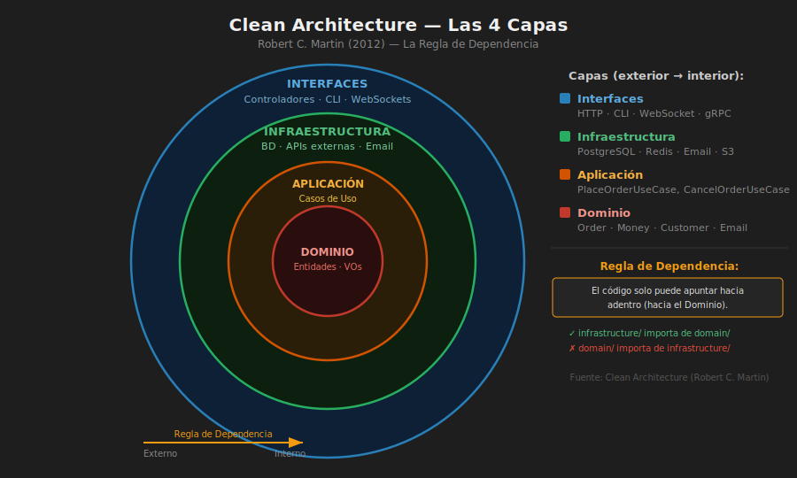
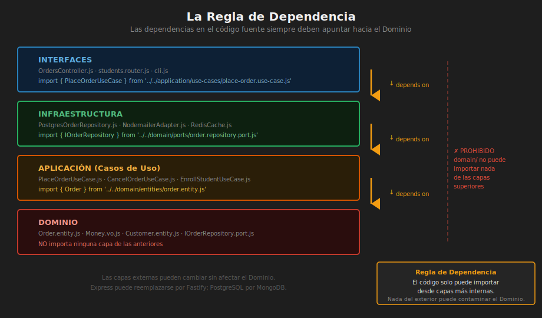

# 📖 02 — Clean Architecture

> _"La arquitectura limpia organiza el código de forma que las decisiones de negocio sean independientes de los detalles técnicos."_
>
> — Robert C. Martin (Uncle Bob)

---

## 🎯 ¿Qué es Clean Architecture?

### ¿Qué es?

**Clean Architecture** (Arquitectura Limpia) es un conjunto de principios propuesto por Robert C. Martin en 2012 que organiza el código en **capas concéntricas**, donde las capas internas representan políticas de negocio y las capas externas representan detalles técnicos.

La idea central es simple y poderosa:

> **Las dependencias siempre apuntan hacia adentro. Las capas internas no conocen las capas externas.**

```
         ┌─────────────────────────────────────┐
         │           FRAMEWORKS                │  ← Express, React, PG, etc.
         │   ┌─────────────────────────────┐   │
         │   │     INTERFACE ADAPTERS      │   │  ← Controllers, Repositories
         │   │   ┌─────────────────────┐   │   │
         │   │   │    USE CASES        │   │   │  ← Lógica de aplicación
         │   │   │   ┌─────────────┐   │   │   │
         │   │   │   │  ENTITIES   │   │   │   │  ← Reglas de negocio
         │   │   │   └─────────────┘   │   │   │
         │   │   └─────────────────────┘   │   │
         │   └─────────────────────────────┘   │
         └─────────────────────────────────────┘
                   ↑  Las flechas van HACIA ADENTRO
```

### ¿Para qué sirve?

- **Testabilidad**: el núcleo del negocio se prueba sin iniciar Express, sin BD, sin red.
- **Independencia de frameworks**: puedes cambiar Express por Fastify sin tocar una sola línea de negocio.
- **Independencia de la base de datos**: cambiar PostgreSQL por MongoDB es un cambio de adaptador, no de dominio.
- **Mantenibilidad a largo plazo**: los requisitos de negocio cambian; el código que los refleja debe ser el más estable.

### ¿Qué impacto tiene?

**Si lo aplicas:**

- ✅ Los tests unitarios del dominio son rápidos (< 100ms) sin mocks pesados
- ✅ Nuevo colaborador entiende el negocio leyendo solo `domain/` y `application/`
- ✅ Cambiar de ORM, base de datos o framework no rompe el negocio
- ✅ Las reglas de negocio están centralizadas y documentadas en código

**Si no lo aplicas:**

- ❌ Lógica de negocio dentro de `app.post('/orders', async (req, res) => { ... DB.query('...')... })`
- ❌ Tests requieren levantar Express + PostgreSQL (lentos, frágiles)
- ❌ Cambiar de Express a Fastify requiere tocar 80 archivos
- ❌ Imposible entender el negocio sin leer código de infraestructura

---



## 🏛️ Las Cuatro Capas

### 1. Entities (Entidades — núcleo del dominio)

Son las reglas de negocio **más estables y universales**. No dependen de ningún framework ni caso de uso específico. Encapsulan datos y lógica crítica del dominio.

```javascript
// domain/entities/order.entity.js
export class Order {
  #id;
  #customerId;
  #items;
  #status;
  #total;

  constructor({ id, customerId, items }) {
    if (!customerId) throw new Error("Order must have a customer");
    if (!items?.length) throw new Error("Order must have at least one item");

    this.#id = id;
    this.#customerId = customerId;
    this.#items = [...items];
    this.#status = "PENDING";
    this.#total = this.#calculateTotal();
  }

  // Regla de negocio: solo se puede cancelar si está PENDING
  cancel() {
    if (this.#status !== "PENDING") {
      throw new Error(`Cannot cancel order in status: ${this.#status}`);
    }
    this.#status = "CANCELLED";
  }

  // Regla de negocio: mínimo $5.000 para confirmar
  confirm() {
    if (this.#total < 5000) {
      throw new Error("Minimum order amount is $5,000");
    }
    this.#status = "CONFIRMED";
  }

  #calculateTotal() {
    return this.#items.reduce(
      (sum, item) => sum + item.price * item.quantity,
      0,
    );
  }

  get id() {
    return this.#id;
  }
  get customerId() {
    return this.#customerId;
  }
  get status() {
    return this.#status;
  }
  get total() {
    return this.#total;
  }
  get items() {
    return [...this.#items];
  }
}
```

### 2. Use Cases (Casos de Uso — lógica de aplicación)

Orquestan las entidades y los puertos para cumplir un objetivo del usuario. Un caso de uso = una acción del negocio.

```javascript
// application/use-cases/place-order.use-case.js
export class PlaceOrderUseCase {
  // Inyección de dependencias: no sabe qué BD se usa
  #orderRepository;
  #inventoryPort;
  #notificationPort;

  constructor({ orderRepository, inventoryPort, notificationPort }) {
    this.#orderRepository = orderRepository;
    this.#inventoryPort = inventoryPort;
    this.#notificationPort = notificationPort;
  }

  async execute({ customerId, items }) {
    // 1. Verificar disponibilidad (puerto secundario)
    for (const item of items) {
      const available = await this.#inventoryPort.checkStock(
        item.sku,
        item.quantity,
      );
      if (!available) throw new Error(`Item ${item.sku} out of stock`);
    }

    // 2. Crear la entidad (aplica reglas de negocio del dominio)
    const order = new Order({ customerId, items });
    order.confirm();

    // 3. Persistir (puerto secundario)
    await this.#orderRepository.save(order);

    // 4. Notificar (puerto secundario)
    await this.#notificationPort.notifyOrderPlaced(order);

    return order;
  }
}
```

### 3. Interface Adapters (Adaptadores de interfaz)

Convierten datos del mundo exterior (HTTP, CLI, gRPC) al formato que usan los casos de uso, y viceversa.

```javascript
// interfaces/http/orders.controller.js
export class OrdersController {
  #placeOrderUseCase;

  constructor({ placeOrderUseCase }) {
    this.#placeOrderUseCase = placeOrderUseCase;
  }

  async post(req, res) {
    try {
      // Convierte Request HTTP → input del caso de uso
      const order = await this.#placeOrderUseCase.execute({
        customerId: req.user.id,
        items: req.body.items,
      });

      // Convierte entidad → respuesta HTTP
      res.status(201).json({
        orderId: order.id,
        total: order.total,
        status: order.status,
      });
    } catch (error) {
      if (error.message.includes("out of stock")) {
        return res.status(422).json({ error: error.message });
      }
      res.status(500).json({ error: "Internal error" });
    }
  }
}
```

También incluye los **repositorios concretos**:

```javascript
// infrastructure/repositories/postgres-order.repository.js
import { OrderMapper } from "../mappers/order.mapper.js";

export class PostgresOrderRepository {
  #db;

  constructor({ db }) {
    this.#db = db;
  }

  async save(order) {
    const row = OrderMapper.toPersistence(order);
    await this.#db.query(
      "INSERT INTO orders (id, customer_id, status, total) VALUES ($1, $2, $3, $4)",
      [row.id, row.customer_id, row.status, row.total],
    );
  }

  async findById(id) {
    const { rows } = await this.#db.query(
      "SELECT * FROM orders WHERE id = $1",
      [id],
    );
    if (!rows[0]) return null;
    return OrderMapper.toDomain(rows[0]);
  }
}
```

### 4. Frameworks & Drivers (Capa más externa)

Express, Fastify, `node-postgres`, `nodemailer`, sistemas de archivos. Son **detalles**: se pueden reemplazar sin afectar el negocio.

---



## 📐 La Regla de Dependencia

> **"El código fuente solo puede depender de lo que está más adentro en el círculo."**

```
Entities    ← nunca importan nada de capas externas
Use Cases   ← importan Entities únicamente
Adapters    ← importan Use Cases y Entities
Frameworks  ← importan todo lo que necesite
```

**Verificación rápida en Node.js:**

```bash
# Estas carpetas NO deben importar nada de 'infrastructure', 'interfaces', 'express', 'pg', etc.
grep -r "express\|fastify\|pg\|mongoose\|knex\|axios" src/domain/ src/application/
# Resultado esperado: vacío
```

---

## 🛠️ Estructura de Carpetas Recomendada

```
src/
├── domain/                        ← Capa 1 y 2
│   ├── entities/
│   │   ├── order.entity.js
│   │   └── user.entity.js
│   ├── value-objects/
│   │   ├── email.value-object.js
│   │   └── money.value-object.js
│   ├── repositories/              ← INTERFACES (contratos)
│   │   └── order.repository.js    ← clase abstracta / JSDoc
│   └── services/                  ← lógica de dominio compleja
│       └── pricing.domain-service.js
│
├── application/                   ← Capa 3 (Use Cases)
│   └── use-cases/
│       ├── place-order.use-case.js
│       ├── cancel-order.use-case.js
│       └── get-order.use-case.js
│
├── infrastructure/                ← Capa 4 (Adapters externos)
│   ├── repositories/
│   │   ├── postgres-order.repository.js
│   │   └── in-memory-order.repository.js   ← para tests
│   ├── email/
│   │   └── nodemailer-email.adapter.js
│   └── config/
│       └── database.js
│
└── interfaces/                    ← Capa 4 (Adapters de entrada)
    └── http/
        ├── app.js                 ← Setup de Express
        ├── orders.controller.js
        └── users.controller.js
```

---

## 🧪 La Prueba Definitiva de Clean Architecture

```javascript
// test/use-cases/place-order.test.js
// Este test NO necesita Express, NO necesita PostgreSQL, NO necesita red

import { PlaceOrderUseCase } from "../../src/application/use-cases/place-order.use-case.js";
import { InMemoryOrderRepository } from "../../src/infrastructure/repositories/in-memory-order.repository.js";

describe("PlaceOrderUseCase", () => {
  it("crea una orden confirmada cuando hay stock", async () => {
    const repo = new InMemoryOrderRepository();
    const inventoryPort = { checkStock: async () => true }; // fake
    const notificationPort = { notifyOrderPlaced: async () => {} }; // fake

    const useCase = new PlaceOrderUseCase({
      orderRepository: repo,
      inventoryPort,
      notificationPort,
    });

    const order = await useCase.execute({
      customerId: "usr_1",
      items: [{ sku: "SKU-001", quantity: 2, price: 10000 }],
    });

    expect(order.status).toBe("CONFIRMED");
    expect(order.total).toBe(20000);
  });
});
```

> ✅ Este test se ejecuta en **< 10ms** sin levantar ningún servidor ni base de datos.
