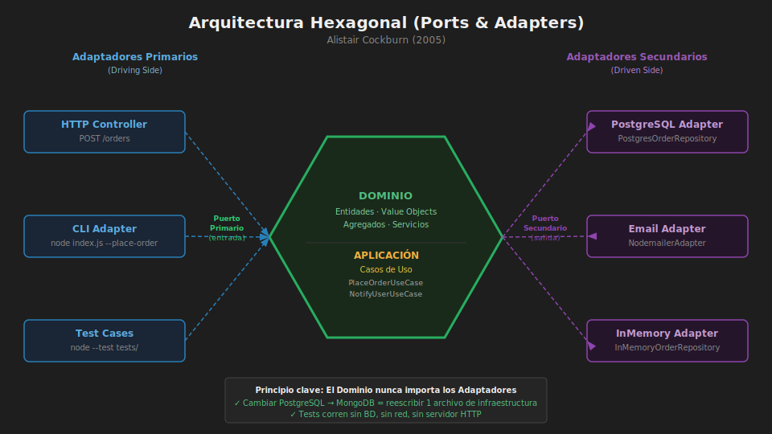

# 📖 03 — Arquitectura Hexagonal (Ports & Adapters)

> _"La aplicación puede ser usada de la misma manera por personas, programas, pruebas automatizadas o scripts. Puede ser desarrollada y probada de forma aislada de sus eventuales dispositivos de tiempo de ejecución y bases de datos."_
>
> — Alistair Cockburn (creador del patrón, 2005)

---



## 🎯 ¿Qué es la Arquitectura Hexagonal?

### ¿Qué es?

La **Arquitectura Hexagonal** (también llamada **Ports & Adapters**) es un estilo arquitectónico que protege el núcleo de la aplicación de los detalles del mundo exterior mediante **puertos** (contratos abstractos) y **adaptadores** (implementaciones concretas).

El hexágono no tiene ningún significado matemático: simplemente transmite la idea de que la aplicación **no tiene un lado "de arriba" (UI) ni un lado "de abajo" (BD)**. Todos los actores externos se conectan mediante sus propios adaptadores.

```
                     ┌───────────────────────────┐
       HTTP ─────────┤                           ├─────────  PostgreSQL
      (Adapter)      │       HEXÁGONO            │         (Adapter)
                     │   ┌───────────────────┐   │
       CLI ──────────┤   │                   │   ├─────────  Redis
      (Adapter)      │   │  DOMINIO PURO     │   │         (Adapter)
                     │   │  (Application     │   │
    Tests ───────────┤   │   + Domain)       │   ├─────────  Email
      (Adapter)      │   │                   │   │         (Adapter)
                     │   └───────────────────┘   │
    gRPC ────────────┤                           ├─────────  SMS
      (Adapter)      │                           │         (Adapter)
                     └───────────────────────────┘
                      ↑ Puertos izquierda (entrada)   ↑ Puertos derecha (salida)
```

### ¿Para qué sirve?

- **Testear el dominio en aislamiento**: reemplaza PostgreSQL por un `InMemoryRepository` en tests.
- **Integrar nuevas tecnologías**: agregar un consumidor de mensajes Kafka = crear un nuevo adaptador, sin tocar el dominio.
- **Desarrollo paralelo**: el equipo de backend puede trabajar en el dominio mientras el de infraestructura configura la BD.
- **Cambio de base de datos**: pasar de MongoDB a PostgreSQL = reescribir el adaptador, no el negocio.

### ¿Qué impacto tiene?

**Si lo aplicas:**

- ✅ Puedes correr el 100% de las pruebas de negocio sin internet, sin BD, sin servidor
- ✅ `InMemoryRepository` para CI/CD rápido; `PostgresRepository` para producción
- ✅ La lógica de negocio es legible sin conocer qué framework se usa
- ✅ Cambiar de `nodemailer` a `SendGrid` = cambiar 1 archivo de infraestructura

**Si no lo aplicas:**

- ❌ Las pruebas requieren levantar toda la infraestructura (lento, frágil)
- ❌ Cambiar la BD implica modificar casos de uso y controladores
- ❌ El código de negocio está contaminado con SQL, llamadas HTTP y detalles técnicos

---

## 🔌 Puertos Primarios (Entrada) — Driving Side

Los **puertos primarios** son las interfaces a través de las cuales el mundo exterior **activa** la aplicación. Son los casos de uso expuestos como contratos.

```javascript
// domain/ports/primary/order-service.port.js
/**
 * Puerto primario: define QUÉ puede hacer la aplicación.
 * Los adaptadores de entrada (HTTP, CLI, tests) lo implementan o lo llaman.
 */
export class IOrderService {
  /**
   * @param {{ customerId: string, items: Array }} input
   * @returns {Promise<Order>}
   */
  async placeOrder(input) {
    throw new Error("Not implemented");
  }

  /**
   * @param {string} orderId
   * @returns {Promise<void>}
   */
  async cancelOrder(orderId) {
    throw new Error("Not implemented");
  }

  /**
   * @param {string} orderId
   * @returns {Promise<Order|null>}
   */
  async getOrder(orderId) {
    throw new Error("Not implemented");
  }
}
```

**Adaptador primario — HTTP:**

```javascript
// interfaces/http/orders.controller.js
export class OrdersController {
  #orderService; // IOrderService

  constructor({ orderService }) {
    this.#orderService = orderService;
  }

  register(app) {
    app.post("/orders", (req, res) => this.#placeOrder(req, res));
    app.delete("/orders/:id", (req, res) => this.#cancelOrder(req, res));
    app.get("/orders/:id", (req, res) => this.#getOrder(req, res));
  }

  async #placeOrder(req, res) {
    const order = await this.#orderService.placeOrder({
      customerId: req.user.id,
      items: req.body.items,
    });
    res.status(201).json({ id: order.id, total: order.total });
  }

  async #cancelOrder(req, res) {
    await this.#orderService.cancelOrder(req.params.id);
    res.status(204).end();
  }

  async #getOrder(req, res) {
    const order = await this.#orderService.getOrder(req.params.id);
    if (!order) return res.status(404).json({ error: "Not found" });
    res.json({ id: order.id, status: order.status, total: order.total });
  }
}
```

---

## 🔌 Puertos Secundarios (Salida) — Driven Side

Los **puertos secundarios** son las interfaces que la aplicación usa para comunicarse con el mundo exterior (BD, email, APIs externas). La aplicación **define** el contrato; la infraestructura **lo implementa**.

```javascript
// domain/ports/secondary/order.repository.port.js
export class IOrderRepository {
  /** @param {Order} order @returns {Promise<void>} */
  async save(order) {
    throw new Error("Not implemented");
  }

  /** @param {string} id @returns {Promise<Order|null>} */
  async findById(id) {
    throw new Error("Not implemented");
  }

  /** @param {string} customerId @returns {Promise<Order[]>} */
  async findByCustomer(customerId) {
    throw new Error("Not implemented");
  }
}

// domain/ports/secondary/notification.port.js
export class INotificationPort {
  /** @param {Order} order @returns {Promise<void>} */
  async notifyOrderPlaced(order) {
    throw new Error("Not implemented");
  }

  /** @param {Order} order @returns {Promise<void>} */
  async notifyOrderCancelled(order) {
    throw new Error("Not implemented");
  }
}
```

**Adaptador secundario — PostgreSQL:**

```javascript
// infrastructure/repositories/postgres-order.repository.js
import { IOrderRepository } from "../../domain/ports/secondary/order.repository.port.js";
import { Order } from "../../domain/entities/order.entity.js";

export class PostgresOrderRepository extends IOrderRepository {
  #db;

  constructor({ db }) {
    super();
    this.#db = db;
  }

  async save(order) {
    await this.#db.query(
      `INSERT INTO orders (id, customer_id, status, total, created_at)
       VALUES ($1, $2, $3, $4, NOW())
       ON CONFLICT (id) DO UPDATE SET status = $3`,
      [order.id, order.customerId, order.status, order.total],
    );
  }

  async findById(id) {
    const { rows } = await this.#db.query(
      "SELECT * FROM orders WHERE id = $1",
      [id],
    );
    if (!rows[0]) return null;
    return new Order({
      id: rows[0].id,
      customerId: rows[0].customer_id,
      status: rows[0].status,
      total: rows[0].total,
    });
  }
}
```

**Adaptador secundario — In-Memory (para tests):**

```javascript
// infrastructure/repositories/in-memory-order.repository.js
import { IOrderRepository } from "../../domain/ports/secondary/order.repository.port.js";

export class InMemoryOrderRepository extends IOrderRepository {
  #store = new Map();

  async save(order) {
    this.#store.set(order.id, order);
  }

  async findById(id) {
    return this.#store.get(id) ?? null;
  }

  async findByCustomer(customerId) {
    return [...this.#store.values()].filter((o) => o.customerId === customerId);
  }

  // Utilidad para tests
  clear() {
    this.#store.clear();
  }
  count() {
    return this.#store.size;
  }
}
```

---

## 🏗️ Composición en el punto de entrada

El **composition root** es el único lugar donde se instancian los adaptadores concretos y se inyectan en los casos de uso:

```javascript
// src/main.js  ← el único lugar que importa infraestructura concreta
import express from "express";
import pg from "pg";

import { PlaceOrderUseCase } from "./application/use-cases/place-order.use-case.js";
import { PostgresOrderRepository } from "./infrastructure/repositories/postgres-order.repository.js";
import { NodemailerNotificationAdapter } from "./infrastructure/email/nodemailer-notification.adapter.js";
import { PostgresInventoryAdapter } from "./infrastructure/inventory/postgres-inventory.adapter.js";
import { OrdersController } from "./interfaces/http/orders.controller.js";

const db = new pg.Pool({ connectionString: process.env.DATABASE_URL });

// Instancia adaptadores
const orderRepository = new PostgresOrderRepository({ db });
const notificationPort = new NodemailerNotificationAdapter();
const inventoryPort = new PostgresInventoryAdapter({ db });

// Inyecta en casos de uso
const placeOrderUseCase = new PlaceOrderUseCase({
  orderRepository,
  inventoryPort,
  notificationPort,
});

// Controlador recibe caso de uso (no adaptadores directamente)
const ordersController = new OrdersController({
  orderService: {
    placeOrder: placeOrderUseCase.execute.bind(placeOrderUseCase),
  },
});

const app = express();
app.use(express.json());
ordersController.register(app);

app.listen(3000, () => console.log("Server running on :3000"));
```

---

## 🔄 Clean Architecture vs Hexagonal

Ambas arquitecturas comparten los mismos principios; la diferencia es de **perspectiva**:

| Aspecto         | Clean Architecture             | Hexagonal (Ports & Adapters)      |
| --------------- | ------------------------------ | --------------------------------- |
| Metáfora visual | Círculos concéntricos          | Hexágono con conectores           |
| Énfasis         | Regla de dependencia por capas | Intercambiabilidad de adaptadores |
| Terminología    | Entities, Use Cases, Adapters  | Domain, Ports, Adapters           |
| Origen          | Robert C. Martin (2012)        | Alistair Cockburn (2005)          |
| Compatibilidad  | —                              | Se complementan perfectamente     |

> 💡 En la práctica, la mayoría de equipos combina ambas: las capas de Clean Architecture con la terminología de Ports & Adapters.

---

## ✅ Checklist de Arquitectura Hexagonal

```
[ ] El directorio domain/ no importa express, pg, mongoose, axios ni ningún framework
[ ] Cada dependencia externa tiene su puerto (interfaz abstracta)
[ ] Existe al menos un InMemoryAdapter para cada puerto secundario
[ ] El composition root (main.js) es el único lugar con new ConcreteAdapter()
[ ] Los tests del dominio NO levantan servidor ni conexión a BD
[ ] Cambiar la BD solo requiere cambiar UN archivo en infrastructure/
```
