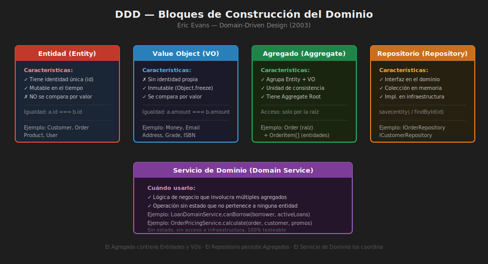

# 📖 04 — Domain-Driven Design (DDD) Básico

> _"El corazón del software está en su capacidad de resolver problemas del dominio del usuario. Todas las demás características importan solo si este núcleo funciona."_
>
> — Eric Evans, _Domain-Driven Design: Tackling Complexity in the Heart of Software_ (2003)

---



## 🎯 ¿Qué es DDD?

### ¿Qué es?

**Domain-Driven Design (DDD)** es un enfoque de diseño de software que pone el **dominio del negocio** en el centro de las decisiones técnicas. No es un framework ni una librería: es una **filosofía de modelado** que propone un lenguaje común entre desarrolladores y expertos del negocio, y un conjunto de bloques de construcción para representar ese dominio fielmente en código.

Eric Evans identificó dos tipos de complejidad:

- **Complejidad accidental**: la que nosotros mismos introducimos (tecnología, frameworks, decisiones de diseño pobres).
- **Complejidad esencial**: la inherente al dominio del negocio (reglas tributarias, cálculos financieros, flujos de aprobación).

DDD propone reducir la complejidad accidental para que los desarrolladores puedan enfocarse en la esencial.

### ¿Para qué sirve?

- Crear código que habla el **lenguaje del negocio**, no el de los frameworks.
- Descubrir y modelar las **reglas de negocio** que realmente importan.
- Separar **qué** hace el sistema de **cómo** lo hace.
- Guiar decisiones de arquitectura en sistemas complejos (microservicios, contextos delimitados).

### ¿Qué impacto tiene?

**Si lo aplicas:**

- ✅ Los desarrolladores y los expertos del negocio hablan el mismo idioma
- ✅ El código refleja las reglas del negocio, no los detalles técnicos
- ✅ Los cambios de negocio se traducen directamente en cambios de código ubicables
- ✅ El dominio es testeable sin infraestructura

**Si no lo aplicas:**

- ❌ El conocimiento del negocio vive en las cabezas de las personas, no en el código
- ❌ Las reglas críticas están dispersas en controladores, servicios y repositorios
- ❌ Cada cambio de negocio requiere rastrear decenas de archivos

---

## 🧱 Bloque 1 — Entidad (Entity)

Una **entidad** es un objeto del dominio que tiene **identidad única** que persiste en el tiempo. Dos entidades son iguales si tienen el mismo `id`, aunque todos sus otros atributos cambien.

```javascript
// domain/entities/customer.entity.js
import { randomUUID } from "crypto";
import { Email } from "../value-objects/email.vo.js";
import { Money } from "../value-objects/money.vo.js";

export class Customer {
  #id;
  #name;
  #email; // Email (Value Object)
  #creditLimit; // Money (Value Object)
  #isActive;

  constructor({ id = randomUUID(), name, email, creditLimit }) {
    if (!name?.trim()) throw new Error("Customer name is required");

    this.#id = id;
    this.#name = name.trim();
    this.#email = email instanceof Email ? email : new Email(email);
    this.#creditLimit =
      creditLimit instanceof Money
        ? creditLimit
        : new Money(creditLimit, "COP");
    this.#isActive = true;
  }

  // Comportamiento del dominio
  upgrade(newCreditLimit) {
    if (!(newCreditLimit instanceof Money))
      throw new Error("Invalid credit limit");
    if (newCreditLimit.lessThanOrEqual(this.#creditLimit)) {
      throw new Error("New credit limit must be greater than current limit");
    }
    this.#creditLimit = newCreditLimit;
  }

  deactivate() {
    if (!this.#isActive) throw new Error("Customer is already inactive");
    this.#isActive = false;
  }

  canPurchase(amount) {
    return this.#isActive && this.#creditLimit.greaterThanOrEqual(amount);
  }

  // Getters — solo lectura del estado
  get id() {
    return this.#id;
  }
  get name() {
    return this.#name;
  }
  get email() {
    return this.#email.value;
  }
  get creditLimit() {
    return this.#creditLimit;
  }
  get isActive() {
    return this.#isActive;
  }

  // Las entidades se comparan por identidad, no por valor
  equals(other) {
    return other instanceof Customer && this.#id === other.id;
  }
}
```

---

## 🧱 Bloque 2 — Objeto de Valor (Value Object)

Un **Value Object** es un objeto que describe **características** del dominio sin tener identidad propia. Es **inmutable**: si quieres cambiarlo, creas uno nuevo. Dos VOs son iguales si todos sus atributos son iguales.

```javascript
// domain/value-objects/money.vo.js
export class Money {
  #amount;
  #currency;

  constructor(amount, currency = "COP") {
    if (typeof amount !== "number" || amount < 0) {
      throw new Error(`Invalid amount: ${amount}`);
    }
    if (!["COP", "USD", "EUR"].includes(currency)) {
      throw new Error(`Unsupported currency: ${currency}`);
    }
    this.#amount = amount;
    this.#currency = currency;
    Object.freeze(this); // El VO es completamente inmutable
  }

  // Operaciones retornan NUEVOS objetos (inmutabilidad)
  add(other) {
    this.#assertSameCurrency(other);
    return new Money(this.#amount + other.amount, this.#currency);
  }

  subtract(other) {
    this.#assertSameCurrency(other);
    const result = this.#amount - other.amount;
    if (result < 0)
      throw new Error("Subtraction would result in negative amount");
    return new Money(result, this.#currency);
  }

  multiply(factor) {
    if (typeof factor !== "number" || factor < 0)
      throw new Error("Invalid factor");
    return new Money(Math.round(this.#amount * factor), this.#currency);
  }

  greaterThanOrEqual(other) {
    this.#assertSameCurrency(other);
    return this.#amount >= other.amount;
  }

  lessThanOrEqual(other) {
    this.#assertSameCurrency(other);
    return this.#amount <= other.amount;
  }

  // Igualdad por valor (no por referencia)
  equals(other) {
    return (
      other instanceof Money &&
      this.#amount === other.amount &&
      this.#currency === other.currency
    );
  }

  #assertSameCurrency(other) {
    if (this.#currency !== other.currency) {
      throw new Error(
        `Currency mismatch: ${this.#currency} vs ${other.currency}`,
      );
    }
  }

  get amount() {
    return this.#amount;
  }
  get currency() {
    return this.#currency;
  }
  toString() {
    return `${this.#currency} ${this.#amount.toLocaleString("es-CO")}`;
  }
}

// domain/value-objects/email.vo.js
export class Email {
  #value;
  static #REGEX = /^[^\s@]+@[^\s@]+\.[^\s@]+$/;

  constructor(value) {
    if (!Email.#REGEX.test(value)) throw new Error(`Invalid email: ${value}`);
    this.#value = value.toLowerCase().trim();
    Object.freeze(this);
  }

  equals(other) {
    return other instanceof Email && this.#value === other.value;
  }

  get value() {
    return this.#value;
  }
  toString() {
    return this.#value;
  }
}
```

> 💡 **Regla de oro**: Si dos cosas son iguales porque tienen los mismos datos → **Value Object**. Si una puede cambiar sus datos pero sigue siendo "la misma cosa" → **Entity**.

---

## 🧱 Bloque 3 — Agregado (Aggregate)

Un **Agregado** es un conjunto de entidades y value objects que forman una **unidad de consistencia**. Tiene una **raíz del agregado (Aggregate Root)** que es la única entidad a través de la cual el exterior puede acceder o modificar el agregado.

```javascript
// domain/aggregates/order.aggregate.js
import { randomUUID } from "crypto";
import { Money } from "../value-objects/money.vo.js";
import { OrderStatus } from "../value-objects/order-status.vo.js";
import { OrderItem } from "../entities/order-item.entity.js";

export class Order {
  #id;
  #customerId;
  #items = []; // Entidades internas del agregado
  #status;
  #total;
  #events = []; // Domain events pendientes de publicar

  constructor({ id = randomUUID(), customerId, status = OrderStatus.PENDING }) {
    if (!customerId) throw new Error("Order requires a customer");
    this.#id = id;
    this.#customerId = customerId;
    this.#status = new OrderStatus(status);
    this.#total = new Money(0, "COP");
  }

  // El exterior solo puede modificar el agregado a través de la raíz
  addItem({ productId, name, price, quantity }) {
    if (!this.#status.isPending()) {
      throw new Error("Cannot add items to a non-pending order");
    }
    if (quantity <= 0) throw new Error("Quantity must be positive");

    const item = new OrderItem({ productId, name, price, quantity });
    this.#items.push(item);
    this.#recalculateTotal();
  }

  removeItem(productId) {
    if (!this.#status.isPending()) {
      throw new Error("Cannot remove items from a non-pending order");
    }
    this.#items = this.#items.filter((i) => i.productId !== productId);
    this.#recalculateTotal();
  }

  confirm() {
    if (!this.#status.isPending())
      throw new Error("Only pending orders can be confirmed");
    if (this.#items.length === 0) throw new Error("Cannot confirm empty order");
    if (this.#total.amount < 5000)
      throw new Error("Minimum order amount is COP 5,000");

    this.#status = new OrderStatus(OrderStatus.CONFIRMED);
    this.#events.push({
      type: "OrderConfirmed",
      orderId: this.#id,
      total: this.#total,
    });
  }

  cancel(reason) {
    if (this.#status.isDelivered())
      throw new Error("Cannot cancel a delivered order");
    this.#status = new OrderStatus(OrderStatus.CANCELLED);
    this.#events.push({ type: "OrderCancelled", orderId: this.#id, reason });
  }

  #recalculateTotal() {
    this.#total = this.#items.reduce(
      (acc, item) => acc.add(item.subtotal),
      new Money(0, "COP"),
    );
  }

  pullEvents() {
    const events = [...this.#events];
    this.#events = [];
    return events;
  }

  get id() {
    return this.#id;
  }
  get customerId() {
    return this.#customerId;
  }
  get items() {
    return [...this.#items];
  } // Copia defensiva
  get status() {
    return this.#status.value;
  }
  get total() {
    return this.#total;
  }
}
```

---

## 🧱 Bloque 4 — Repositorio (Repository)

Un **Repositorio** proporciona una **ilusión de colección en memoria** para los agregados. El dominio lo define como interfaz; la infraestructura lo implementa.

```javascript
// domain/repositories/order.repository.js
export class IOrderRepository {
  /** @param {Order} order */
  async save(order) {
    throw new Error("Not implemented");
  }

  /** @param {string} id @returns {Promise<Order|null>} */
  async findById(id) {
    throw new Error("Not implemented");
  }

  /** @param {string} customerId @returns {Promise<Order[]>} */
  async findActiveByCustomer(customerId) {
    throw new Error("Not implemented");
  }

  /** @param {Order} order */
  async delete(order) {
    throw new Error("Not implemented");
  }
}
```

**Implementación en memoria para tests:**

```javascript
// infrastructure/repositories/in-memory-order.repository.js
export class InMemoryOrderRepository extends IOrderRepository {
  #orders = new Map();

  async save(order) {
    this.#orders.set(order.id, order);
  }

  async findById(id) {
    return this.#orders.get(id) ?? null;
  }

  async findActiveByCustomer(customerId) {
    return [...this.#orders.values()].filter(
      (o) => o.customerId === customerId && o.status !== "CANCELLED",
    );
  }

  async delete(order) {
    this.#orders.delete(order.id);
  }
}
```

---

## 🧱 Bloque 5 — Servicio de Dominio (Domain Service)

Un **Servicio de Dominio** encapsula lógica de negocio que **no pertenece naturalmente** a ninguna entidad específica, generalmente porque involucra múltiples agregados.

```javascript
// domain/services/order-pricing.service.js
import { Money } from "../value-objects/money.vo.js";

/**
 * Servicio de dominio: calcula el precio final de una orden
 * considerando el nivel del cliente y las promociones activas.
 * No es natural a Order ni a Customer por sí solos.
 */
export class OrderPricingService {
  /**
   * @param {Order} order
   * @param {Customer} customer
   * @param {Promotion[]} activePromotions
   * @returns {Money} precio final con descuentos aplicados
   */
  calculateFinalPrice(order, customer, activePromotions) {
    let basePrice = order.total;

    // Descuento por nivel de cliente
    const customerDiscount = this.#getCustomerDiscount(customer);
    basePrice = basePrice.subtract(basePrice.multiply(customerDiscount));

    // Aplicar promociones activas (no acumulables)
    const bestPromotion = activePromotions
      .filter((p) => p.isApplicableTo(order))
      .reduce((best, p) => (p.discount > best.discount ? p : best), {
        discount: 0,
      });

    if (bestPromotion.discount > 0) {
      basePrice = basePrice.subtract(
        basePrice.multiply(bestPromotion.discount),
      );
    }

    return basePrice;
  }

  #getCustomerDiscount(customer) {
    if (customer.isVip) return 0.15;
    if (customer.isPremium) return 0.1;
    return 0;
  }
}
```

---

## 🌐 Lenguaje Ubicuo (Ubiquitous Language)

El **Lenguaje Ubicuo** es el vocabulario compartido entre desarrolladores y expertos del dominio. Se usa en conversaciones, historias de usuario Y en el código.

```javascript
// ❌ MAL — lenguaje técnico, no del negocio
class DataProcessor {
  processRecord(data) {
    /* ... */
  }
  updateStatus(id, flag) {
    /* ... */
  }
}

// ✅ BIEN — lenguaje ubicuo del dominio de e-commerce
class Order {
  confirm() {
    /* ... */
  }
  cancel(reason) {
    /* ... */
  }
  ship(trackingCode) {
    /* ... */
  }
  deliver() {
    /* ... */
  }
}
```

**Señales de que tienes lenguaje ubicuo correcto:**

- El experto del negocio puede leer el nombre de tus clases y decir "sí, eso existe en nuestro proceso"
- Los tests se leen como especificaciones del negocio
- Los reportes de bugs usan las mismas palabras que el código

---

## 🗺️ Contextos Delimitados (Bounded Contexts)

Un **Contexto Delimitado** define los límites dentro de los cuales un modelo del dominio es válido. Fuera de ese límite, la misma palabra puede significar algo diferente.

```
┌──────────────────────┐    ┌──────────────────────┐    ┌──────────────────────┐
│  Contexto: Ventas    │    │  Contexto: Envíos     │    │  Contexto: Factura   │
│                      │    │                       │    │                      │
│  "Cliente" =         │    │  "Cliente" =          │    │  "Cliente" =         │
│   quien compra       │    │   dirección entrega   │    │   NIT/CC para DIAN   │
│                      │    │                       │    │                      │
│  "Pedido" =          │    │  "Pedido" =           │    │  "Pedido" =          │
│   carrito confirmado │    │   guía de envío       │    │   referencia factura │
└──────────────────────┘    └──────────────────────┘    └──────────────────────┘
```

> 💡 Los microservicios suelen corresponder a Bounded Contexts: cada microservicio tiene su propio modelo del dominio y su propio lenguaje ubicuo.

---

## 📐 Resumen: ¿Cuándo usar qué bloque?

| Bloque         | Tiene identidad | Es inmutable | Involucra múltiples objetos | Acceso a infraestructura |
| -------------- | --------------- | ------------ | --------------------------- | ------------------------ |
| Entity         | ✅ Sí           | ❌ No        | ❌ No                       | ❌ No                    |
| Value Object   | ❌ No           | ✅ Sí        | ❌ No                       | ❌ No                    |
| Aggregate      | ✅ Sí (raíz)    | ❌ No        | ✅ Sí                       | ❌ No                    |
| Repository     | —               | —            | —                           | ✅ Solo interfaz         |
| Domain Service | ❌ No           | —            | ✅ Sí                       | ❌ No                    |
