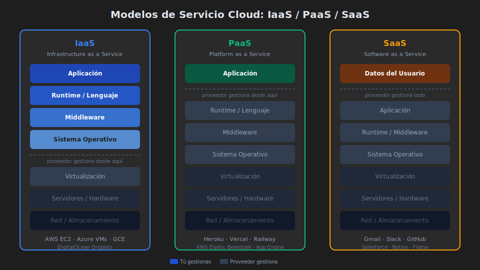

# ☁️ Cloud Computing: IaaS, PaaS y SaaS

> _"La nube no es el futuro — es el presente. La pregunta ya no es si migrar, sino cómo hacerlo bien."_

---

## 🎯 ¿Qué es Cloud Computing?

### ¿Qué es?

Cloud computing es el modelo de proporcionar **recursos de TI (servidores, almacenamiento, bases de datos, redes, software) a través de internet bajo demanda**, pagando solo por lo que se consume.

En lugar de comprar y mantener tu propio hardware, alquilas capacidad de infraestructura de un proveedor que la gestiona por ti.

### ¿Para qué sirve?

- **Escalar rápidamente**: una startup puede pasar de 100 a 1 millón de usuarios sin comprar servidores
- **Reducir costos iniciales**: sin inversión en hardware (CapEx → OpEx)
- **Aumentar disponibilidad**: replicación geográfica automática
- **Acelerar time-to-market**: desplegar en minutos, no en semanas

### ¿Qué impacto tiene?

**Si lo usas bien:**

- ✅ Infraestructura que crece con tu negocio
- ✅ Alta disponibilidad global sin operar centros de datos
- ✅ Acceso a servicios avanzados (IA, ML, analytics) sin desarrollarlos

**Si lo ignoras:**

- ❌ Sobreprovisionar hardware que usas al 10% de capacidad
- ❌ Tiempo de mercado lento por fricción de infraestructura
- ❌ Costos fijos altos sin flexibilidad

---

## 📐 Los Tres Modelos de Servicio

<!-- Diagrama: 0-assets/01-cloud-modelos-servicio.svg -->



### IaaS — Infrastructure as a Service

**Tú administras**: Sistema operativo, runtime, aplicación, datos
**El proveedor administra**: Hardware, red, virtualización, almacenamiento físico

Es el nivel más bajo de abstracción. Alquilas máquinas virtuales (VMs) configurables.

```
Analogía: alquilas un terreno y construyes tu casa desde los cimientos.
```

**Ejemplos reales**:

- AWS EC2 (Elastic Compute Cloud)
- Azure Virtual Machines
- Google Compute Engine
- DigitalOcean Droplets

**Cuándo usar IaaS**:

- Necesitas control total del sistema operativo
- Migración "lift and shift" de servidores on-premise
- Cargas de trabajo con requisitos específicos de red/almacenamiento

---

### PaaS — Platform as a Service

**Tú administras**: Aplicación, datos, configuración de la plataforma
**El proveedor administra**: SO, runtime, middleware, servidores, almacenamiento, redes

Subes tu código — la plataforma lo ejecuta. Sin preocuparte por parches del SO ni versiones de runtime.

```
Analogía: alquilas un apartamento amueblado — llevas tu ropa y te instalas.
```

**Ejemplos reales**:

- Heroku
- Google App Engine
- AWS Elastic Beanstalk
- Azure App Service
- Vercel / Railway / Render (PaaS modernos)

**Cuándo usar PaaS**:

- Equipos pequeños sin DevOps dedicado
- Prototipado rápido y startups
- Cuando el negocio es la app, no la infraestructura

```javascript
// Ejemplo: despliegue en Railway (PaaS)
// Solo necesitas un package.json con "start" script — Railway hace el resto

// package.json
{
  "scripts": {
    "start": "node server.js"  // Railway detecta este comando automáticamente
  }
}

// Variables de entorno se configuran en el dashboard — no en el código
const PORT = process.env.PORT;        // Railway asigna el puerto
const DATABASE_URL = process.env.DATABASE_URL;  // Railway provee la URL de BD
```

---

### SaaS — Software as a Service

**Tú administras**: Solo los datos y configuración del usuario
**El proveedor administra**: Todo lo demás — código, plataforma, infraestructura

Consumes software listo para usar a través de un navegador o API.

```
Analogía: reservas una habitación de hotel — todo ya está listo.
```

**Ejemplos reales**:

- Gmail / Google Workspace
- Salesforce CRM
- Slack, Notion, Figma
- GitHub, Jira, Confluence
- Stripe (pagos), Twilio (SMS), SendGrid (email)

**Cuándo usar SaaS**:

- Funcionalidad no diferenciadora (email, CRM, analítica)
- Rapidez: no hay tiempo para construir esa funcionalidad
- Cuando el costo de SaaS es menor que el costo de desarrollo

---

## 🏢 Los Tres Grandes Proveedores Cloud

| Servicio                | AWS                 | Azure                | GCP                 |
| ----------------------- | ------------------- | -------------------- | ------------------- |
| **Cómputo (IaaS)**      | EC2                 | Virtual Machines     | Compute Engine      |
| **Cómputo (PaaS)**      | Elastic Beanstalk   | App Service          | App Engine          |
| **Contenedores**        | ECS / EKS (K8s)     | AKS                  | GKE                 |
| **Serverless**          | Lambda              | Azure Functions      | Cloud Functions     |
| **Base de datos SQL**   | RDS                 | Azure SQL            | Cloud SQL           |
| **Base de datos NoSQL** | DynamoDB            | Cosmos DB            | Firestore           |
| **Almacenamiento**      | S3                  | Blob Storage         | Cloud Storage       |
| **CDN**                 | CloudFront          | Azure CDN            | Cloud CDN           |
| **DNS**                 | Route 53            | Azure DNS            | Cloud DNS           |
| **Autenticación**       | Cognito             | Azure AD B2C         | Identity Platform   |
| **IA / ML**             | SageMaker           | Azure ML             | Vertex AI           |
| **Cuota gratuita**      | Free Tier (siempre) | Free Tier (12 meses) | Free Tier (siempre) |

---

## 🌐 On-Premise vs Cloud

| Característica      | On-Premise              | Cloud                                    |
| ------------------- | ----------------------- | ---------------------------------------- |
| **Costo inicial**   | CapEx alto (hardware)   | OpEx bajo (pago por uso)                 |
| **Escalabilidad**   | Lenta (compra hardware) | Inmediata (minutos)                      |
| **Control**         | Total                   | Parcial (según modelo)                   |
| **Seguridad**       | Responsabilidad propia  | Responsabilidad compartida               |
| **Disponibilidad**  | Depende de tu equipo    | SLA ≥ 99.9% garantizado                  |
| **Actualizaciones** | Manuales, costosas      | Automáticas (en PaaS/SaaS)               |
| **Cumplimiento**    | Control total           | Depende de certificaciones del proveedor |

### ¿Cuándo tiene sentido on-premise?

- Datos ultra-sensibles con regulación estricta (sector bancario, defensa)
- Cargas de trabajo muy estables y predecibles (ROI claro en hardware)
- Latencia ultra-baja que require colocación física

---

## 💰 Modelo de Costos Cloud

Entender el pricing evita sorpresas en la factura:

```javascript
// Ejemplo: costo estimado de una aplicación pequeña en AWS
const estimacionMensual = {
  ec2_t3_micro: {
    descripcion: "1 instancia EC2 t3.micro (2vCPU, 1GB RAM)",
    costo: "$8.47/mes", // on-demand, us-east-1
    alternativa: "Gratis con Free Tier el primer año",
  },

  rds_postgres: {
    descripcion: "PostgreSQL db.t3.micro (Single-AZ)",
    costo: "$14.46/mes",
    nota: "Alta disponibilidad (Multi-AZ) duplica el costo",
  },

  s3_almacenamiento: {
    descripcion: "10 GB almacenamiento + 1M requests",
    costo: "$0.23 + $0.004 ≈ $0.24/mes",
  },

  transferencia_salida: {
    descripcion: "50 GB de datos salientes al mes",
    costo: "$4.50/mes",
    atencion: "⚠️ El ingress es gratis, el egress se cobra",
  },

  total_aproximado: "~$27/mes para stack muy básico",
};
```

**Reglas para no tener sorpresas**:

1. Configura alertas de billing desde el día 1
2. Entiende el egress pricing: sacar datos de la nube cuesta
3. Usa instancias reservadas para cargas predecibles (70% de descuento)
4. Tag todo lo que creas para saber qué genera costos

---

## 🏛️ Responsabilidad Compartida

Un concepto crítico en seguridad cloud: **no todo es responsabilidad del proveedor**.

```
IaaS (EC2):
  AWS: Hardware, red física, virtualización
  TÚ: SO, parches de seguridad, runtime, app, datos, red virtual

PaaS (App Engine):
  GCP: SO, runtime, middleware, infraestructura
  TÚ: Aplicación, datos, configuración de la plataforma

SaaS (Gmail):
  Proveedor: Todo excepto datos del usuario
  TÚ: Gestión de cuentas, datos ingresados
```

**Ejemplo real**: el famoso ataque a Capital One (2019) fue posible porque configuraron mal los permisos IAM de su instancia EC2 en AWS. AWS no tuvo falla — la responsabilidad de configuración del SO era del cliente.

---

## 🔄 Patrones de Migración a la Nube

Las empresas suelen migrar siguiendo el modelo de **las 6R**:

| Estrategia                | Descripción                                                                      | Cuándo                               |
| ------------------------- | -------------------------------------------------------------------------------- | ------------------------------------ |
| **Rehost** (Lift & Shift) | Mover VMs a la nube sin cambiar el código                                        | Migración rápida, prueba de concepto |
| **Replatform**            | Pequeños cambios para aprovechar PaaS (ej: usar RDS en vez de PostgreSQL propio) | Reducir operational overhead         |
| **Repurchase**            | Cambiar a SaaS (ej: migrar CRM propio a Salesforce)                              | Funcionalidad no diferenciadora      |
| **Refactor**              | Rediseñar para cloud native (microservicios, serverless)                         | Máximo aprovechamiento del cloud     |
| **Retire**                | Apagar lo que ya no sirve                                                        | Limpieza de deuda técnica            |
| **Retain**                | Quedarse on-premise                                                              | Regulación, latencia, ROI no claro   |

---

## 📌 Conceptos Clave para Recordar

```
IaaS = Infraestructura como servicio (VMs configurables)
PaaS = Plataforma como servicio (sube código, la plat ejecuta)
SaaS = Software como servicio (usa la app directamente)

AWS = líder del mercado, mayor ecosistema
Azure = fuerte en empresas con ecosistema Microsoft
GCP = fuerte en IA/ML y analytics (BigQuery, Vertex AI)

Responsabilidad compartida = no todo lo protege el proveedor
Free Tier = todos los grandes proveedores tienen capa gratuita
```

---

## 🔗 Siguiente Tema

[02 — Docker y Contenedores: el primer paso hacia el cloud →](02-docker-contenedores.md)
