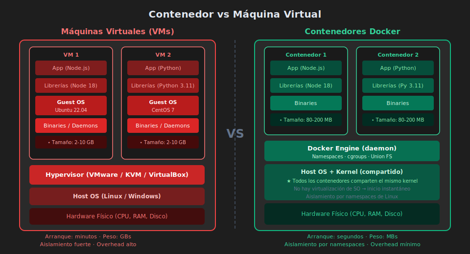
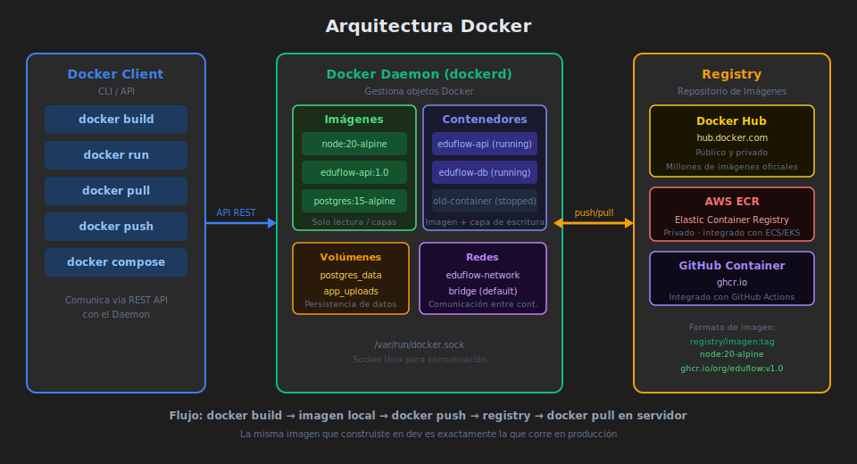

# 🐳 Docker y Contenedores

> _"Con Docker, si funciona en tu máquina, funciona en producción. Esa es la promesa — y se cumple."_

---

## 🎯 ¿Qué es Docker?

### ¿Qué es?

Docker es una plataforma de **containerización** que permite empaquetar una aplicación junto con todas sus dependencias (runtime, librerías, configuración) en una unidad portátil llamada **contenedor**.

Un contenedor es como un proceso aislado que lleva consigo todo lo que necesita para ejecutarse — sin importar el sistema operativo del host.

### ¿Para qué sirve?

- **Eliminar el "en mi máquina funciona"**: el contenedor es idéntico en dev, testing y producción
- **Aislar servicios**: cada microservicio en su propio contenedor con sus dependencias
- **Acelerar onboarding**: nuevo desarrollador levanta el entorno con un comando
- **Despliegue reproducible**: la misma imagen que probaste es la que va a producción

### ¿Qué impacto tiene?

**Si lo aplicas:**

- ✅ Entornos 100% reproducibles
- ✅ Despliegues consistentes y predecibles
- ✅ Escala horizontal fácil (múltiples instancias idénticas)

**Si no lo aplicas:**

- ❌ Horas perdidas en "¿qué versión tienes de Node?"
- ❌ Bugs que aparecen solo en producción
- ❌ Procesos de deploy frágiles y manuales

---

## 🔄 Contenedor vs Máquina Virtual

<!-- Diagrama: 0-assets/03-contenedor-vs-vm.svg -->



| Característica   | Máquina Virtual            | Contenedor                            |
| ---------------- | -------------------------- | ------------------------------------- |
| **Aislamiento**  | SO completo separado       | Proceso aislado, kernel compartido    |
| **Tamaño**       | GBs (incluye SO)           | MBs (solo la app y deps)              |
| **Arranque**     | Minutos                    | Segundos (o milisegundos)             |
| **Portabilidad** | Limitada (tamaño, formato) | Alta (corre donde hay Docker)         |
| **Overhead**     | Alto (hypervisor)          | Bajo (namespaces del kernel)          |
| **Seguridad**    | Fuerte aislamiento de SO   | Menor aislamiento (kernel compartido) |

**¿Cuándo usar VMs?**: entornos que requieren aislamiento fuerte de SO, sistemas operativos diferentes en el mismo host.

**¿Cuándo usar contenedores?**: la gran mayoría de aplicaciones web, microservicios, CI/CD pipelines.

---

## 🏗️ Arquitectura de Docker

<!-- Diagrama: 0-assets/02-docker-arquitectura.svg -->



### Componentes principales

**Docker Client** (`docker`): la CLI con la que interactúas.

```bash
docker build .          # construir imagen
docker run myapp        # crear y ejecutar contenedor
docker ps               # listar contenedores activos
docker images           # listar imágenes locales
```

**Docker Daemon** (`dockerd`): el proceso que gestiona imágenes, contenedores, redes y volúmenes.

**Docker Registry**: repositorio de imágenes. Docker Hub es el público principal. También existen registros privados (AWS ECR, Google Artifact Registry, GitHub Container Registry).

---

## 📄 Dockerfile — Construir Imágenes

Un **Dockerfile** es el recetario para construir una imagen Docker. Cada instrucción crea una **capa** inmutable que puede reutilizarse con cache.

### Ejemplo básico para EduFlow API

```dockerfile
# ❌ Versión básica (funciona pero no recomendada para producción)
FROM node:20
WORKDIR /app
COPY . .
RUN npm install
EXPOSE 3000
CMD ["node", "server.js"]
```

**Problemas de este Dockerfile**:

1. `node:20` pesa ~1GB — usa `node:20-alpine` (~180MB)
2. `npm install` en lugar de `pnpm install`
3. Copia todo antes de instalar deps — invalida el cache si cambia cualquier archivo
4. Corre como root — riesgo de seguridad
5. No tiene health check

### Dockerfile optimizado (multi-stage)

```dockerfile
# ✅ Dockerfile optimizado para EduFlow API

# ═══════════════════════════════════════════
# STAGE 1: Instalar dependencias (deps)
# Solo se reconstruye si cambia package.json
# ═══════════════════════════════════════════
FROM node:20-alpine AS deps

# Instalar pnpm (gestor de paquetes del bootcamp)
RUN npm install -g pnpm@8

WORKDIR /app

# Copiar SOLO archivos de dependencias primero
# Esto maximiza el cache de Docker
COPY package.json pnpm-lock.yaml ./

# Instalar solo dependencias de producción
RUN pnpm install --frozen-lockfile --prod

# ═══════════════════════════════════════════
# STAGE 2: Imagen final de producción
# Solo toma node_modules del stage anterior
# ═══════════════════════════════════════════
FROM node:20-alpine AS production

# Metadatos de la imagen
LABEL maintainer="EduFlow Team"
LABEL version="1.0"

WORKDIR /app

# Crear usuario no-root por seguridad
RUN addgroup -S eduflow && adduser -S eduflow -G eduflow

# Copiar node_modules del stage de deps (no re-instalamos)
COPY --from=deps /app/node_modules ./node_modules

# Copiar el código fuente
COPY --chown=eduflow:eduflow . .

# Cambiar al usuario no-root
USER eduflow

# Exponer el puerto que usa la app
EXPOSE 3000

# Health check integrado en la imagen
HEALTHCHECK --interval=30s --timeout=5s --start-period=10s --retries=3 \
  CMD wget -qO- http://localhost:3000/health || exit 1

# Comando de inicio
CMD ["node", "server.js"]
```

### ¿Por qué multi-stage?

```
Sin multi-stage:
  Imagen final incluye: node_modules de dev + herramientas de build + archivos temporales
  Resultado: ~500-800MB

Con multi-stage:
  Stage 1 (deps): instala TODAS las deps incluyendo devDependencies
  Stage 2 (prod): SOLO copia node_modules de producción
  Resultado: ~120-180MB
```

---

## 🚫 .dockerignore — Excluir del Contexto

Tan importante como el `.gitignore`. Sin él, Docker sube todo al daemon — incluyendo `node_modules` de 400MB.

```
# .dockerignore — para EduFlow API

# Dependencias (las instalamos dentro del contenedor)
node_modules/
.pnpm-store/

# Variables de entorno con secretos reales
.env
.env.local
.env.production

# Archivos de desarrollo
*.log
npm-debug.log*
pnpm-debug.log*

# Control de versiones
.git/
.gitignore

# Documentación y assets no necesarios en runtime
README.md
docs/
*.md

# Archivos de testing
__tests__/
*.test.js
*.spec.js
coverage/

# SO y editores
.DS_Store
.vscode/
*.swp
```

---

## 📦 Docker Compose — Aplicaciones Multi-servicio

Una aplicación real rara vez es un solo servicio. EduFlow necesita al menos: API + PostgreSQL.

**Docker Compose** define y gestiona stacks multi-contenedor con un archivo YAML.

```yaml
# docker-compose.yml para EduFlow

# Versión del formato Compose
version: "3.8"

services:
  # ─────────────────────────────────────
  # Servicio 1: Base de datos PostgreSQL
  # ─────────────────────────────────────
  db:
    image: postgres:15-alpine
    container_name: eduflow-db
    environment:
      POSTGRES_DB: ${POSTGRES_DB:-eduflow}
      POSTGRES_USER: ${POSTGRES_USER:-eduflow}
      POSTGRES_PASSWORD: ${POSTGRES_PASSWORD}
    ports:
      - "5432:5432" # solo para desarrollo local
    volumes:
      - postgres_data:/var/lib/postgresql/data # datos persistentes
      - ./scripts/init.sql:/docker-entrypoint-initdb.d/init.sql # migraciones iniciales
    healthcheck:
      test: ["CMD-SHELL", "pg_isready -U ${POSTGRES_USER:-eduflow}"]
      interval: 10s
      timeout: 5s
      retries: 5
    networks:
      - eduflow-network

  # ─────────────────────────────────────
  # Servicio 2: API de EduFlow
  # ─────────────────────────────────────
  api:
    build:
      context: .
      dockerfile: Dockerfile
      target: production # usar stage de producción
    container_name: eduflow-api
    environment:
      NODE_ENV: ${NODE_ENV:-production}
      PORT: ${PORT:-3000}
      DATABASE_URL: postgresql://${POSTGRES_USER:-eduflow}:${POSTGRES_PASSWORD}@db:5432/${POSTGRES_DB:-eduflow}
    ports:
      - "${PORT:-3000}:3000"
    depends_on:
      db:
        condition: service_healthy # espera a que PostgreSQL esté listo
    networks:
      - eduflow-network
    restart: unless-stopped

# ─────────────────────────────────────
# Volúmenes nombrados (datos persistentes)
# ─────────────────────────────────────
volumes:
  postgres_data:
    name: eduflow_postgres_data

# ─────────────────────────────────────
# Red interna (los servicios se comunican por nombre)
# ─────────────────────────────────────
networks:
  eduflow-network:
    name: eduflow_network
```

```bash
# .env.example — variables requeridas
# Copiar a .env y completar los valores reales

# Puerto de la API
PORT=3000

# Ambiente
NODE_ENV=development

# PostgreSQL
POSTGRES_DB=eduflow
POSTGRES_USER=eduflow
POSTGRES_PASSWORD=   # <--- COMPLETAR, nunca commitear el valor real
```

### Comandos esenciales de Docker Compose

```bash
# Construir imágenes y levantar servicios en background
docker compose up --build -d

# Ver logs en tiempo real
docker compose logs -f

# Ver logs de un servicio específico
docker compose logs -f api

# Listar servicios y su estado
docker compose ps

# Ejecutar comando dentro de un contenedor
docker compose exec api node scripts/migrate.js

# Acceder a la shell del contenedor de la BD
docker compose exec db psql -U eduflow -d eduflow

# Detener servicios (mantiene volúmenes)
docker compose down

# Detener servicios Y borrar volúmenes (⚠️ pierde datos)
docker compose down -v

# Reconstruir solo un servicio
docker compose build api
docker compose up -d --no-deps api
```

---

## 🌐 Redes en Docker

Docker crea redes virtuales que aíslan la comunicación entre contenedores:

```yaml
# Con la config anterior, la API se conecta a PostgreSQL así:
# Host: "db"  (nombre del servicio en docker-compose.yml)
# Puerto: 5432

DATABASE_URL=postgresql://eduflow:password@db:5432/eduflow
#                                              ^^
#                              Nombre del servicio, no "localhost"
```

**Regla**: dentro de Docker Compose, los servicios se comunican usando el **nombre del servicio** como hostname — no `localhost`.

---

## 📊 Volúmenes — Persistencia de Datos

```yaml
volumes:
  postgres_data: # Volumen nombrado — Docker gestiona dónde vive en el host
```

```bash
# Ver volúmenes en el sistema
docker volume ls

# Inspeccionar dónde está un volumen
docker volume inspect eduflow_postgres_data

# Backup de una base de datos PostgreSQL dockerizada
docker compose exec db pg_dump -U eduflow eduflow > backup.sql

# Restaurar
docker compose exec -T db psql -U eduflow eduflow < backup.sql
```

**Tipos de volúmenes**:

- **Named volume** (`postgres_data:/var/lib/...`): Docker decide la ubicación — recomendado para datos
- **Bind mount** (`./local:/container`): ruta específica del host — útil para código en desarrollo

---

## 🏆 Buenas Prácticas para Producción

```dockerfile
# ✅ 1. Usar tags específicos, nunca "latest"
FROM node:20.11.1-alpine3.19  # reproducible

# ✅ 2. Un proceso por contenedor
# NO: un contenedor con Node.js + PostgreSQL + Redis
# SÍ: tres contenedores separados

# ✅ 3. Configuración desde variables de entorno
ENV NODE_ENV=production
# Los valores reales vienen de docker-compose o el orquestador

# ✅ 4. Copiar solo lo necesario
COPY --chown=node:node src/ ./src/
COPY --chown=node:node server.js .
# No copiar tests, docs, .git, etc.

# ✅ 5. Graceful shutdown
process.on('SIGTERM', async () => {
  console.log('🔄 Señal SIGTERM recibida, cerrando servidor...');
  await server.close();
  await pool.end();
  process.exit(0);
});
```

---

## 📌 Comandos Docker de Referencia Rápida

```bash
# Imágenes
docker build -t eduflow-api .          # construir imagen
docker images                          # listar imágenes
docker rmi eduflow-api                 # eliminar imagen
docker pull postgres:15-alpine         # descargar imagen del registry

# Contenedores
docker run -p 3000:3000 eduflow-api    # ejecutar contenedor
docker ps                              # contenedores activos
docker ps -a                           # todos los contenedores
docker stop <container-id>             # detener
docker rm <container-id>               # eliminar
docker exec -it <id> sh                # shell interactiva

# Limpieza
docker system prune -af                # ⚠️ elimina todo lo no usado
docker volume prune                    # eliminar volúmenes no usados
docker image prune                     # eliminar imágenes sin usar
```

---

## 🔗 Navegación

| ← Anterior                                                                  | Siguiente →                                     |
| --------------------------------------------------------------------------- | ----------------------------------------------- |
| [01 — Cloud Computing: IaaS, PaaS, SaaS](01-cloud-computing-fundamentos.md) | [03 — Serverless y FaaS](03-serverless-faas.md) |
