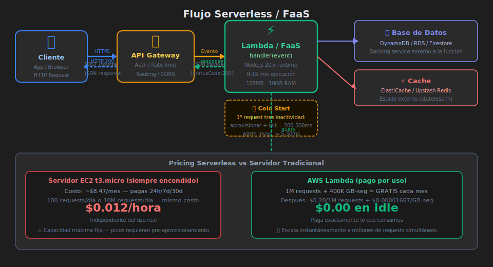

# ⚡ Serverless y Functions as a Service (FaaS)

> _"Serverless no significa que no haya servidores — significa que no son tu problema."_

---

## 🎯 ¿Qué es Serverless?

### ¿Qué es?

Serverless es un modelo de ejecución en la nube donde **el proveedor gestiona completamente la infraestructura del servidor**: escalado, disponibilidad, parcheo y aprovisionamiento.

Tú escribes código en forma de **funciones** (handlers) que se ejecutan en respuesta a **eventos** (HTTP request, cambio en BD, mensaje en cola, timer). Solo pagas por el tiempo exacto de ejecución.

```
Modelo tradicional: servidor siempre encendido → pagas 24/7
Modelo serverless: función ejecuta cuando hay evento → pagas ms de ejecución
```

### ¿Para qué sirve?

- **APIs con tráfico variable**: spikes de Black Friday sin pre-aprovisionar
- **Procesamiento de eventos**: transformar imágenes cuando se suben, enviar emails, notificaciones
- **Automatizaciones**: cron jobs, webhooks, integraciones con terceros
- **Backends de baja frecuencia**: MVPs, funcionalidades secundarias

### ¿Qué impacto tiene?

**Si lo usas bien:**

- ✅ Costo casi cero en tráfico bajo (AWS Lambda: 1M requests gratis/mes)
- ✅ Escala automáticamente de 0 a millones de requests
- ✅ Sin operational overhead (no parchear SO, no configurar auto-scaling)

**Si no lo aplicas:**

- ❌ Servidor EC2 encendido costando $50/mes para 100 requests/día
- ❌ Sobrecarga operacional gestionando infraestructura para lógica simple

---

## 🔄 El Modelo Evento-Respuesta

<!-- Diagrama: 0-assets/04-serverless-flujo.svg -->



### Cómo funciona una función serverless

```
1. Cliente envía request HTTP
2. API Gateway recibe el request y lo transforma en un evento
3. El proveedor aprovisiona un entorno de ejecución (si no hay uno caliente)
4. La función se ejecuta con el evento como input
5. La función retorna una respuesta
6. API Gateway transforma la respuesta y la envía al cliente
7. Si no hay más requests, el entorno se "congela" o se destruye
```

### Anatomía de una función AWS Lambda (Node.js)

```javascript
// handler.js — AWS Lambda function para EduFlow
// Obtener todos los cursos activos

// El handler es una función pura: recibe evento, retorna respuesta
export const handler = async (event) => {
  // "event" contiene todo: path, method, headers, body, query params
  const { httpMethod, pathParameters, body } = event;

  // No hay servidor HTTP — no hay app.listen()
  // No hay Express — solo lógica de negocio

  try {
    if (httpMethod === "GET" && !pathParameters?.id) {
      // Listar todos los cursos
      const courses = await getCourses();
      return {
        statusCode: 200,
        headers: { "Content-Type": "application/json" },
        body: JSON.stringify(courses),
      };
    }

    if (httpMethod === "GET" && pathParameters?.id) {
      // Obtener curso por ID
      const course = await getCourseById(pathParameters.id);
      if (!course) {
        return {
          statusCode: 404,
          body: JSON.stringify({ error: "Curso no encontrado" }),
        };
      }
      return {
        statusCode: 200,
        body: JSON.stringify(course),
      };
    }

    return {
      statusCode: 405,
      body: JSON.stringify({ error: "Método no permitido" }),
    };
  } catch (error) {
    console.error("Error en handler:", error);
    return {
      statusCode: 500,
      body: JSON.stringify({ error: "Error interno del servidor" }),
    };
  }
};
```

---

## 🌐 Plataformas Serverless Principales

### AWS Lambda

El servicio FaaS más usado del mundo.

```javascript
// Configuración en serverless.yml (Serverless Framework)
// No necesitas docker-compose ni Dockerfile

/*
service: eduflow-api

provider:
  name: aws
  runtime: nodejs20.x
  region: us-east-1
  environment:
    DATABASE_URL: ${env:DATABASE_URL}

functions:
  getCourses:
    handler: src/handlers/courses.handler
    events:
      - http:
          path: /courses
          method: GET
      - http:
          path: /courses/{id}
          method: GET

  createCourse:
    handler: src/handlers/courses.createHandler
    events:
      - http:
          path: /courses
          method: POST
*/

// src/handlers/courses.js
import { CourseApplicationService } from "../application/course-application-service.js";
import { DynamoDBCourseRepository } from "../infrastructure/dynamodb-course-repository.js";

// La función se inicializa fuera del handler para reutilizarse entre invocaciones
const repository = new DynamoDBCourseRepository();
const courseService = new CourseApplicationService(repository);

export const handler = async (event) => {
  const courses = await courseService.getAllCourses();
  return {
    statusCode: 200,
    body: JSON.stringify(courses),
  };
};
```

**Pricing AWS Lambda**:

- Primeras **1 millón de requests/mes**: gratis
- Primeras **400,000 GB-segundos de cómputo/mes**: gratis
- Después: $0.20 por millón de requests + $0.0000166667 por GB-segundo

### Vercel Edge Functions

Ideal para proyectos JavaScript/TypeScript frontend+backend.

```javascript
// api/courses.js — Vercel serverless function
// Ruta automática: /api/courses

// Vercel no usa el formato de Lambda — usa el estándar de Request/Response
export default async function handler(req, res) {
  if (req.method !== "GET") {
    return res.status(405).json({ error: "Método no permitido" });
  }

  try {
    // Variables de entorno configuradas en el dashboard de Vercel
    const courses = await fetchCoursesFromDB(process.env.DATABASE_URL);
    return res.status(200).json(courses);
  } catch (error) {
    return res.status(500).json({ error: "Error interno" });
  }
}
```

### Google Cloud Functions

```javascript
// index.js — Google Cloud Function
import { http } from "@google-cloud/functions-framework";

// Registro de la función HTTP
http("getCourses", async (req, res) => {
  if (req.method !== "GET") {
    return res.status(405).send("Method Not Allowed");
  }

  const courses = await getCourses();
  res.json(courses);
});
```

---

## 🧊 El Problema del Cold Start

Cuando una función no ha recibido requests en un tiempo, el proveedor destruye su entorno de ejecución. La próxima invocación debe **arrancar desde cero**: descargar código, inicializar runtime, conectar a BD — esto es el **cold start**.

```
Cold start típicos:
  Node.js en Lambda: 200-500ms
  Node.js en Lambda (con VPC): 500ms - 2s
  Python en Lambda: 100-300ms
  Java en Lambda: 2-8s ← el peor caso

Warm invocation (función "caliente"):
  Node.js: 5-50ms
```

### Estrategias para mitigar cold starts

```javascript
// 1. Inicializar conexiones FUERA del handler
// Se reutilizan entre invocaciones en el mismo contenedor "caliente"

// ❌ Mal: conexión dentro del handler (nueva en cada invocación)
export const handler = async (event) => {
  const pool = new Pool({ connectionString: process.env.DATABASE_URL });
  const result = await pool.query("SELECT * FROM courses");
  await pool.end();
  return { statusCode: 200, body: JSON.stringify(result.rows) };
};

// ✅ Bien: conexión fuera del handler (reutilizada si el contenedor está caliente)
const pool = new Pool({
  connectionString: process.env.DATABASE_URL,
  max: 1, // Lambda: máximo 1 conexión por instancia
  idleTimeoutMillis: 120000,
});

export const handler = async (event) => {
  const result = await pool.query("SELECT * FROM courses");
  return { statusCode: 200, body: JSON.stringify(result.rows) };
};
```

```javascript
// 2. Usar images Lambda para reducir cold start
// (empaquetar todas las deps en una imagen Docker personalizada)

// 3. Habilitar Provisioned Concurrency en Lambda
// Mantiene N instancias siempre "calientes" (costo adicional)

// 4. Usar funciones edge (Vercel, Cloudflare Workers)
// Se ejecutan en nodos cercanos al usuario, cold start <5ms
```

---

## ⚖️ Cuándo Usar Serverless (y cuándo no)

### ✅ Serverless es ideal para:

| Caso                         | Razón                                      |
| ---------------------------- | ------------------------------------------ |
| Tráfico impredecible / picos | Escala de 0 a millones automáticamente     |
| Eventos asíncronos           | Procesar imágenes, enviar emails, webhooks |
| APIs con poco tráfico        | Costo mínimo en idle                       |
| Funcionalidades secundarias  | Notificaciones, reportes, integraciones    |
| Prototipado rápido           | Sin configurar infraestructura             |

### ❌ Serverless NO es ideal para:

| Caso                        | Razón                                                                 |
| --------------------------- | --------------------------------------------------------------------- |
| Procesos de larga ejecución | Lambda tiene límite de 15 minutos                                     |
| Streaming de datos          | No apto para conexiones persistentes (WebSockets tienen limitaciones) |
| Alto volumen constante      | Un servidor puede ser más barato que millones de invocaciones         |
| Estado en memoria           | Cada invocación puede ser una instancia diferente                     |
| Latencia estricta           | Cold starts son impredecibles                                         |

```javascript
// Ejemplo: cuándo serverless NO conviene
// Procesamiento de video de 30 minutos → usar un worker en EC2 o un Container Job

// Cuándo CONVIENE:
// Enviar email de bienvenida cuando un usuario se registra → Lambda perfecta
```

---

## 🔄 Serverless vs Contenedores vs Servidores Tradicionales

| Característica         | Servidor Tradicional        | Contenedor (ECS/K8s)    | Serverless               |
| ---------------------- | --------------------------- | ----------------------- | ------------------------ |
| **Gestión**            | Alto overhead               | Medio overhead          | Ninguno                  |
| **Escalabilidad**      | Manual                      | Automática (con config) | Automática e instantánea |
| **Cold start**         | Ninguno                     | Segundos                | Milisegundos-segundos    |
| **Estado**             | En memoria                  | En memoria              | No recomendado           |
| **Costo base**         | Siempre pagando             | Siempre pagando         | Solo en ejecución        |
| **Debugging**          | Fácil                       | Medio                   | Difícil                  |
| **Long-running tasks** | ✅                          | ✅                      | ❌ (limitado)            |
| **Picos de tráfico**   | ❌ (requiere planificación) | ✅                      | ✅                       |

---

## 🛠️ Simulación Local de Serverless

Para desarrollar funciones serverless localmente sin deployar:

```javascript
// local-server.js — simular Lambda localmente con Express
// Solo para desarrollo — no va a producción

import express from "express";
import { handler } from "./src/handlers/courses.js";

const app = express();
app.use(express.json());

// Adaptar requests Express al formato de eventos Lambda
const expressToLambdaEvent = (req) => ({
  httpMethod: req.method,
  path: req.path,
  pathParameters: req.params,
  queryStringParameters: req.query,
  headers: req.headers,
  body: req.body ? JSON.stringify(req.body) : null,
});

app.all("/api/*", async (req, res) => {
  const event = expressToLambdaEvent(req);
  const response = await handler(event);

  res
    .status(response.statusCode)
    .set(response.headers || {})
    .send(response.body);
});

app.listen(3001, () => {
  console.log("🔬 Simulador serverless corriendo en puerto 3001");
});
```

```bash
# Herramientas para desarrollo local serverless:
# AWS SAM Local: simula Lambda y API Gateway localmente
# sam local start-api

# Serverless Framework offline:
# pnpm add -D serverless-offline
# serverless offline
```

---

## 📌 Conceptos Clave para Recordar

```
Serverless = sin administrar servidores, no "sin servidores"
Handler = función pura: (evento) => respuesta
Cold start = primer arranque tras inactividad (latencia extra)
FaaS = Functions as a Service (Lambda, Cloud Functions, Azure Functions)
Event-driven = la función solo ejecuta cuando hay un evento

AWS Lambda límites importantes:
  - Tiempo máximo: 15 minutos
  - Memoria: 128MB - 10GB
  - Tamaño de payload: 6MB (sincrónico) / 256KB (async)
  - Concurrencia por defecto: 1,000 ejecuciones simultáneas por región
```

---

## 🔗 Navegación

| ← Anterior                                              | Siguiente →                                                      |
| ------------------------------------------------------- | ---------------------------------------------------------------- |
| [02 — Docker y Contenedores](02-docker-contenedores.md) | [04 — Cloud Native y 12-Factor App](04-cloud-native-12factor.md) |
