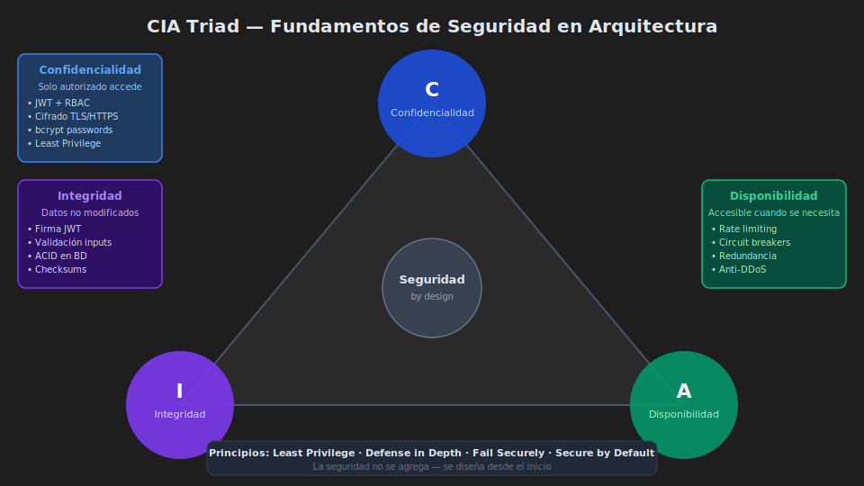

# 🛡️ Fundamentos de Seguridad: CIA Triad y Principios

> _"La seguridad no se agrega al sistema — se diseña dentro de él."_

---

## 🎯 ¿Qué es la Seguridad en Arquitectura?

### ¿Qué es?

La seguridad en arquitectura de software es el conjunto de **principios, patrones y decisiones de diseño** que permiten que un sistema proteja sus datos, funciones y disponibilidad contra amenazas. No es una capa que se agrega al final — es una **propiedad arquitectónica transversal** que se considera desde el primer diagrama.

### ¿Para qué sirve?

- **Proteger datos sensibles**: información de usuarios, transacciones, secretos de negocio
- **Garantizar continuidad del servicio**: el sistema sigue funcionando bajo ataque
- **Cumplir regulaciones**: GDPR, PCI DSS, HIPAA, Ley 1581 en Colombia
- **Ganar confianza**: los usuarios y clientes confían en sistemas que protegen su información

### ¿Qué impacto tiene?

**Si diseñas con seguridad desde el inicio:**

- ✅ Costo de corrección: bajo (prevenir es 100x más barato que remediar)
- ✅ Menos incidentes de seguridad y su impacto reputacional
- ✅ Auditorías de seguridad aprobadas
- ✅ Usuarios y clientes con confianza en el sistema

**Si ignoras la seguridad:**

- ❌ Un breach de datos promedio cuesta **$4.45 millones USD** (IBM, 2023)
- ❌ Datos de usuarios expuestos, multas regulatorias
- ❌ Reputación destruida (Equifax, Yahoo, Cambridge Analytica)
- ❌ Tiempo y costo 100x mayor para remediar vulnerabilidades tardíamente

---

## 🔺 La Triada CIA

<!-- Diagrama: 0-assets/01-cia-triad.svg -->



La CIA Triad es el **framework fundamental** de seguridad. Todo sistema seguro debe garantizar los tres vértices:

### C — Confidencialidad (Confidentiality)

**¿Qué es?** Solo las personas autorizadas pueden acceder a la información.

**En arquitectura de software:**

- Cifrado en tránsito (TLS/HTTPS) y en reposo (AES-256)
- Control de acceso basado en roles (RBAC)
- Principio de mínimo privilegio: cada componente accede solo a lo que necesita

**Ejemplo real:** Las contraseñas en la base de datos de EduFlow deben estar hasheadas con bcrypt, no en texto plano. Si la BD se filtra, los atacantes no obtienen contraseñas usables.

```javascript
// ❌ MAL — Contraseña en texto plano
const user = { email: "ana@sena.edu.co", password: "mipass123" };

// ✅ BIEN — Hash con bcrypt (costo computacional deliberado)
import bcrypt from "bcrypt";
const SALT_ROUNDS = 12; // Mayor = más seguro pero más lento
const passwordHash = await bcrypt.hash("mipass123", SALT_ROUNDS);
```

---

### I — Integridad (Integrity)

**¿Qué es?** La información no ha sido modificada de forma no autorizada.

**En arquitectura de software:**

- Firma digital de mensajes (JWT usa HMAC-SHA256 o RSA)
- Checksums y validación de entradas
- Transacciones de base de datos (ACID)
- Auditoría de cambios (audit logs)

**Ejemplo real:** Un JWT firmado garantiza que el payload (con el rol del usuario) no ha sido manipulado por el cliente entre peticiones.

```javascript
// El servidor firma el token con una clave secreta
// Si alguien modifica el payload, la firma no coincidirá
const token = jwt.sign(
  { userId: "123", role: "student" },
  process.env.JWT_SECRET, // Solo el servidor conoce este secreto
  { expiresIn: "15m" },
);

// Verificación: si el payload fue modificado, lanza error
try {
  const decoded = jwt.verify(token, process.env.JWT_SECRET);
  // decoded = { userId: '123', role: 'student', iat: ..., exp: ... }
} catch (err) {
  // JsonWebTokenError: invalid signature
}
```

---

### A — Disponibilidad (Availability)

**¿Qué es?** El sistema está accesible cuando los usuarios autorizados lo necesitan.

**En arquitectura de software:**

- Rate limiting: limitar el número de requests por cliente
- Circuit breakers: evitar que un servicio caído afecte todo el sistema
- Redundancia y replicación
- Protección contra DDoS (a nivel de infraestructura)

**Ejemplo real:** Sin rate limiting, un atacante puede hacer 10,000 intentos de login por segundo (ataque de fuerza bruta), agotando los recursos del servidor.

```javascript
import rateLimit from "express-rate-limit";

// Máximo 5 intentos de login por IP en 15 minutos
const loginLimiter = rateLimit({
  windowMs: 15 * 60 * 1000, // 15 minutos
  max: 5,
  standardHeaders: true,
  message: {
    error: "Demasiados intentos de login. Intenta en 15 minutos.",
  },
});

app.use("/auth/login", loginLimiter);
```

---

## 🧱 Principios Fundamentales de Seguridad

### 1. Least Privilege (Mínimo Privilegio)

Cada componente, usuario o proceso debe tener **solo los permisos que necesita** para cumplir su función, y nada más.

**En código:**

```javascript
// ❌ MAL — El usuario de la BD tiene acceso total
const pool = new pg.Pool({
  user: "postgres", // superusuario con acceso a todo
  database: "eduflow",
});

// ✅ BIEN — Usuario con solo los permisos necesarios
const pool = new pg.Pool({
  user: "eduflow_app", // usuario con GRANT SELECT, INSERT, UPDATE, DELETE
  database: "eduflow", // solo en las tablas que necesita
});
```

**En arquitectura:**

- Los microservicios acceden solo a su propia base de datos
- Las funciones lambda tienen IAM roles con permisos mínimos
- Los containers corren como usuarios no-root (ya lo vimos en semana 07)

---

### 2. Defense in Depth (Defensa en Profundidad)

No depender de una única capa de seguridad. Si una falla, las demás siguen protegiendo.

```
Cliente
  ↓
[HTTPS/TLS]           ← Capa 1: Cifrado en tránsito
  ↓
[Rate Limiting]       ← Capa 2: Protección contra fuerza bruta
  ↓
[Helmet.js]           ← Capa 3: Headers de seguridad HTTP
  ↓
[Autenticación JWT]   ← Capa 4: Verificar identidad
  ↓
[Autorización RBAC]   ← Capa 5: Verificar permisos
  ↓
[Validación entradas] ← Capa 6: Sanitizar datos del cliente
  ↓
[Consultas parametrizadas] ← Capa 7: Contra SQL Injection
  ↓
[Datos en BD cifrados] ← Capa 8: Protección en reposo
```

Si el atacante evade la capa 1 (intercepta HTTPS con un cert falso), todavía enfrenta 7 capas más.

---

### 3. Fail Securely (Fallar Seguro)

Cuando el sistema falla, debe hacerlo de forma que **no exponga información sensible** ni deje el sistema en un estado inseguro.

```javascript
// ❌ MAL — Revela información del sistema en errores
app.use((err, req, res, next) => {
  res.status(500).json({
    error: err.message,
    stack: err.stack, // Expone estructura interna
    query: err.query, // Puede revelar SQL
  });
});

// ✅ BIEN — Error genérico para el cliente, log completo interno
app.use((err, req, res, next) => {
  // Log completo solo en el servidor
  console.error({
    message: err.message,
    stack: err.stack,
    requestId: req.id,
    timestamp: new Date().toISOString(),
  });

  // Respuesta genérica al cliente
  res.status(500).json({
    error: "Error interno del servidor",
    requestId: req.id, // Para correlacionar con logs sin revelar detalles
  });
});
```

**Por defecto, denegar acceso** cuando hay ambigüedad:

```javascript
// ❌ MAL — Por defecto permite
const canAccess = user.role === "admin" ? true : undefined;
if (canAccess !== false) {
  /* permite */
} // ← undefined pasa!

// ✅ BIEN — Por defecto deniega
const canAccess = user.role === "admin";
if (!canAccess) {
  return res.status(403).json({ error: "Acceso denegado" });
}
```

---

### 4. Secure by Default (Seguro por Defecto)

La configuración predeterminada debe ser la más segura posible.

```javascript
// ❌ MAL — CORS abierto por defecto
app.use(cors()); // Permite cualquier origen

// ✅ BIEN — CORS restrictivo, se abre solo lo necesario
app.use(
  cors({
    origin: process.env.ALLOWED_ORIGINS?.split(",") ?? [],
    methods: ["GET", "POST", "PUT", "DELETE"],
    allowedHeaders: ["Content-Type", "Authorization"],
    credentials: true,
  }),
);
```

---

## 🗺️ Superficies de Ataque

Una **superficie de ataque** es el conjunto de puntos donde un atacante puede intentar ingresar al sistema.

**Como arquitecto, tu objetivo es minimizar la superficie de ataque:**

| Superficie                  | Riesgo                      | Mitigación                                          |
| --------------------------- | --------------------------- | --------------------------------------------------- |
| Endpoints HTTP expuestos    | Acceso no autorizado        | Autenticación + autorización en todos los endpoints |
| Dependencias (npm packages) | Vulnerabilidades conocidas  | `pnpm audit`, actualizaciones regulares             |
| Variables de entorno        | Filtración de secretos      | Vault, variables de entorno del SO, nunca en código |
| Errores verbose             | Descubrimiento de sistema   | Manejo de errores seguro (Fail Securely)            |
| Puertos abiertos            | Acceso a servicios internos | Expose solo lo necesario en Docker Compose          |
| Logs                        | Filtración de datos         | No loguear contraseñas, tokens o PII                |

---

## 💡 Caso Real: El Ataque a Equifax (2017)

**¿Qué pasó?** Equifax expuso datos de **147 millones de personas** (incluyendo números de seguro social, fechas de nacimiento y direcciones).

**¿Cómo?**

1. Apache Struts tenía una vulnerabilidad conocida (CVE-2017-5638)
2. El parche existía desde **marzo 2017**, pero Equifax no lo aplicó
3. Los atacantes lo explotaron en **julio 2017**

**¿Qué violó la CIA Triad?**

- ❌ **Confidencialidad**: datos personales expuestos
- ❌ **Integridad**: datos potencialmente modificados
- ❌ **Disponibilidad**: servicio afectado por meses

**Costo**: $700 millones en multas, $1.4B en mejoras de seguridad, caída del 30% en el precio de la acción.

**Lección arquitectónica**: Una dependencia desactualizada con vulnerabilidad conocida destruyó la compañía. `pnpm audit` es parte de la arquitectura, no opcional.

---

## 📋 Resumen

| Concepto              | Descripción                   | Ejemplo en EduFlow                  |
| --------------------- | ----------------------------- | ----------------------------------- |
| **Confidencialidad**  | Solo autorizados acceden      | JWT + RBAC, bcrypt para passwords   |
| **Integridad**        | Datos no modificados          | Firma JWT, validación de entradas   |
| **Disponibilidad**    | Sistema siempre accesible     | Rate limiting, circuit breakers     |
| **Least Privilege**   | Mínimos permisos necesarios   | Usuario BD limitado, roles de app   |
| **Defense in Depth**  | Múltiples capas de defensa    | HTTPS + auth + validación + cifrado |
| **Fail Securely**     | Errores sin exponer info      | Mensajes genéricos al cliente       |
| **Secure by Default** | Config más segura por defecto | CORS restrictivo, HTTPS obligatorio |

---

## 🔗 Siguiente Tema

**[→ Autenticación y Autorización: OAuth 2.0 y JWT](02-autenticacion-autorizacion.md)** — La implementación práctica de la confidencialidad e integridad.

---

_Bootcamp de Arquitectura de Software — SENA · bc-channel-epti_
