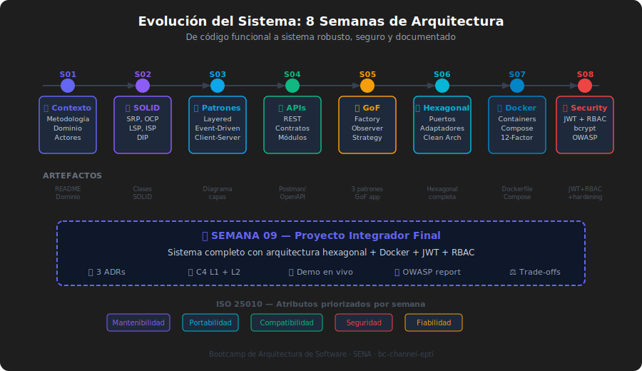

# 🏗️ Síntesis Arquitectónica: 8 Semanas en Perspectiva

> **Duración**: 60 minutos
> **Tipo**: Presencial
> **Semana**: 09

---

## 🎯 Objetivos

Al finalizar este módulo, podrás:

- Trazar la línea de evolución de un sistema arquitectónico a lo largo de 8 semanas
- Explicar cómo cada concepto del bootcamp construye sobre el anterior
- Identificar el "hilo conductor" que une SOLID, patrones, cloud y seguridad
- Articular el razonamiento arquitectónico como una habilidad profesional transferible

---

## 🗺️ La Línea del Tiempo: De 0 a Arquitecto Junior

```
┌──────────────────────────────────────────────────────────────────────────────────┐
│                    EVOLUCIÓN DE UN SISTEMA EN 8 SEMANAS                          │
├────────┬─────────────────────────────────────────────────────────────────────────┤
│ sem 01 │ 📋 Contexto: ¿Qué voy a construir y cómo lo voy a construir?             │
│        │ → Metodología, dominio del negocio, actores, entidades, restricciones   │
│        │ → Artifact: ADR-000 informal (decisión de metodología)                 │
├────────┼─────────────────────────────────────────────────────────────────────────┤
│ sem 02 │ 🧱 Fundamentos: Cada clase tiene UNA razón para cambiar                  │
│        │ → SRP, OCP, LSP, ISP, DIP aplicados al dominio personal                │
│        │ → Artifact: Diagrama de clases con responsabilidades claras            │
├────────┼─────────────────────────────────────────────────────────────────────────┤
│ sem 03 │ 🏛️ Patrón: ¿Cómo organizo las capas del sistema?                         │
│        │ → Layered, Event-Driven, Client-Server — cuándo usar cada uno          │
│        │ → Artifact: Diagrama de capas de la arquitectura elegida               │
├────────┼─────────────────────────────────────────────────────────────────────────┤
│ sem 04 │ 🔌 Contratos: ¿Cómo hablan los módulos entre sí?                         │
│        │ → REST API, síncrono vs. asíncrono, diseño de rutas                    │
│        │ → Artifact: OpenAPI / colección Postman del sistema                   │
├────────┼─────────────────────────────────────────────────────────────────────────┤
│ sem 05 │ 🎨 Patrones GoF: Soluciones probadas a problemas recurrentes             │
│        │ → Factory, Observer, Strategy, Singleton, Decorator                   │
│        │ → Artifact: Al menos 3 patrones GoF aplicados al dominio personal      │
├────────┼─────────────────────────────────────────────────────────────────────────┤
│ sem 06 │ 🔷 Hexagonal: El dominio libre de frameworks                             │
│        │ → Puertos, adaptadores, clean architecture, DDD básico                │
│        │ → Artifact: Arquitectura hexagonal con puertos/adaptadores separados  │
├────────┼─────────────────────────────────────────────────────────────────────────┤
│ sem 07 │ 🐳 Cloud: "Works on my machine" ya no es excusa                          │
│        │ → Docker, Docker Compose, multi-stage builds, 12-factor app           │
│        │ → Artifact: Dockerfile + docker-compose.yml funcionales               │
├────────┼─────────────────────────────────────────────────────────────────────────┤
│ sem 08 │ 🔒 Seguridad: Protect by design, not by afterthought                    │
│        │ → JWT, bcrypt, OAuth2, RBAC, OWASP Top 10, Helmet, rate-limiting      │
│        │ → Artifact: API con autenticación JWT + RBAC + hardening              │
└────────┴─────────────────────────────────────────────────────────────────────────┘
```

---

## 🔗 El Hilo Conductor: SOLID → Todo lo Demás

### ¿Qué es?

SOLID no es solo una lista de principios para clases. Es la **filosofía base** que sustenta todos los patrones y arquitecturas que vinieron después.

### ¿Para qué sirve?

Cuando entiendes SOLID profundamente, los patrones dejan de ser recetas y se vuelven consecuencias naturales de aplicar los principios.

### 💥 ¿Qué impacto tiene?

**Conexión SOLID → Patrones GoF**:

```
SRP → Factory Method (separar creación de uso)
OCP → Strategy (extender sin modificar)
DIP → Observer (depender de abstracción, no implementación)
ISP → Decorator (interfaces pequeñas, composición flexible)
LSP → Template Method (subclases sustituibles por contrato)
```

**Conexión SOLID → Arquitectura Hexagonal**:

```
DIP         → Los puertos SON interfaces que el dominio define
OCP         → Agrega un nuevo adaptador sin tocar el dominio
SRP         → El dominio solo conoce reglas de negocio
           Infraestructura solo sabe de frameworks y BD
```

**Conexión SOLID → Seguridad**:

```
SRP         → TokenService, PasswordService separados
OCP         → Agregar OAuth provider sin cambiar el login use case
DIP         → El domain use case depende de ITokenServicePort,
           no de jsonwebtoken directamente
```

---

## 🏗️ Arquitectura Hexagonal: El Gran Unificador

```
┌───────────────────────────────────────────────────────────┐
│                     MUNDO EXTERIOR                        │
│  HTTP  │  CLI  │  Tests  │  Message Queue  │  Cron Jobs   │
└────────┬──────────────────────────────────────────────────┘
         │  adapters/primary (driving side)
┌────────▼──────────────────────────────────────────────────┐
│              PUERTOS DE ENTRADA (Interfaces)              │
│  IUserRepository  │  ITokenService  │  IEmailService      │
└────────┬──────────────────────────────────────────────────┘
         │
┌────────▼──────────────────────────────────────────────────┐
│                     DOMINIO PURO                          │
│  Entities → Value Objects → Aggregates → Use Cases        │
│  ✅ SIN dependencias externas                             │
│  ✅ Testeable con mocks puros                             │
│  ✅ Estable frente a cambios tecnológicos                  │
└────────┬──────────────────────────────────────────────────┘
         │  adapters/secondary (driven side)
┌────────▼──────────────────────────────────────────────────┐
│           IMPLEMENTACIONES CONCRETAS                      │
│  PostgresUserRepository  │  JWTTokenService  │  SendGrid  │
│  Express Router          │  bcrypt            │  Docker   │
└───────────────────────────────────────────────────────────┘
```

---

## 🎯 La Madurez del Razonamiento Arquitectónico

### Nivel 0 — Junior (inicio del bootcamp)

> _"Hago lo que funciona."_

- Escribe código que resuelve el problema
- No piensa en mantenibilidad ni escalabilidad
- Copia patrones sin entender el por qué

### Nivel 1 — Mid (mitad del bootcamp: semanas 3-5)

> _"Aplico los principios que aprendí."_

- Separa responsabilidades (SRP)
- Usa patrones GoF cuando los reconoce
- Sabe que hay "mejores formas" aunque no siempre las elige correctamente

### Nivel 2 — Arquitecto Junior (al finalizar el bootcamp)

> _"Tomo decisiones informadas con trade-offs explícitos."_

- Elige arquitectura según el contexto del problema
- Documenta por qué eligió X sobre Y con ADRs
- Conoce los límites y costos de cada decisión
- Puede comunicar decisiones técnicas a audiencias no técnicas

### Nivel 3 — Arquitecto Senior (objetivo a 2-3 años)

> _"Diseño para incertidumbre y cambio."_

- Anticipa dónde cambiará el sistema y diseña para eso
- Construye equipos, no solo sistemas
- Gestiona deuda técnica de forma estratégica

---

## 📊 Los 5 Pilares del Bootcamp: Un Mapa Mental

```
                    ARQUITECTURA DE SOFTWARE
                            │
          ┌─────────────────┼─────────────────────┐
          │                 │                     │
    PRINCIPIOS          ESTRUCTURA             CONTEXTO
    (sem 02)           (sem 03-06)            (sem 07-08)
          │                 │                     │
   • SOLID           • Patrones           • Contenedores
   • Cohesión          Clásicos           • Cloud
   • Acoplamiento   • Patrones GoF        • Seguridad CIA
                    • Hexagonal          • OWASP Top 10
                    • Clean Arch
                              │
                        CALIDAD
                       (sem 09)
                              │
                     • Atributos ISO 25010
                     • Trade-offs
                     • Fitness Functions
                     • Documentación ADRs
```

---

## 🔍 Lo Que Aprendiste Sin Darte Cuenta

Más allá de los patrones y arquitecturas, el bootcamp te enseñó:

### 1. Pensar en consecuencias, no solo soluciones

Cada decisión arquitectónica tiene consecuencias. El arquitecto maduro las anticipa y las documenta **antes** de que sean problemas.

### 2. Comunicar decisiones técnicas

Una arquitectura que no puedes explicar es una arquitectura que no puedes defender. El C4 Model y los ADRs son herramientas de comunicación tanto como de documentación.

### 3. El equilibrio entre simplicidad y robustez

```javascript
// La tentación del over-engineering
class AbstractFactoryBuilderSingletonObserverDecoratorFacadeProxy {
  // 🔴 Nadie sabrá qué hace esto en 6 meses
}

// El equilibrio correcto
class UserRegistrationService {
  // ✅ Claro, testeable, extensible cuando SEA necesario
}
```

### 4. La seguridad no es un módulo, es una mentalidad

No implementaste seguridad en la semana 8. Implementaste la **capa de seguridad** en la semana 8. La mentalidad de "¿qué pasa si alguien malicioso usa esto?" debe estar desde la semana 1.

---

## 💡 Preguntas para la Reflexión

Antes de la presentación final, reflexiona sobre estas preguntas:

1. **¿Cuál fue la decisión arquitectónica más difícil que tomaste?** (No la más compleja técnicamente, sino la más difícil de justificar)

2. **¿Qué cambiarías de tu arquitectura si pudieras empezar de cero?** (Honestidad técnica: todos tenemos algo que "haríamos diferente")

3. **¿Tu arquitectura resiste el "test del camión"?** (Si desaparecieras mañana, ¿podría otro developer entender las decisiones que tomaste solo leyendo la documentación?)

4. **¿Dónde es probable que cambie tu sistema en los próximos 12 meses?** (¿Lo diseñaste para absorber ese cambio?)

---

## 📚 Material Visual



---

_Semana 09 · Proyecto Integrador Final · Bootcamp de Arquitectura de Software_
