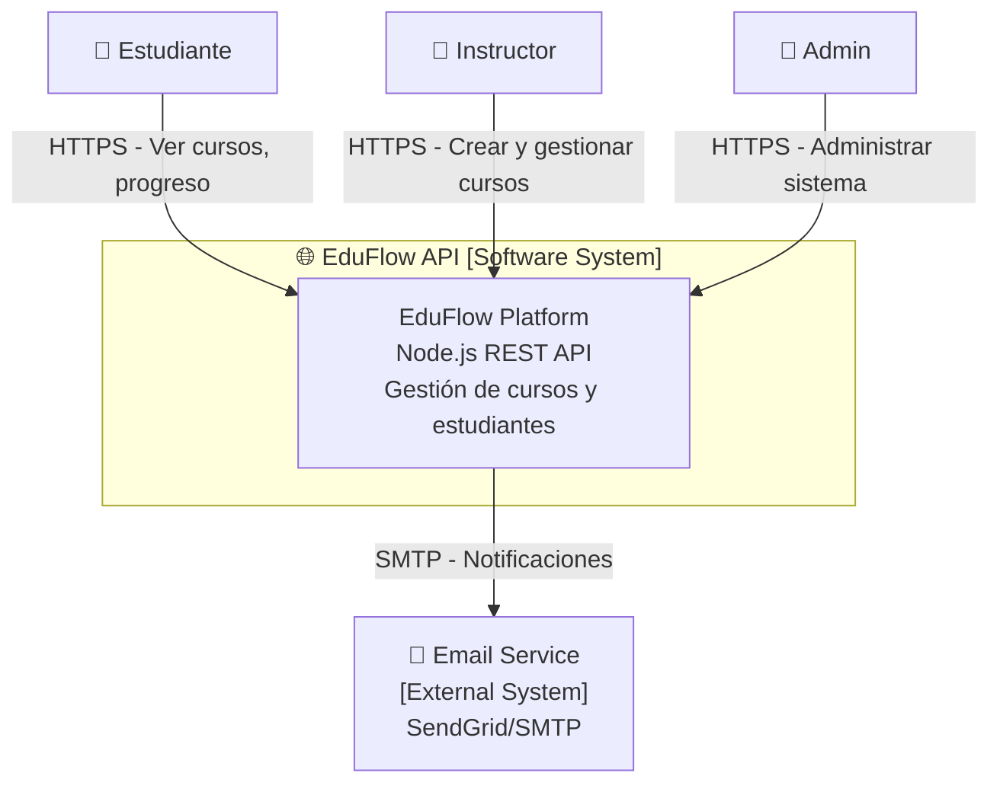
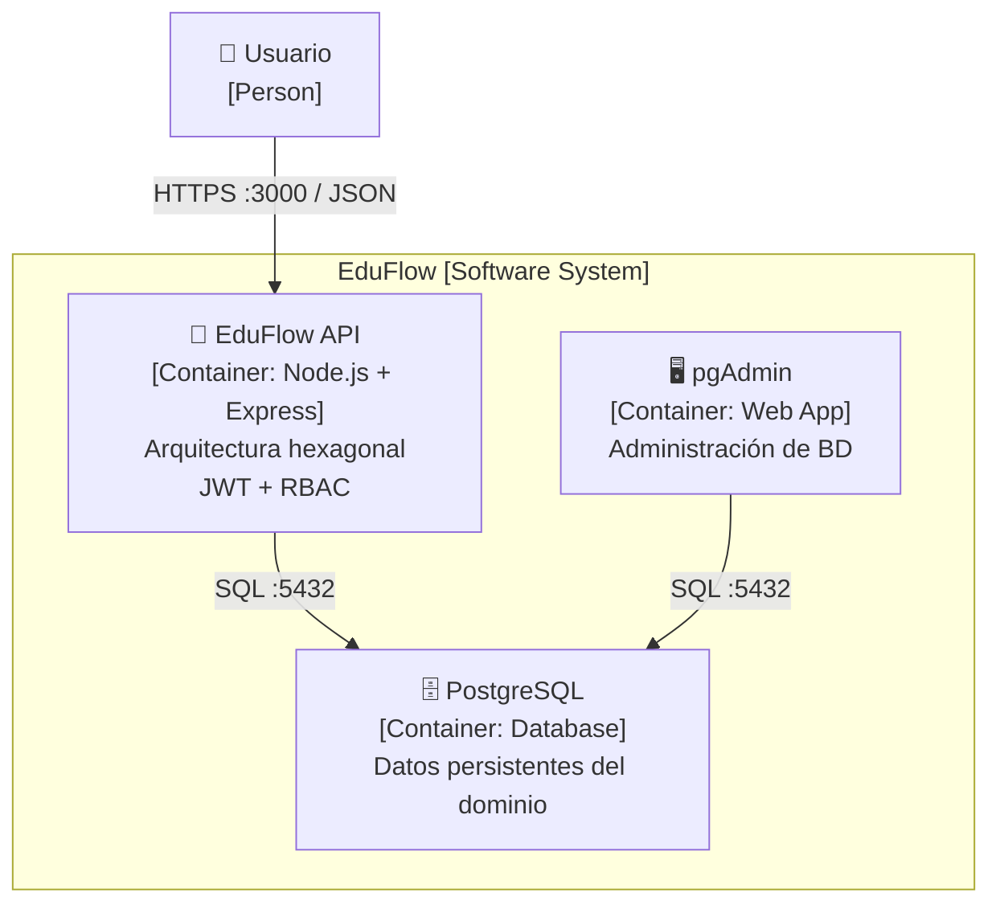
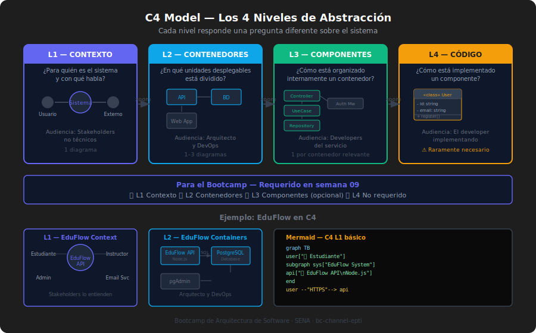

# 📝 Documentación Arquitectónica: ADRs y C4 Model

> **Duración**: 60 minutos
> **Tipo**: Presencial
> **Semana**: 09

---

## 🎯 Objetivos

Al finalizar este módulo, podrás:

- Escribir un ADR (Architecture Decision Record) completo y útil
- Distinguir los 4 niveles del C4 Model y saber cuándo usar cada uno
- Aplicar arc42 lite para documentar un sistema de mediana complejidad
- Entender por qué documentar decisiones es tan importante como tomarlas

---

## 📋 Architecture Decision Records (ADRs)

### 🎯 ¿Qué es un ADR?

Un ADR es un documento corto que captura una **decisión arquitectónica importante**, el **contexto** en que se tomó, las **alternativas consideradas** y las **consecuencias** esperadas.

La metáfora es un diario de decisiones técnicas: no documenta lo que hace el código, documenta **por qué el código es como es**.

### 🚀 ¿Para qué sirve?

- **Para el equipo actual**: Evita re-debatir decisiones ya tomadas
- **Para futuros developers**: Explica el "por qué" sin necesidad de preguntar
- **Para el arquitecto**: Fuerza a pensar en alternativas y consecuencias antes de decidir
- **Para auditorías/inversores**: Evidencia de que las decisiones fueron deliberadas, no accidentales

### 💥 ¿Qué impacto tiene?

**Si escribes ADRs:**

- ✅ El equipo nuevo entiende la arquitectura en días, no semanas
- ✅ Las revisiones de código son más rápidas (hay contexto)
- ✅ Los errores de "esto fue así por una razón" se reducen

**Si NO escribes ADRs:**

- ❌ "No tocamos ese componente porque... nadie sabe por qué pero funciona"
- ❌ El developer junior refactoriza algo "para mejorarlo" y rompe un invariante de negocio
- ❌ Pierdes horas re-evaluando decisiones ya tomadas en cada planning

---

### Anatomía de un ADR

```markdown
# ADR-[NNN]: [Título descriptivo en una líne a]

## Estado

[Propuesto | Aceptado | Deprecado | Reemplazado por ADR-XXX]
Fecha: AAAA-MM-DD

## Contexto

Descripción del PROBLEMA o NECESIDAD que motivó la decisión.
Incluye: restricciones técnicas, negocio, equipo, tiempo.
NO incluye la solución aquí.

## Opciones Consideradas

1. **Opción A** — Descripción breve y pros/cons
2. **Opción B** — Descripción breve y pros/cons
3. **Opción C** — Descripción breve y pros/cons

## Decisión

Cuál opción elegimos y POR QUÉ, referenciando el contexto.

## Consecuencias

### Positivas

- ✅ ...
- ✅ ...

### Negativas (trade-offs aceptados)

- ❌ ...
- ❌ ...

## Referencias

- [Enlace o libro relevante]
```

---

### Ejemplo Real: ADR-001 de EduFlow

```markdown
# ADR-001: Adoptar Arquitectura Hexagonal sobre MVC tradicional

## Estado

Aceptado — 2026-03-04

## Contexto

EduFlow necesita una arquitectura para su API Node.js que:

- Permita testear la lógica de negocio sin base de datos
- Facilite migrar de PostgreSQL a otro motor si fuera necesario
- Sea mantenible por un equipo de 2-3 developers en crecimiento

El equipo evaluó la arquitectura en la semana 6 del proyecto.

## Opciones Consideradas

1. **MVC + Express.js**
   - ✅ Familiar para todo el equipo
   - ✅ Menos archivos y carpetas
   - ❌ El dominio queda acoplado al framework
   - ❌ Tests requieren levantar toda la app

2. **Arquitectura en Capas estricta** (presentation, business, data)
   - ✅ Más estructura que MVC
   - ✅ Separación clara por responsabilidad
   - ❌ Las capas inferiores aún pueden "filtrarse" hacia arriba
   - ❌ No resuelve el problema de testear sin BD

3. **Arquitectura Hexagonal (Puertos y Adaptadores)**
   - ✅ Dominio completamente puro, testeable sin infraestructura
   - ✅ Adaptadores intercambiables (PostgreSQL → SQLite en tests)
   - ❌ Más archivos y carpetas iniciales
   - ❌ Curva de aprendizaje para el equipo

## Decisión

Arquitectura Hexagonal. La prioridad máxima era testabilidad del dominio
sin infraestructura, y esta arquitectura es la única que la garantiza
por diseño, no por convención.

## Consecuencias

### Positivas

- ✅ Los use cases son testables con mocks simples
- ✅ Se puede agregar un nuevo adaptador (Redis, S3) sin tocar el dominio
- ✅ El dominio puede reutilizarse si migramos de Express a Fastify

### Negativas

- ❌ Estructura de carpetas más compleja para onboarding de developers
- ❌ Mayor tiempo de setup inicial vs. MVC (estimado: +4 horas)
- ❌ Requiere disciplina de equipo para no "saltarse" la arquitectura

## Referencias

- Ports and Adapters Architecture — Alistair Cockburn (2005)
- Clean Architecture — Robert C. Martin (capítulo 22)
```

---

### Cuándo Escribir un ADR

Escribe un ADR cuando la decisión:

| Característica                         | Ejemplo                                   |
| -------------------------------------- | ----------------------------------------- |
| Es difícil o costosa de revertir       | Elección de base de datos                 |
| Afecta a múltiples equipos o módulos   | Protocolo de comunicación entre servicios |
| Tiene más de una alternativa razonable | REST vs. GraphQL vs. gRPC                 |
| Involucra un trade-off significativo   | Rendimiento vs. consistencia              |
| Será cuestionada en el futuro          | "¿Por qué no usamos X como todos?"        |

---

## 🗺️ C4 Model: Los 4 Niveles de Abstracción

### 🎯 ¿Qué es el C4 Model?

El C4 Model es un sistema de diagramación de arquitectura de software creado por Simon Brown que organiza los diagramas en **4 niveles de abstracción**, desde el más general (contexto) hasta el más detallado (código).

La metáfora es un mapa: primero ves el país (contexto), luego la ciudad (contenedores), luego el barrio (componentes), luego la calle (código).

### 🚀 ¿Para qué sirve?

Permite tener diagramas que son útiles para **diferentes audiencias**:

- CEO o inversor → solo ve C4 L1 (contexto)
- Arquitecto / Tech Lead → C4 L1 + L2 (contexto + contenedores)
- Developer → C4 L2 + L3 (contenedores + componentes)
- Code reviewer → C4 L4 (código, raramente necesario)

### Los 4 Niveles

```
┌──────────────────────────────────────────────────────────────────────┐
│  NIVEL 1: CONTEXTO (Context Diagram)                                 │
│  Pregunta: ¿Qué es el sistema y quién lo usa?                        │
│  Audiencia: Stakeholders no técnicos                                 │
│  Elemento: Software System → actores → sistemas externos             │
└──────────────────────────────────────────────────────────────────────┘
                              ↓
┌──────────────────────────────────────────────────────────────────────┐
│  NIVEL 2: CONTENEDORES (Container Diagram)                           │
│  Pregunta: ¿Cómo está dividido el sistema en unidades desplegables?  │
│  Audiencia: Arquitecto, DevOps                                       │
│  Elemento: Container (app, BD, servicio) → tecnología → protocolos  │
└──────────────────────────────────────────────────────────────────────┘
                              ↓
┌──────────────────────────────────────────────────────────────────────┐
│  NIVEL 3: COMPONENTES (Component Diagram)                            │
│  Pregunta: ¿Cómo está organizado internamente cada contenedor?       │
│  Audiencia: Desarrolladores del contenedor específico                │
│  Elemento: Component (módulo, servicio interno, use case)           │
└──────────────────────────────────────────────────────────────────────┘
                              ↓
┌──────────────────────────────────────────────────────────────────────┐
│  NIVEL 4: CÓDIGO (Code Diagram — opcional)                           │
│  Pregunta: ¿Cómo está implementado cada componente?                  │
│  Audiencia: El developer que implementa ese componente               │
│  Elemento: Diagrama de clases UML (generalmente auto-generado)       │
└──────────────────────────────────────────────────────────────────────┘
```

---

### C4 Level 1 — Contexto de EduFlow

```
[Diagrama como texto — usar Mermaid o Draw.io para la versión visual]

SISTEMA: EduFlow API

ACTORES:
  - Estudiante: usa la plataforma para ver cursos y seguir su progreso
  - Instructor: crea y gestiona cursos
  - Admin: gestiona usuarios y tiene acceso total

SISTEMAS EXTERNOS:
  - Email Service (SMTP/SendGrid): envío de notificaciones (futuro)
  - OAuth Provider (Google): login social (planificado)

FLUJOS:
  Estudiante  → [HTTPS] → EduFlow API
  Instructor  → [HTTPS] → EduFlow API
  Admin       → [HTTPS] → EduFlow API
  EduFlow API → [SMTP]  → Email Service
```



---

### C4 Level 2 — Contenedores de EduFlow



---

## 📐 arc42 Ligero: Documentar Sistemas Medianos

### ¿Qué es arc42?

arc42 es una plantilla de documentación arquitectónica creada por Gernot Starke que provee estructura para documentar sistemas de software de forma pragmática.

La versión "lite" que usamos en este bootcamp tiene 5 secciones esenciales:

```markdown
# Documentación Arquitectónica — [Nombre del Sistema]

## 1. Introducción y Objetivos

- Qué problema resuelve el sistema
- Stakeholders y sus expectativas
- Restricciones técnicas y de negocio

## 2. Contexto del Sistema (C4 Level 1)

- Diagrama de contexto
- Interfaces con sistemas externos

## 3. Solución Arquitectónica (C4 Level 2)

- Diagrama de contenedores
- Justificación del patrón elegido

## 4. Decisiones Arquitectónicas (ADRs)

- ADR-001: [decisión más importante]
- ADR-002: [segunda decisión importante]
- ADR-003: [tercera decisión importante]

## 5. Calidad y Trade-offs

- Atributos de calidad priorizados
- Trade-offs aceptados con justificación
```

---

## 🛠️ Herramientas para Diagramas C4

| Herramienta | Tipo         | Ventaja                                    | Link            |
| ----------- | ------------ | ------------------------------------------ | --------------- |
| Mermaid     | Código/Texto | Gratis, vive en Markdown, en GitHub        | mermaid.js.org  |
| Draw.io     | Visual       | Gratis, exporta SVG/PNG, integra VS Code   | draw.io         |
| PlantUML    | Código/Texto | Muy expresivo, soporta C4 directamente     | plantuml.com    |
| Structurizr | SaaS/DSL     | Específico para C4, excelente para equipos | structurizr.com |
| Lucidchart  | SaaS Visual  | Colaborativo, profesional                  | lucidchart.com  |

**Recomendación para el bootcamp**: Mermaid para diagramas en el README, Draw.io para presentaciones.

---

## 📚 Material Visual



---

_Semana 09 · Proyecto Integrador Final · Bootcamp de Arquitectura de Software_
