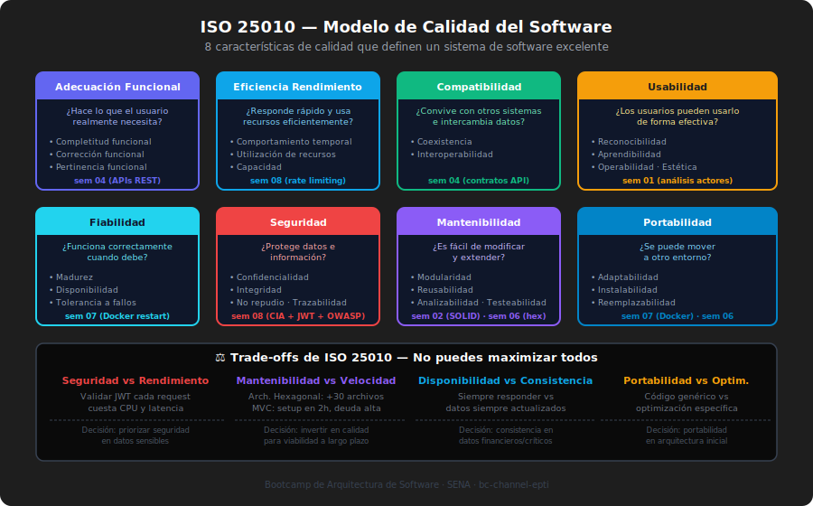

# ⚖️ Atributos de Calidad y Trade-offs en Arquitectura

> **Duración**: 60 minutos
> **Tipo**: Presencial
> **Semana**: 09

---

## 🎯 Objetivos

Al finalizar este módulo, podrás:

- Identificar y priorizar atributos de calidad ISO 25010 relevantes para tu sistema
- Explicar qué es un trade-off arquitectónico y por qué son inevitables
- Aplicar el concepto de Architecture Fitness Functions para verificar propiedades del sistema
- Tomar decisiones arquitectónicas con criterios explícitos de calidad

---

## 📊 ISO 25010: El Modelo de Calidad del Software

### 🎯 ¿Qué es?

ISO 25010 es el estándar internacional que define los **atributos de calidad** que un sistema de software puede (y debe) exhibir. Es el vocabulario oficial para hablar de "qué tan bueno es un sistema" más allá de "funciona o no funciona".

### 🚀 ¿Para qué sirve?

- Proporciona un lenguaje común para discutir calidad entre técnicos y negocio
- Permite priorizar qué atributos son críticos para el sistema específico
- Ayuda a identificar trade-offs antes de que se conviertan en problemas

### 💥 ¿Qué impacto tiene?

**Si priorizas atributos de calidad explícitamente:**

- ✅ Tomas decisiones de diseño con criterios medibles
- ✅ Puedes comunicar a negocio qué sacrificas y qué ganas
- ✅ El sistema cumple las expectativas de sus usuarios reales

**Si NO priorizas:**

- ❌ "El sistema funciona pero es imposible de mantener"
- ❌ "Es seguro pero tiene 5 segundos de latencia"
- ❌ "Es escalable pero nadie del equipo lo entiende"

---

### Los 8 Atributos Principales de ISO 25010

```
┌─────────────────────────────────────────────────────────────────────────────┐
│                    ISO 25010 — CALIDAD DEL SOFTWARE                         │
├─────────────────┬───────────────────────────────────────────────────────────┤
│  ADECUACIÓN     │ El sistema hace lo que el usuario necesita                │
│  FUNCIONAL      │ Funcionalidad completa, correcta y apropiada              │
├─────────────────┼───────────────────────────────────────────────────────────┤
│  EFICIENCIA DE  │ Rendimiento bajo carga real                               │
│  RENDIMIENTO    │ Tiempo de respuesta, throughput, uso de recursos          │
├─────────────────┼───────────────────────────────────────────────────────────┤
│  COMPATIBILIDAD │ Coexistencia e interoperabilidad                          │
│                 │ ¿Convive bien con otros sistemas?                         │
├─────────────────┼───────────────────────────────────────────────────────────┤
│  USABILIDAD     │ ¿Los usuarios pueden usarlo efectivamente?                │
│                 │ Aprendibilidad, operabilidad, protección de errores       │
├─────────────────┼───────────────────────────────────────────────────────────┤
│  FIABILIDAD     │ ¿Funciona correctamente cuando debe?                      │
│                 │ Disponibilidad, tolerancia a fallos, recuperabilidad      │
├─────────────────┼───────────────────────────────────────────────────────────┤
│  SEGURIDAD      │ ¿Protege datos e información?                             │
│                 │ Confidencialidad, integridad, no repudio                  │
├─────────────────┼───────────────────────────────────────────────────────────┤
│  MANTENIBILIDAD │ ¿Es fácil de modificar?                                   │
│                 │ Modularidad, reusabilidad, analizabilidad, modificabilidad│
├─────────────────┼───────────────────────────────────────────────────────────┤
│  PORTABILIDAD   │ ¿Se puede mover a otro entorno?                           │
│                 │ Adaptabilidad, instalabilidad, reemplazabilidad           │
└─────────────────┴───────────────────────────────────────────────────────────┘
```

---

### Atributos de Calidad en el Contexto del Bootcamp

En cada semana priorizamos implícitamente ciertos atributos:

| Semana | Decisión                    | Atributo ISO 25010 Priorizado                     |
| ------ | --------------------------- | ------------------------------------------------- |
| 02     | Aplicar SOLID               | **Mantenibilidad** (modularidad, modificabilidad) |
| 03     | Patrón arquitectónico       | **Mantenibilidad** + **Portabilidad**             |
| 04     | API REST + contratos claros | **Compatibilidad** (interoperabilidad)            |
| 05     | Patrones GoF                | **Mantenibilidad** (reusabilidad)                 |
| 06     | Arquitectura Hexagonal      | **Mantenibilidad** + **Portabilidad**             |
| 07     | Docker + Compose            | **Portabilidad** (instalabilidad)                 |
| 08     | JWT + RBAC + Hardening      | **Seguridad** (confidencialidad, integridad)      |

---

## ⚖️ Trade-offs: Los Compromisos Inevitables

### ¿Qué es un trade-off?

Un trade-off arquitectónico ocurre cuando **mejorar un atributo de calidad reduce otro**. No son errores de diseño — son consecuencias inevitables de toda decisión técnica.

### Las Tensiones Clásicas

```
SEGURIDAD  ◄─────────────────────────────────► RENDIMIENTO
"Cada validación JWT tiene costo de CPU"      "Verificar token ad niente"

ESCALABILIDAD ◄──────────────────────────────► CONSISTENCIA
"Más nodos = más rápido pero..."             "¿Cuándo se sincronizan los datos?"

SIMPLICIDAD ◄────────────────────────────────► FLEXIBILIDAD
"Una sola tabla clara"                       "¿Qué pasa cuando cambian los reqs?"

DISPONIBILIDAD ◄─────────────────────────────► CONSISTENCIA
"Siempre respondo aunque..."                 "¿Con datos stale?"

RENDIMIENTO ◄────────────────────────────────► MANTENIBILIDAD
"Código optimizado manualmente"              "Que nadie más entiende"
```

---

### Caso EduFlow: Trade-offs Documentados

#### Trade-off #1: Arquitectura Hexagonal vs. Velocidad de Desarrollo Inicial

| Aspecto            | Con MVC (opción descartada) | Con Hexagonal (elegida)    |
| ------------------ | --------------------------- | -------------------------- |
| Archivos iniciales | ~10 archivos                | ~30 archivos               |
| Tiempo de setup    | 2 horas                     | 6 horas                    |
| Tests sin BD       | Difícil                     | Trivial (mocks de puertos) |
| Cambiar BD         | Reescritura parcial         | Cambiar adaptador          |
| Onboarding         | 1 día                       | 2-3 días                   |

**Decisión**: Aceptamos el costo inicial de complejidad por la ganancia en testabilidad y mantenibilidad a largo plazo.

---

#### Trade-off #2: JWT Stateless vs. Sessions con Estado

| Aspecto               | Sesiones (descartada)          | JWT (elegida)                 |
| --------------------- | ------------------------------ | ----------------------------- |
| Revocación inmediata  | ✅ Borra sesión del servidor   | ❌ Esperar expiración         |
| Escalabilidad         | ❌ Sticky sessions o Redis     | ✅ Cualquier instancia valida |
| Tamaño del token      | ✅ Solo un ID                  | ❌ Payload embebido           |
| Dependencia de estado | ❌ Necesita almacén compartido | ✅ Sin estado en el servidor  |

**Decisión**: Aceptamos que la revocación inmediata es más compleja (requiere blacklist en Redis) a cambio de facilidad de escalado horizontal.

---

#### Trade-off #3: Validación Estricta con Zod vs. Flexibilidad

| Aspecto              | Sin validación                    | Con Zod (elegida)                |
| -------------------- | --------------------------------- | -------------------------------- |
| Velocidad desarrollo | ✅ Sin schemas adicionales        | ❌ Definir schema por endpoint   |
| Seguridad            | ❌ Injection, DoS posibles        | ✅ Solo datos válidos pasan      |
| Mensajes de error    | ❌ "Cannot read property of null" | ✅ "email: must be valid email"  |
| Documentación        | ❌ Implícita                      | ✅ El schema ES la documentación |

**Decisión**: Aceptamos el costo de escribir schemas a cambio de seguridad y auto-documentación.

---

## 🧪 Architecture Fitness Functions

### ¿Qué son?

Las Architecture Fitness Functions son **tests automatizados que verifican propiedades estructurales y de calidad** de la arquitectura, no solo del comportamiento funcional.

El concepto viene de _Building Evolutionary Architectures_ (Neal Ford, Rebecca Parsons, Patrick Kua).

### ¿Para qué sirven?

Son el mecanismo para asegurar que la arquitectura **no se degrada con el tiempo** cuando los developers agregan código.

```javascript
// Ejemplo de fitness function:
// "El dominio NUNCA puede importar desde infraestructura"

// Sin fitness function:
// Semana 1: domain/user.entity.js — puro ✅
// Semana 8: alguien agrega import pg — dominio acoplado ❌ nadie lo nota

// Con fitness function en el CI:
// El test falla → el PR no puede mergearse → la arquitectura se mantiene
```

### Fitness Functions para Arquitectura Hexagonal

```javascript
// tests/architecture/hexagonal.fitness.test.js

import { describe, it, expect } from "vitest";
import { glob } from "glob";
import { readFileSync } from "fs";

// ─── Regla 1: El dominio no puede importar infraestructura ───────────────────
describe("Fitness Function: Hexagonal Architecture", () => {
  it("domain must not depend on infrastructure", async () => {
    const domainFiles = await glob("src/domain/**/*.js");

    for (const file of domainFiles) {
      const content = readFileSync(file, "utf-8");
      expect(content).not.toMatch(/from ['"].*\/infrastructure\//);
    }
  });

  // ─── Regla 2: El dominio no puede importar frameworks ─────────────────────
  it("domain must not depend on external frameworks", async () => {
    const domainFiles = await glob("src/domain/**/*.js");
    const forbidden = [
      "express",
      "fastify",
      "pg",
      "mongoose",
      "axios",
      "jsonwebtoken",
    ];

    for (const file of domainFiles) {
      const content = readFileSync(file, "utf-8");
      for (const dep of forbidden) {
        expect(content, `${file} no debe importar ${dep}`).not.toMatch(
          new RegExp(`from ['"]${dep}`),
        );
      }
    }
  });

  // ─── Regla 3: Los use cases solo dependen de puertos ─────────────────────
  it("application use cases must only import from domain or ports", async () => {
    const useCaseFiles = await glob("src/application/use-cases/**/*.js");

    for (const file of useCaseFiles) {
      const content = readFileSync(file, "utf-8");
      // No pueden importar desde infrastructure directamente
      expect(content).not.toMatch(/from ['"].*\/infrastructure\//);
    }
  });
});
```

### Fitness Functions para Seguridad

```javascript
// tests/architecture/security.fitness.test.js

import { describe, it, expect } from "vitest";
import { readFileSync, existsSync } from "fs";
import { glob } from "glob";

// Regla: No secretos hardcodeados en código fuente
describe("Fitness Function: Security", () => {
  it("must not have hardcoded secrets in source code", async () => {
    const sourceFiles = await glob("src/**/*.js");

    // Patrones de secretos hardcodeados
    const secretPatterns = [
      /secret\s*=\s*['"][^'"]{8,}['"]/i,
      /password\s*=\s*['"][^'"]{4,}['"]/i,
      /api_key\s*=\s*['"][^'"]{8,}['"]/i,
      /JWT_SECRET\s*=\s*['"][^'"]{8,}['"]/i,
    ];

    for (const file of sourceFiles) {
      const content = readFileSync(file, "utf-8");
      for (const pattern of secretPatterns) {
        expect(
          content,
          `${file} no debe tener secretos hardcodeados`,
        ).not.toMatch(pattern);
      }
    }
  });

  // Regla: .env no debe estar en el repositorio
  it(".env must not exist in repository (only .env.example)", () => {
    expect(existsSync(".env")).toBe(false);
    expect(existsSync(".env.example")).toBe(true);
  });
});
```

---

## 🗺️ Cómo Elegir Qué Atributos Priorizar

Para tu sistema, responde estas preguntas:

### 1. ¿Cuál es el peor escenario inaceptable?

```
Si falla la seguridad → datos de usuarios expuestos → demanda legal
→ Seguridad es un atributo no negociable

Si falla la disponibilidad → estudiantes no pueden acceder a exámenes
→ Fiabilidad/Disponibilidad es crítica

Si el sistema es lento → usuarios se van a la competencia
→ Eficiencia de rendimiento importa
```

### 2. ¿Qué va a cambiar más?

```
Si el negocio cambia reglas frecuentemente → Mantenibilidad alta
Si cambian los proveedores de infraestructura → Portabilidad alta
Si escala rápidamente en usuarios → Eficiencia de rendimiento alta
```

### 3. ¿Qué puede sacrificarse inicialmente?

```
MVP: sacrifica rendimiento, portabilidad, algunas características
Producto maduro: sacrifica velocidad de desarrollo por mantenibilidad
Sistema crítico: sacrifica facilidad de uso por seguridad/fiabilidad
```

---

## 📚 Material Visual



---

_Semana 09 · Proyecto Integrador Final · Bootcamp de Arquitectura de Software_
