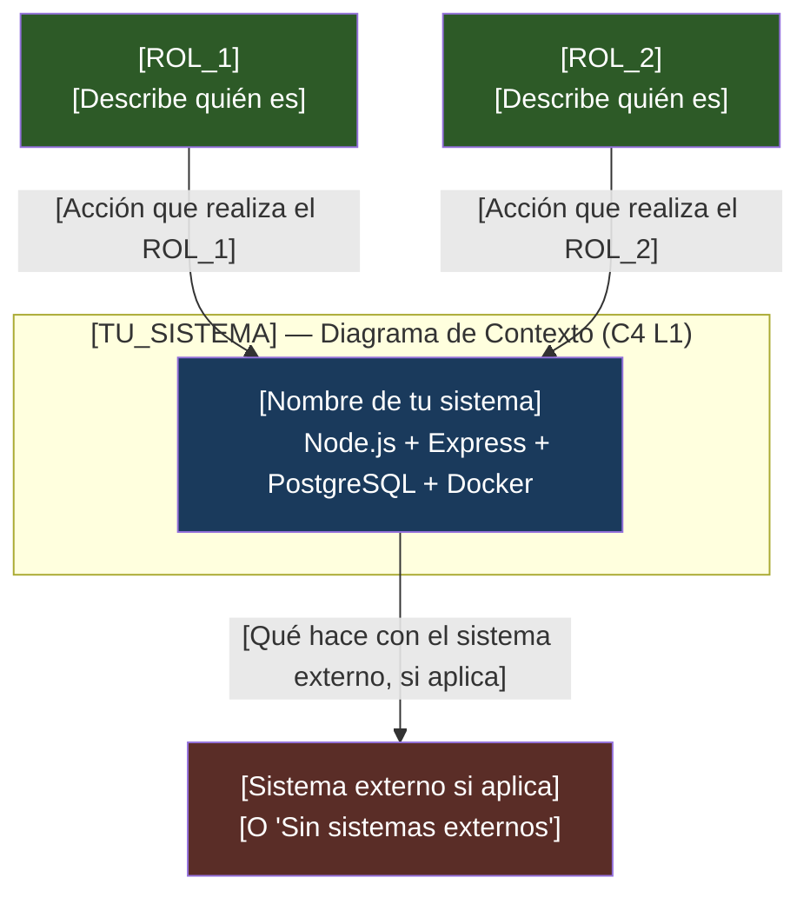
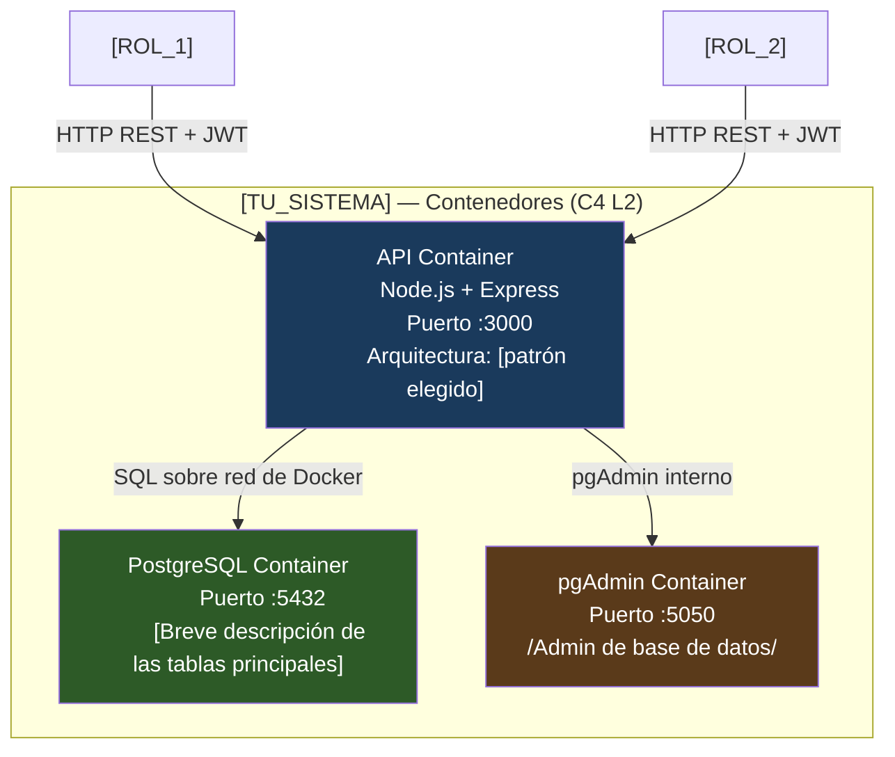

# 🚀 Proyecto Integrador Final — Semana 09

> **Tema**: Documentación y Defensa de tu Arquitectura
> **Duración**: Trabajo de preparación (continúa el proyecto de las semanas 01–08)
> **Semana**: 09

---

> ⚠️ **POLÍTICA ANTICOPIA**
>
> Este proyecto usa **tu dominio asignado**.
> Completa cada sección con los detalles reales de tu sistema.
> Reemplaza `[TuDominio]`, `[ROL_X]`, `[TU_SISTEMA]`, etc.
> con los datos específicos de tu proyecto.
>
> Entregar un sistema de otro estudiante o copiar código sin adaptarlo
> invalida toda la semana y puede afectar la nota acumulada del bootcamp.

---

## 🎯 Objetivo del Proyecto Final

Esta semana no construyes algo nuevo. **Documentas, defiendes y reflexionas** sobre todo lo que construiste en las semanas 01–08. El objetivo es demostrar que entiendes las decisiones arquitectónicas que tomaste.

---

## Entregable 1 — Tres Architecture Decision Records (ADRs)

Crea la carpeta `docs/adr/` en tu repositorio y escribe los siguientes tres ADRs:

### ADR-001 — Decisión de Patrón Arquitectónico

```
Archivo: docs/adr/ADR-001-patron-arquitectonico.md

Título: Selección del patrón arquitectónico para [TuDominio]
Fecha: [Fecha actual]
Estado: Aceptada

## Contexto
[Describe en 3–5 oraciones el problema de negocio de tu dominio.
¿Qué necesitan hacer los usuarios? ¿Cuáles son las restricciones?
Ejemplo real, no genérico.]

## Opciones Evaluadas
1. [Opción A — descripción breve y su mayor ventaja para tu caso]
2. [Opción B — descripción breve y su mayor ventaja para tu caso]
3. [Opción C — descripción breve y su mayor ventaja para tu caso, si aplica]

## Decisión
Elegimos [el patrón que implementaste].

Razón principal: [Responde "¿Por qué este patrón, en tu dominio específico?"]

## Consecuencias
Positivas:
- [Consecuencia concreta en tu código — puedes citar un módulo real]
- [Consecuencia concreta 2]

Negativas:
- [Costo real que aceptaste — tiempo, complejidad, etc.]
```

---

### ADR-002 — Decisión de Autenticación y Autorización

```
Archivo: docs/adr/ADR-002-autenticacion-autorizacion.md

Título: Estrategia de autenticación y RBAC para [TuDominio]
Fecha: [Fecha actual]
Estado: Aceptada

## Contexto
[TuDominio] requiere que distintos roles [ROL_1], [ROL_2] y [ROL_3 si aplica]
tengan acceso diferenciado a los recursos. Es necesario verificar identidad
antes de autorizar operaciones.

## Opciones Evaluadas
1. JWT — [describe por qué lo consideraste para tu dominio]
2. Sesiones con cookies — [describe la principal diferencia en tu caso]
3. [Otra opción si la evaluaste]

## Decisión
Elegimos [la opción implementada].

Razón: [Justificación técnica concreta, no genérica.]

## Consecuencias
Positivas:
- [Al menos 2 consecuencias en tu sistema real]

Negativas:
- [Al menos 1 limitación real que aceptaste]
```

---

### ADR-003 — Tu Decisión Más Importante del Dominio

```
Archivo: docs/adr/ADR-003-[nombre-de-tu-decision].md

Título: [La decisión arquitectónica más importante que tomaste, diferente a las anteriores]
Fecha: [Fecha actual]
Estado: Aceptada

[Escribe este ADR completamente con tus palabras.
Puede ser sobre: estructura de la base de datos, validación de datos,
Docker Compose, estructura de carpetas, gestión de errores, o cualquier
otra decisión que consideres importante y específica de tu dominio.]
```

---

## Entregable 2 — Diagramas C4 (Mermaid en el README)

Agrega los siguientes diagramas a tu `README.md`:

### C4 Nivel 1 — Diagrama de Contexto



### C4 Nivel 2 — Diagrama de Contenedores



---

## Entregable 3 — Sistema Funcional

### Verificación del sistema

Tu proyecto debe cumplir todos los puntos de esta tabla:

| Criterio        | Descripción                                                        | ¿Cumple? |
| --------------- | ------------------------------------------------------------------ | -------- |
| Levanta en frío | `docker compose up --build` sin errores                            | [ ]      |
| Tests pasan     | `pnpm test` ≥ 5 tests en verde                                     | [ ]      |
| Auth funcional  | `POST /auth/register` y `POST /auth/login` responden correctamente | [ ]      |
| JWT protege     | Endpoints del dominio retornan 401 sin token                       | [ ]      |
| RBAC activo     | Al menos un endpoint retorna 403 para rol incorrecto               | [ ]      |
| `.env.example`  | Existe con todas las variables (sin valores reales)                | [ ]      |
| `.gitignore`    | Excluye `.env`, `node_modules/`, `dist/`                           | [ ]      |

### Estructura esperada del repositorio

```
[tu-dominio]-api/
│
├── docs/
│   └── adr/
│       ├── ADR-001-patron-arquitectonico.md
│       ├── ADR-002-autenticacion-autorizacion.md
│       └── ADR-003-[nombre].md
│
├── src/
│   ├── [estructura de tu patrón arquitectónico]
│   └── ...
│
├── tests/
│   └── [al menos 5 tests]
│
├── scripts/
│   └── demo-presentacion.sh
│
├── docker-compose.yml
├── Dockerfile
├── .env.example
├── .gitignore
├── package.json         ← scripts: start, dev, test
└── README.md            ← con diagramas C4 Mermaid
```

---

## Entregable 4 — Slide de Trade-Off (una diapositiva o sección en README)

Completa esta tabla en tu `README.md`:

```markdown
## Decisiones de Trade-Off

| Decisión              | Opción elegida | Alternativa evaluada | Beneficio obtenido | Costo aceptado |
| --------------------- | -------------- | -------------------- | ------------------ | -------------- |
| Patrón arquitectónico | [Tu patrón]    | [Alternativa]        | [Beneficio 1]      | [Costo 1]      |
| Autenticación         | [Tu opción]    | [Alternativa]        | [Beneficio 2]      | [Costo 2]      |
| [Tu decisión 3]       | [Tu opción]    | [Alternativa]        | [Beneficio 3]      | [Costo 3]      |
```

---

## Entregable 5 — Reflexión Personal (½ página)

Escribe en tu `README.md` (o en `docs/reflexion-final.md`) una sección titulada **"Reflexión Final"** que responda estas tres preguntas:

```markdown
## Reflexión Final

### La decisión arquitectónica que más me marcó

[Tu respuesta genuina]

### Si empezara desde cero, cambiaría

[Tu respuesta honesta — no hay respuesta incorrecta si está justificada]

### El patrón o principio que más usaré en mi carrera

[Tu respuesta con una justificación breve]
```

---

## Rúbrica del Proyecto (30% de la nota de la semana)

| Criterio          | Indicador                                          | Peso |
| ----------------- | -------------------------------------------------- | ---- |
| ADRs              | 3 ADRs completos, con contexto y trade-offs reales | 30%  |
| Diagramas C4      | L1 y L2 correctos y coherentes con el sistema real | 20%  |
| Sistema funcional | Levanta en frío, tests pasan, auth + RBAC funciona | 30%  |
| Reflexión         | Honesta, específica y técnicamente fundamentada    | 20%  |

---

## Entrega

- Repositorio público en GitHub (o enlace compartido con el instructor)
- URL del repositorio enviada antes de la sesión presencial
- Sistema ejecutable confirmado con: `docker compose up && pnpm test`

---

_Semana 09 · Proyecto Integrador Final · Bootcamp de Arquitectura de Software_
